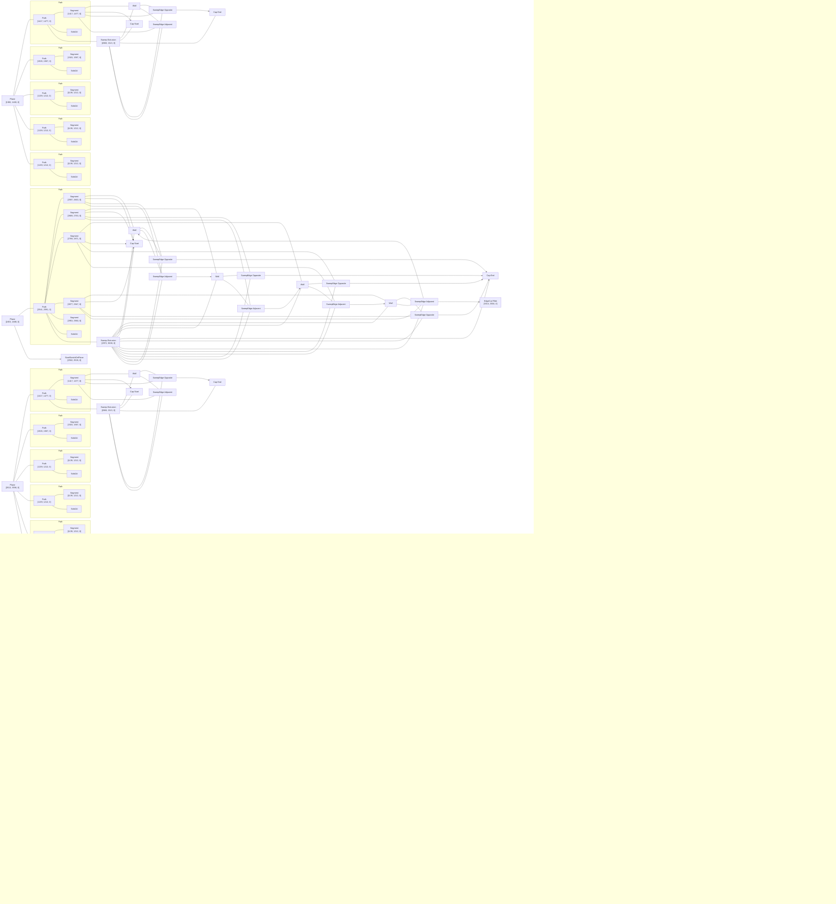

```mermaid
flowchart LR
  subgraph path2 [Path]
    2["Path<br>[1417, 1477, 0]"]
      %% [ProgramBodyItem { index: 21 }, VariableDeclarationDeclaration, VariableDeclarationInit, FunctionExpressionBody, FunctionExpressionBodyItem { index: 1 }, VariableDeclarationDeclaration, VariableDeclarationInit, PipeBodyItem { index: 0 }]
    3["Segment<br>[1417, 1477, 0]"]
      %% [ProgramBodyItem { index: 21 }, VariableDeclarationDeclaration, VariableDeclarationInit, FunctionExpressionBody, FunctionExpressionBodyItem { index: 1 }, VariableDeclarationDeclaration, VariableDeclarationInit, PipeBodyItem { index: 0 }]
    4[Solid2d]
  end
  subgraph path5 [Path]
    5["Path<br>[1503, 1587, 0]"]
      %% [ProgramBodyItem { index: 21 }, VariableDeclarationDeclaration, VariableDeclarationInit, FunctionExpressionBody, FunctionExpressionBodyItem { index: 1 }, VariableDeclarationDeclaration, VariableDeclarationInit, PipeBodyItem { index: 1 }, CallKwArg { index: 0 }]
    6["Segment<br>[1503, 1587, 0]"]
      %% [ProgramBodyItem { index: 21 }, VariableDeclarationDeclaration, VariableDeclarationInit, FunctionExpressionBody, FunctionExpressionBodyItem { index: 1 }, VariableDeclarationDeclaration, VariableDeclarationInit, PipeBodyItem { index: 1 }, CallKwArg { index: 0 }]
    7[Solid2d]
  end
  subgraph path8 [Path]
    8["Path<br>[1139, 1212, 0]"]
      %% [ProgramBodyItem { index: 20 }, VariableDeclarationDeclaration, VariableDeclarationInit, FunctionExpressionBody, FunctionExpressionBodyItem { index: 8 }, VariableDeclarationDeclaration, VariableDeclarationInit]
    9["Segment<br>[1139, 1212, 0]"]
      %% [ProgramBodyItem { index: 20 }, VariableDeclarationDeclaration, VariableDeclarationInit, FunctionExpressionBody, FunctionExpressionBodyItem { index: 8 }, VariableDeclarationDeclaration, VariableDeclarationInit]
    10[Solid2d]
  end
  subgraph path11 [Path]
    11["Path<br>[1139, 1212, 0]"]
      %% [ProgramBodyItem { index: 20 }, VariableDeclarationDeclaration, VariableDeclarationInit, FunctionExpressionBody, FunctionExpressionBodyItem { index: 8 }, VariableDeclarationDeclaration, VariableDeclarationInit]
    12["Segment<br>[1139, 1212, 0]"]
      %% [ProgramBodyItem { index: 20 }, VariableDeclarationDeclaration, VariableDeclarationInit, FunctionExpressionBody, FunctionExpressionBodyItem { index: 8 }, VariableDeclarationDeclaration, VariableDeclarationInit]
    13[Solid2d]
  end
  subgraph path14 [Path]
    14["Path<br>[1139, 1212, 0]"]
      %% [ProgramBodyItem { index: 20 }, VariableDeclarationDeclaration, VariableDeclarationInit, FunctionExpressionBody, FunctionExpressionBodyItem { index: 8 }, VariableDeclarationDeclaration, VariableDeclarationInit]
    15["Segment<br>[1139, 1212, 0]"]
      %% [ProgramBodyItem { index: 20 }, VariableDeclarationDeclaration, VariableDeclarationInit, FunctionExpressionBody, FunctionExpressionBodyItem { index: 8 }, VariableDeclarationDeclaration, VariableDeclarationInit]
    16[Solid2d]
  end
  subgraph path24 [Path]
    24["Path<br>[2541, 2591, 0]"]
      %% [ProgramBodyItem { index: 25 }, VariableDeclarationDeclaration, VariableDeclarationInit, PipeBodyItem { index: 0 }]
    25["Segment<br>[2597, 2663, 0]"]
      %% [ProgramBodyItem { index: 25 }, VariableDeclarationDeclaration, VariableDeclarationInit, PipeBodyItem { index: 1 }]
    26["Segment<br>[2669, 2763, 0]"]
      %% [ProgramBodyItem { index: 25 }, VariableDeclarationDeclaration, VariableDeclarationInit, PipeBodyItem { index: 2 }]
    27["Segment<br>[2769, 2871, 0]"]
      %% [ProgramBodyItem { index: 25 }, VariableDeclarationDeclaration, VariableDeclarationInit, PipeBodyItem { index: 3 }]
    28["Segment<br>[2877, 2947, 0]"]
      %% [ProgramBodyItem { index: 25 }, VariableDeclarationDeclaration, VariableDeclarationInit, PipeBodyItem { index: 4 }]
    29["Segment<br>[2953, 2960, 0]"]
      %% [ProgramBodyItem { index: 25 }, VariableDeclarationDeclaration, VariableDeclarationInit, PipeBodyItem { index: 5 }]
    30[Solid2d]
  end
  subgraph path48 [Path]
    48["Path<br>[1417, 1477, 0]"]
      %% [ProgramBodyItem { index: 21 }, VariableDeclarationDeclaration, VariableDeclarationInit, FunctionExpressionBody, FunctionExpressionBodyItem { index: 1 }, VariableDeclarationDeclaration, VariableDeclarationInit, PipeBodyItem { index: 0 }]
    49["Segment<br>[1417, 1477, 0]"]
      %% [ProgramBodyItem { index: 21 }, VariableDeclarationDeclaration, VariableDeclarationInit, FunctionExpressionBody, FunctionExpressionBodyItem { index: 1 }, VariableDeclarationDeclaration, VariableDeclarationInit, PipeBodyItem { index: 0 }]
    50[Solid2d]
  end
  subgraph path51 [Path]
    51["Path<br>[1503, 1587, 0]"]
      %% [ProgramBodyItem { index: 21 }, VariableDeclarationDeclaration, VariableDeclarationInit, FunctionExpressionBody, FunctionExpressionBodyItem { index: 1 }, VariableDeclarationDeclaration, VariableDeclarationInit, PipeBodyItem { index: 1 }, CallKwArg { index: 0 }]
    52["Segment<br>[1503, 1587, 0]"]
      %% [ProgramBodyItem { index: 21 }, VariableDeclarationDeclaration, VariableDeclarationInit, FunctionExpressionBody, FunctionExpressionBodyItem { index: 1 }, VariableDeclarationDeclaration, VariableDeclarationInit, PipeBodyItem { index: 1 }, CallKwArg { index: 0 }]
    53[Solid2d]
  end
  subgraph path54 [Path]
    54["Path<br>[1139, 1212, 0]"]
      %% [ProgramBodyItem { index: 20 }, VariableDeclarationDeclaration, VariableDeclarationInit, FunctionExpressionBody, FunctionExpressionBodyItem { index: 8 }, VariableDeclarationDeclaration, VariableDeclarationInit]
    55["Segment<br>[1139, 1212, 0]"]
      %% [ProgramBodyItem { index: 20 }, VariableDeclarationDeclaration, VariableDeclarationInit, FunctionExpressionBody, FunctionExpressionBodyItem { index: 8 }, VariableDeclarationDeclaration, VariableDeclarationInit]
    56[Solid2d]
  end
  subgraph path57 [Path]
    57["Path<br>[1139, 1212, 0]"]
      %% [ProgramBodyItem { index: 20 }, VariableDeclarationDeclaration, VariableDeclarationInit, FunctionExpressionBody, FunctionExpressionBodyItem { index: 8 }, VariableDeclarationDeclaration, VariableDeclarationInit]
    58["Segment<br>[1139, 1212, 0]"]
      %% [ProgramBodyItem { index: 20 }, VariableDeclarationDeclaration, VariableDeclarationInit, FunctionExpressionBody, FunctionExpressionBodyItem { index: 8 }, VariableDeclarationDeclaration, VariableDeclarationInit]
    59[Solid2d]
  end
  subgraph path60 [Path]
    60["Path<br>[1139, 1212, 0]"]
      %% [ProgramBodyItem { index: 20 }, VariableDeclarationDeclaration, VariableDeclarationInit, FunctionExpressionBody, FunctionExpressionBodyItem { index: 8 }, VariableDeclarationDeclaration, VariableDeclarationInit]
    61["Segment<br>[1139, 1212, 0]"]
      %% [ProgramBodyItem { index: 20 }, VariableDeclarationDeclaration, VariableDeclarationInit, FunctionExpressionBody, FunctionExpressionBodyItem { index: 8 }, VariableDeclarationDeclaration, VariableDeclarationInit]
    62[Solid2d]
  end
  subgraph path70 [Path]
    70["Path<br>[4141, 4279, 0]"]
      %% [ProgramBodyItem { index: 37 }, VariableDeclarationDeclaration, VariableDeclarationInit, PipeBodyItem { index: 0 }]
    71["Segment<br>[4285, 4345, 0]"]
      %% [ProgramBodyItem { index: 37 }, VariableDeclarationDeclaration, VariableDeclarationInit, PipeBodyItem { index: 1 }]
    72["Segment<br>[4351, 4399, 0]"]
      %% [ProgramBodyItem { index: 37 }, VariableDeclarationDeclaration, VariableDeclarationInit, PipeBodyItem { index: 2 }]
    73["Segment<br>[4405, 4441, 0]"]
      %% [ProgramBodyItem { index: 37 }, VariableDeclarationDeclaration, VariableDeclarationInit, PipeBodyItem { index: 3 }]
    74["Segment<br>[4447, 4469, 0]"]
      %% [ProgramBodyItem { index: 37 }, VariableDeclarationDeclaration, VariableDeclarationInit, PipeBodyItem { index: 4 }]
    75["Segment<br>[4475, 4498, 0]"]
      %% [ProgramBodyItem { index: 37 }, VariableDeclarationDeclaration, VariableDeclarationInit, PipeBodyItem { index: 5 }]
    76["Segment<br>[4504, 4554, 0]"]
      %% [ProgramBodyItem { index: 37 }, VariableDeclarationDeclaration, VariableDeclarationInit, PipeBodyItem { index: 6 }]
    77["Segment<br>[4560, 4579, 0]"]
      %% [ProgramBodyItem { index: 37 }, VariableDeclarationDeclaration, VariableDeclarationInit, PipeBodyItem { index: 7 }]
    78["Segment<br>[4604, 4644, 0]"]
      %% [ProgramBodyItem { index: 37 }, VariableDeclarationDeclaration, VariableDeclarationInit, PipeBodyItem { index: 8 }]
    79["Segment<br>[4650, 4657, 0]"]
      %% [ProgramBodyItem { index: 37 }, VariableDeclarationDeclaration, VariableDeclarationInit, PipeBodyItem { index: 9 }]
    80[Solid2d]
  end
  subgraph path100 [Path]
    100["Path<br>[4771, 4849, 0]"]
      %% [ProgramBodyItem { index: 39 }, VariableDeclarationDeclaration, VariableDeclarationInit, PipeBodyItem { index: 0 }]
    101["Segment<br>[4771, 4849, 0]"]
      %% [ProgramBodyItem { index: 39 }, VariableDeclarationDeclaration, VariableDeclarationInit, PipeBodyItem { index: 0 }]
    102[Solid2d]
  end
  1["Plane<br>[1380, 1400, 0]"]
    %% [ProgramBodyItem { index: 21 }, VariableDeclarationDeclaration, VariableDeclarationInit, FunctionExpressionBody, FunctionExpressionBodyItem { index: 0 }, VariableDeclarationDeclaration, VariableDeclarationInit]
  17["Sweep Extrusion<br>[2068, 2113, 0]"]
    %% [ProgramBodyItem { index: 21 }, VariableDeclarationDeclaration, VariableDeclarationInit, FunctionExpressionBody, FunctionExpressionBodyItem { index: 7 }, VariableDeclarationDeclaration, VariableDeclarationInit]
  18[Wall]
    %% face_code_ref=Missing NodePath
  19["Cap Start"]
    %% face_code_ref=Missing NodePath
  20["Cap End"]
    %% face_code_ref=Missing NodePath
  21["SweepEdge Opposite"]
  22["SweepEdge Adjacent"]
  23["Plane<br>[2453, 2488, 0]"]
    %% [ProgramBodyItem { index: 23 }, VariableDeclarationDeclaration, VariableDeclarationInit]
  31["Sweep Extrusion<br>[2972, 3008, 0]"]
    %% [ProgramBodyItem { index: 26 }, VariableDeclarationDeclaration, VariableDeclarationInit, PipeBodyItem { index: 0 }]
  32[Wall]
    %% face_code_ref=Missing NodePath
  33[Wall]
    %% face_code_ref=Missing NodePath
  34[Wall]
    %% face_code_ref=Missing NodePath
  35[Wall]
    %% face_code_ref=Missing NodePath
  36["Cap Start"]
    %% face_code_ref=Missing NodePath
  37["Cap End"]
    %% face_code_ref=Missing NodePath
  38["SweepEdge Opposite"]
  39["SweepEdge Adjacent"]
  40["SweepEdge Opposite"]
  41["SweepEdge Adjacent"]
  42["SweepEdge Opposite"]
  43["SweepEdge Adjacent"]
  44["SweepEdge Opposite"]
  45["SweepEdge Adjacent"]
  46["EdgeCut Fillet<br>[3014, 3304, 0]"]
    %% [ProgramBodyItem { index: 26 }, VariableDeclarationDeclaration, VariableDeclarationInit, PipeBodyItem { index: 1 }]
  47["Plane<br>[3513, 3556, 0]"]
    %% [ProgramBodyItem { index: 28 }, VariableDeclarationDeclaration, VariableDeclarationInit]
  63["Sweep Extrusion<br>[2068, 2113, 0]"]
    %% [ProgramBodyItem { index: 21 }, VariableDeclarationDeclaration, VariableDeclarationInit, FunctionExpressionBody, FunctionExpressionBodyItem { index: 7 }, VariableDeclarationDeclaration, VariableDeclarationInit]
  64[Wall]
    %% face_code_ref=Missing NodePath
  65["Cap Start"]
    %% face_code_ref=Missing NodePath
  66["Cap End"]
    %% face_code_ref=Missing NodePath
  67["SweepEdge Opposite"]
  68["SweepEdge Adjacent"]
  69["Plane<br>[4107, 4125, 0]"]
    %% [ProgramBodyItem { index: 36 }, VariableDeclarationDeclaration, VariableDeclarationInit]
  81["Sweep Revolve<br>[4663, 4680, 0]"]
    %% [ProgramBodyItem { index: 37 }, VariableDeclarationDeclaration, VariableDeclarationInit, PipeBodyItem { index: 10 }]
  82[Wall]
    %% face_code_ref=Missing NodePath
  83[Wall]
    %% face_code_ref=Missing NodePath
  84[Wall]
    %% face_code_ref=[ProgramBodyItem { index: 38 }, VariableDeclarationDeclaration, VariableDeclarationInit]
  85[Wall]
    %% face_code_ref=Missing NodePath
  86[Wall]
    %% face_code_ref=Missing NodePath
  87[Wall]
    %% face_code_ref=Missing NodePath
  88[Wall]
    %% face_code_ref=Missing NodePath
  89[Wall]
    %% face_code_ref=Missing NodePath
  90[Wall]
    %% face_code_ref=Missing NodePath
  91["SweepEdge Adjacent"]
  92["SweepEdge Adjacent"]
  93["SweepEdge Adjacent"]
  94["SweepEdge Adjacent"]
  95["SweepEdge Adjacent"]
  96["SweepEdge Adjacent"]
  97["SweepEdge Adjacent"]
  98["SweepEdge Adjacent"]
  99["SweepEdge Adjacent"]
  103["Sweep Extrusion<br>[5047, 5102, 0]"]
    %% [ProgramBodyItem { index: 41 }, VariableDeclarationDeclaration, VariableDeclarationInit]
  104[Wall]
    %% face_code_ref=Missing NodePath
  105["SweepEdge Opposite"]
  106["SweepEdge Adjacent"]
  107["Sweep Extrusion<br>[5047, 5102, 0]"]
    %% [ProgramBodyItem { index: 41 }, VariableDeclarationDeclaration, VariableDeclarationInit]
  108["Sweep Extrusion<br>[5047, 5102, 0]"]
    %% [ProgramBodyItem { index: 41 }, VariableDeclarationDeclaration, VariableDeclarationInit]
  109["Sweep Extrusion<br>[5047, 5102, 0]"]
    %% [ProgramBodyItem { index: 41 }, VariableDeclarationDeclaration, VariableDeclarationInit]
  110["Sweep Extrusion<br>[5047, 5102, 0]"]
    %% [ProgramBodyItem { index: 41 }, VariableDeclarationDeclaration, VariableDeclarationInit]
  111["StartSketchOnPlane<br>[2502, 2526, 0]"]
    %% [ProgramBodyItem { index: 24 }, VariableDeclarationDeclaration, VariableDeclarationInit]
  112["StartSketchOnPlane<br>[1380, 1400, 0]"]
    %% [ProgramBodyItem { index: 21 }, VariableDeclarationDeclaration, VariableDeclarationInit, FunctionExpressionBody, FunctionExpressionBodyItem { index: 0 }, VariableDeclarationDeclaration, VariableDeclarationInit]
  113["StartSketchOnFace<br>[4715, 4756, 0]"]
    %% [ProgramBodyItem { index: 38 }, VariableDeclarationDeclaration, VariableDeclarationInit]
  1 --- 2
  1 --- 5
  1 --- 8
  1 --- 11
  1 --- 14
  2 --- 3
  2 --- 4
  2 ---- 17
  3 --- 18
  3 x--> 19
  3 --- 21
  3 --- 22
  5 --- 6
  5 --- 7
  8 --- 9
  8 --- 10
  11 --- 12
  11 --- 13
  14 --- 15
  14 --- 16
  17 --- 18
  17 --- 19
  17 --- 20
  17 --- 21
  17 --- 22
  18 --- 21
  18 --- 22
  21 <--x 20
  23 --- 24
  23 <--x 111
  24 --- 25
  24 --- 26
  24 --- 27
  24 --- 28
  24 --- 29
  24 --- 30
  24 ---- 31
  25 --- 35
  25 x--> 36
  25 --- 44
  25 --- 45
  26 --- 34
  26 x--> 36
  26 --- 42
  26 --- 43
  27 --- 33
  27 x--> 36
  27 --- 40
  27 --- 41
  28 --- 32
  28 x--> 36
  28 --- 38
  28 --- 39
  31 --- 32
  31 --- 33
  31 --- 34
  31 --- 35
  31 --- 36
  31 --- 37
  31 --- 38
  31 --- 39
  31 --- 40
  31 --- 41
  31 --- 42
  31 --- 43
  31 --- 44
  31 --- 45
  32 --- 38
  32 --- 39
  41 <--x 32
  33 --- 40
  33 --- 41
  43 <--x 33
  34 --- 42
  34 --- 43
  45 <--x 34
  39 <--x 35
  35 --- 44
  35 --- 45
  38 <--x 37
  40 <--x 37
  42 <--x 37
  44 <--x 37
  39 <--x 46
  47 --- 48
  47 --- 51
  47 --- 54
  47 --- 57
  47 --- 60
  47 <--x 112
  48 --- 49
  48 --- 50
  48 ---- 63
  49 --- 64
  49 x--> 65
  49 --- 67
  49 --- 68
  51 --- 52
  51 --- 53
  54 --- 55
  54 --- 56
  57 --- 58
  57 --- 59
  60 --- 61
  60 --- 62
  63 --- 64
  63 --- 65
  63 --- 66
  63 --- 67
  63 --- 68
  64 --- 67
  64 --- 68
  67 <--x 66
  69 --- 70
  70 --- 71
  70 --- 72
  70 --- 73
  70 --- 74
  70 --- 75
  70 --- 76
  70 --- 77
  70 --- 78
  70 --- 79
  70 --- 80
  70 ---- 81
  81 <--x 71
  71 --- 82
  71 --- 91
  81 <--x 72
  72 --- 83
  72 --- 92
  81 <--x 73
  73 --- 84
  73 --- 93
  81 <--x 74
  74 --- 85
  74 --- 94
  81 <--x 75
  75 --- 86
  75 --- 95
  81 <--x 76
  76 --- 87
  76 --- 96
  81 <--x 77
  77 --- 88
  77 --- 97
  81 <--x 78
  78 --- 89
  78 --- 98
  81 <--x 79
  79 --- 90
  79 --- 99
  81 --- 82
  81 --- 83
  81 --- 84
  81 --- 85
  81 --- 86
  81 --- 87
  81 --- 88
  81 --- 89
  81 --- 90
  81 --- 91
  81 --- 92
  81 --- 93
  81 --- 94
  81 --- 95
  81 --- 96
  81 --- 97
  81 --- 98
  81 --- 99
  82 --- 91
  99 <--x 82
  91 <--x 83
  83 --- 92
  92 <--x 84
  84 --- 93
  84 --- 100
  101 <--x 84
  84 <--x 113
  93 <--x 85
  85 --- 94
  94 <--x 86
  86 --- 95
  105 <--x 86
  95 <--x 87
  87 --- 96
  96 <--x 88
  88 --- 97
  97 <--x 89
  89 --- 98
  98 <--x 90
  90 --- 99
  100 --- 101
  100 --- 102
  100 ---- 103
  101 --- 104
  101 --- 105
  101 --- 106
  103 --- 104
  103 --- 105
  103 --- 106
  104 --- 105
  104 --- 106
```
