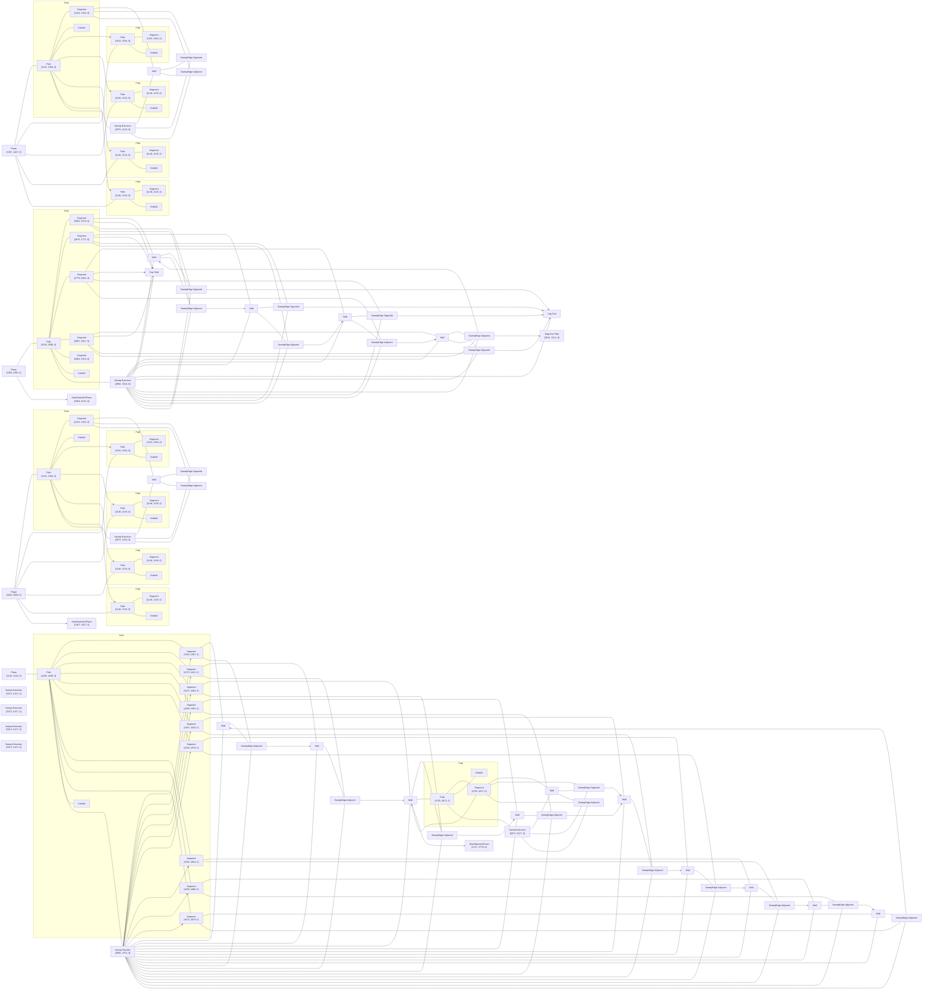

```mermaid
flowchart LR
  subgraph path2 [Path]
    2["Path<br>[1424, 1484, 0]"]
      %% [ProgramBodyItem { index: 21 }, VariableDeclarationDeclaration, VariableDeclarationInit, FunctionExpressionBody, FunctionExpressionBodyItem { index: 1 }, VariableDeclarationDeclaration, VariableDeclarationInit, PipeBodyItem { index: 0 }]
    3["Segment<br>[1424, 1484, 0]"]
      %% [ProgramBodyItem { index: 21 }, VariableDeclarationDeclaration, VariableDeclarationInit, FunctionExpressionBody, FunctionExpressionBodyItem { index: 1 }, VariableDeclarationDeclaration, VariableDeclarationInit, PipeBodyItem { index: 0 }]
    4[Solid2d]
  end
  subgraph path5 [Path]
    5["Path<br>[1510, 1594, 0]"]
      %% [ProgramBodyItem { index: 21 }, VariableDeclarationDeclaration, VariableDeclarationInit, FunctionExpressionBody, FunctionExpressionBodyItem { index: 1 }, VariableDeclarationDeclaration, VariableDeclarationInit, PipeBodyItem { index: 1 }, CallKwArg { index: 0 }]
    6["Segment<br>[1510, 1594, 0]"]
      %% [ProgramBodyItem { index: 21 }, VariableDeclarationDeclaration, VariableDeclarationInit, FunctionExpressionBody, FunctionExpressionBodyItem { index: 1 }, VariableDeclarationDeclaration, VariableDeclarationInit, PipeBodyItem { index: 1 }, CallKwArg { index: 0 }]
    7[Solid2d]
  end
  subgraph path8 [Path]
    8["Path<br>[1148, 1219, 0]"]
      %% [ProgramBodyItem { index: 20 }, VariableDeclarationDeclaration, VariableDeclarationInit, FunctionExpressionBody, FunctionExpressionBodyItem { index: 8 }, VariableDeclarationDeclaration, VariableDeclarationInit]
    9["Segment<br>[1148, 1219, 0]"]
      %% [ProgramBodyItem { index: 20 }, VariableDeclarationDeclaration, VariableDeclarationInit, FunctionExpressionBody, FunctionExpressionBodyItem { index: 8 }, VariableDeclarationDeclaration, VariableDeclarationInit]
    10[Solid2d]
  end
  subgraph path11 [Path]
    11["Path<br>[1148, 1219, 0]"]
      %% [ProgramBodyItem { index: 20 }, VariableDeclarationDeclaration, VariableDeclarationInit, FunctionExpressionBody, FunctionExpressionBodyItem { index: 8 }, VariableDeclarationDeclaration, VariableDeclarationInit]
    12["Segment<br>[1148, 1219, 0]"]
      %% [ProgramBodyItem { index: 20 }, VariableDeclarationDeclaration, VariableDeclarationInit, FunctionExpressionBody, FunctionExpressionBodyItem { index: 8 }, VariableDeclarationDeclaration, VariableDeclarationInit]
    13[Solid2d]
  end
  subgraph path14 [Path]
    14["Path<br>[1148, 1219, 0]"]
      %% [ProgramBodyItem { index: 20 }, VariableDeclarationDeclaration, VariableDeclarationInit, FunctionExpressionBody, FunctionExpressionBodyItem { index: 8 }, VariableDeclarationDeclaration, VariableDeclarationInit]
    15["Segment<br>[1148, 1219, 0]"]
      %% [ProgramBodyItem { index: 20 }, VariableDeclarationDeclaration, VariableDeclarationInit, FunctionExpressionBody, FunctionExpressionBodyItem { index: 8 }, VariableDeclarationDeclaration, VariableDeclarationInit]
    16[Solid2d]
  end
  subgraph path22 [Path]
    22["Path<br>[2548, 2598, 0]"]
      %% [ProgramBodyItem { index: 25 }, VariableDeclarationDeclaration, VariableDeclarationInit, PipeBodyItem { index: 0 }]
    23["Segment<br>[2604, 2670, 0]"]
      %% [ProgramBodyItem { index: 25 }, VariableDeclarationDeclaration, VariableDeclarationInit, PipeBodyItem { index: 1 }]
    24["Segment<br>[2676, 2773, 0]"]
      %% [ProgramBodyItem { index: 25 }, VariableDeclarationDeclaration, VariableDeclarationInit, PipeBodyItem { index: 2 }]
    25["Segment<br>[2779, 2881, 0]"]
      %% [ProgramBodyItem { index: 25 }, VariableDeclarationDeclaration, VariableDeclarationInit, PipeBodyItem { index: 3 }]
    26["Segment<br>[2887, 2957, 0]"]
      %% [ProgramBodyItem { index: 25 }, VariableDeclarationDeclaration, VariableDeclarationInit, PipeBodyItem { index: 4 }]
    27["Segment<br>[2963, 2970, 0]"]
      %% [ProgramBodyItem { index: 25 }, VariableDeclarationDeclaration, VariableDeclarationInit, PipeBodyItem { index: 5 }]
    28[Solid2d]
  end
  subgraph path46 [Path]
    46["Path<br>[1424, 1484, 0]"]
      %% [ProgramBodyItem { index: 21 }, VariableDeclarationDeclaration, VariableDeclarationInit, FunctionExpressionBody, FunctionExpressionBodyItem { index: 1 }, VariableDeclarationDeclaration, VariableDeclarationInit, PipeBodyItem { index: 0 }]
    47["Segment<br>[1424, 1484, 0]"]
      %% [ProgramBodyItem { index: 21 }, VariableDeclarationDeclaration, VariableDeclarationInit, FunctionExpressionBody, FunctionExpressionBodyItem { index: 1 }, VariableDeclarationDeclaration, VariableDeclarationInit, PipeBodyItem { index: 0 }]
    48[Solid2d]
  end
  subgraph path49 [Path]
    49["Path<br>[1510, 1594, 0]"]
      %% [ProgramBodyItem { index: 21 }, VariableDeclarationDeclaration, VariableDeclarationInit, FunctionExpressionBody, FunctionExpressionBodyItem { index: 1 }, VariableDeclarationDeclaration, VariableDeclarationInit, PipeBodyItem { index: 1 }, CallKwArg { index: 0 }]
    50["Segment<br>[1510, 1594, 0]"]
      %% [ProgramBodyItem { index: 21 }, VariableDeclarationDeclaration, VariableDeclarationInit, FunctionExpressionBody, FunctionExpressionBodyItem { index: 1 }, VariableDeclarationDeclaration, VariableDeclarationInit, PipeBodyItem { index: 1 }, CallKwArg { index: 0 }]
    51[Solid2d]
  end
  subgraph path52 [Path]
    52["Path<br>[1148, 1219, 0]"]
      %% [ProgramBodyItem { index: 20 }, VariableDeclarationDeclaration, VariableDeclarationInit, FunctionExpressionBody, FunctionExpressionBodyItem { index: 8 }, VariableDeclarationDeclaration, VariableDeclarationInit]
    53["Segment<br>[1148, 1219, 0]"]
      %% [ProgramBodyItem { index: 20 }, VariableDeclarationDeclaration, VariableDeclarationInit, FunctionExpressionBody, FunctionExpressionBodyItem { index: 8 }, VariableDeclarationDeclaration, VariableDeclarationInit]
    54[Solid2d]
  end
  subgraph path55 [Path]
    55["Path<br>[1148, 1219, 0]"]
      %% [ProgramBodyItem { index: 20 }, VariableDeclarationDeclaration, VariableDeclarationInit, FunctionExpressionBody, FunctionExpressionBodyItem { index: 8 }, VariableDeclarationDeclaration, VariableDeclarationInit]
    56["Segment<br>[1148, 1219, 0]"]
      %% [ProgramBodyItem { index: 20 }, VariableDeclarationDeclaration, VariableDeclarationInit, FunctionExpressionBody, FunctionExpressionBodyItem { index: 8 }, VariableDeclarationDeclaration, VariableDeclarationInit]
    57[Solid2d]
  end
  subgraph path58 [Path]
    58["Path<br>[1148, 1219, 0]"]
      %% [ProgramBodyItem { index: 20 }, VariableDeclarationDeclaration, VariableDeclarationInit, FunctionExpressionBody, FunctionExpressionBodyItem { index: 8 }, VariableDeclarationDeclaration, VariableDeclarationInit]
    59["Segment<br>[1148, 1219, 0]"]
      %% [ProgramBodyItem { index: 20 }, VariableDeclarationDeclaration, VariableDeclarationInit, FunctionExpressionBody, FunctionExpressionBodyItem { index: 8 }, VariableDeclarationDeclaration, VariableDeclarationInit]
    60[Solid2d]
  end
  subgraph path66 [Path]
    66["Path<br>[4160, 4298, 0]"]
      %% [ProgramBodyItem { index: 37 }, VariableDeclarationDeclaration, VariableDeclarationInit, PipeBodyItem { index: 0 }]
    67["Segment<br>[4304, 4367, 0]"]
      %% [ProgramBodyItem { index: 37 }, VariableDeclarationDeclaration, VariableDeclarationInit, PipeBodyItem { index: 1 }]
    68["Segment<br>[4373, 4421, 0]"]
      %% [ProgramBodyItem { index: 37 }, VariableDeclarationDeclaration, VariableDeclarationInit, PipeBodyItem { index: 2 }]
    69["Segment<br>[4427, 4463, 0]"]
      %% [ProgramBodyItem { index: 37 }, VariableDeclarationDeclaration, VariableDeclarationInit, PipeBodyItem { index: 3 }]
    70["Segment<br>[4469, 4491, 0]"]
      %% [ProgramBodyItem { index: 37 }, VariableDeclarationDeclaration, VariableDeclarationInit, PipeBodyItem { index: 4 }]
    71["Segment<br>[4497, 4520, 0]"]
      %% [ProgramBodyItem { index: 37 }, VariableDeclarationDeclaration, VariableDeclarationInit, PipeBodyItem { index: 5 }]
    72["Segment<br>[4526, 4576, 0]"]
      %% [ProgramBodyItem { index: 37 }, VariableDeclarationDeclaration, VariableDeclarationInit, PipeBodyItem { index: 6 }]
    73["Segment<br>[4582, 4601, 0]"]
      %% [ProgramBodyItem { index: 37 }, VariableDeclarationDeclaration, VariableDeclarationInit, PipeBodyItem { index: 7 }]
    74["Segment<br>[4626, 4666, 0]"]
      %% [ProgramBodyItem { index: 37 }, VariableDeclarationDeclaration, VariableDeclarationInit, PipeBodyItem { index: 8 }]
    75["Segment<br>[4672, 4679, 0]"]
      %% [ProgramBodyItem { index: 37 }, VariableDeclarationDeclaration, VariableDeclarationInit, PipeBodyItem { index: 9 }]
    76[Solid2d]
  end
  subgraph path96 [Path]
    96["Path<br>[4793, 4871, 0]"]
      %% [ProgramBodyItem { index: 39 }, VariableDeclarationDeclaration, VariableDeclarationInit, PipeBodyItem { index: 0 }]
    97["Segment<br>[4793, 4871, 0]"]
      %% [ProgramBodyItem { index: 39 }, VariableDeclarationDeclaration, VariableDeclarationInit, PipeBodyItem { index: 0 }]
    98[Solid2d]
  end
  1["Plane<br>[1387, 1407, 0]"]
    %% [ProgramBodyItem { index: 21 }, VariableDeclarationDeclaration, VariableDeclarationInit, FunctionExpressionBody, FunctionExpressionBodyItem { index: 0 }, VariableDeclarationDeclaration, VariableDeclarationInit]
  17["Sweep Extrusion<br>[2075, 2120, 0]"]
    %% [ProgramBodyItem { index: 21 }, VariableDeclarationDeclaration, VariableDeclarationInit, FunctionExpressionBody, FunctionExpressionBodyItem { index: 7 }, VariableDeclarationDeclaration, VariableDeclarationInit]
  18[Wall]
    %% face_code_ref=Missing NodePath
  19["SweepEdge Opposite"]
  20["SweepEdge Adjacent"]
  21["Plane<br>[2460, 2495, 0]"]
    %% [ProgramBodyItem { index: 23 }, VariableDeclarationDeclaration, VariableDeclarationInit]
  29["Sweep Extrusion<br>[2982, 3018, 0]"]
    %% [ProgramBodyItem { index: 26 }, VariableDeclarationDeclaration, VariableDeclarationInit, PipeBodyItem { index: 0 }]
  30[Wall]
    %% face_code_ref=Missing NodePath
  31[Wall]
    %% face_code_ref=Missing NodePath
  32[Wall]
    %% face_code_ref=Missing NodePath
  33[Wall]
    %% face_code_ref=Missing NodePath
  34["Cap Start"]
    %% face_code_ref=Missing NodePath
  35["Cap End"]
    %% face_code_ref=Missing NodePath
  36["SweepEdge Opposite"]
  37["SweepEdge Adjacent"]
  38["SweepEdge Opposite"]
  39["SweepEdge Adjacent"]
  40["SweepEdge Opposite"]
  41["SweepEdge Adjacent"]
  42["SweepEdge Opposite"]
  43["SweepEdge Adjacent"]
  44["EdgeCut Fillet<br>[3024, 3314, 0]"]
    %% [ProgramBodyItem { index: 26 }, VariableDeclarationDeclaration, VariableDeclarationInit, PipeBodyItem { index: 1 }]
  45["Plane<br>[3526, 3569, 0]"]
    %% [ProgramBodyItem { index: 28 }, VariableDeclarationDeclaration, VariableDeclarationInit]
  61["Sweep Extrusion<br>[2075, 2120, 0]"]
    %% [ProgramBodyItem { index: 21 }, VariableDeclarationDeclaration, VariableDeclarationInit, FunctionExpressionBody, FunctionExpressionBodyItem { index: 7 }, VariableDeclarationDeclaration, VariableDeclarationInit]
  62[Wall]
    %% face_code_ref=Missing NodePath
  63["SweepEdge Opposite"]
  64["SweepEdge Adjacent"]
  65["Plane<br>[4126, 4144, 0]"]
    %% [ProgramBodyItem { index: 36 }, VariableDeclarationDeclaration, VariableDeclarationInit]
  77["Sweep Revolve<br>[4685, 4702, 0]"]
    %% [ProgramBodyItem { index: 37 }, VariableDeclarationDeclaration, VariableDeclarationInit, PipeBodyItem { index: 10 }]
  78[Wall]
    %% face_code_ref=Missing NodePath
  79[Wall]
    %% face_code_ref=Missing NodePath
  80[Wall]
    %% face_code_ref=[ProgramBodyItem { index: 38 }, VariableDeclarationDeclaration, VariableDeclarationInit]
  81[Wall]
    %% face_code_ref=Missing NodePath
  82[Wall]
    %% face_code_ref=Missing NodePath
  83[Wall]
    %% face_code_ref=Missing NodePath
  84[Wall]
    %% face_code_ref=Missing NodePath
  85[Wall]
    %% face_code_ref=Missing NodePath
  86[Wall]
    %% face_code_ref=Missing NodePath
  87["SweepEdge Adjacent"]
  88["SweepEdge Adjacent"]
  89["SweepEdge Adjacent"]
  90["SweepEdge Adjacent"]
  91["SweepEdge Adjacent"]
  92["SweepEdge Adjacent"]
  93["SweepEdge Adjacent"]
  94["SweepEdge Adjacent"]
  95["SweepEdge Adjacent"]
  99["Sweep Extrusion<br>[5072, 5127, 0]"]
    %% [ProgramBodyItem { index: 41 }, VariableDeclarationDeclaration, VariableDeclarationInit]
  100[Wall]
    %% face_code_ref=Missing NodePath
  101["SweepEdge Opposite"]
  102["SweepEdge Adjacent"]
  103["Sweep Extrusion<br>[5072, 5127, 0]"]
    %% [ProgramBodyItem { index: 41 }, VariableDeclarationDeclaration, VariableDeclarationInit]
  104["Sweep Extrusion<br>[5072, 5127, 0]"]
    %% [ProgramBodyItem { index: 41 }, VariableDeclarationDeclaration, VariableDeclarationInit]
  105["Sweep Extrusion<br>[5072, 5127, 0]"]
    %% [ProgramBodyItem { index: 41 }, VariableDeclarationDeclaration, VariableDeclarationInit]
  106["Sweep Extrusion<br>[5072, 5127, 0]"]
    %% [ProgramBodyItem { index: 41 }, VariableDeclarationDeclaration, VariableDeclarationInit]
  107["StartSketchOnPlane<br>[2509, 2533, 0]"]
    %% [ProgramBodyItem { index: 24 }, VariableDeclarationDeclaration, VariableDeclarationInit]
  108["StartSketchOnPlane<br>[1387, 1407, 0]"]
    %% [ProgramBodyItem { index: 21 }, VariableDeclarationDeclaration, VariableDeclarationInit, FunctionExpressionBody, FunctionExpressionBodyItem { index: 0 }, VariableDeclarationDeclaration, VariableDeclarationInit]
  109["StartSketchOnFace<br>[4737, 4778, 0]"]
    %% [ProgramBodyItem { index: 38 }, VariableDeclarationDeclaration, VariableDeclarationInit]
  1 --- 2
  1 --- 5
  1 --- 8
  1 --- 11
  1 --- 14
  2 --- 3
  2 --- 4
  2 <--x 5
  2 <--x 8
  2 <--x 11
  2 <--x 14
  2 ---- 17
  3 --- 18
  3 --- 19
  3 --- 20
  5 --- 6
  5 --- 7
  8 --- 9
  8 --- 10
  11 --- 12
  11 --- 13
  14 --- 15
  14 --- 16
  17 --- 18
  17 --- 19
  17 --- 20
  18 --- 19
  18 --- 20
  21 --- 22
  21 <--x 107
  22 --- 23
  22 --- 24
  22 --- 25
  22 --- 26
  22 --- 27
  22 --- 28
  22 ---- 29
  23 --- 33
  23 x--> 34
  23 --- 42
  23 --- 43
  24 --- 32
  24 x--> 34
  24 --- 40
  24 --- 41
  25 --- 31
  25 x--> 34
  25 --- 38
  25 --- 39
  26 --- 30
  26 x--> 34
  26 --- 36
  26 --- 37
  29 --- 30
  29 --- 31
  29 --- 32
  29 --- 33
  29 --- 34
  29 --- 35
  29 --- 36
  29 --- 37
  29 --- 38
  29 --- 39
  29 --- 40
  29 --- 41
  29 --- 42
  29 --- 43
  30 --- 36
  30 --- 37
  39 <--x 30
  31 --- 38
  31 --- 39
  41 <--x 31
  32 --- 40
  32 --- 41
  43 <--x 32
  37 <--x 33
  33 --- 42
  33 --- 43
  36 <--x 35
  38 <--x 35
  40 <--x 35
  42 <--x 35
  37 <--x 44
  45 --- 46
  45 --- 49
  45 --- 52
  45 --- 55
  45 --- 58
  45 <--x 108
  46 --- 47
  46 --- 48
  46 <--x 49
  46 <--x 52
  46 <--x 55
  46 <--x 58
  46 ---- 61
  47 --- 62
  47 --- 63
  47 --- 64
  49 --- 50
  49 --- 51
  52 --- 53
  52 --- 54
  55 --- 56
  55 --- 57
  58 --- 59
  58 --- 60
  61 --- 62
  61 --- 63
  61 --- 64
  62 --- 63
  62 --- 64
  65 --- 66
  66 --- 67
  66 --- 68
  66 --- 69
  66 --- 70
  66 --- 71
  66 --- 72
  66 --- 73
  66 --- 74
  66 --- 75
  66 --- 76
  66 ---- 77
  77 <--x 67
  67 --- 78
  67 --- 87
  77 <--x 68
  68 --- 79
  68 --- 88
  77 <--x 69
  69 --- 80
  69 --- 89
  77 <--x 70
  70 --- 81
  70 --- 90
  77 <--x 71
  71 --- 82
  71 --- 91
  77 <--x 72
  72 --- 83
  72 --- 92
  77 <--x 73
  73 --- 84
  73 --- 93
  77 <--x 74
  74 --- 85
  74 --- 94
  77 <--x 75
  75 --- 86
  75 --- 95
  77 --- 78
  77 --- 79
  77 --- 80
  77 --- 81
  77 --- 82
  77 --- 83
  77 --- 84
  77 --- 85
  77 --- 86
  77 --- 87
  77 --- 88
  77 --- 89
  77 --- 90
  77 --- 91
  77 --- 92
  77 --- 93
  77 --- 94
  77 --- 95
  78 --- 87
  95 <--x 78
  87 <--x 79
  79 --- 88
  88 <--x 80
  80 --- 89
  80 --- 96
  97 <--x 80
  80 <--x 109
  89 <--x 81
  81 --- 90
  90 <--x 82
  82 --- 91
  101 <--x 82
  91 <--x 83
  83 --- 92
  92 <--x 84
  84 --- 93
  93 <--x 85
  85 --- 94
  94 <--x 86
  86 --- 95
  96 --- 97
  96 --- 98
  96 ---- 99
  97 --- 100
  97 --- 101
  97 --- 102
  99 --- 100
  99 --- 101
  99 --- 102
  100 --- 101
  100 --- 102
```
