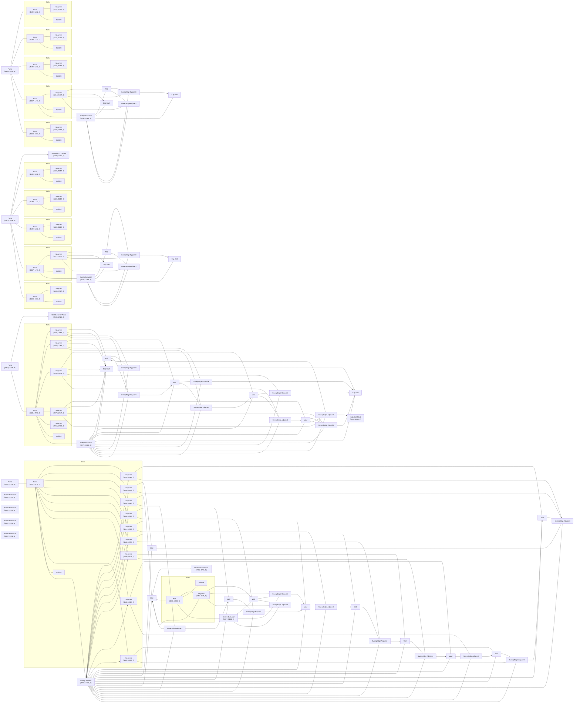

```mermaid
flowchart LR
  subgraph path8 [Path]
    8["Path<br>[1139, 1212, 0]"]
      %% [ProgramBodyItem { index: 20 }, VariableDeclarationDeclaration, VariableDeclarationInit, FunctionExpressionBody, FunctionExpressionBodyItem { index: 8 }, VariableDeclarationDeclaration, VariableDeclarationInit]
    26["Segment<br>[1139, 1212, 0]"]
      %% [ProgramBodyItem { index: 20 }, VariableDeclarationDeclaration, VariableDeclarationInit, FunctionExpressionBody, FunctionExpressionBodyItem { index: 8 }, VariableDeclarationDeclaration, VariableDeclarationInit]
    48[Solid2d]
  end
  subgraph path9 [Path]
    9["Path<br>[1139, 1212, 0]"]
      %% [ProgramBodyItem { index: 20 }, VariableDeclarationDeclaration, VariableDeclarationInit, FunctionExpressionBody, FunctionExpressionBodyItem { index: 8 }, VariableDeclarationDeclaration, VariableDeclarationInit]
    24["Segment<br>[1139, 1212, 0]"]
      %% [ProgramBodyItem { index: 20 }, VariableDeclarationDeclaration, VariableDeclarationInit, FunctionExpressionBody, FunctionExpressionBodyItem { index: 8 }, VariableDeclarationDeclaration, VariableDeclarationInit]
    49[Solid2d]
  end
  subgraph path10 [Path]
    10["Path<br>[1139, 1212, 0]"]
      %% [ProgramBodyItem { index: 20 }, VariableDeclarationDeclaration, VariableDeclarationInit, FunctionExpressionBody, FunctionExpressionBodyItem { index: 8 }, VariableDeclarationDeclaration, VariableDeclarationInit]
    21["Segment<br>[1139, 1212, 0]"]
      %% [ProgramBodyItem { index: 20 }, VariableDeclarationDeclaration, VariableDeclarationInit, FunctionExpressionBody, FunctionExpressionBodyItem { index: 8 }, VariableDeclarationDeclaration, VariableDeclarationInit]
    51[Solid2d]
  end
  subgraph path11 [Path]
    11["Path<br>[1139, 1212, 0]"]
      %% [ProgramBodyItem { index: 20 }, VariableDeclarationDeclaration, VariableDeclarationInit, FunctionExpressionBody, FunctionExpressionBodyItem { index: 8 }, VariableDeclarationDeclaration, VariableDeclarationInit]
    25["Segment<br>[1139, 1212, 0]"]
      %% [ProgramBodyItem { index: 20 }, VariableDeclarationDeclaration, VariableDeclarationInit, FunctionExpressionBody, FunctionExpressionBodyItem { index: 8 }, VariableDeclarationDeclaration, VariableDeclarationInit]
    52[Solid2d]
  end
  subgraph path12 [Path]
    12["Path<br>[1139, 1212, 0]"]
      %% [ProgramBodyItem { index: 20 }, VariableDeclarationDeclaration, VariableDeclarationInit, FunctionExpressionBody, FunctionExpressionBodyItem { index: 8 }, VariableDeclarationDeclaration, VariableDeclarationInit]
    23["Segment<br>[1139, 1212, 0]"]
      %% [ProgramBodyItem { index: 20 }, VariableDeclarationDeclaration, VariableDeclarationInit, FunctionExpressionBody, FunctionExpressionBodyItem { index: 8 }, VariableDeclarationDeclaration, VariableDeclarationInit]
    53[Solid2d]
  end
  subgraph path13 [Path]
    13["Path<br>[1139, 1212, 0]"]
      %% [ProgramBodyItem { index: 20 }, VariableDeclarationDeclaration, VariableDeclarationInit, FunctionExpressionBody, FunctionExpressionBodyItem { index: 8 }, VariableDeclarationDeclaration, VariableDeclarationInit]
    22["Segment<br>[1139, 1212, 0]"]
      %% [ProgramBodyItem { index: 20 }, VariableDeclarationDeclaration, VariableDeclarationInit, FunctionExpressionBody, FunctionExpressionBodyItem { index: 8 }, VariableDeclarationDeclaration, VariableDeclarationInit]
    57[Solid2d]
  end
  subgraph path14 [Path]
    14["Path<br>[1417, 1477, 0]"]
      %% [ProgramBodyItem { index: 21 }, VariableDeclarationDeclaration, VariableDeclarationInit, FunctionExpressionBody, FunctionExpressionBodyItem { index: 1 }, VariableDeclarationDeclaration, VariableDeclarationInit, PipeBodyItem { index: 0 }]
    27["Segment<br>[1417, 1477, 0]"]
      %% [ProgramBodyItem { index: 21 }, VariableDeclarationDeclaration, VariableDeclarationInit, FunctionExpressionBody, FunctionExpressionBodyItem { index: 1 }, VariableDeclarationDeclaration, VariableDeclarationInit, PipeBodyItem { index: 0 }]
    46[Solid2d]
  end
  subgraph path15 [Path]
    15["Path<br>[1417, 1477, 0]"]
      %% [ProgramBodyItem { index: 21 }, VariableDeclarationDeclaration, VariableDeclarationInit, FunctionExpressionBody, FunctionExpressionBodyItem { index: 1 }, VariableDeclarationDeclaration, VariableDeclarationInit, PipeBodyItem { index: 0 }]
    28["Segment<br>[1417, 1477, 0]"]
      %% [ProgramBodyItem { index: 21 }, VariableDeclarationDeclaration, VariableDeclarationInit, FunctionExpressionBody, FunctionExpressionBodyItem { index: 1 }, VariableDeclarationDeclaration, VariableDeclarationInit, PipeBodyItem { index: 0 }]
    54[Solid2d]
  end
  subgraph path16 [Path]
    16["Path<br>[1503, 1587, 0]"]
      %% [ProgramBodyItem { index: 21 }, VariableDeclarationDeclaration, VariableDeclarationInit, FunctionExpressionBody, FunctionExpressionBodyItem { index: 1 }, VariableDeclarationDeclaration, VariableDeclarationInit, PipeBodyItem { index: 1 }, CallKwArg { index: 0 }]
    29["Segment<br>[1503, 1587, 0]"]
      %% [ProgramBodyItem { index: 21 }, VariableDeclarationDeclaration, VariableDeclarationInit, FunctionExpressionBody, FunctionExpressionBodyItem { index: 1 }, VariableDeclarationDeclaration, VariableDeclarationInit, PipeBodyItem { index: 1 }, CallKwArg { index: 0 }]
    55[Solid2d]
  end
  subgraph path17 [Path]
    17["Path<br>[1503, 1587, 0]"]
      %% [ProgramBodyItem { index: 21 }, VariableDeclarationDeclaration, VariableDeclarationInit, FunctionExpressionBody, FunctionExpressionBodyItem { index: 1 }, VariableDeclarationDeclaration, VariableDeclarationInit, PipeBodyItem { index: 1 }, CallKwArg { index: 0 }]
    30["Segment<br>[1503, 1587, 0]"]
      %% [ProgramBodyItem { index: 21 }, VariableDeclarationDeclaration, VariableDeclarationInit, FunctionExpressionBody, FunctionExpressionBodyItem { index: 1 }, VariableDeclarationDeclaration, VariableDeclarationInit, PipeBodyItem { index: 1 }, CallKwArg { index: 0 }]
    58[Solid2d]
  end
  subgraph path18 [Path]
    18["Path<br>[2541, 2591, 0]"]
      %% [ProgramBodyItem { index: 25 }, VariableDeclarationDeclaration, VariableDeclarationInit, PipeBodyItem { index: 0 }]
    31["Segment<br>[2597, 2663, 0]"]
      %% [ProgramBodyItem { index: 25 }, VariableDeclarationDeclaration, VariableDeclarationInit, PipeBodyItem { index: 1 }]
    32["Segment<br>[2669, 2763, 0]"]
      %% [ProgramBodyItem { index: 25 }, VariableDeclarationDeclaration, VariableDeclarationInit, PipeBodyItem { index: 2 }]
    33["Segment<br>[2769, 2871, 0]"]
      %% [ProgramBodyItem { index: 25 }, VariableDeclarationDeclaration, VariableDeclarationInit, PipeBodyItem { index: 3 }]
    34["Segment<br>[2877, 2947, 0]"]
      %% [ProgramBodyItem { index: 25 }, VariableDeclarationDeclaration, VariableDeclarationInit, PipeBodyItem { index: 4 }]
    35["Segment<br>[2953, 2960, 0]"]
      %% [ProgramBodyItem { index: 25 }, VariableDeclarationDeclaration, VariableDeclarationInit, PipeBodyItem { index: 5 }]
    47[Solid2d]
  end
  subgraph path19 [Path]
    19["Path<br>[4141, 4279, 0]"]
      %% [ProgramBodyItem { index: 37 }, VariableDeclarationDeclaration, VariableDeclarationInit, PipeBodyItem { index: 0 }]
    36["Segment<br>[4285, 4384, 0]"]
      %% [ProgramBodyItem { index: 37 }, VariableDeclarationDeclaration, VariableDeclarationInit, PipeBodyItem { index: 1 }]
    37["Segment<br>[4390, 4438, 0]"]
      %% [ProgramBodyItem { index: 37 }, VariableDeclarationDeclaration, VariableDeclarationInit, PipeBodyItem { index: 2 }]
    38["Segment<br>[4444, 4480, 0]"]
      %% [ProgramBodyItem { index: 37 }, VariableDeclarationDeclaration, VariableDeclarationInit, PipeBodyItem { index: 3 }]
    39["Segment<br>[4486, 4508, 0]"]
      %% [ProgramBodyItem { index: 37 }, VariableDeclarationDeclaration, VariableDeclarationInit, PipeBodyItem { index: 4 }]
    40["Segment<br>[4514, 4537, 0]"]
      %% [ProgramBodyItem { index: 37 }, VariableDeclarationDeclaration, VariableDeclarationInit, PipeBodyItem { index: 5 }]
    41["Segment<br>[4543, 4593, 0]"]
      %% [ProgramBodyItem { index: 37 }, VariableDeclarationDeclaration, VariableDeclarationInit, PipeBodyItem { index: 6 }]
    42["Segment<br>[4599, 4618, 0]"]
      %% [ProgramBodyItem { index: 37 }, VariableDeclarationDeclaration, VariableDeclarationInit, PipeBodyItem { index: 7 }]
    43["Segment<br>[4643, 4683, 0]"]
      %% [ProgramBodyItem { index: 37 }, VariableDeclarationDeclaration, VariableDeclarationInit, PipeBodyItem { index: 8 }]
    44["Segment<br>[4689, 4697, 0]"]
      %% [ProgramBodyItem { index: 37 }, VariableDeclarationDeclaration, VariableDeclarationInit, PipeBodyItem { index: 9 }]
    56[Solid2d]
  end
  subgraph path20 [Path]
    20["Path<br>[4811, 4889, 0]"]
      %% [ProgramBodyItem { index: 39 }, VariableDeclarationDeclaration, VariableDeclarationInit, PipeBodyItem { index: 0 }]
    45["Segment<br>[4811, 4889, 0]"]
      %% [ProgramBodyItem { index: 39 }, VariableDeclarationDeclaration, VariableDeclarationInit, PipeBodyItem { index: 0 }]
    50[Solid2d]
  end
  1["Plane<br>[1380, 1400, 0]"]
    %% [ProgramBodyItem { index: 21 }, VariableDeclarationDeclaration, VariableDeclarationInit, FunctionExpressionBody, FunctionExpressionBodyItem { index: 0 }, VariableDeclarationDeclaration, VariableDeclarationInit]
  2["Plane<br>[2453, 2488, 0]"]
    %% [ProgramBodyItem { index: 23 }, VariableDeclarationDeclaration, VariableDeclarationInit]
  3["Plane<br>[3513, 3556, 0]"]
    %% [ProgramBodyItem { index: 28 }, VariableDeclarationDeclaration, VariableDeclarationInit]
  4["Plane<br>[4107, 4125, 0]"]
    %% [ProgramBodyItem { index: 36 }, VariableDeclarationDeclaration, VariableDeclarationInit]
  5["StartSketchOnPlane<br>[1380, 1400, 0]"]
    %% [ProgramBodyItem { index: 21 }, VariableDeclarationDeclaration, VariableDeclarationInit, FunctionExpressionBody, FunctionExpressionBodyItem { index: 0 }, VariableDeclarationDeclaration, VariableDeclarationInit]
  6["StartSketchOnPlane<br>[2502, 2526, 0]"]
    %% [ProgramBodyItem { index: 24 }, VariableDeclarationDeclaration, VariableDeclarationInit]
  7["StartSketchOnFace<br>[4755, 4796, 0]"]
    %% [ProgramBodyItem { index: 38 }, VariableDeclarationDeclaration, VariableDeclarationInit]
  59["Sweep Extrusion<br>[2068, 2113, 0]"]
    %% [ProgramBodyItem { index: 21 }, VariableDeclarationDeclaration, VariableDeclarationInit, FunctionExpressionBody, FunctionExpressionBodyItem { index: 7 }, VariableDeclarationDeclaration, VariableDeclarationInit]
  60["Sweep Extrusion<br>[2068, 2113, 0]"]
    %% [ProgramBodyItem { index: 21 }, VariableDeclarationDeclaration, VariableDeclarationInit, FunctionExpressionBody, FunctionExpressionBodyItem { index: 7 }, VariableDeclarationDeclaration, VariableDeclarationInit]
  61["Sweep Extrusion<br>[2972, 3008, 0]"]
    %% [ProgramBodyItem { index: 26 }, VariableDeclarationDeclaration, VariableDeclarationInit, PipeBodyItem { index: 0 }]
  62["Sweep Revolve<br>[4703, 4720, 0]"]
    %% [ProgramBodyItem { index: 37 }, VariableDeclarationDeclaration, VariableDeclarationInit, PipeBodyItem { index: 10 }]
  63["Sweep Extrusion<br>[5097, 5152, 0]"]
    %% [ProgramBodyItem { index: 41 }, VariableDeclarationDeclaration, VariableDeclarationInit]
  64["Sweep Extrusion<br>[5097, 5152, 0]"]
    %% [ProgramBodyItem { index: 41 }, VariableDeclarationDeclaration, VariableDeclarationInit]
  65["Sweep Extrusion<br>[5097, 5152, 0]"]
    %% [ProgramBodyItem { index: 41 }, VariableDeclarationDeclaration, VariableDeclarationInit]
  66["Sweep Extrusion<br>[5097, 5152, 0]"]
    %% [ProgramBodyItem { index: 41 }, VariableDeclarationDeclaration, VariableDeclarationInit]
  67["Sweep Extrusion<br>[5097, 5152, 0]"]
    %% [ProgramBodyItem { index: 41 }, VariableDeclarationDeclaration, VariableDeclarationInit]
  68[Wall]
    %% face_code_ref=Missing NodePath
  69[Wall]
    %% face_code_ref=Missing NodePath
  70[Wall]
    %% face_code_ref=Missing NodePath
  71[Wall]
    %% face_code_ref=Missing NodePath
  72[Wall]
    %% face_code_ref=Missing NodePath
  73[Wall]
    %% face_code_ref=Missing NodePath
  74[Wall]
    %% face_code_ref=Missing NodePath
  75[Wall]
    %% face_code_ref=Missing NodePath
  76[Wall]
    %% face_code_ref=Missing NodePath
  77[Wall]
    %% face_code_ref=Missing NodePath
  78[Wall]
    %% face_code_ref=Missing NodePath
  79[Wall]
    %% face_code_ref=Missing NodePath
  80[Wall]
    %% face_code_ref=Missing NodePath
  81[Wall]
    %% face_code_ref=Missing NodePath
  82[Wall]
    %% face_code_ref=[ProgramBodyItem { index: 38 }, VariableDeclarationDeclaration, VariableDeclarationInit]
  83[Wall]
    %% face_code_ref=Missing NodePath
  84["Cap Start"]
    %% face_code_ref=Missing NodePath
  85["Cap Start"]
    %% face_code_ref=Missing NodePath
  86["Cap Start"]
    %% face_code_ref=Missing NodePath
  87["Cap End"]
    %% face_code_ref=Missing NodePath
  88["Cap End"]
    %% face_code_ref=Missing NodePath
  89["Cap End"]
    %% face_code_ref=Missing NodePath
  90["SweepEdge Opposite"]
  91["SweepEdge Opposite"]
  92["SweepEdge Opposite"]
  93["SweepEdge Opposite"]
  94["SweepEdge Opposite"]
  95["SweepEdge Opposite"]
  96["SweepEdge Opposite"]
  97["SweepEdge Adjacent"]
  98["SweepEdge Adjacent"]
  99["SweepEdge Adjacent"]
  100["SweepEdge Adjacent"]
  101["SweepEdge Adjacent"]
  102["SweepEdge Adjacent"]
  103["SweepEdge Adjacent"]
  104["SweepEdge Adjacent"]
  105["SweepEdge Adjacent"]
  106["SweepEdge Adjacent"]
  107["SweepEdge Adjacent"]
  108["SweepEdge Adjacent"]
  109["SweepEdge Adjacent"]
  110["SweepEdge Adjacent"]
  111["SweepEdge Adjacent"]
  112["EdgeCut Fillet<br>[3014, 3304, 0]"]
    %% [ProgramBodyItem { index: 26 }, VariableDeclarationDeclaration, VariableDeclarationInit, PipeBodyItem { index: 1 }]
  1 --- 8
  1 --- 9
  1 --- 13
  1 --- 15
  1 --- 16
  2 <--x 6
  2 --- 18
  3 <--x 5
  3 --- 10
  3 --- 11
  3 --- 12
  3 --- 14
  3 --- 17
  4 --- 19
  82 x--> 7
  8 --- 26
  8 --- 48
  9 --- 24
  9 --- 49
  10 --- 21
  10 --- 51
  11 --- 25
  11 --- 52
  12 --- 23
  12 --- 53
  13 --- 22
  13 --- 57
  14 --- 27
  14 --- 46
  14 ---- 60
  15 --- 28
  15 --- 54
  15 ---- 59
  16 --- 29
  16 --- 55
  17 --- 30
  17 --- 58
  18 --- 31
  18 --- 32
  18 --- 33
  18 --- 34
  18 --- 35
  18 --- 47
  18 ---- 61
  19 --- 36
  19 --- 37
  19 --- 38
  19 --- 39
  19 --- 40
  19 --- 41
  19 --- 42
  19 --- 43
  19 --- 44
  19 --- 56
  19 ---- 62
  20 --- 45
  20 --- 50
  20 ---- 64
  82 --- 20
  27 --- 83
  27 x--> 86
  27 --- 96
  27 --- 111
  28 --- 68
  28 x--> 85
  28 --- 90
  28 --- 97
  31 --- 70
  31 x--> 84
  31 --- 94
  31 --- 101
  32 --- 71
  32 x--> 84
  32 --- 93
  32 --- 100
  33 --- 69
  33 x--> 84
  33 --- 92
  33 --- 99
  34 --- 72
  34 x--> 84
  34 --- 91
  34 --- 98
  62 <--x 36
  36 --- 78
  36 x--> 103
  62 <--x 37
  37 --- 77
  37 --- 103
  62 <--x 38
  38 --- 82
  38 --- 104
  62 <--x 39
  39 --- 79
  39 --- 105
  62 <--x 40
  40 --- 74
  40 --- 106
  62 <--x 41
  41 --- 81
  41 --- 107
  62 <--x 42
  42 --- 76
  42 --- 108
  62 <--x 43
  43 --- 75
  43 --- 109
  62 <--x 44
  44 --- 80
  44 --- 110
  45 --- 73
  45 x--> 82
  45 --- 95
  45 --- 102
  59 --- 68
  59 --- 85
  59 --- 88
  59 --- 90
  59 --- 97
  60 --- 83
  60 --- 86
  60 --- 89
  60 --- 96
  60 --- 111
  61 --- 69
  61 --- 70
  61 --- 71
  61 --- 72
  61 --- 84
  61 --- 87
  61 --- 91
  61 --- 92
  61 --- 93
  61 --- 94
  61 --- 98
  61 --- 99
  61 --- 100
  61 --- 101
  62 --- 74
  62 --- 75
  62 --- 76
  62 --- 77
  62 --- 78
  62 --- 79
  62 --- 80
  62 --- 81
  62 --- 82
  62 --- 103
  62 --- 104
  62 --- 105
  62 --- 106
  62 --- 107
  62 --- 108
  62 --- 109
  62 --- 110
  64 --- 73
  64 --- 95
  64 --- 102
  68 --- 90
  68 --- 97
  69 --- 92
  69 --- 99
  100 <--x 69
  70 --- 94
  98 <--x 70
  70 --- 101
  71 --- 93
  71 --- 100
  101 <--x 71
  72 --- 91
  72 --- 98
  99 <--x 72
  73 --- 95
  73 --- 102
  95 <--x 74
  105 <--x 74
  74 --- 106
  108 <--x 75
  75 --- 109
  107 <--x 76
  76 --- 108
  77 --- 103
  78 --- 103
  110 <--x 78
  104 <--x 79
  79 --- 105
  109 <--x 80
  80 --- 110
  106 <--x 81
  81 --- 107
  82 --- 104
  83 --- 96
  83 --- 111
  91 <--x 87
  92 <--x 87
  93 <--x 87
  94 <--x 87
  90 <--x 88
  96 <--x 89
  98 <--x 112
```
