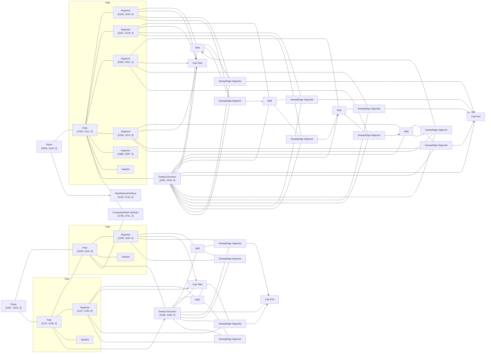

```mermaid
flowchart LR
  subgraph path2 [Path]
    2["Path<br>[1039, 1104, 0]"]
      %% [ProgramBodyItem { index: 5 }, VariableDeclarationDeclaration, VariableDeclarationInit, PipeBodyItem { index: 0 }]
    3["Segment<br>[1039, 1104, 0]"]
      %% [ProgramBodyItem { index: 5 }, VariableDeclarationDeclaration, VariableDeclarationInit, PipeBodyItem { index: 0 }]
    4[Solid2d]
  end
  subgraph path5 [Path]
    5["Path<br>[1137, 1190, 0]"]
      %% [ProgramBodyItem { index: 5 }, VariableDeclarationDeclaration, VariableDeclarationInit, PipeBodyItem { index: 1 }, CallKwArg { index: 0 }, ArrayElement { index: 0 }]
    6["Segment<br>[1137, 1190, 0]"]
      %% [ProgramBodyItem { index: 5 }, VariableDeclarationDeclaration, VariableDeclarationInit, PipeBodyItem { index: 1 }, CallKwArg { index: 0 }, ArrayElement { index: 0 }]
    7[Solid2d]
  end
  subgraph path18 [Path]
    18["Path<br>[2159, 2212, 0]"]
      %% [ProgramBodyItem { index: 13 }, VariableDeclarationDeclaration, VariableDeclarationInit, PipeBodyItem { index: 0 }]
    19["Segment<br>[2218, 2245, 0]"]
      %% [ProgramBodyItem { index: 13 }, VariableDeclarationDeclaration, VariableDeclarationInit, PipeBodyItem { index: 1 }]
    20["Segment<br>[2251, 2278, 0]"]
      %% [ProgramBodyItem { index: 13 }, VariableDeclarationDeclaration, VariableDeclarationInit, PipeBodyItem { index: 2 }]
    21["Segment<br>[2284, 2312, 0]"]
      %% [ProgramBodyItem { index: 13 }, VariableDeclarationDeclaration, VariableDeclarationInit, PipeBodyItem { index: 3 }]
    22["Segment<br>[2318, 2374, 0]"]
      %% [ProgramBodyItem { index: 13 }, VariableDeclarationDeclaration, VariableDeclarationInit, PipeBodyItem { index: 4 }]
    23["Segment<br>[2380, 2387, 0]"]
      %% [ProgramBodyItem { index: 13 }, VariableDeclarationDeclaration, VariableDeclarationInit, PipeBodyItem { index: 5 }]
    24[Solid2d]
  end
  1["Plane<br>[1007, 1024, 0]"]
    %% [ProgramBodyItem { index: 4 }, VariableDeclarationDeclaration, VariableDeclarationInit]
  8["Sweep Extrusion<br>[1295, 1339, 0]"]
    %% [ProgramBodyItem { index: 6 }, VariableDeclarationDeclaration, VariableDeclarationInit]
  9[Wall]
    %% face_code_ref=Missing NodePath
  10[Wall]
    %% face_code_ref=Missing NodePath
  11["Cap Start"]
    %% face_code_ref=Missing NodePath
  12["Cap End"]
    %% face_code_ref=Missing NodePath
  13["SweepEdge Opposite"]
  14["SweepEdge Adjacent"]
  15["SweepEdge Opposite"]
  16["SweepEdge Adjacent"]
  17["Plane<br>[2064, 2103, 0]"]
    %% [ProgramBodyItem { index: 11 }, VariableDeclarationDeclaration, VariableDeclarationInit]
  25["Sweep Extrusion<br>[2401, 2444, 0]"]
    %% [ProgramBodyItem { index: 14 }, VariableDeclarationDeclaration, VariableDeclarationInit]
  26[Wall]
    %% face_code_ref=Missing NodePath
  27[Wall]
    %% face_code_ref=Missing NodePath
  28[Wall]
    %% face_code_ref=Missing NodePath
  29[Wall]
    %% face_code_ref=Missing NodePath
  30["Cap Start"]
    %% face_code_ref=Missing NodePath
  31["Cap End"]
    %% face_code_ref=Missing NodePath
  32["SweepEdge Opposite"]
  33["SweepEdge Adjacent"]
  34["SweepEdge Opposite"]
  35["SweepEdge Adjacent"]
  36["SweepEdge Opposite"]
  37["SweepEdge Adjacent"]
  38["SweepEdge Opposite"]
  39["SweepEdge Adjacent"]
  40["CompositeSolid Subtract<br>[2749, 2791, 0]"]
    %% [ProgramBodyItem { index: 15 }, VariableDeclarationDeclaration, VariableDeclarationInit]
  41["StartSketchOnPlane<br>[2118, 2143, 0]"]
    %% [ProgramBodyItem { index: 12 }, VariableDeclarationDeclaration, VariableDeclarationInit]
  1 --- 2
  1 --- 5
  2 --- 3
  2 --- 4
  5 --- 2
  2 ---- 8
  2 --- 40
  3 --- 9
  3 x--> 11
  3 --- 13
  3 --- 14
  5 --- 6
  5 --- 7
  5 x---> 8
  6 --- 10
  6 x--> 11
  6 --- 15
  6 --- 16
  8 --- 9
  8 --- 10
  8 --- 11
  8 --- 12
  8 --- 13
  8 --- 14
  8 --- 15
  8 --- 16
  9 --- 13
  9 --- 14
  10 --- 15
  10 --- 16
  13 <--x 12
  15 <--x 12
  17 --- 18
  17 <--x 41
  18 --- 19
  18 --- 20
  18 --- 21
  18 --- 22
  18 --- 23
  18 --- 24
  18 ---- 25
  18 --- 40
  19 --- 29
  19 x--> 30
  19 --- 38
  19 --- 39
  20 --- 28
  20 x--> 30
  20 --- 36
  20 --- 37
  21 --- 27
  21 x--> 30
  21 --- 34
  21 --- 35
  22 --- 26
  22 x--> 30
  22 --- 32
  22 --- 33
  25 --- 26
  25 --- 27
  25 --- 28
  25 --- 29
  25 --- 30
  25 --- 31
  25 --- 32
  25 --- 33
  25 --- 34
  25 --- 35
  25 --- 36
  25 --- 37
  25 --- 38
  25 --- 39
  26 --- 32
  26 --- 33
  35 <--x 26
  27 --- 34
  27 --- 35
  37 <--x 27
  28 --- 36
  28 --- 37
  39 <--x 28
  33 <--x 29
  29 --- 38
  29 --- 39
  32 <--x 31
  34 <--x 31
  36 <--x 31
  38 <--x 31
```
