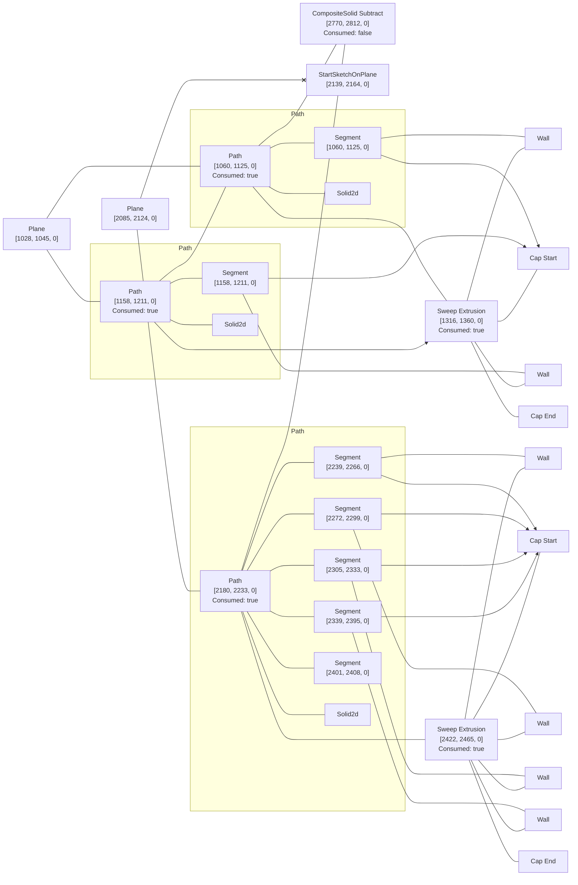

```mermaid
flowchart LR
  subgraph path2 [Path]
    2["Path<br>[1060, 1125, 0]<br>Consumed: true"]
      %% [ProgramBodyItem { index: 5 }, VariableDeclarationDeclaration, VariableDeclarationInit, PipeBodyItem { index: 0 }]
    3["Segment<br>[1060, 1125, 0]"]
      %% [ProgramBodyItem { index: 5 }, VariableDeclarationDeclaration, VariableDeclarationInit, PipeBodyItem { index: 0 }]
    4[Solid2d]
  end
  subgraph path5 [Path]
    5["Path<br>[1158, 1211, 0]<br>Consumed: true"]
      %% [ProgramBodyItem { index: 5 }, VariableDeclarationDeclaration, VariableDeclarationInit, PipeBodyItem { index: 1 }, CallKwArg { index: 0 }, ArrayElement { index: 0 }]
    6["Segment<br>[1158, 1211, 0]"]
      %% [ProgramBodyItem { index: 5 }, VariableDeclarationDeclaration, VariableDeclarationInit, PipeBodyItem { index: 1 }, CallKwArg { index: 0 }, ArrayElement { index: 0 }]
    7[Solid2d]
  end
  subgraph path14 [Path]
    14["Path<br>[2180, 2233, 0]<br>Consumed: true"]
      %% [ProgramBodyItem { index: 13 }, VariableDeclarationDeclaration, VariableDeclarationInit, PipeBodyItem { index: 0 }]
    15["Segment<br>[2239, 2266, 0]"]
      %% [ProgramBodyItem { index: 13 }, VariableDeclarationDeclaration, VariableDeclarationInit, PipeBodyItem { index: 1 }]
    16["Segment<br>[2272, 2299, 0]"]
      %% [ProgramBodyItem { index: 13 }, VariableDeclarationDeclaration, VariableDeclarationInit, PipeBodyItem { index: 2 }]
    17["Segment<br>[2305, 2333, 0]"]
      %% [ProgramBodyItem { index: 13 }, VariableDeclarationDeclaration, VariableDeclarationInit, PipeBodyItem { index: 3 }]
    18["Segment<br>[2339, 2395, 0]"]
      %% [ProgramBodyItem { index: 13 }, VariableDeclarationDeclaration, VariableDeclarationInit, PipeBodyItem { index: 4 }]
    19["Segment<br>[2401, 2408, 0]"]
      %% [ProgramBodyItem { index: 13 }, VariableDeclarationDeclaration, VariableDeclarationInit, PipeBodyItem { index: 5 }]
    20[Solid2d]
  end
  1["Plane<br>[1028, 1045, 0]"]
    %% [ProgramBodyItem { index: 4 }, VariableDeclarationDeclaration, VariableDeclarationInit]
  8["Sweep Extrusion<br>[1316, 1360, 0]<br>Consumed: true"]
    %% [ProgramBodyItem { index: 6 }, VariableDeclarationDeclaration, VariableDeclarationInit]
  9[Wall]
    %% face_code_ref=Missing NodePath
  10[Wall]
    %% face_code_ref=Missing NodePath
  11["Cap Start"]
    %% face_code_ref=Missing NodePath
  12["Cap End"]
    %% face_code_ref=Missing NodePath
  13["Plane<br>[2085, 2124, 0]"]
    %% [ProgramBodyItem { index: 11 }, VariableDeclarationDeclaration, VariableDeclarationInit]
  21["Sweep Extrusion<br>[2422, 2465, 0]<br>Consumed: true"]
    %% [ProgramBodyItem { index: 14 }, VariableDeclarationDeclaration, VariableDeclarationInit]
  22[Wall]
    %% face_code_ref=Missing NodePath
  23[Wall]
    %% face_code_ref=Missing NodePath
  24[Wall]
    %% face_code_ref=Missing NodePath
  25[Wall]
    %% face_code_ref=Missing NodePath
  26["Cap Start"]
    %% face_code_ref=Missing NodePath
  27["Cap End"]
    %% face_code_ref=Missing NodePath
  28["CompositeSolid Subtract<br>[2770, 2812, 0]<br>Consumed: false"]
    %% [ProgramBodyItem { index: 15 }, VariableDeclarationDeclaration, VariableDeclarationInit]
  29["StartSketchOnPlane<br>[2139, 2164, 0]"]
    %% [ProgramBodyItem { index: 12 }, VariableDeclarationDeclaration, VariableDeclarationInit]
  1 --- 2
  1 --- 5
  2 --- 3
  2 --- 4
  5 --- 2
  2 ---- 8
  2 --- 28
  3 --- 9
  3 x--> 11
  5 --- 6
  5 --- 7
  5 x---> 8
  6 --- 10
  6 x--> 11
  8 --- 9
  8 --- 10
  8 --- 11
  8 --- 12
  13 --- 14
  13 <--x 29
  14 --- 15
  14 --- 16
  14 --- 17
  14 --- 18
  14 --- 19
  14 --- 20
  14 ---- 21
  14 --- 28
  15 --- 25
  15 x--> 26
  16 --- 24
  16 x--> 26
  17 --- 23
  17 x--> 26
  18 --- 22
  18 x--> 26
  21 --- 22
  21 --- 23
  21 --- 24
  21 --- 25
  21 --- 26
  21 --- 27
```
