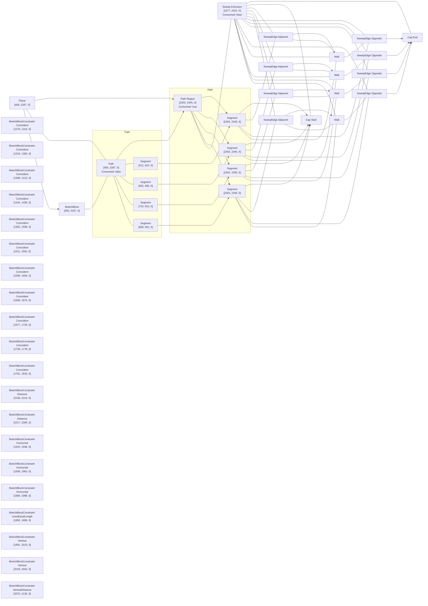

```mermaid
flowchart LR
  subgraph path4 [Path]
    4["Path<br>[459, 2287, 0]<br>Consumed: false"]
      %% [ProgramBodyItem { index: 4 }, VariableDeclarationDeclaration, VariableDeclarationInit]
    10["Segment<br>[512, 610, 0]"]
      %% [ProgramBodyItem { index: 4 }, VariableDeclarationDeclaration, VariableDeclarationInit, SketchBlockBody, SketchBlockBodyItem { index: 0 }, VariableDeclarationDeclaration, VariableDeclarationInit]
    11["Segment<br>[625, 696, 0]"]
      %% [ProgramBodyItem { index: 4 }, VariableDeclarationDeclaration, VariableDeclarationInit, SketchBlockBody, SketchBlockBodyItem { index: 1 }, VariableDeclarationDeclaration, VariableDeclarationInit]
    12["Segment<br>[710, 810, 0]"]
      %% [ProgramBodyItem { index: 4 }, VariableDeclarationDeclaration, VariableDeclarationInit, SketchBlockBody, SketchBlockBodyItem { index: 2 }, VariableDeclarationDeclaration, VariableDeclarationInit]
    13["Segment<br>[828, 901, 0]"]
      %% [ProgramBodyItem { index: 4 }, VariableDeclarationDeclaration, VariableDeclarationInit, SketchBlockBody, SketchBlockBodyItem { index: 3 }, VariableDeclarationDeclaration, VariableDeclarationInit]
  end
  subgraph path3 [Path]
    3["Path Region<br>[2303, 2345, 0]<br>Consumed: true"]
      %% [ProgramBodyItem { index: 5 }, VariableDeclarationDeclaration, VariableDeclarationInit]
    6["Segment<br>[2303, 2345, 0]"]
      %% [ProgramBodyItem { index: 5 }, VariableDeclarationDeclaration, VariableDeclarationInit]
    7["Segment<br>[2303, 2345, 0]"]
      %% [ProgramBodyItem { index: 5 }, VariableDeclarationDeclaration, VariableDeclarationInit]
    8["Segment<br>[2303, 2345, 0]"]
      %% [ProgramBodyItem { index: 5 }, VariableDeclarationDeclaration, VariableDeclarationInit]
    9["Segment<br>[2303, 2345, 0]"]
      %% [ProgramBodyItem { index: 5 }, VariableDeclarationDeclaration, VariableDeclarationInit]
  end
  5["Plane<br>[459, 2287, 0]"]
    %% [ProgramBodyItem { index: 4 }, VariableDeclarationDeclaration, VariableDeclarationInit]
  35["Sweep Extrusion<br>[2377, 2422, 0]<br>Consumed: false"]
    %% [ProgramBodyItem { index: 7 }, VariableDeclarationDeclaration, VariableDeclarationInit]
  44[Wall]
    %% face_code_ref=Missing NodePath
  45[Wall]
    %% face_code_ref=Missing NodePath
  46[Wall]
    %% face_code_ref=Missing NodePath
  47[Wall]
    %% face_code_ref=Missing NodePath
  2["Cap Start"]
    %% face_code_ref=Missing NodePath
  1["Cap End"]
    %% face_code_ref=Missing NodePath
  40["SweepEdge Opposite"]
  36["SweepEdge Adjacent"]
  41["SweepEdge Opposite"]
  37["SweepEdge Adjacent"]
  42["SweepEdge Opposite"]
  38["SweepEdge Adjacent"]
  43["SweepEdge Opposite"]
  39["SweepEdge Adjacent"]
  14["SketchBlock<br>[459, 2287, 0]"]
    %% [ProgramBodyItem { index: 4 }, VariableDeclarationDeclaration, VariableDeclarationInit]
  15["SketchBlockConstraint Coincident<br>[1279, 1316, 0]"]
    %% [ProgramBodyItem { index: 4 }, VariableDeclarationDeclaration, VariableDeclarationInit, SketchBlockBody, SketchBlockBodyItem { index: 7 }, ExpressionStatementExpr]
  16["SketchBlockConstraint Coincident<br>[1319, 1365, 0]"]
    %% [ProgramBodyItem { index: 4 }, VariableDeclarationDeclaration, VariableDeclarationInit, SketchBlockBody, SketchBlockBodyItem { index: 8 }, ExpressionStatementExpr]
  17["SketchBlockConstraint Coincident<br>[1368, 1413, 0]"]
    %% [ProgramBodyItem { index: 4 }, VariableDeclarationDeclaration, VariableDeclarationInit, SketchBlockBody, SketchBlockBodyItem { index: 9 }, ExpressionStatementExpr]
  18["SketchBlockConstraint Coincident<br>[1416, 1459, 0]"]
    %% [ProgramBodyItem { index: 4 }, VariableDeclarationDeclaration, VariableDeclarationInit, SketchBlockBody, SketchBlockBodyItem { index: 10 }, ExpressionStatementExpr]
  19["SketchBlockConstraint Coincident<br>[1462, 1508, 0]"]
    %% [ProgramBodyItem { index: 4 }, VariableDeclarationDeclaration, VariableDeclarationInit, SketchBlockBody, SketchBlockBodyItem { index: 11 }, ExpressionStatementExpr]
  20["SketchBlockConstraint Coincident<br>[1511, 1555, 0]"]
    %% [ProgramBodyItem { index: 4 }, VariableDeclarationDeclaration, VariableDeclarationInit, SketchBlockBody, SketchBlockBodyItem { index: 12 }, ExpressionStatementExpr]
  21["SketchBlockConstraint Coincident<br>[1558, 1605, 0]"]
    %% [ProgramBodyItem { index: 4 }, VariableDeclarationDeclaration, VariableDeclarationInit, SketchBlockBody, SketchBlockBodyItem { index: 13 }, ExpressionStatementExpr]
  22["SketchBlockConstraint Coincident<br>[1608, 1674, 0]"]
    %% [ProgramBodyItem { index: 4 }, VariableDeclarationDeclaration, VariableDeclarationInit, SketchBlockBody, SketchBlockBodyItem { index: 14 }, ExpressionStatementExpr]
  23["SketchBlockConstraint Coincident<br>[1677, 1725, 0]"]
    %% [ProgramBodyItem { index: 4 }, VariableDeclarationDeclaration, VariableDeclarationInit, SketchBlockBody, SketchBlockBodyItem { index: 15 }, ExpressionStatementExpr]
  24["SketchBlockConstraint Coincident<br>[1728, 1778, 0]"]
    %% [ProgramBodyItem { index: 4 }, VariableDeclarationDeclaration, VariableDeclarationInit, SketchBlockBody, SketchBlockBodyItem { index: 16 }, ExpressionStatementExpr]
  25["SketchBlockConstraint Coincident<br>[1781, 1833, 0]"]
    %% [ProgramBodyItem { index: 4 }, VariableDeclarationDeclaration, VariableDeclarationInit, SketchBlockBody, SketchBlockBodyItem { index: 17 }, ExpressionStatementExpr]
  31["SketchBlockConstraint LinesEqualLength<br>[1850, 1895, 0]"]
    %% [ProgramBodyItem { index: 4 }, VariableDeclarationDeclaration, VariableDeclarationInit, SketchBlockBody, SketchBlockBodyItem { index: 18 }, ExpressionStatementExpr]
  28["SketchBlockConstraint Horizontal<br>[1915, 1936, 0]"]
    %% [ProgramBodyItem { index: 4 }, VariableDeclarationDeclaration, VariableDeclarationInit, SketchBlockBody, SketchBlockBodyItem { index: 19 }, ExpressionStatementExpr]
  29["SketchBlockConstraint Horizontal<br>[1939, 1963, 0]"]
    %% [ProgramBodyItem { index: 4 }, VariableDeclarationDeclaration, VariableDeclarationInit, SketchBlockBody, SketchBlockBodyItem { index: 20 }, ExpressionStatementExpr]
  30["SketchBlockConstraint Horizontal<br>[1966, 1988, 0]"]
    %% [ProgramBodyItem { index: 4 }, VariableDeclarationDeclaration, VariableDeclarationInit, SketchBlockBody, SketchBlockBodyItem { index: 21 }, ExpressionStatementExpr]
  32["SketchBlockConstraint Vertical<br>[1991, 2015, 0]"]
    %% [ProgramBodyItem { index: 4 }, VariableDeclarationDeclaration, VariableDeclarationInit, SketchBlockBody, SketchBlockBodyItem { index: 22 }, ExpressionStatementExpr]
  33["SketchBlockConstraint Vertical<br>[2018, 2042, 0]"]
    %% [ProgramBodyItem { index: 4 }, VariableDeclarationDeclaration, VariableDeclarationInit, SketchBlockBody, SketchBlockBodyItem { index: 23 }, ExpressionStatementExpr]
  34["SketchBlockConstraint VerticalDistance<br>[2070, 2135, 0]"]
    %% [ProgramBodyItem { index: 4 }, VariableDeclarationDeclaration, VariableDeclarationInit, SketchBlockBody, SketchBlockBodyItem { index: 24 }, ExpressionStatementExpr]
  26["SketchBlockConstraint Distance<br>[2138, 2214, 0]"]
    %% [ProgramBodyItem { index: 4 }, VariableDeclarationDeclaration, VariableDeclarationInit, SketchBlockBody, SketchBlockBodyItem { index: 25 }, ExpressionStatementExpr]
  27["SketchBlockConstraint Distance<br>[2217, 2285, 0]"]
    %% [ProgramBodyItem { index: 4 }, VariableDeclarationDeclaration, VariableDeclarationInit, SketchBlockBody, SketchBlockBodyItem { index: 26 }, ExpressionStatementExpr]
  35 --- 1
  40 <--x 1
  41 <--x 1
  42 <--x 1
  43 <--x 1
  6 <--x 2
  7 <--x 2
  8 <--x 2
  9 <--x 2
  35 --- 2
  4 x--> 3
  5 x--> 3
  3 <--x 6
  3 <--x 7
  3 <--x 8
  3 <--x 9
  3 ---- 35
  5 --- 4
  4 --- 10
  4 --- 11
  4 --- 12
  4 --- 13
  14 --- 4
  5 <--x 14
  10 x--> 6
  6 --- 36
  6 --- 40
  6 --- 44
  11 x--> 7
  7 --- 37
  7 --- 41
  7 --- 45
  12 x--> 8
  8 --- 38
  8 --- 42
  8 --- 46
  13 x--> 9
  9 --- 39
  9 --- 43
  9 --- 47
  35 --- 36
  35 --- 37
  35 --- 38
  35 --- 39
  35 --- 40
  35 --- 41
  35 --- 42
  35 --- 43
  35 --- 44
  35 --- 45
  35 --- 46
  35 --- 47
  44 --- 36
  36 x--> 44
  45 --- 37
  37 x--> 45
  46 --- 38
  38 x--> 46
  47 --- 39
  39 x--> 47
  44 --- 40
  45 --- 41
  46 --- 42
  47 --- 43
```
