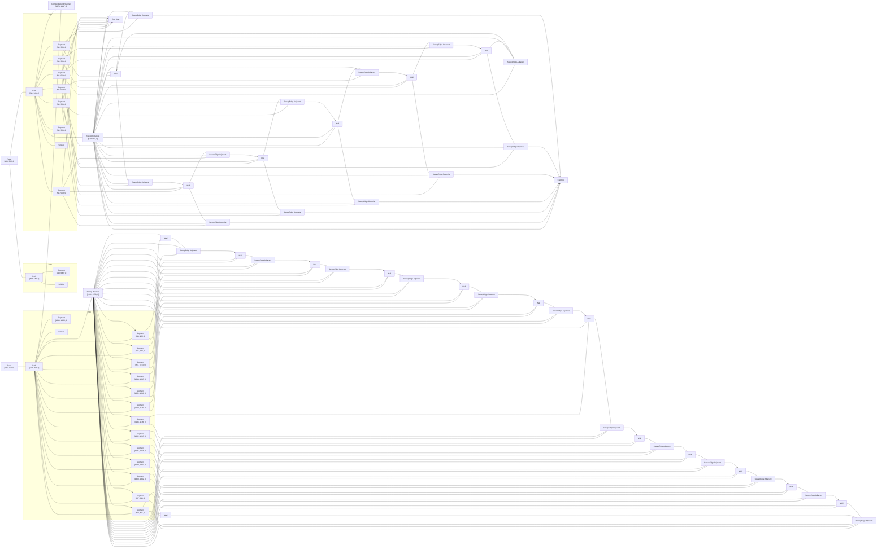

```mermaid
flowchart LR
  subgraph path3 [Path]
    3["Path<br>[511, 569, 0]"]
      %% [ProgramBodyItem { index: 4 }, VariableDeclarationDeclaration, VariableDeclarationInit, PipeBodyItem { index: 1 }]
    6["Segment<br>[511, 569, 0]"]
      %% [ProgramBodyItem { index: 4 }, VariableDeclarationDeclaration, VariableDeclarationInit, PipeBodyItem { index: 1 }]
    7["Segment<br>[511, 569, 0]"]
      %% [ProgramBodyItem { index: 4 }, VariableDeclarationDeclaration, VariableDeclarationInit, PipeBodyItem { index: 1 }]
    8["Segment<br>[511, 569, 0]"]
      %% [ProgramBodyItem { index: 4 }, VariableDeclarationDeclaration, VariableDeclarationInit, PipeBodyItem { index: 1 }]
    9["Segment<br>[511, 569, 0]"]
      %% [ProgramBodyItem { index: 4 }, VariableDeclarationDeclaration, VariableDeclarationInit, PipeBodyItem { index: 1 }]
    10["Segment<br>[511, 569, 0]"]
      %% [ProgramBodyItem { index: 4 }, VariableDeclarationDeclaration, VariableDeclarationInit, PipeBodyItem { index: 1 }]
    11["Segment<br>[511, 569, 0]"]
      %% [ProgramBodyItem { index: 4 }, VariableDeclarationDeclaration, VariableDeclarationInit, PipeBodyItem { index: 1 }]
    12["Segment<br>[511, 569, 0]"]
      %% [ProgramBodyItem { index: 4 }, VariableDeclarationDeclaration, VariableDeclarationInit, PipeBodyItem { index: 1 }]
    28[Solid2d]
  end
  subgraph path4 [Path]
    4["Path<br>[593, 642, 0]"]
      %% [ProgramBodyItem { index: 4 }, VariableDeclarationDeclaration, VariableDeclarationInit, PipeBodyItem { index: 2 }, CallKwArg { index: 0 }]
    13["Segment<br>[593, 642, 0]"]
      %% [ProgramBodyItem { index: 4 }, VariableDeclarationDeclaration, VariableDeclarationInit, PipeBodyItem { index: 2 }, CallKwArg { index: 0 }]
    30[Solid2d]
  end
  subgraph path5 [Path]
    5["Path<br>[759, 808, 0]"]
      %% [ProgramBodyItem { index: 5 }, VariableDeclarationDeclaration, VariableDeclarationInit, PipeBodyItem { index: 1 }]
    14["Segment<br>[814, 861, 0]"]
      %% [ProgramBodyItem { index: 5 }, VariableDeclarationDeclaration, VariableDeclarationInit, PipeBodyItem { index: 2 }]
    15["Segment<br>[867, 893, 0]"]
      %% [ProgramBodyItem { index: 5 }, VariableDeclarationDeclaration, VariableDeclarationInit, PipeBodyItem { index: 3 }]
    16["Segment<br>[899, 955, 0]"]
      %% [ProgramBodyItem { index: 5 }, VariableDeclarationDeclaration, VariableDeclarationInit, PipeBodyItem { index: 4 }]
    17["Segment<br>[961, 987, 0]"]
      %% [ProgramBodyItem { index: 5 }, VariableDeclarationDeclaration, VariableDeclarationInit, PipeBodyItem { index: 5 }]
    18["Segment<br>[993, 1013, 0]"]
      %% [ProgramBodyItem { index: 5 }, VariableDeclarationDeclaration, VariableDeclarationInit, PipeBodyItem { index: 6 }]
    19["Segment<br>[1019, 1045, 0]"]
      %% [ProgramBodyItem { index: 5 }, VariableDeclarationDeclaration, VariableDeclarationInit, PipeBodyItem { index: 7 }]
    20["Segment<br>[1051, 1098, 0]"]
      %% [ProgramBodyItem { index: 5 }, VariableDeclarationDeclaration, VariableDeclarationInit, PipeBodyItem { index: 8 }]
    21["Segment<br>[1104, 1130, 0]"]
      %% [ProgramBodyItem { index: 5 }, VariableDeclarationDeclaration, VariableDeclarationInit, PipeBodyItem { index: 9 }]
    22["Segment<br>[1136, 1196, 0]"]
      %% [ProgramBodyItem { index: 5 }, VariableDeclarationDeclaration, VariableDeclarationInit, PipeBodyItem { index: 10 }]
    23["Segment<br>[1202, 1235, 0]"]
      %% [ProgramBodyItem { index: 5 }, VariableDeclarationDeclaration, VariableDeclarationInit, PipeBodyItem { index: 11 }]
    24["Segment<br>[1241, 1274, 0]"]
      %% [ProgramBodyItem { index: 5 }, VariableDeclarationDeclaration, VariableDeclarationInit, PipeBodyItem { index: 12 }]
    25["Segment<br>[1280, 1302, 0]"]
      %% [ProgramBodyItem { index: 5 }, VariableDeclarationDeclaration, VariableDeclarationInit, PipeBodyItem { index: 13 }]
    26["Segment<br>[1308, 1342, 0]"]
      %% [ProgramBodyItem { index: 5 }, VariableDeclarationDeclaration, VariableDeclarationInit, PipeBodyItem { index: 14 }]
    27["Segment<br>[1348, 1355, 0]"]
      %% [ProgramBodyItem { index: 5 }, VariableDeclarationDeclaration, VariableDeclarationInit, PipeBodyItem { index: 15 }]
    29[Solid2d]
  end
  1["Plane<br>[488, 505, 0]"]
    %% [ProgramBodyItem { index: 4 }, VariableDeclarationDeclaration, VariableDeclarationInit, PipeBodyItem { index: 0 }]
  2["Plane<br>[736, 753, 0]"]
    %% [ProgramBodyItem { index: 5 }, VariableDeclarationDeclaration, VariableDeclarationInit, PipeBodyItem { index: 0 }]
  31["Sweep Extrusion<br>[649, 664, 0]"]
    %% [ProgramBodyItem { index: 4 }, VariableDeclarationDeclaration, VariableDeclarationInit, PipeBodyItem { index: 3 }]
  32["Sweep Revolve<br>[1361, 1378, 0]"]
    %% [ProgramBodyItem { index: 5 }, VariableDeclarationDeclaration, VariableDeclarationInit, PipeBodyItem { index: 16 }]
  33["CompositeSolid Subtract<br>[1379, 1417, 0]"]
    %% [ProgramBodyItem { index: 6 }, ExpressionStatementExpr, PipeBodyItem { index: 0 }]
  34[Wall]
    %% face_code_ref=Missing NodePath
  35[Wall]
    %% face_code_ref=Missing NodePath
  36[Wall]
    %% face_code_ref=Missing NodePath
  37[Wall]
    %% face_code_ref=Missing NodePath
  38[Wall]
    %% face_code_ref=Missing NodePath
  39[Wall]
    %% face_code_ref=Missing NodePath
  40[Wall]
    %% face_code_ref=Missing NodePath
  41[Wall]
    %% face_code_ref=Missing NodePath
  42[Wall]
    %% face_code_ref=Missing NodePath
  43[Wall]
    %% face_code_ref=Missing NodePath
  44[Wall]
    %% face_code_ref=Missing NodePath
  45[Wall]
    %% face_code_ref=Missing NodePath
  46[Wall]
    %% face_code_ref=Missing NodePath
  47[Wall]
    %% face_code_ref=Missing NodePath
  48[Wall]
    %% face_code_ref=Missing NodePath
  49[Wall]
    %% face_code_ref=Missing NodePath
  50[Wall]
    %% face_code_ref=Missing NodePath
  51[Wall]
    %% face_code_ref=Missing NodePath
  52[Wall]
    %% face_code_ref=Missing NodePath
  53["Cap Start"]
    %% face_code_ref=Missing NodePath
  54["Cap End"]
    %% face_code_ref=Missing NodePath
  55["SweepEdge Opposite"]
  56["SweepEdge Opposite"]
  57["SweepEdge Opposite"]
  58["SweepEdge Opposite"]
  59["SweepEdge Opposite"]
  60["SweepEdge Opposite"]
  61["SweepEdge Adjacent"]
  62["SweepEdge Adjacent"]
  63["SweepEdge Adjacent"]
  64["SweepEdge Adjacent"]
  65["SweepEdge Adjacent"]
  66["SweepEdge Adjacent"]
  67["SweepEdge Adjacent"]
  68["SweepEdge Adjacent"]
  69["SweepEdge Adjacent"]
  70["SweepEdge Adjacent"]
  71["SweepEdge Adjacent"]
  72["SweepEdge Adjacent"]
  73["SweepEdge Adjacent"]
  74["SweepEdge Adjacent"]
  75["SweepEdge Adjacent"]
  76["SweepEdge Adjacent"]
  77["SweepEdge Adjacent"]
  78["SweepEdge Adjacent"]
  1 --- 3
  1 --- 4
  2 --- 5
  3 --- 6
  3 --- 7
  3 --- 8
  3 --- 9
  3 --- 10
  3 --- 11
  3 --- 12
  3 --- 28
  3 ---- 31
  3 --- 33
  4 --- 13
  4 --- 30
  5 --- 14
  5 --- 15
  5 --- 16
  5 --- 17
  5 --- 18
  5 --- 19
  5 --- 20
  5 --- 21
  5 --- 22
  5 --- 23
  5 --- 24
  5 --- 25
  5 --- 26
  5 --- 27
  5 --- 29
  5 ---- 32
  5 --- 33
  6 --- 34
  6 x--> 53
  6 --- 60
  6 --- 66
  7 --- 35
  7 x--> 53
  7 --- 59
  7 --- 65
  8 --- 36
  8 x--> 53
  8 --- 57
  8 --- 63
  9 --- 37
  9 x--> 53
  9 --- 56
  9 --- 62
  10 --- 38
  10 x--> 53
  10 --- 58
  10 --- 64
  12 --- 39
  12 x--> 53
  12 --- 55
  12 --- 61
  32 <--x 14
  14 --- 44
  14 x--> 67
  32 <--x 15
  15 --- 40
  15 --- 67
  32 <--x 16
  16 --- 52
  16 --- 68
  32 <--x 17
  17 --- 41
  17 --- 69
  32 <--x 18
  18 --- 49
  18 --- 70
  32 <--x 19
  19 --- 45
  19 --- 71
  32 <--x 20
  20 --- 43
  20 --- 72
  32 <--x 21
  21 --- 48
  21 --- 73
  32 <--x 22
  22 --- 42
  22 --- 74
  32 <--x 23
  23 --- 50
  23 --- 75
  32 <--x 24
  24 --- 51
  24 --- 76
  32 <--x 25
  25 --- 47
  25 --- 77
  32 <--x 26
  26 --- 46
  26 --- 78
  31 --- 34
  31 --- 35
  31 --- 36
  31 --- 37
  31 --- 38
  31 --- 39
  31 --- 53
  31 --- 54
  31 --- 55
  31 --- 56
  31 --- 57
  31 --- 58
  31 --- 59
  31 --- 60
  31 --- 61
  31 --- 62
  31 --- 63
  31 --- 64
  31 --- 65
  31 --- 66
  32 --- 40
  32 --- 41
  32 --- 42
  32 --- 43
  32 --- 44
  32 --- 45
  32 --- 46
  32 --- 47
  32 --- 48
  32 --- 49
  32 --- 50
  32 --- 51
  32 --- 52
  32 --- 67
  32 --- 68
  32 --- 69
  32 --- 70
  32 --- 71
  32 --- 72
  32 --- 73
  32 --- 74
  32 --- 75
  32 --- 76
  32 --- 77
  32 --- 78
  34 --- 60
  65 <--x 34
  34 --- 66
  35 --- 59
  64 <--x 35
  35 --- 65
  36 --- 57
  62 <--x 36
  36 --- 63
  37 --- 56
  61 <--x 37
  37 --- 62
  38 --- 58
  63 <--x 38
  38 --- 64
  39 --- 55
  39 --- 61
  66 <--x 39
  40 --- 67
  68 <--x 41
  41 --- 69
  73 <--x 42
  42 --- 74
  71 <--x 43
  43 --- 72
  44 --- 67
  78 <--x 44
  70 <--x 45
  45 --- 71
  77 <--x 46
  46 --- 78
  76 <--x 47
  47 --- 77
  72 <--x 48
  48 --- 73
  69 <--x 49
  49 --- 70
  74 <--x 50
  50 --- 75
  75 <--x 51
  51 --- 76
  52 --- 68
  55 <--x 54
  56 <--x 54
  57 <--x 54
  58 <--x 54
  59 <--x 54
  60 <--x 54
```
