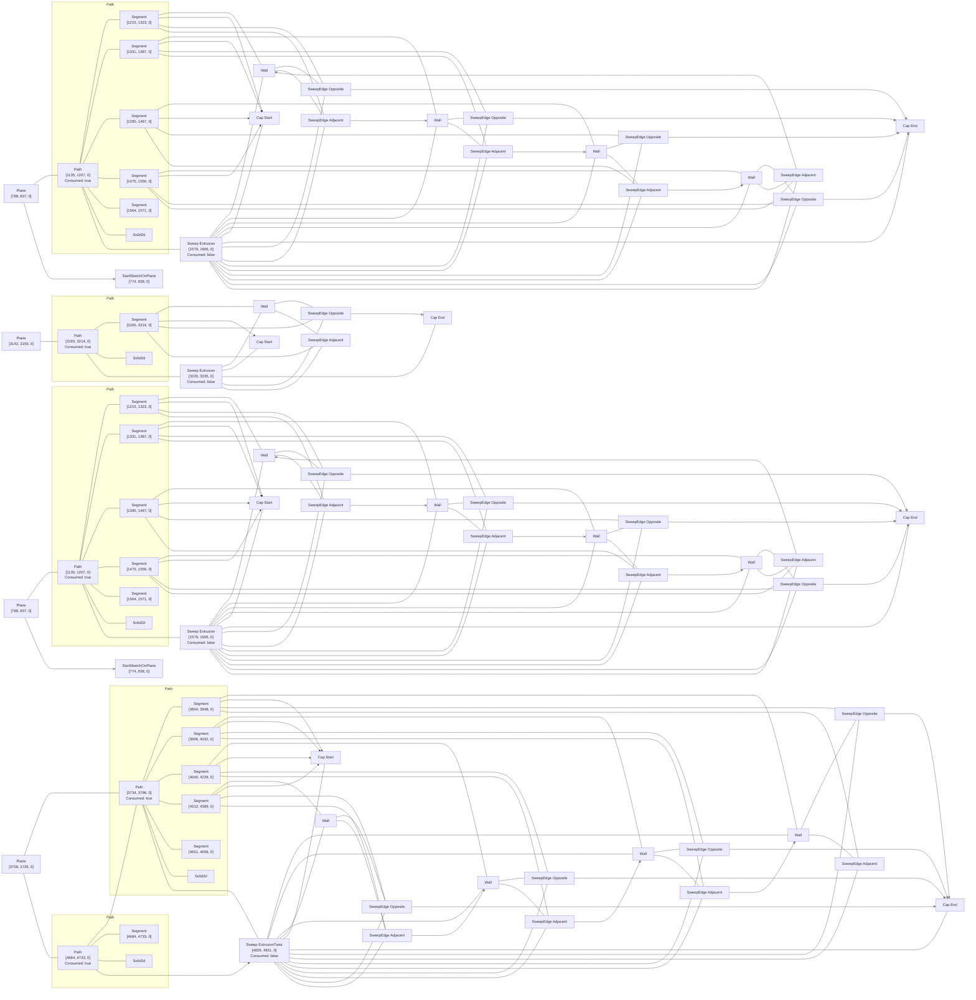

```mermaid
flowchart LR
  subgraph path2 [Path]
    2["Path<br>[1135, 1207, 0]<br>Consumed: true"]
      %% [ProgramBodyItem { index: 13 }, VariableDeclarationDeclaration, VariableDeclarationInit, FunctionExpressionBody, FunctionExpressionBodyItem { index: 8 }, VariableDeclarationDeclaration, VariableDeclarationInit, PipeBodyItem { index: 0 }]
    3["Segment<br>[1215, 1323, 0]"]
      %% [ProgramBodyItem { index: 13 }, VariableDeclarationDeclaration, VariableDeclarationInit, FunctionExpressionBody, FunctionExpressionBodyItem { index: 8 }, VariableDeclarationDeclaration, VariableDeclarationInit, PipeBodyItem { index: 1 }]
    4["Segment<br>[1331, 1387, 0]"]
      %% [ProgramBodyItem { index: 13 }, VariableDeclarationDeclaration, VariableDeclarationInit, FunctionExpressionBody, FunctionExpressionBodyItem { index: 8 }, VariableDeclarationDeclaration, VariableDeclarationInit, PipeBodyItem { index: 2 }]
    5["Segment<br>[1395, 1467, 0]"]
      %% [ProgramBodyItem { index: 13 }, VariableDeclarationDeclaration, VariableDeclarationInit, FunctionExpressionBody, FunctionExpressionBodyItem { index: 8 }, VariableDeclarationDeclaration, VariableDeclarationInit, PipeBodyItem { index: 3 }]
    6["Segment<br>[1475, 1556, 0]"]
      %% [ProgramBodyItem { index: 13 }, VariableDeclarationDeclaration, VariableDeclarationInit, FunctionExpressionBody, FunctionExpressionBodyItem { index: 8 }, VariableDeclarationDeclaration, VariableDeclarationInit, PipeBodyItem { index: 4 }]
    7["Segment<br>[1564, 1571, 0]"]
      %% [ProgramBodyItem { index: 13 }, VariableDeclarationDeclaration, VariableDeclarationInit, FunctionExpressionBody, FunctionExpressionBodyItem { index: 8 }, VariableDeclarationDeclaration, VariableDeclarationInit, PipeBodyItem { index: 5 }]
    8[Solid2d]
  end
  subgraph path25 [Path]
    25["Path<br>[1135, 1207, 0]<br>Consumed: true"]
      %% [ProgramBodyItem { index: 13 }, VariableDeclarationDeclaration, VariableDeclarationInit, FunctionExpressionBody, FunctionExpressionBodyItem { index: 8 }, VariableDeclarationDeclaration, VariableDeclarationInit, PipeBodyItem { index: 0 }]
    26["Segment<br>[1215, 1323, 0]"]
      %% [ProgramBodyItem { index: 13 }, VariableDeclarationDeclaration, VariableDeclarationInit, FunctionExpressionBody, FunctionExpressionBodyItem { index: 8 }, VariableDeclarationDeclaration, VariableDeclarationInit, PipeBodyItem { index: 1 }]
    27["Segment<br>[1331, 1387, 0]"]
      %% [ProgramBodyItem { index: 13 }, VariableDeclarationDeclaration, VariableDeclarationInit, FunctionExpressionBody, FunctionExpressionBodyItem { index: 8 }, VariableDeclarationDeclaration, VariableDeclarationInit, PipeBodyItem { index: 2 }]
    28["Segment<br>[1395, 1467, 0]"]
      %% [ProgramBodyItem { index: 13 }, VariableDeclarationDeclaration, VariableDeclarationInit, FunctionExpressionBody, FunctionExpressionBodyItem { index: 8 }, VariableDeclarationDeclaration, VariableDeclarationInit, PipeBodyItem { index: 3 }]
    29["Segment<br>[1475, 1556, 0]"]
      %% [ProgramBodyItem { index: 13 }, VariableDeclarationDeclaration, VariableDeclarationInit, FunctionExpressionBody, FunctionExpressionBodyItem { index: 8 }, VariableDeclarationDeclaration, VariableDeclarationInit, PipeBodyItem { index: 4 }]
    30["Segment<br>[1564, 1571, 0]"]
      %% [ProgramBodyItem { index: 13 }, VariableDeclarationDeclaration, VariableDeclarationInit, FunctionExpressionBody, FunctionExpressionBodyItem { index: 8 }, VariableDeclarationDeclaration, VariableDeclarationInit, PipeBodyItem { index: 5 }]
    31[Solid2d]
  end
  subgraph path48 [Path]
    48["Path<br>[3165, 3214, 0]<br>Consumed: true"]
      %% [ProgramBodyItem { index: 20 }, VariableDeclarationDeclaration, VariableDeclarationInit, PipeBodyItem { index: 1 }]
    49["Segment<br>[3165, 3214, 0]"]
      %% [ProgramBodyItem { index: 20 }, VariableDeclarationDeclaration, VariableDeclarationInit, PipeBodyItem { index: 1 }]
    50[Solid2d]
  end
  subgraph path58 [Path]
    58["Path<br>[3734, 3796, 0]<br>Consumed: true"]
      %% [ProgramBodyItem { index: 21 }, VariableDeclarationDeclaration, VariableDeclarationInit, FunctionExpressionBody, FunctionExpressionBodyItem { index: 5 }, VariableDeclarationDeclaration, VariableDeclarationInit, PipeBodyItem { index: 1 }]
    59["Segment<br>[3804, 3948, 0]"]
      %% [ProgramBodyItem { index: 21 }, VariableDeclarationDeclaration, VariableDeclarationInit, FunctionExpressionBody, FunctionExpressionBodyItem { index: 5 }, VariableDeclarationDeclaration, VariableDeclarationInit, PipeBodyItem { index: 2 }]
    60["Segment<br>[3956, 4032, 0]"]
      %% [ProgramBodyItem { index: 21 }, VariableDeclarationDeclaration, VariableDeclarationInit, FunctionExpressionBody, FunctionExpressionBodyItem { index: 5 }, VariableDeclarationDeclaration, VariableDeclarationInit, PipeBodyItem { index: 3 }]
    61["Segment<br>[4040, 4229, 0]"]
      %% [ProgramBodyItem { index: 21 }, VariableDeclarationDeclaration, VariableDeclarationInit, FunctionExpressionBody, FunctionExpressionBodyItem { index: 5 }, VariableDeclarationDeclaration, VariableDeclarationInit, PipeBodyItem { index: 4 }]
    62["Segment<br>[4312, 4389, 0]"]
      %% [ProgramBodyItem { index: 21 }, VariableDeclarationDeclaration, VariableDeclarationInit, FunctionExpressionBody, FunctionExpressionBodyItem { index: 5 }, VariableDeclarationDeclaration, VariableDeclarationInit, PipeBodyItem { index: 5 }]
    63["Segment<br>[4651, 4658, 0]"]
      %% [ProgramBodyItem { index: 21 }, VariableDeclarationDeclaration, VariableDeclarationInit, FunctionExpressionBody, FunctionExpressionBodyItem { index: 5 }, VariableDeclarationDeclaration, VariableDeclarationInit, PipeBodyItem { index: 7 }]
    64[Solid2d]
  end
  subgraph path65 [Path]
    65["Path<br>[4684, 4733, 0]<br>Consumed: true"]
      %% [ProgramBodyItem { index: 21 }, VariableDeclarationDeclaration, VariableDeclarationInit, FunctionExpressionBody, FunctionExpressionBodyItem { index: 5 }, VariableDeclarationDeclaration, VariableDeclarationInit, PipeBodyItem { index: 8 }, CallKwArg { index: 0 }]
    66["Segment<br>[4684, 4733, 0]"]
      %% [ProgramBodyItem { index: 21 }, VariableDeclarationDeclaration, VariableDeclarationInit, FunctionExpressionBody, FunctionExpressionBodyItem { index: 5 }, VariableDeclarationDeclaration, VariableDeclarationInit, PipeBodyItem { index: 8 }, CallKwArg { index: 0 }]
    67[Solid2d]
  end
  1["Plane<br>[788, 837, 0]"]
    %% [ProgramBodyItem { index: 13 }, VariableDeclarationDeclaration, VariableDeclarationInit, FunctionExpressionBody, FunctionExpressionBodyItem { index: 0 }, VariableDeclarationDeclaration, VariableDeclarationInit, CallKwUnlabeledArg]
  9["Sweep Extrusion<br>[1579, 1606, 0]<br>Consumed: false"]
    %% [ProgramBodyItem { index: 13 }, VariableDeclarationDeclaration, VariableDeclarationInit, FunctionExpressionBody, FunctionExpressionBodyItem { index: 8 }, VariableDeclarationDeclaration, VariableDeclarationInit, PipeBodyItem { index: 6 }]
  10[Wall]
    %% face_code_ref=Missing NodePath
  11[Wall]
    %% face_code_ref=Missing NodePath
  12[Wall]
    %% face_code_ref=Missing NodePath
  13[Wall]
    %% face_code_ref=Missing NodePath
  14["Cap Start"]
    %% face_code_ref=Missing NodePath
  15["Cap End"]
    %% face_code_ref=Missing NodePath
  16["SweepEdge Opposite"]
  17["SweepEdge Adjacent"]
  18["SweepEdge Opposite"]
  19["SweepEdge Adjacent"]
  20["SweepEdge Opposite"]
  21["SweepEdge Adjacent"]
  22["SweepEdge Opposite"]
  23["SweepEdge Adjacent"]
  24["Plane<br>[788, 837, 0]"]
    %% [ProgramBodyItem { index: 13 }, VariableDeclarationDeclaration, VariableDeclarationInit, FunctionExpressionBody, FunctionExpressionBodyItem { index: 0 }, VariableDeclarationDeclaration, VariableDeclarationInit, CallKwUnlabeledArg]
  32["Sweep Extrusion<br>[1579, 1606, 0]<br>Consumed: false"]
    %% [ProgramBodyItem { index: 13 }, VariableDeclarationDeclaration, VariableDeclarationInit, FunctionExpressionBody, FunctionExpressionBodyItem { index: 8 }, VariableDeclarationDeclaration, VariableDeclarationInit, PipeBodyItem { index: 6 }]
  33[Wall]
    %% face_code_ref=Missing NodePath
  34[Wall]
    %% face_code_ref=Missing NodePath
  35[Wall]
    %% face_code_ref=Missing NodePath
  36[Wall]
    %% face_code_ref=Missing NodePath
  37["Cap Start"]
    %% face_code_ref=Missing NodePath
  38["Cap End"]
    %% face_code_ref=Missing NodePath
  39["SweepEdge Opposite"]
  40["SweepEdge Adjacent"]
  41["SweepEdge Opposite"]
  42["SweepEdge Adjacent"]
  43["SweepEdge Opposite"]
  44["SweepEdge Adjacent"]
  45["SweepEdge Opposite"]
  46["SweepEdge Adjacent"]
  47["Plane<br>[3142, 3159, 0]"]
    %% [ProgramBodyItem { index: 20 }, VariableDeclarationDeclaration, VariableDeclarationInit, PipeBodyItem { index: 0 }]
  51["Sweep Extrusion<br>[3220, 3235, 0]<br>Consumed: false"]
    %% [ProgramBodyItem { index: 20 }, VariableDeclarationDeclaration, VariableDeclarationInit, PipeBodyItem { index: 2 }]
  52[Wall]
    %% face_code_ref=Missing NodePath
  53["Cap Start"]
    %% face_code_ref=Missing NodePath
  54["Cap End"]
    %% face_code_ref=Missing NodePath
  55["SweepEdge Opposite"]
  56["SweepEdge Adjacent"]
  57["Plane<br>[3709, 3726, 0]"]
    %% [ProgramBodyItem { index: 21 }, VariableDeclarationDeclaration, VariableDeclarationInit, FunctionExpressionBody, FunctionExpressionBodyItem { index: 5 }, VariableDeclarationDeclaration, VariableDeclarationInit, PipeBodyItem { index: 0 }]
  68["Sweep ExtrusionTwist<br>[4829, 4951, 0]<br>Consumed: false"]
    %% [ProgramBodyItem { index: 21 }, VariableDeclarationDeclaration, VariableDeclarationInit, FunctionExpressionBody, FunctionExpressionBodyItem { index: 5 }, VariableDeclarationDeclaration, VariableDeclarationInit, PipeBodyItem { index: 9 }]
  69[Wall]
    %% face_code_ref=Missing NodePath
  70[Wall]
    %% face_code_ref=Missing NodePath
  71[Wall]
    %% face_code_ref=Missing NodePath
  72[Wall]
    %% face_code_ref=Missing NodePath
  73["Cap Start"]
    %% face_code_ref=Missing NodePath
  74["Cap End"]
    %% face_code_ref=Missing NodePath
  75["SweepEdge Opposite"]
  76["SweepEdge Adjacent"]
  77["SweepEdge Opposite"]
  78["SweepEdge Adjacent"]
  79["SweepEdge Opposite"]
  80["SweepEdge Adjacent"]
  81["SweepEdge Opposite"]
  82["SweepEdge Adjacent"]
  83["StartSketchOnPlane<br>[774, 838, 0]"]
    %% [ProgramBodyItem { index: 13 }, VariableDeclarationDeclaration, VariableDeclarationInit, FunctionExpressionBody, FunctionExpressionBodyItem { index: 0 }, VariableDeclarationDeclaration, VariableDeclarationInit]
  84["StartSketchOnPlane<br>[774, 838, 0]"]
    %% [ProgramBodyItem { index: 13 }, VariableDeclarationDeclaration, VariableDeclarationInit, FunctionExpressionBody, FunctionExpressionBodyItem { index: 0 }, VariableDeclarationDeclaration, VariableDeclarationInit]
  1 --- 2
  1 <--x 83
  2 --- 3
  2 --- 4
  2 --- 5
  2 --- 6
  2 --- 7
  2 --- 8
  2 ---- 9
  3 --- 10
  3 x--> 14
  3 --- 16
  3 --- 17
  4 --- 11
  4 x--> 14
  4 --- 18
  4 --- 19
  5 --- 12
  5 x--> 14
  5 --- 20
  5 --- 21
  6 --- 13
  6 x--> 14
  6 --- 22
  6 --- 23
  9 --- 10
  9 --- 11
  9 --- 12
  9 --- 13
  9 --- 14
  9 --- 15
  9 --- 16
  9 --- 17
  9 --- 18
  9 --- 19
  9 --- 20
  9 --- 21
  9 --- 22
  9 --- 23
  10 --- 16
  10 --- 17
  23 <--x 10
  17 <--x 11
  11 --- 18
  11 --- 19
  19 <--x 12
  12 --- 20
  12 --- 21
  21 <--x 13
  13 --- 22
  13 --- 23
  16 <--x 15
  18 <--x 15
  20 <--x 15
  22 <--x 15
  24 --- 25
  24 <--x 84
  25 --- 26
  25 --- 27
  25 --- 28
  25 --- 29
  25 --- 30
  25 --- 31
  25 ---- 32
  26 --- 33
  26 x--> 37
  26 --- 39
  26 --- 40
  27 --- 34
  27 x--> 37
  27 --- 41
  27 --- 42
  28 --- 35
  28 x--> 37
  28 --- 43
  28 --- 44
  29 --- 36
  29 x--> 37
  29 --- 45
  29 --- 46
  32 --- 33
  32 --- 34
  32 --- 35
  32 --- 36
  32 --- 37
  32 --- 38
  32 --- 39
  32 --- 40
  32 --- 41
  32 --- 42
  32 --- 43
  32 --- 44
  32 --- 45
  32 --- 46
  33 --- 39
  33 --- 40
  46 <--x 33
  40 <--x 34
  34 --- 41
  34 --- 42
  42 <--x 35
  35 --- 43
  35 --- 44
  44 <--x 36
  36 --- 45
  36 --- 46
  39 <--x 38
  41 <--x 38
  43 <--x 38
  45 <--x 38
  47 --- 48
  48 --- 49
  48 --- 50
  48 ---- 51
  49 --- 52
  49 x--> 53
  49 --- 55
  49 --- 56
  51 --- 52
  51 --- 53
  51 --- 54
  51 --- 55
  51 --- 56
  52 --- 55
  52 --- 56
  55 <--x 54
  57 --- 58
  57 --- 65
  58 --- 59
  58 --- 60
  58 --- 61
  58 --- 62
  58 --- 63
  58 --- 64
  65 --- 58
  58 ---- 68
  59 --- 69
  59 x--> 73
  59 --- 75
  59 --- 76
  60 --- 70
  60 x--> 73
  60 --- 77
  60 --- 78
  61 --- 71
  61 x--> 73
  61 --- 79
  61 --- 80
  62 --- 72
  62 x--> 73
  62 --- 81
  62 --- 82
  65 --- 66
  65 --- 67
  65 x---> 68
  68 --- 69
  68 --- 70
  68 --- 71
  68 --- 72
  68 --- 73
  68 --- 74
  68 --- 75
  68 --- 76
  68 --- 77
  68 --- 78
  68 --- 79
  68 --- 80
  68 --- 81
  68 --- 82
  69 --- 75
  69 --- 76
  78 <--x 69
  70 --- 77
  70 --- 78
  80 <--x 70
  71 --- 79
  71 --- 80
  82 <--x 71
  72 --- 81
  72 --- 82
  75 <--x 74
  77 <--x 74
  79 <--x 74
  81 <--x 74
```
