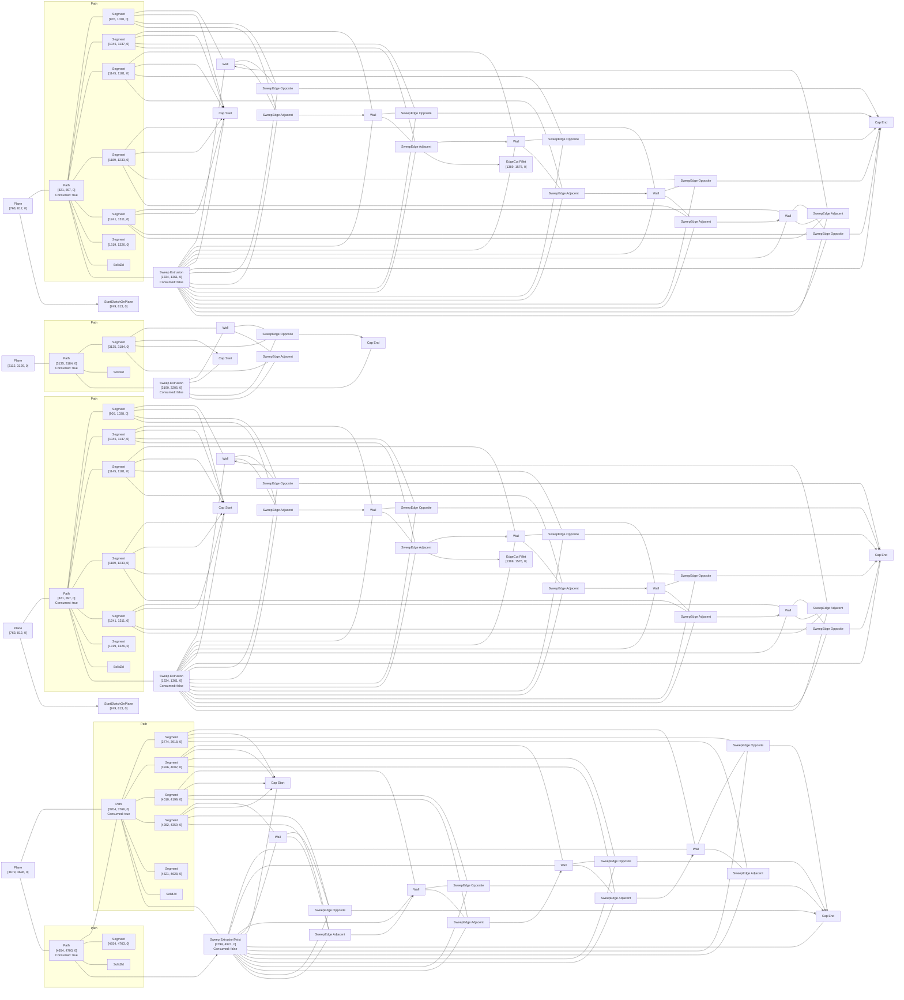

```mermaid
flowchart LR
  subgraph path2 [Path]
    2["Path<br>[821, 897, 0]<br>Consumed: true"]
      %% [ProgramBodyItem { index: 13 }, VariableDeclarationDeclaration, VariableDeclarationInit, FunctionExpressionBody, FunctionExpressionBodyItem { index: 0 }, VariableDeclarationDeclaration, VariableDeclarationInit, PipeBodyItem { index: 1 }]
    3["Segment<br>[905, 1038, 0]"]
      %% [ProgramBodyItem { index: 13 }, VariableDeclarationDeclaration, VariableDeclarationInit, FunctionExpressionBody, FunctionExpressionBodyItem { index: 0 }, VariableDeclarationDeclaration, VariableDeclarationInit, PipeBodyItem { index: 2 }]
    4["Segment<br>[1046, 1137, 0]"]
      %% [ProgramBodyItem { index: 13 }, VariableDeclarationDeclaration, VariableDeclarationInit, FunctionExpressionBody, FunctionExpressionBodyItem { index: 0 }, VariableDeclarationDeclaration, VariableDeclarationInit, PipeBodyItem { index: 3 }]
    5["Segment<br>[1145, 1181, 0]"]
      %% [ProgramBodyItem { index: 13 }, VariableDeclarationDeclaration, VariableDeclarationInit, FunctionExpressionBody, FunctionExpressionBodyItem { index: 0 }, VariableDeclarationDeclaration, VariableDeclarationInit, PipeBodyItem { index: 4 }]
    6["Segment<br>[1189, 1233, 0]"]
      %% [ProgramBodyItem { index: 13 }, VariableDeclarationDeclaration, VariableDeclarationInit, FunctionExpressionBody, FunctionExpressionBodyItem { index: 0 }, VariableDeclarationDeclaration, VariableDeclarationInit, PipeBodyItem { index: 5 }]
    7["Segment<br>[1241, 1311, 0]"]
      %% [ProgramBodyItem { index: 13 }, VariableDeclarationDeclaration, VariableDeclarationInit, FunctionExpressionBody, FunctionExpressionBodyItem { index: 0 }, VariableDeclarationDeclaration, VariableDeclarationInit, PipeBodyItem { index: 6 }]
    8["Segment<br>[1319, 1326, 0]"]
      %% [ProgramBodyItem { index: 13 }, VariableDeclarationDeclaration, VariableDeclarationInit, FunctionExpressionBody, FunctionExpressionBodyItem { index: 0 }, VariableDeclarationDeclaration, VariableDeclarationInit, PipeBodyItem { index: 7 }]
    9[Solid2d]
  end
  subgraph path30 [Path]
    30["Path<br>[821, 897, 0]<br>Consumed: true"]
      %% [ProgramBodyItem { index: 13 }, VariableDeclarationDeclaration, VariableDeclarationInit, FunctionExpressionBody, FunctionExpressionBodyItem { index: 0 }, VariableDeclarationDeclaration, VariableDeclarationInit, PipeBodyItem { index: 1 }]
    31["Segment<br>[905, 1038, 0]"]
      %% [ProgramBodyItem { index: 13 }, VariableDeclarationDeclaration, VariableDeclarationInit, FunctionExpressionBody, FunctionExpressionBodyItem { index: 0 }, VariableDeclarationDeclaration, VariableDeclarationInit, PipeBodyItem { index: 2 }]
    32["Segment<br>[1046, 1137, 0]"]
      %% [ProgramBodyItem { index: 13 }, VariableDeclarationDeclaration, VariableDeclarationInit, FunctionExpressionBody, FunctionExpressionBodyItem { index: 0 }, VariableDeclarationDeclaration, VariableDeclarationInit, PipeBodyItem { index: 3 }]
    33["Segment<br>[1145, 1181, 0]"]
      %% [ProgramBodyItem { index: 13 }, VariableDeclarationDeclaration, VariableDeclarationInit, FunctionExpressionBody, FunctionExpressionBodyItem { index: 0 }, VariableDeclarationDeclaration, VariableDeclarationInit, PipeBodyItem { index: 4 }]
    34["Segment<br>[1189, 1233, 0]"]
      %% [ProgramBodyItem { index: 13 }, VariableDeclarationDeclaration, VariableDeclarationInit, FunctionExpressionBody, FunctionExpressionBodyItem { index: 0 }, VariableDeclarationDeclaration, VariableDeclarationInit, PipeBodyItem { index: 5 }]
    35["Segment<br>[1241, 1311, 0]"]
      %% [ProgramBodyItem { index: 13 }, VariableDeclarationDeclaration, VariableDeclarationInit, FunctionExpressionBody, FunctionExpressionBodyItem { index: 0 }, VariableDeclarationDeclaration, VariableDeclarationInit, PipeBodyItem { index: 6 }]
    36["Segment<br>[1319, 1326, 0]"]
      %% [ProgramBodyItem { index: 13 }, VariableDeclarationDeclaration, VariableDeclarationInit, FunctionExpressionBody, FunctionExpressionBodyItem { index: 0 }, VariableDeclarationDeclaration, VariableDeclarationInit, PipeBodyItem { index: 7 }]
    37[Solid2d]
  end
  subgraph path58 [Path]
    58["Path<br>[3135, 3184, 0]<br>Consumed: true"]
      %% [ProgramBodyItem { index: 20 }, VariableDeclarationDeclaration, VariableDeclarationInit, PipeBodyItem { index: 1 }]
    59["Segment<br>[3135, 3184, 0]"]
      %% [ProgramBodyItem { index: 20 }, VariableDeclarationDeclaration, VariableDeclarationInit, PipeBodyItem { index: 1 }]
    60[Solid2d]
  end
  subgraph path68 [Path]
    68["Path<br>[3704, 3766, 0]<br>Consumed: true"]
      %% [ProgramBodyItem { index: 21 }, VariableDeclarationDeclaration, VariableDeclarationInit, FunctionExpressionBody, FunctionExpressionBodyItem { index: 5 }, VariableDeclarationDeclaration, VariableDeclarationInit, PipeBodyItem { index: 1 }]
    69["Segment<br>[3774, 3918, 0]"]
      %% [ProgramBodyItem { index: 21 }, VariableDeclarationDeclaration, VariableDeclarationInit, FunctionExpressionBody, FunctionExpressionBodyItem { index: 5 }, VariableDeclarationDeclaration, VariableDeclarationInit, PipeBodyItem { index: 2 }]
    70["Segment<br>[3926, 4002, 0]"]
      %% [ProgramBodyItem { index: 21 }, VariableDeclarationDeclaration, VariableDeclarationInit, FunctionExpressionBody, FunctionExpressionBodyItem { index: 5 }, VariableDeclarationDeclaration, VariableDeclarationInit, PipeBodyItem { index: 3 }]
    71["Segment<br>[4010, 4199, 0]"]
      %% [ProgramBodyItem { index: 21 }, VariableDeclarationDeclaration, VariableDeclarationInit, FunctionExpressionBody, FunctionExpressionBodyItem { index: 5 }, VariableDeclarationDeclaration, VariableDeclarationInit, PipeBodyItem { index: 4 }]
    72["Segment<br>[4282, 4359, 0]"]
      %% [ProgramBodyItem { index: 21 }, VariableDeclarationDeclaration, VariableDeclarationInit, FunctionExpressionBody, FunctionExpressionBodyItem { index: 5 }, VariableDeclarationDeclaration, VariableDeclarationInit, PipeBodyItem { index: 5 }]
    73["Segment<br>[4621, 4628, 0]"]
      %% [ProgramBodyItem { index: 21 }, VariableDeclarationDeclaration, VariableDeclarationInit, FunctionExpressionBody, FunctionExpressionBodyItem { index: 5 }, VariableDeclarationDeclaration, VariableDeclarationInit, PipeBodyItem { index: 7 }]
    74[Solid2d]
  end
  subgraph path75 [Path]
    75["Path<br>[4654, 4703, 0]<br>Consumed: true"]
      %% [ProgramBodyItem { index: 21 }, VariableDeclarationDeclaration, VariableDeclarationInit, FunctionExpressionBody, FunctionExpressionBodyItem { index: 5 }, VariableDeclarationDeclaration, VariableDeclarationInit, PipeBodyItem { index: 8 }, CallKwArg { index: 0 }]
    76["Segment<br>[4654, 4703, 0]"]
      %% [ProgramBodyItem { index: 21 }, VariableDeclarationDeclaration, VariableDeclarationInit, FunctionExpressionBody, FunctionExpressionBodyItem { index: 5 }, VariableDeclarationDeclaration, VariableDeclarationInit, PipeBodyItem { index: 8 }, CallKwArg { index: 0 }]
    77[Solid2d]
  end
  1["Plane<br>[763, 812, 0]"]
    %% [ProgramBodyItem { index: 13 }, VariableDeclarationDeclaration, VariableDeclarationInit, FunctionExpressionBody, FunctionExpressionBodyItem { index: 0 }, VariableDeclarationDeclaration, VariableDeclarationInit, PipeBodyItem { index: 0 }, CallKwUnlabeledArg]
  10["Sweep Extrusion<br>[1334, 1361, 0]<br>Consumed: false"]
    %% [ProgramBodyItem { index: 13 }, VariableDeclarationDeclaration, VariableDeclarationInit, FunctionExpressionBody, FunctionExpressionBodyItem { index: 0 }, VariableDeclarationDeclaration, VariableDeclarationInit, PipeBodyItem { index: 8 }]
  11[Wall]
    %% face_code_ref=Missing NodePath
  12[Wall]
    %% face_code_ref=Missing NodePath
  13[Wall]
    %% face_code_ref=Missing NodePath
  14[Wall]
    %% face_code_ref=Missing NodePath
  15[Wall]
    %% face_code_ref=Missing NodePath
  16["Cap Start"]
    %% face_code_ref=Missing NodePath
  17["Cap End"]
    %% face_code_ref=Missing NodePath
  18["SweepEdge Opposite"]
  19["SweepEdge Adjacent"]
  20["SweepEdge Opposite"]
  21["SweepEdge Adjacent"]
  22["SweepEdge Opposite"]
  23["SweepEdge Adjacent"]
  24["SweepEdge Opposite"]
  25["SweepEdge Adjacent"]
  26["SweepEdge Opposite"]
  27["SweepEdge Adjacent"]
  28["EdgeCut Fillet<br>[1369, 1576, 0]"]
    %% [ProgramBodyItem { index: 13 }, VariableDeclarationDeclaration, VariableDeclarationInit, FunctionExpressionBody, FunctionExpressionBodyItem { index: 0 }, VariableDeclarationDeclaration, VariableDeclarationInit, PipeBodyItem { index: 9 }]
  29["Plane<br>[763, 812, 0]"]
    %% [ProgramBodyItem { index: 13 }, VariableDeclarationDeclaration, VariableDeclarationInit, FunctionExpressionBody, FunctionExpressionBodyItem { index: 0 }, VariableDeclarationDeclaration, VariableDeclarationInit, PipeBodyItem { index: 0 }, CallKwUnlabeledArg]
  38["Sweep Extrusion<br>[1334, 1361, 0]<br>Consumed: false"]
    %% [ProgramBodyItem { index: 13 }, VariableDeclarationDeclaration, VariableDeclarationInit, FunctionExpressionBody, FunctionExpressionBodyItem { index: 0 }, VariableDeclarationDeclaration, VariableDeclarationInit, PipeBodyItem { index: 8 }]
  39[Wall]
    %% face_code_ref=Missing NodePath
  40[Wall]
    %% face_code_ref=Missing NodePath
  41[Wall]
    %% face_code_ref=Missing NodePath
  42[Wall]
    %% face_code_ref=Missing NodePath
  43[Wall]
    %% face_code_ref=Missing NodePath
  44["Cap Start"]
    %% face_code_ref=Missing NodePath
  45["Cap End"]
    %% face_code_ref=Missing NodePath
  46["SweepEdge Opposite"]
  47["SweepEdge Adjacent"]
  48["SweepEdge Opposite"]
  49["SweepEdge Adjacent"]
  50["SweepEdge Opposite"]
  51["SweepEdge Adjacent"]
  52["SweepEdge Opposite"]
  53["SweepEdge Adjacent"]
  54["SweepEdge Opposite"]
  55["SweepEdge Adjacent"]
  56["EdgeCut Fillet<br>[1369, 1576, 0]"]
    %% [ProgramBodyItem { index: 13 }, VariableDeclarationDeclaration, VariableDeclarationInit, FunctionExpressionBody, FunctionExpressionBodyItem { index: 0 }, VariableDeclarationDeclaration, VariableDeclarationInit, PipeBodyItem { index: 9 }]
  57["Plane<br>[3112, 3129, 0]"]
    %% [ProgramBodyItem { index: 20 }, VariableDeclarationDeclaration, VariableDeclarationInit, PipeBodyItem { index: 0 }]
  61["Sweep Extrusion<br>[3190, 3205, 0]<br>Consumed: false"]
    %% [ProgramBodyItem { index: 20 }, VariableDeclarationDeclaration, VariableDeclarationInit, PipeBodyItem { index: 2 }]
  62[Wall]
    %% face_code_ref=Missing NodePath
  63["Cap Start"]
    %% face_code_ref=Missing NodePath
  64["Cap End"]
    %% face_code_ref=Missing NodePath
  65["SweepEdge Opposite"]
  66["SweepEdge Adjacent"]
  67["Plane<br>[3679, 3696, 0]"]
    %% [ProgramBodyItem { index: 21 }, VariableDeclarationDeclaration, VariableDeclarationInit, FunctionExpressionBody, FunctionExpressionBodyItem { index: 5 }, VariableDeclarationDeclaration, VariableDeclarationInit, PipeBodyItem { index: 0 }]
  78["Sweep ExtrusionTwist<br>[4799, 4921, 0]<br>Consumed: false"]
    %% [ProgramBodyItem { index: 21 }, VariableDeclarationDeclaration, VariableDeclarationInit, FunctionExpressionBody, FunctionExpressionBodyItem { index: 5 }, VariableDeclarationDeclaration, VariableDeclarationInit, PipeBodyItem { index: 9 }]
  79[Wall]
    %% face_code_ref=Missing NodePath
  80[Wall]
    %% face_code_ref=Missing NodePath
  81[Wall]
    %% face_code_ref=Missing NodePath
  82[Wall]
    %% face_code_ref=Missing NodePath
  83["Cap Start"]
    %% face_code_ref=Missing NodePath
  84["Cap End"]
    %% face_code_ref=Missing NodePath
  85["SweepEdge Opposite"]
  86["SweepEdge Adjacent"]
  87["SweepEdge Opposite"]
  88["SweepEdge Adjacent"]
  89["SweepEdge Opposite"]
  90["SweepEdge Adjacent"]
  91["SweepEdge Opposite"]
  92["SweepEdge Adjacent"]
  93["StartSketchOnPlane<br>[749, 813, 0]"]
    %% [ProgramBodyItem { index: 13 }, VariableDeclarationDeclaration, VariableDeclarationInit, FunctionExpressionBody, FunctionExpressionBodyItem { index: 0 }, VariableDeclarationDeclaration, VariableDeclarationInit, PipeBodyItem { index: 0 }]
  94["StartSketchOnPlane<br>[749, 813, 0]"]
    %% [ProgramBodyItem { index: 13 }, VariableDeclarationDeclaration, VariableDeclarationInit, FunctionExpressionBody, FunctionExpressionBodyItem { index: 0 }, VariableDeclarationDeclaration, VariableDeclarationInit, PipeBodyItem { index: 0 }]
  1 --- 2
  1 <--x 93
  2 --- 3
  2 --- 4
  2 --- 5
  2 --- 6
  2 --- 7
  2 --- 8
  2 --- 9
  2 ---- 10
  3 --- 11
  3 x--> 16
  3 --- 18
  3 --- 19
  4 --- 12
  4 x--> 16
  4 --- 20
  4 --- 21
  5 --- 13
  5 x--> 16
  5 --- 22
  5 --- 23
  6 --- 14
  6 x--> 16
  6 --- 24
  6 --- 25
  7 --- 15
  7 x--> 16
  7 --- 26
  7 --- 27
  10 --- 11
  10 --- 12
  10 --- 13
  10 --- 14
  10 --- 15
  10 --- 16
  10 --- 17
  10 --- 18
  10 --- 19
  10 --- 20
  10 --- 21
  10 --- 22
  10 --- 23
  10 --- 24
  10 --- 25
  10 --- 26
  10 --- 27
  11 --- 18
  11 --- 19
  27 <--x 11
  19 <--x 12
  12 --- 20
  12 --- 21
  21 <--x 13
  13 --- 22
  13 --- 23
  23 <--x 14
  14 --- 24
  14 --- 25
  25 <--x 15
  15 --- 26
  15 --- 27
  18 <--x 17
  20 <--x 17
  22 <--x 17
  24 <--x 17
  26 <--x 17
  21 <--x 28
  29 --- 30
  29 <--x 94
  30 --- 31
  30 --- 32
  30 --- 33
  30 --- 34
  30 --- 35
  30 --- 36
  30 --- 37
  30 ---- 38
  31 --- 39
  31 x--> 44
  31 --- 46
  31 --- 47
  32 --- 40
  32 x--> 44
  32 --- 48
  32 --- 49
  33 --- 41
  33 x--> 44
  33 --- 50
  33 --- 51
  34 --- 42
  34 x--> 44
  34 --- 52
  34 --- 53
  35 --- 43
  35 x--> 44
  35 --- 54
  35 --- 55
  38 --- 39
  38 --- 40
  38 --- 41
  38 --- 42
  38 --- 43
  38 --- 44
  38 --- 45
  38 --- 46
  38 --- 47
  38 --- 48
  38 --- 49
  38 --- 50
  38 --- 51
  38 --- 52
  38 --- 53
  38 --- 54
  38 --- 55
  39 --- 46
  39 --- 47
  55 <--x 39
  47 <--x 40
  40 --- 48
  40 --- 49
  49 <--x 41
  41 --- 50
  41 --- 51
  51 <--x 42
  42 --- 52
  42 --- 53
  53 <--x 43
  43 --- 54
  43 --- 55
  46 <--x 45
  48 <--x 45
  50 <--x 45
  52 <--x 45
  54 <--x 45
  49 <--x 56
  57 --- 58
  58 --- 59
  58 --- 60
  58 ---- 61
  59 --- 62
  59 x--> 63
  59 --- 65
  59 --- 66
  61 --- 62
  61 --- 63
  61 --- 64
  61 --- 65
  61 --- 66
  62 --- 65
  62 --- 66
  65 <--x 64
  67 --- 68
  67 --- 75
  68 --- 69
  68 --- 70
  68 --- 71
  68 --- 72
  68 --- 73
  68 --- 74
  75 --- 68
  68 ---- 78
  69 --- 79
  69 x--> 83
  69 --- 85
  69 --- 86
  70 --- 80
  70 x--> 83
  70 --- 87
  70 --- 88
  71 --- 81
  71 x--> 83
  71 --- 89
  71 --- 90
  72 --- 82
  72 x--> 83
  72 --- 91
  72 --- 92
  75 --- 76
  75 --- 77
  75 x---> 78
  78 --- 79
  78 --- 80
  78 --- 81
  78 --- 82
  78 --- 83
  78 --- 84
  78 --- 85
  78 --- 86
  78 --- 87
  78 --- 88
  78 --- 89
  78 --- 90
  78 --- 91
  78 --- 92
  79 --- 85
  79 --- 86
  88 <--x 79
  80 --- 87
  80 --- 88
  90 <--x 80
  81 --- 89
  81 --- 90
  92 <--x 81
  82 --- 91
  82 --- 92
  85 <--x 84
  87 <--x 84
  89 <--x 84
  91 <--x 84
```
