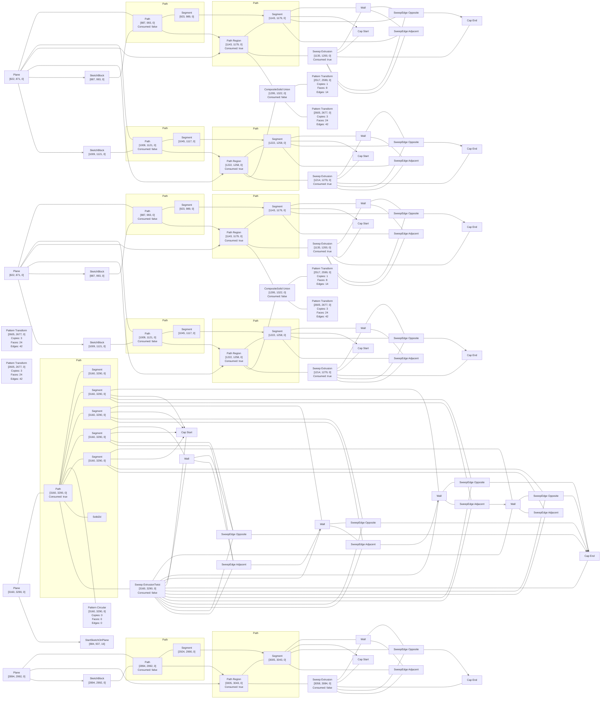

```mermaid
flowchart LR
  subgraph path2 [Path]
    2["Path<br>[887, 993, 0]<br>Consumed: false"]
      %% [ProgramBodyItem { index: 13 }, VariableDeclarationDeclaration, VariableDeclarationInit, FunctionExpressionBody, FunctionExpressionBodyItem { index: 1 }, VariableDeclarationDeclaration, VariableDeclarationInit]
    3["Segment<br>[923, 989, 0]"]
      %% [ProgramBodyItem { index: 13 }, VariableDeclarationDeclaration, VariableDeclarationInit, FunctionExpressionBody, FunctionExpressionBodyItem { index: 1 }, VariableDeclarationDeclaration, VariableDeclarationInit, SketchBlockBody, SketchBlockBodyItem { index: 0 }, VariableDeclarationDeclaration, VariableDeclarationInit]
  end
  subgraph path4 [Path]
    4["Path<br>[1009, 1121, 0]<br>Consumed: false"]
      %% [ProgramBodyItem { index: 13 }, VariableDeclarationDeclaration, VariableDeclarationInit, FunctionExpressionBody, FunctionExpressionBodyItem { index: 2 }, VariableDeclarationDeclaration, VariableDeclarationInit]
    5["Segment<br>[1045, 1117, 0]"]
      %% [ProgramBodyItem { index: 13 }, VariableDeclarationDeclaration, VariableDeclarationInit, FunctionExpressionBody, FunctionExpressionBodyItem { index: 2 }, VariableDeclarationDeclaration, VariableDeclarationInit, SketchBlockBody, SketchBlockBodyItem { index: 0 }, VariableDeclarationDeclaration, VariableDeclarationInit]
  end
  subgraph path6 [Path]
    6["Path Region<br>[1143, 1179, 0]<br>Consumed: true"]
      %% [ProgramBodyItem { index: 13 }, VariableDeclarationDeclaration, VariableDeclarationInit, FunctionExpressionBody, FunctionExpressionBodyItem { index: 3 }, VariableDeclarationDeclaration, VariableDeclarationInit, CallKwUnlabeledArg]
    7["Segment<br>[1143, 1179, 0]"]
      %% [ProgramBodyItem { index: 13 }, VariableDeclarationDeclaration, VariableDeclarationInit, FunctionExpressionBody, FunctionExpressionBodyItem { index: 3 }, VariableDeclarationDeclaration, VariableDeclarationInit, CallKwUnlabeledArg]
  end
  subgraph path14 [Path]
    14["Path Region<br>[1222, 1258, 0]<br>Consumed: true"]
      %% [ProgramBodyItem { index: 13 }, VariableDeclarationDeclaration, VariableDeclarationInit, FunctionExpressionBody, FunctionExpressionBodyItem { index: 4 }, VariableDeclarationDeclaration, VariableDeclarationInit, CallKwUnlabeledArg]
    15["Segment<br>[1222, 1258, 0]"]
      %% [ProgramBodyItem { index: 13 }, VariableDeclarationDeclaration, VariableDeclarationInit, FunctionExpressionBody, FunctionExpressionBodyItem { index: 4 }, VariableDeclarationDeclaration, VariableDeclarationInit, CallKwUnlabeledArg]
  end
  subgraph path24 [Path]
    24["Path<br>[887, 993, 0]<br>Consumed: false"]
      %% [ProgramBodyItem { index: 13 }, VariableDeclarationDeclaration, VariableDeclarationInit, FunctionExpressionBody, FunctionExpressionBodyItem { index: 1 }, VariableDeclarationDeclaration, VariableDeclarationInit]
    25["Segment<br>[923, 989, 0]"]
      %% [ProgramBodyItem { index: 13 }, VariableDeclarationDeclaration, VariableDeclarationInit, FunctionExpressionBody, FunctionExpressionBodyItem { index: 1 }, VariableDeclarationDeclaration, VariableDeclarationInit, SketchBlockBody, SketchBlockBodyItem { index: 0 }, VariableDeclarationDeclaration, VariableDeclarationInit]
  end
  subgraph path26 [Path]
    26["Path<br>[1009, 1121, 0]<br>Consumed: false"]
      %% [ProgramBodyItem { index: 13 }, VariableDeclarationDeclaration, VariableDeclarationInit, FunctionExpressionBody, FunctionExpressionBodyItem { index: 2 }, VariableDeclarationDeclaration, VariableDeclarationInit]
    27["Segment<br>[1045, 1117, 0]"]
      %% [ProgramBodyItem { index: 13 }, VariableDeclarationDeclaration, VariableDeclarationInit, FunctionExpressionBody, FunctionExpressionBodyItem { index: 2 }, VariableDeclarationDeclaration, VariableDeclarationInit, SketchBlockBody, SketchBlockBodyItem { index: 0 }, VariableDeclarationDeclaration, VariableDeclarationInit]
  end
  subgraph path28 [Path]
    28["Path Region<br>[1143, 1179, 0]<br>Consumed: true"]
      %% [ProgramBodyItem { index: 13 }, VariableDeclarationDeclaration, VariableDeclarationInit, FunctionExpressionBody, FunctionExpressionBodyItem { index: 3 }, VariableDeclarationDeclaration, VariableDeclarationInit, CallKwUnlabeledArg]
    29["Segment<br>[1143, 1179, 0]"]
      %% [ProgramBodyItem { index: 13 }, VariableDeclarationDeclaration, VariableDeclarationInit, FunctionExpressionBody, FunctionExpressionBodyItem { index: 3 }, VariableDeclarationDeclaration, VariableDeclarationInit, CallKwUnlabeledArg]
  end
  subgraph path36 [Path]
    36["Path Region<br>[1222, 1258, 0]<br>Consumed: true"]
      %% [ProgramBodyItem { index: 13 }, VariableDeclarationDeclaration, VariableDeclarationInit, FunctionExpressionBody, FunctionExpressionBodyItem { index: 4 }, VariableDeclarationDeclaration, VariableDeclarationInit, CallKwUnlabeledArg]
    37["Segment<br>[1222, 1258, 0]"]
      %% [ProgramBodyItem { index: 13 }, VariableDeclarationDeclaration, VariableDeclarationInit, FunctionExpressionBody, FunctionExpressionBodyItem { index: 4 }, VariableDeclarationDeclaration, VariableDeclarationInit, CallKwUnlabeledArg]
  end
  subgraph path52 [Path]
    52["Path<br>[2894, 2992, 0]<br>Consumed: false"]
      %% [ProgramBodyItem { index: 20 }, VariableDeclarationDeclaration, VariableDeclarationInit]
    53["Segment<br>[2924, 2990, 0]"]
      %% [ProgramBodyItem { index: 20 }, VariableDeclarationDeclaration, VariableDeclarationInit, SketchBlockBody, SketchBlockBodyItem { index: 0 }, VariableDeclarationDeclaration, VariableDeclarationInit]
  end
  subgraph path54 [Path]
    54["Path Region<br>[3005, 3043, 0]<br>Consumed: true"]
      %% [ProgramBodyItem { index: 21 }, VariableDeclarationDeclaration, VariableDeclarationInit]
    55["Segment<br>[3005, 3043, 0]"]
      %% [ProgramBodyItem { index: 21 }, VariableDeclarationDeclaration, VariableDeclarationInit]
  end
  subgraph path63 [Path]
    63["Path<br>[3160, 3290, 0]<br>Consumed: true"]
      %% [ProgramBodyItem { index: 23 }, VariableDeclarationDeclaration, VariableDeclarationInit]
    64["Segment<br>[3160, 3290, 0]"]
      %% [ProgramBodyItem { index: 23 }, VariableDeclarationDeclaration, VariableDeclarationInit]
    65["Segment<br>[3160, 3290, 0]"]
      %% [ProgramBodyItem { index: 23 }, VariableDeclarationDeclaration, VariableDeclarationInit]
    66["Segment<br>[3160, 3290, 0]"]
      %% [ProgramBodyItem { index: 23 }, VariableDeclarationDeclaration, VariableDeclarationInit]
    67["Segment<br>[3160, 3290, 0]"]
      %% [ProgramBodyItem { index: 23 }, VariableDeclarationDeclaration, VariableDeclarationInit]
    69["Segment<br>[3160, 3290, 0]"]
      %% [ProgramBodyItem { index: 23 }, VariableDeclarationDeclaration, VariableDeclarationInit]
    70[Solid2d]
  end
  1["Plane<br>[822, 871, 0]"]
    %% [ProgramBodyItem { index: 13 }, VariableDeclarationDeclaration, VariableDeclarationInit, FunctionExpressionBody, FunctionExpressionBodyItem { index: 0 }, VariableDeclarationDeclaration, VariableDeclarationInit]
  8["Sweep Extrusion<br>[1135, 1200, 0]<br>Consumed: true"]
    %% [ProgramBodyItem { index: 13 }, VariableDeclarationDeclaration, VariableDeclarationInit, FunctionExpressionBody, FunctionExpressionBodyItem { index: 3 }, VariableDeclarationDeclaration, VariableDeclarationInit]
  9[Wall]
    %% face_code_ref=Missing NodePath
  10["Cap Start"]
    %% face_code_ref=Missing NodePath
  11["Cap End"]
    %% face_code_ref=Missing NodePath
  12["SweepEdge Opposite"]
  13["SweepEdge Adjacent"]
  16["Sweep Extrusion<br>[1214, 1279, 0]<br>Consumed: true"]
    %% [ProgramBodyItem { index: 13 }, VariableDeclarationDeclaration, VariableDeclarationInit, FunctionExpressionBody, FunctionExpressionBodyItem { index: 4 }, VariableDeclarationDeclaration, VariableDeclarationInit]
  17[Wall]
    %% face_code_ref=Missing NodePath
  18["Cap Start"]
    %% face_code_ref=Missing NodePath
  19["Cap End"]
    %% face_code_ref=Missing NodePath
  20["SweepEdge Opposite"]
  21["SweepEdge Adjacent"]
  22["CompositeSolid Union<br>[1295, 1322, 0]<br>Consumed: false"]
    %% [ProgramBodyItem { index: 13 }, VariableDeclarationDeclaration, VariableDeclarationInit, FunctionExpressionBody, FunctionExpressionBodyItem { index: 5 }, VariableDeclarationDeclaration, VariableDeclarationInit, PipeBodyItem { index: 0 }]
  23["Plane<br>[822, 871, 0]"]
    %% [ProgramBodyItem { index: 13 }, VariableDeclarationDeclaration, VariableDeclarationInit, FunctionExpressionBody, FunctionExpressionBodyItem { index: 0 }, VariableDeclarationDeclaration, VariableDeclarationInit]
  30["Sweep Extrusion<br>[1135, 1200, 0]<br>Consumed: true"]
    %% [ProgramBodyItem { index: 13 }, VariableDeclarationDeclaration, VariableDeclarationInit, FunctionExpressionBody, FunctionExpressionBodyItem { index: 3 }, VariableDeclarationDeclaration, VariableDeclarationInit]
  31[Wall]
    %% face_code_ref=Missing NodePath
  32["Cap Start"]
    %% face_code_ref=Missing NodePath
  33["Cap End"]
    %% face_code_ref=Missing NodePath
  34["SweepEdge Opposite"]
  35["SweepEdge Adjacent"]
  38["Sweep Extrusion<br>[1214, 1279, 0]<br>Consumed: true"]
    %% [ProgramBodyItem { index: 13 }, VariableDeclarationDeclaration, VariableDeclarationInit, FunctionExpressionBody, FunctionExpressionBodyItem { index: 4 }, VariableDeclarationDeclaration, VariableDeclarationInit]
  39[Wall]
    %% face_code_ref=Missing NodePath
  40["Cap Start"]
    %% face_code_ref=Missing NodePath
  41["Cap End"]
    %% face_code_ref=Missing NodePath
  42["SweepEdge Opposite"]
  43["SweepEdge Adjacent"]
  44["CompositeSolid Union<br>[1295, 1322, 0]<br>Consumed: false"]
    %% [ProgramBodyItem { index: 13 }, VariableDeclarationDeclaration, VariableDeclarationInit, FunctionExpressionBody, FunctionExpressionBodyItem { index: 5 }, VariableDeclarationDeclaration, VariableDeclarationInit, PipeBodyItem { index: 0 }]
  45["Pattern Transform<br>[2517, 2599, 0]<br>Copies: 1<br>Faces: 8<br>Edges: 14"]
    %% [ProgramBodyItem { index: 18 }, ExpressionStatementExpr, PipeBodyItem { index: 1 }]
  46["Pattern Transform<br>[2517, 2599, 0]<br>Copies: 1<br>Faces: 8<br>Edges: 14"]
    %% [ProgramBodyItem { index: 18 }, ExpressionStatementExpr, PipeBodyItem { index: 1 }]
  47["Pattern Transform<br>[2605, 2677, 0]<br>Copies: 3<br>Faces: 24<br>Edges: 42"]
    %% [ProgramBodyItem { index: 18 }, ExpressionStatementExpr, PipeBodyItem { index: 2 }]
  48["Pattern Transform<br>[2605, 2677, 0]<br>Copies: 3<br>Faces: 24<br>Edges: 42"]
    %% [ProgramBodyItem { index: 18 }, ExpressionStatementExpr, PipeBodyItem { index: 2 }]
  49["Pattern Transform<br>[2605, 2677, 0]<br>Copies: 3<br>Faces: 24<br>Edges: 42"]
    %% [ProgramBodyItem { index: 18 }, ExpressionStatementExpr, PipeBodyItem { index: 2 }]
  50["Pattern Transform<br>[2605, 2677, 0]<br>Copies: 3<br>Faces: 24<br>Edges: 42"]
    %% [ProgramBodyItem { index: 18 }, ExpressionStatementExpr, PipeBodyItem { index: 2 }]
  51["Plane<br>[2894, 2992, 0]"]
    %% [ProgramBodyItem { index: 20 }, VariableDeclarationDeclaration, VariableDeclarationInit]
  56["Sweep Extrusion<br>[3058, 3084, 0]<br>Consumed: false"]
    %% [ProgramBodyItem { index: 22 }, VariableDeclarationDeclaration, VariableDeclarationInit]
  57[Wall]
    %% face_code_ref=Missing NodePath
  58["Cap Start"]
    %% face_code_ref=Missing NodePath
  59["Cap End"]
    %% face_code_ref=Missing NodePath
  60["SweepEdge Opposite"]
  61["SweepEdge Adjacent"]
  62["Plane<br>[3160, 3290, 0]"]
    %% [ProgramBodyItem { index: 23 }, VariableDeclarationDeclaration, VariableDeclarationInit]
  68["Pattern Circular<br>[3160, 3290, 0]<br>Copies: 0<br>Faces: 0<br>Edges: 0"]
    %% [ProgramBodyItem { index: 23 }, VariableDeclarationDeclaration, VariableDeclarationInit]
  71["Sweep ExtrusionTwist<br>[3160, 3290, 0]<br>Consumed: false"]
    %% [ProgramBodyItem { index: 23 }, VariableDeclarationDeclaration, VariableDeclarationInit]
  72[Wall]
    %% face_code_ref=Missing NodePath
  73[Wall]
    %% face_code_ref=Missing NodePath
  74[Wall]
    %% face_code_ref=Missing NodePath
  75[Wall]
    %% face_code_ref=Missing NodePath
  76["Cap Start"]
    %% face_code_ref=Missing NodePath
  77["Cap End"]
    %% face_code_ref=Missing NodePath
  78["SweepEdge Opposite"]
  79["SweepEdge Adjacent"]
  80["SweepEdge Opposite"]
  81["SweepEdge Adjacent"]
  82["SweepEdge Opposite"]
  83["SweepEdge Adjacent"]
  84["SweepEdge Opposite"]
  85["SweepEdge Adjacent"]
  86["SketchBlock<br>[887, 993, 0]"]
    %% [ProgramBodyItem { index: 13 }, VariableDeclarationDeclaration, VariableDeclarationInit, FunctionExpressionBody, FunctionExpressionBodyItem { index: 1 }, VariableDeclarationDeclaration, VariableDeclarationInit]
  87["SketchBlock<br>[1009, 1121, 0]"]
    %% [ProgramBodyItem { index: 13 }, VariableDeclarationDeclaration, VariableDeclarationInit, FunctionExpressionBody, FunctionExpressionBodyItem { index: 2 }, VariableDeclarationDeclaration, VariableDeclarationInit]
  88["SketchBlock<br>[887, 993, 0]"]
    %% [ProgramBodyItem { index: 13 }, VariableDeclarationDeclaration, VariableDeclarationInit, FunctionExpressionBody, FunctionExpressionBodyItem { index: 1 }, VariableDeclarationDeclaration, VariableDeclarationInit]
  89["SketchBlock<br>[1009, 1121, 0]"]
    %% [ProgramBodyItem { index: 13 }, VariableDeclarationDeclaration, VariableDeclarationInit, FunctionExpressionBody, FunctionExpressionBodyItem { index: 2 }, VariableDeclarationDeclaration, VariableDeclarationInit]
  90["SketchBlock<br>[2894, 2992, 0]"]
    %% [ProgramBodyItem { index: 20 }, VariableDeclarationDeclaration, VariableDeclarationInit]
  91["StartSketchOnPlane<br>[884, 937, 16]"]
    %% [ProgramBodyItem { index: 0 }, VariableDeclarationDeclaration, VariableDeclarationInit, FunctionExpressionBody, FunctionExpressionBodyItem { index: 8 }, ReturnStatementArg, PipeBodyItem { index: 0 }]
  1 --- 2
  1 --- 4
  1 <--x 6
  1 <--x 14
  1 <--x 86
  1 <--x 87
  2 --- 3
  2 <--x 6
  86 --- 2
  3 <--x 7
  4 --- 5
  4 <--x 14
  87 --- 4
  5 <--x 15
  6 --- 7
  6 ---- 8
  6 --- 22
  7 --- 9
  7 x--> 10
  7 --- 12
  7 --- 13
  8 --- 9
  8 --- 10
  8 --- 11
  8 --- 12
  8 --- 13
  9 --- 12
  9 --- 13
  12 <--x 11
  14 --- 15
  14 ---- 16
  14 --- 22
  15 --- 17
  15 x--> 18
  15 --- 20
  15 --- 21
  16 --- 17
  16 --- 18
  16 --- 19
  16 --- 20
  16 --- 21
  17 --- 20
  17 --- 21
  20 <--x 19
  22 --- 45
  22 --- 47
  23 --- 24
  23 --- 26
  23 <--x 28
  23 <--x 36
  23 <--x 88
  23 <--x 89
  24 --- 25
  24 <--x 28
  88 --- 24
  25 <--x 29
  26 --- 27
  26 <--x 36
  89 --- 26
  27 <--x 37
  28 --- 29
  28 ---- 30
  28 --- 44
  29 --- 31
  29 x--> 32
  29 --- 34
  29 --- 35
  30 --- 31
  30 --- 32
  30 --- 33
  30 --- 34
  30 --- 35
  31 --- 34
  31 --- 35
  34 <--x 33
  36 --- 37
  36 ---- 38
  36 --- 44
  37 --- 39
  37 x--> 40
  37 --- 42
  37 --- 43
  38 --- 39
  38 --- 40
  38 --- 41
  38 --- 42
  38 --- 43
  39 --- 42
  39 --- 43
  42 <--x 41
  44 --- 46
  44 --- 49
  51 --- 52
  51 <--x 54
  51 <--x 90
  52 --- 53
  52 <--x 54
  90 --- 52
  53 <--x 55
  54 --- 55
  54 ---- 56
  55 --- 57
  55 x--> 58
  55 --- 60
  55 --- 61
  56 --- 57
  56 --- 58
  56 --- 59
  56 --- 60
  56 --- 61
  57 --- 60
  57 --- 61
  60 <--x 59
  62 --- 63
  62 <--x 91
  63 --- 64
  63 --- 65
  63 --- 66
  63 --- 67
  63 --- 68
  63 --- 69
  63 --- 70
  63 ---- 71
  65 --- 73
  65 x--> 76
  65 --- 80
  65 --- 81
  66 --- 74
  66 x--> 76
  66 --- 82
  66 --- 83
  67 --- 75
  67 x--> 76
  67 --- 84
  67 --- 85
  69 --- 72
  69 x--> 76
  69 --- 78
  69 --- 79
  71 --- 72
  71 --- 73
  71 --- 74
  71 --- 75
  71 --- 76
  71 --- 77
  71 --- 78
  71 --- 79
  71 --- 80
  71 --- 81
  71 --- 82
  71 --- 83
  71 --- 84
  71 --- 85
  72 --- 78
  72 --- 79
  81 <--x 72
  73 --- 80
  73 --- 81
  83 <--x 73
  74 --- 82
  74 --- 83
  85 <--x 74
  75 --- 84
  75 --- 85
  78 <--x 77
  80 <--x 77
  82 <--x 77
  84 <--x 77
```
