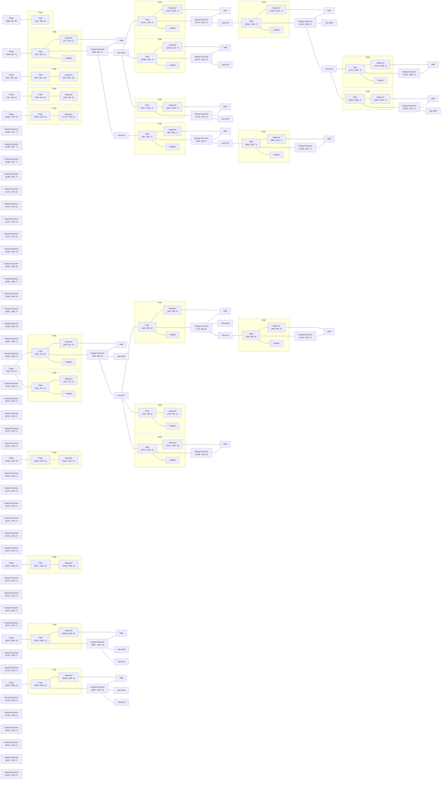

```mermaid
flowchart LR
  subgraph path3 [Path]
    3["Path<br>[511, 592, 8]"]
  end
  subgraph path5 [Path]
    5["Path<br>[571, 622, 7]"]
    6["Segment<br>[571, 622, 7]"]
    7[Solid2d]
  end
  subgraph path8 [Path]
    8["Path<br>[487, 544, 10]"]
    9["Segment<br>[550, 684, 10]"]
  end
  subgraph path11 [Path]
    11["Path<br>[354, 410, 5]"]
    12["Segment<br>[354, 410, 5]"]
    13[Solid2d]
  end
  subgraph path15 [Path]
    15["Path<br>[744, 784, 9]"]
    16["Segment<br>[792, 854, 9]"]
  end
  subgraph path21 [Path]
    21["Path<br>[421, 477, 5]"]
    22["Segment<br>[421, 477, 5]"]
    23[Solid2d]
  end
  subgraph path28 [Path]
    28["Path<br>[807, 863, 7]"]
    29["Segment<br>[807, 863, 7]"]
    30[Solid2d]
  end
  subgraph path34 [Path]
    34["Path<br>[988, 1041, 7]"]
    35["Segment<br>[988, 1041, 7]"]
    36[Solid2d]
  end
  subgraph path37 [Path]
    37["Path<br>[642, 698, 5]"]
    38["Segment<br>[642, 698, 5]"]
    39[Solid2d]
  end
  subgraph path40 [Path]
    40["Path<br>[709, 765, 5]"]
    41["Segment<br>[709, 765, 5]"]
    42[Solid2d]
  end
  subgraph path51 [Path]
    51["Path<br>[909, 963, 5]"]
    52["Segment<br>[909, 963, 5]"]
    53[Solid2d]
  end
  subgraph path61 [Path]
    61["Path<br>[1424, 1464, 7]"]
    62["Segment<br>[1424, 1464, 7]"]
    63[Solid2d]
  end
  subgraph path68 [Path]
    68["Path<br>[1568, 1619, 7]"]
    69["Segment<br>[1568, 1619, 7]"]
    70[Solid2d]
  end
  subgraph path71 [Path]
    71["Path<br>[1241, 1301, 5]"]
    72["Segment<br>[1241, 1301, 5]"]
    73[Solid2d]
  end
  subgraph path80 [Path]
    80["Path<br>[1752, 1805, 7]"]
    81["Segment<br>[1752, 1805, 7]"]
    82[Solid2d]
  end
  subgraph path93 [Path]
    93["Path<br>[2048, 2120, 7]"]
    94["Segment<br>[2048, 2120, 7]"]
    95[Solid2d]
  end
  subgraph path100 [Path]
    100["Path<br>[1659, 1705, 5]"]
    101["Segment<br>[1711, 1763, 5]"]
  end
  subgraph path108 [Path]
    108["Path<br>[2109, 2155, 5]"]
    109["Segment<br>[2161, 2213, 5]"]
  end
  subgraph path117 [Path]
    117["Path<br>[2953, 3000, 5]"]
    118["Segment<br>[3008, 3348, 5]"]
  end
  subgraph path127 [Path]
    127["Path<br>[2377, 2408, 7]"]
    128["Segment<br>[2414, 2434, 7]"]
  end
  subgraph path133 [Path]
    133["Path<br>[2953, 3000, 5]"]
    134["Segment<br>[3008, 3348, 5]"]
  end
  subgraph path142 [Path]
    142["Path<br>[4347, 4442, 5]"]
    143["Segment<br>[4448, 4481, 5]"]
  end
  subgraph path146 [Path]
    146["Path<br>[2864, 2896, 7]"]
    147["Segment<br>[2902, 2923, 7]"]
  end
  1["Plane<br>[548, 565, 7]"]
  2["Plane<br>[488, 505, 8]"]
  4["Plane<br>[464, 481, 10]"]
  10["Plane<br>[354, 410, 5]"]
  14["Plane<br>[744, 784, 9]"]
  17["Sweep Extrusion<br>[631, 687, 7]"]
  18[Wall]
  19["Cap Start"]
  20["Cap End"]
  24["Sweep Extrusion<br>[487, 520, 5]"]
  25[Wall]
  26["Cap Start"]
  27["Cap End"]
  31["Sweep Extrusion<br>[876, 938, 7]"]
  32[Wall]
  33["Cap End"]
  43["Sweep Extrusion<br>[1188, 1267, 7]"]
  44[Wall]
  45["Sweep Extrusion<br>[775, 808, 5]"]
  46[Wall]
  47["Cap Start"]
  48["Cap End"]
  49["Sweep Extrusion<br>[1188, 1267, 7]"]
  50["Sweep Extrusion<br>[1188, 1267, 7]"]
  54["Sweep Extrusion<br>[1188, 1267, 7]"]
  55["Sweep Extrusion<br>[1110, 1144, 5]"]
  56[Wall]
  57["Sweep Extrusion<br>[1188, 1267, 7]"]
  58["Sweep Extrusion<br>[1110, 1144, 5]"]
  59["Sweep Extrusion<br>[1110, 1144, 5]"]
  60["Sweep Extrusion<br>[1110, 1144, 5]"]
  64["Sweep Extrusion<br>[1470, 1503, 7]"]
  65[Wall]
  66["Cap End"]
  67["Sweep Extrusion<br>[1110, 1144, 5]"]
  74["Sweep Extrusion<br>[1634, 1699, 7]"]
  75[Wall]
  76["Cap Start"]
  77["Cap End"]
  78["Sweep Extrusion<br>[1448, 1482, 5]"]
  79[Wall]
  83["Sweep Extrusion<br>[1448, 1482, 5]"]
  84["Sweep Extrusion<br>[1952, 1996, 7]"]
  85[Wall]
  86["Sweep Extrusion<br>[1448, 1482, 5]"]
  87["Sweep Extrusion<br>[1952, 1996, 7]"]
  88["Sweep Extrusion<br>[1448, 1482, 5]"]
  89["Sweep Extrusion<br>[1952, 1996, 7]"]
  90["Sweep Extrusion<br>[1448, 1482, 5]"]
  91["Sweep Extrusion<br>[1952, 1996, 7]"]
  92["Sweep Extrusion<br>[1952, 1996, 7]"]
  96["Sweep Extrusion<br>[2275, 2319, 7]"]
  97[Wall]
  98["Cap End"]
  99["Plane<br>[1659, 1705, 5]"]
  102["Sweep Extrusion<br>[2275, 2319, 7]"]
  103["Sweep Extrusion<br>[2275, 2319, 7]"]
  104["Sweep Extrusion<br>[2275, 2319, 7]"]
  105["Sweep Extrusion<br>[2275, 2319, 7]"]
  106["Sweep Extrusion<br>[2275, 2319, 7]"]
  107["Plane<br>[2109, 2155, 5]"]
  110["Sweep Extrusion<br>[2275, 2319, 7]"]
  111["Sweep Extrusion<br>[2275, 2319, 7]"]
  112["Sweep Extrusion<br>[2275, 2319, 7]"]
  113["Sweep Extrusion<br>[2275, 2319, 7]"]
  114["Sweep Extrusion<br>[2275, 2319, 7]"]
  115["Sweep Extrusion<br>[2275, 2319, 7]"]
  116["Plane<br>[2953, 3000, 5]"]
  119["Sweep Extrusion<br>[2275, 2319, 7]"]
  120["Sweep Extrusion<br>[2275, 2319, 7]"]
  121["Sweep Extrusion<br>[3867, 3913, 5]"]
  122[Wall]
  123["Cap Start"]
  124["Cap End"]
  125["Sweep Extrusion<br>[2275, 2319, 7]"]
  126["Sweep Extrusion<br>[2275, 2319, 7]"]
  129["Sweep Extrusion<br>[2728, 2796, 7]"]
  130[Wall]
  131["Cap Start"]
  132["Plane<br>[2953, 3000, 5]"]
  135["Sweep Extrusion<br>[3867, 3913, 5]"]
  136[Wall]
  137["Cap Start"]
  138["Cap End"]
  139["Sweep Extrusion<br>[2728, 2796, 7]"]
  140["Sweep Extrusion<br>[2728, 2796, 7]"]
  141["Plane<br>[4347, 4442, 5]"]
  144["Sweep Extrusion<br>[2728, 2796, 7]"]
  145["Sweep Extrusion<br>[2728, 2796, 7]"]
  148["Sweep Extrusion<br>[3202, 3276, 7]"]
  149[Wall]
  150["Cap Start"]
  151["Sweep Extrusion<br>[3202, 3276, 7]"]
  152["Sweep Extrusion<br>[3202, 3276, 7]"]
  153["Sweep Extrusion<br>[3202, 3276, 7]"]
  154["Sweep Extrusion<br>[3202, 3276, 7]"]
  1 --- 5
  2 --- 3
  4 --- 8
  5 --- 6
  5 ---- 17
  5 --- 7
  6 --- 18
  8 --- 9
  10 --- 11
  10 --- 21
  11 --- 12
  11 ---- 24
  11 --- 13
  12 --- 25
  14 --- 15
  15 --- 16
  17 --- 18
  17 --- 19
  17 --- 20
  19 --- 61
  19 --- 93
  19 --- 127
  20 --- 28
  21 --- 22
  21 --- 23
  24 --- 25
  24 --- 26
  24 --- 27
  27 --- 37
  27 --- 40
  27 --- 71
  28 --- 29
  28 ---- 31
  28 --- 30
  29 --- 32
  31 --- 32
  31 --- 33
  33 --- 34
  34 --- 35
  34 ---- 43
  34 --- 36
  35 --- 44
  37 --- 38
  37 ---- 45
  37 --- 39
  38 --- 46
  40 --- 41
  40 --- 42
  43 --- 44
  45 --- 46
  45 --- 47
  45 --- 48
  48 --- 51
  51 --- 52
  51 ---- 55
  51 --- 53
  52 --- 56
  55 --- 56
  61 --- 62
  61 ---- 64
  61 --- 63
  62 --- 65
  64 --- 65
  64 --- 66
  66 --- 68
  68 --- 69
  68 ---- 74
  68 --- 70
  69 --- 75
  71 --- 72
  71 ---- 78
  71 --- 73
  72 --- 79
  74 --- 75
  74 --- 76
  74 --- 77
  77 --- 80
  77 --- 146
  78 --- 79
  80 --- 81
  80 ---- 84
  80 --- 82
  81 --- 85
  84 --- 85
  93 --- 94
  93 ---- 96
  93 --- 95
  94 --- 97
  96 --- 97
  96 --- 98
  99 --- 100
  100 --- 101
  107 --- 108
  108 --- 109
  116 --- 117
  117 --- 118
  117 ---- 121
  118 --- 122
  121 --- 122
  121 --- 123
  121 --- 124
  127 --- 128
  127 ---- 129
  128 --- 130
  129 --- 130
  129 --- 131
  132 --- 133
  133 --- 134
  133 ---- 135
  134 --- 136
  135 --- 136
  135 --- 137
  135 --- 138
  141 --- 142
  142 --- 143
  146 --- 147
  146 ---- 148
  147 --- 149
  148 --- 149
  148 --- 150
```
