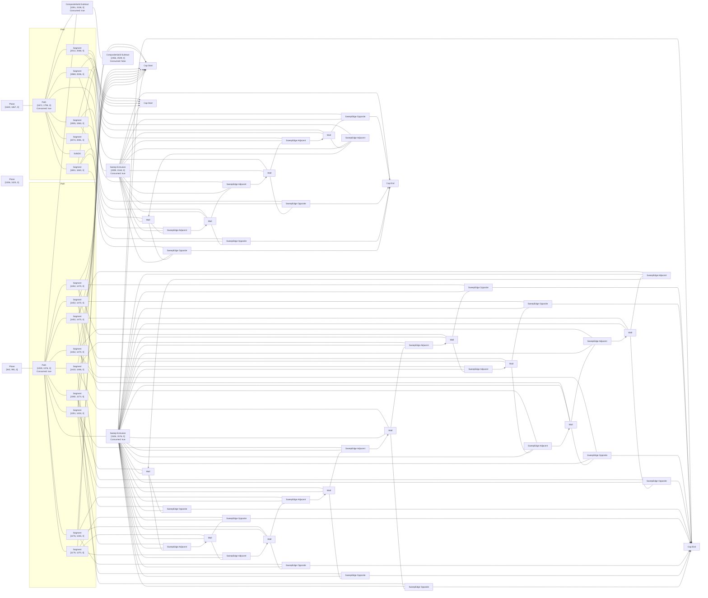

```mermaid
flowchart LR
  subgraph path3 [Path]
    3["Path<br>[1039, 1076, 0]<br>Consumed: true"]
      %% [ProgramBodyItem { index: 13 }, VariableDeclarationDeclaration, VariableDeclarationInit, PipeBodyItem { index: 0 }]
    4["Segment<br>[1082, 1173, 0]"]
      %% [ProgramBodyItem { index: 13 }, VariableDeclarationDeclaration, VariableDeclarationInit, PipeBodyItem { index: 1 }]
    5["Segment<br>[1179, 1270, 0]"]
      %% [ProgramBodyItem { index: 13 }, VariableDeclarationDeclaration, VariableDeclarationInit, PipeBodyItem { index: 2 }]
    6["Segment<br>[1276, 1345, 0]"]
      %% [ProgramBodyItem { index: 13 }, VariableDeclarationDeclaration, VariableDeclarationInit, PipeBodyItem { index: 3 }]
    7["Segment<br>[1351, 1404, 0]"]
      %% [ProgramBodyItem { index: 13 }, VariableDeclarationDeclaration, VariableDeclarationInit, PipeBodyItem { index: 4 }]
    8["Segment<br>[1410, 1446, 0]"]
      %% [ProgramBodyItem { index: 13 }, VariableDeclarationDeclaration, VariableDeclarationInit, PipeBodyItem { index: 5 }]
    9["Segment<br>[1452, 1470, 0]"]
      %% [ProgramBodyItem { index: 13 }, VariableDeclarationDeclaration, VariableDeclarationInit, PipeBodyItem { index: 6 }]
    10["Segment<br>[1452, 1470, 0]"]
      %% [ProgramBodyItem { index: 13 }, VariableDeclarationDeclaration, VariableDeclarationInit, PipeBodyItem { index: 6 }]
    11["Segment<br>[1452, 1470, 0]"]
      %% [ProgramBodyItem { index: 13 }, VariableDeclarationDeclaration, VariableDeclarationInit, PipeBodyItem { index: 6 }]
    12["Segment<br>[1452, 1470, 0]"]
      %% [ProgramBodyItem { index: 13 }, VariableDeclarationDeclaration, VariableDeclarationInit, PipeBodyItem { index: 6 }]
  end
  subgraph path44 [Path]
    44["Path<br>[1672, 1795, 0]<br>Consumed: true"]
      %% [ProgramBodyItem { index: 16 }, VariableDeclarationDeclaration, VariableDeclarationInit, PipeBodyItem { index: 0 }]
    45["Segment<br>[1801, 1840, 0]"]
      %% [ProgramBodyItem { index: 16 }, VariableDeclarationDeclaration, VariableDeclarationInit, PipeBodyItem { index: 1 }]
    46["Segment<br>[1905, 1963, 0]"]
      %% [ProgramBodyItem { index: 16 }, VariableDeclarationDeclaration, VariableDeclarationInit, PipeBodyItem { index: 2 }]
    47["Segment<br>[1969, 2006, 0]"]
      %% [ProgramBodyItem { index: 16 }, VariableDeclarationDeclaration, VariableDeclarationInit, PipeBodyItem { index: 3 }]
    48["Segment<br>[2012, 2068, 0]"]
      %% [ProgramBodyItem { index: 16 }, VariableDeclarationDeclaration, VariableDeclarationInit, PipeBodyItem { index: 4 }]
    49["Segment<br>[2074, 2081, 0]"]
      %% [ProgramBodyItem { index: 16 }, VariableDeclarationDeclaration, VariableDeclarationInit, PipeBodyItem { index: 5 }]
    50[Solid2d]
  end
  1["Plane<br>[942, 991, 0]"]
    %% [ProgramBodyItem { index: 11 }, VariableDeclarationDeclaration, VariableDeclarationInit]
  2["Plane<br>[1006, 1023, 0]"]
    %% [ProgramBodyItem { index: 12 }, VariableDeclarationDeclaration, VariableDeclarationInit]
  13["Sweep Extrusion<br>[1526, 1576, 0]<br>Consumed: true"]
    %% [ProgramBodyItem { index: 14 }, VariableDeclarationDeclaration, VariableDeclarationInit]
  14[Wall]
    %% face_code_ref=Missing NodePath
  15[Wall]
    %% face_code_ref=Missing NodePath
  16[Wall]
    %% face_code_ref=Missing NodePath
  17[Wall]
    %% face_code_ref=Missing NodePath
  18[Wall]
    %% face_code_ref=Missing NodePath
  19[Wall]
    %% face_code_ref=Missing NodePath
  20[Wall]
    %% face_code_ref=Missing NodePath
  21[Wall]
    %% face_code_ref=Missing NodePath
  22[Wall]
    %% face_code_ref=Missing NodePath
  23["Cap Start"]
    %% face_code_ref=Missing NodePath
  24["Cap End"]
    %% face_code_ref=Missing NodePath
  25["SweepEdge Opposite"]
  26["SweepEdge Adjacent"]
  27["SweepEdge Opposite"]
  28["SweepEdge Adjacent"]
  29["SweepEdge Opposite"]
  30["SweepEdge Adjacent"]
  31["SweepEdge Opposite"]
  32["SweepEdge Adjacent"]
  33["SweepEdge Opposite"]
  34["SweepEdge Adjacent"]
  35["SweepEdge Opposite"]
  36["SweepEdge Adjacent"]
  37["SweepEdge Opposite"]
  38["SweepEdge Adjacent"]
  39["SweepEdge Opposite"]
  40["SweepEdge Adjacent"]
  41["SweepEdge Opposite"]
  42["SweepEdge Adjacent"]
  43["Plane<br>[1640, 1657, 0]"]
    %% [ProgramBodyItem { index: 15 }, VariableDeclarationDeclaration, VariableDeclarationInit]
  51["Sweep Extrusion<br>[2099, 2163, 0]<br>Consumed: true"]
    %% [ProgramBodyItem { index: 17 }, VariableDeclarationDeclaration, VariableDeclarationInit, PipeBodyItem { index: 0 }]
  52[Wall]
    %% face_code_ref=Missing NodePath
  53[Wall]
    %% face_code_ref=Missing NodePath
  54[Wall]
    %% face_code_ref=Missing NodePath
  55[Wall]
    %% face_code_ref=Missing NodePath
  56["Cap Start"]
    %% face_code_ref=Missing NodePath
  57["Cap End"]
    %% face_code_ref=Missing NodePath
  58["SweepEdge Opposite"]
  59["SweepEdge Adjacent"]
  60["SweepEdge Opposite"]
  61["SweepEdge Adjacent"]
  62["SweepEdge Opposite"]
  63["SweepEdge Adjacent"]
  64["SweepEdge Opposite"]
  65["SweepEdge Adjacent"]
  66["CompositeSolid Subtract<br>[2391, 2438, 0]<br>Consumed: true"]
    %% [ProgramBodyItem { index: 19 }, VariableDeclarationDeclaration, VariableDeclarationInit]
  67["CompositeSolid Subtract<br>[2456, 2509, 0]<br>Consumed: false"]
    %% [ProgramBodyItem { index: 20 }, VariableDeclarationDeclaration, VariableDeclarationInit, PipeBodyItem { index: 0 }]
  1 --- 3
  3 --- 4
  3 --- 5
  3 --- 6
  3 --- 7
  3 --- 8
  3 --- 9
  3 --- 10
  3 --- 11
  3 --- 12
  3 ---- 13
  3 --- 66
  4 --- 18
  4 x--> 23
  4 --- 33
  4 --- 34
  5 --- 19
  5 x--> 23
  5 --- 35
  5 --- 36
  6 --- 20
  6 x--> 23
  6 --- 37
  6 --- 38
  7 --- 21
  7 x--> 23
  7 --- 39
  7 --- 40
  8 --- 22
  8 x--> 23
  8 --- 41
  8 --- 42
  9 --- 14
  9 x--> 23
  9 --- 25
  9 --- 26
  10 --- 15
  10 x--> 23
  10 --- 27
  10 --- 28
  11 --- 16
  11 x--> 23
  11 --- 29
  11 --- 30
  12 --- 17
  12 x--> 23
  12 --- 31
  12 --- 32
  13 --- 14
  13 --- 15
  13 --- 16
  13 --- 17
  13 --- 18
  13 --- 19
  13 --- 20
  13 --- 21
  13 --- 22
  13 --- 23
  13 --- 24
  13 --- 25
  13 --- 26
  13 --- 27
  13 --- 28
  13 --- 29
  13 --- 30
  13 --- 31
  13 --- 32
  13 --- 33
  13 --- 34
  13 --- 35
  13 --- 36
  13 --- 37
  13 --- 38
  13 --- 39
  13 --- 40
  13 --- 41
  13 --- 42
  14 --- 25
  14 --- 26
  42 <--x 14
  26 <--x 15
  15 --- 27
  15 --- 28
  28 <--x 16
  16 --- 29
  16 --- 30
  30 <--x 17
  17 --- 31
  17 --- 32
  32 <--x 18
  18 --- 33
  18 --- 34
  34 <--x 19
  19 --- 35
  19 --- 36
  36 <--x 20
  20 --- 37
  20 --- 38
  38 <--x 21
  21 --- 39
  21 --- 40
  40 <--x 22
  22 --- 41
  22 --- 42
  25 <--x 24
  27 <--x 24
  29 <--x 24
  31 <--x 24
  33 <--x 24
  35 <--x 24
  37 <--x 24
  39 <--x 24
  41 <--x 24
  43 --- 44
  44 --- 45
  44 --- 46
  44 --- 47
  44 --- 48
  44 --- 49
  44 --- 50
  44 ---- 51
  44 --- 66
  45 --- 55
  45 x--> 56
  45 --- 64
  45 --- 65
  46 --- 54
  46 x--> 56
  46 --- 62
  46 --- 63
  47 --- 53
  47 x--> 56
  47 --- 60
  47 --- 61
  48 --- 52
  48 x--> 56
  48 --- 58
  48 --- 59
  51 --- 52
  51 --- 53
  51 --- 54
  51 --- 55
  51 --- 56
  51 --- 57
  51 --- 58
  51 --- 59
  51 --- 60
  51 --- 61
  51 --- 62
  51 --- 63
  51 --- 64
  51 --- 65
  52 --- 58
  52 --- 59
  61 <--x 52
  53 --- 60
  53 --- 61
  63 <--x 53
  54 --- 62
  54 --- 63
  65 <--x 54
  59 <--x 55
  55 --- 64
  55 --- 65
  58 <--x 57
  60 <--x 57
  62 <--x 57
  64 <--x 57
  66 --- 67
```
