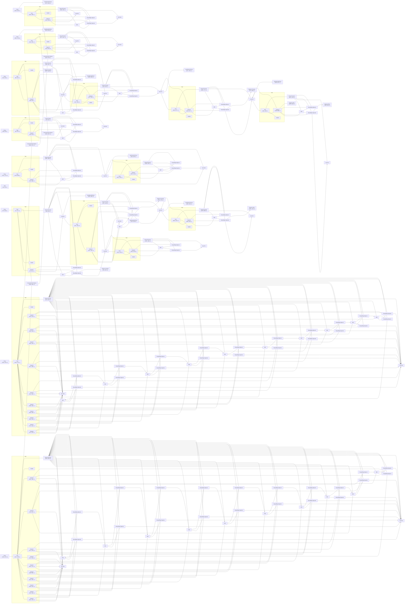

```mermaid
flowchart LR
  subgraph path2 [Path]
    2["Path<br>[863, 963, 1]"]
    3["Segment<br>[863, 963, 1]"]
    4[Solid2d]
  end
  subgraph path12 [Path]
    12["Path<br>[1331, 1404, 1]"]
    13["Segment<br>[1331, 1404, 1]"]
    14[Solid2d]
  end
  subgraph path20 [Path]
    20["Path<br>[1583, 1677, 1]"]
    21["Segment<br>[1583, 1677, 1]"]
    22[Solid2d]
  end
  subgraph path29 [Path]
    29["Path<br>[1994, 2090, 1]"]
    30["Segment<br>[1994, 2090, 1]"]
    31[Solid2d]
  end
  subgraph path40 [Path]
    40["Path<br>[2542, 2721, 1]"]
    41["Segment<br>[2727, 2755, 1]"]
    42["Segment<br>[2761, 2814, 1]"]
    43["Segment<br>[2820, 2839, 1]"]
    44["Segment<br>[2845, 2882, 1]"]
    45["Segment<br>[2888, 2906, 1]"]
    46["Segment<br>[2912, 2965, 1]"]
    47["Segment<br>[2971, 2999, 1]"]
    48["Segment<br>[3005, 3024, 1]"]
    49["Segment<br>[3030, 3109, 1]"]
    50["Segment<br>[3115, 3123, 1]"]
    51[Solid2d]
  end
  subgraph path87 [Path]
    87["Path<br>[3424, 3569, 1]"]
    88["Segment<br>[3424, 3569, 1]"]
    89[Solid2d]
  end
  subgraph path98 [Path]
    98["Path<br>[3799, 3866, 1]"]
    99["Segment<br>[3799, 3866, 1]"]
    100[Solid2d]
  end
  subgraph path107 [Path]
    107["Path<br>[4076, 4149, 1]"]
    108["Segment<br>[4076, 4149, 1]"]
    109[Solid2d]
  end
  subgraph path116 [Path]
    116["Path<br>[491, 553, 3]"]
    117["Segment<br>[491, 553, 3]"]
    118[Solid2d]
  end
  subgraph path126 [Path]
    126["Path<br>[717, 817, 4]"]
    127["Segment<br>[717, 817, 4]"]
    128[Solid2d]
  end
  subgraph path136 [Path]
    136["Path<br>[1184, 1239, 4]"]
    137["Segment<br>[1184, 1239, 4]"]
    138[Solid2d]
  end
  subgraph path144 [Path]
    144["Path<br>[1421, 1525, 4]"]
    145["Segment<br>[1421, 1525, 4]"]
    146[Solid2d]
  end
  subgraph path154 [Path]
    154["Path<br>[1866, 1962, 4]"]
    155["Segment<br>[1866, 1962, 4]"]
    156[Solid2d]
  end
  subgraph path164 [Path]
    164["Path<br>[2297, 2495, 4]"]
    165["Segment<br>[2501, 2529, 4]"]
    166["Segment<br>[2535, 2589, 4]"]
    167["Segment<br>[2595, 2613, 4]"]
    168["Segment<br>[2619, 2656, 4]"]
    169["Segment<br>[2662, 2681, 4]"]
    170["Segment<br>[2687, 2741, 4]"]
    171["Segment<br>[2747, 2766, 4]"]
    172["Segment<br>[2772, 2790, 4]"]
    173["Segment<br>[2796, 2875, 4]"]
    174["Segment<br>[2881, 2889, 4]"]
    175[Solid2d]
  end
  subgraph path211 [Path]
    211["Path<br>[3190, 3356, 4]"]
    212["Segment<br>[3190, 3356, 4]"]
    213[Solid2d]
  end
  1["Plane<br>[822, 839, 1]"]
  5["Sweep Extrusion<br>[987, 1071, 1]"]
  6[Wall]
    %% face_code_ref=Missing NodePath
  7["Cap Start"]
  8["Cap End"]
    %% face_code_ref=Missing NodePath
  9["SweepEdge Opposite"]
  10["SweepEdge Adjacent"]
  11["EdgeCut Chamfer<br>[1077, 1192, 1]"]
  15["Sweep Extrusion<br>[1426, 1481, 1]"]
  16[Wall]
    %% face_code_ref=Missing NodePath
  17["Cap End"]
  18["SweepEdge Opposite"]
  19["SweepEdge Adjacent"]
  23["Sweep Extrusion<br>[1698, 1772, 1]"]
  24[Wall]
    %% face_code_ref=Missing NodePath
  25["Cap End"]
  26["SweepEdge Opposite"]
  27["SweepEdge Adjacent"]
  28["EdgeCut Chamfer<br>[1778, 1889, 1]"]
  32["Sweep Extrusion<br>[2107, 2178, 1]"]
  33[Wall]
    %% face_code_ref=Missing NodePath
  34["Cap End"]
    %% face_code_ref=Missing NodePath
  35["SweepEdge Opposite"]
  36["SweepEdge Adjacent"]
  37["EdgeCut Fillet<br>[2184, 2323, 1]"]
  38["EdgeCut Fillet<br>[2329, 2439, 1]"]
  39["Plane<br>[2502, 2519, 1]"]
  52["Sweep Extrusion<br>[3146, 3204, 1]"]
  53[Wall]
    %% face_code_ref=Missing NodePath
  54[Wall]
    %% face_code_ref=Missing NodePath
  55[Wall]
    %% face_code_ref=Missing NodePath
  56[Wall]
    %% face_code_ref=Missing NodePath
  57[Wall]
    %% face_code_ref=Missing NodePath
  58[Wall]
    %% face_code_ref=Missing NodePath
  59[Wall]
    %% face_code_ref=Missing NodePath
  60[Wall]
    %% face_code_ref=Missing NodePath
  61[Wall]
    %% face_code_ref=Missing NodePath
  62[Wall]
    %% face_code_ref=Missing NodePath
  63["Cap Start"]
    %% face_code_ref=Missing NodePath
  64["Cap End"]
    %% face_code_ref=Missing NodePath
  65["SweepEdge Opposite"]
  66["SweepEdge Adjacent"]
  67["SweepEdge Opposite"]
  68["SweepEdge Adjacent"]
  69["SweepEdge Opposite"]
  70["SweepEdge Adjacent"]
  71["SweepEdge Opposite"]
  72["SweepEdge Adjacent"]
  73["SweepEdge Opposite"]
  74["SweepEdge Adjacent"]
  75["SweepEdge Opposite"]
  76["SweepEdge Adjacent"]
  77["SweepEdge Opposite"]
  78["SweepEdge Adjacent"]
  79["SweepEdge Opposite"]
  80["SweepEdge Adjacent"]
  81["SweepEdge Opposite"]
  82["SweepEdge Adjacent"]
  83["SweepEdge Opposite"]
  84["SweepEdge Adjacent"]
  85["CompositeSolid Subtract<br>[3218, 3273, 1]"]
  86["Plane<br>[3325, 3353, 1]"]
  90["Sweep Extrusion<br>[3590, 3630, 1]"]
  91[Wall]
    %% face_code_ref=Missing NodePath
  92["Cap Start"]
    %% face_code_ref=Missing NodePath
  93["Cap End"]
    %% face_code_ref=Missing NodePath
  94["SweepEdge Opposite"]
  95["SweepEdge Adjacent"]
  96["CompositeSolid Subtract<br>[3649, 3700, 1]"]
  97["Plane<br>[3761, 3778, 1]"]
  101["Sweep Extrusion<br>[3887, 3940, 1]"]
  102[Wall]
    %% face_code_ref=Missing NodePath
  103["Cap Start"]
    %% face_code_ref=Missing NodePath
  104["Cap End"]
  105["SweepEdge Opposite"]
  106["SweepEdge Adjacent"]
  110["Sweep Extrusion<br>[4168, 4223, 1]"]
  111[Wall]
    %% face_code_ref=Missing NodePath
  112["SweepEdge Opposite"]
  113["SweepEdge Adjacent"]
  114["Helix<br>[311, 451, 3]"]
  115["Plane<br>[468, 485, 3]"]
  119["Sweep Sweep<br>[559, 582, 3]"]
  120[Wall]
    %% face_code_ref=Missing NodePath
  121["Cap Start"]
    %% face_code_ref=Missing NodePath
  122["Cap Start"]
    %% face_code_ref=Missing NodePath
  123["SweepEdge Opposite"]
  124["SweepEdge Adjacent"]
  125["Plane<br>[673, 690, 4]"]
  129["Sweep Extrusion<br>[845, 933, 4]"]
  130[Wall]
    %% face_code_ref=Missing NodePath
  131["Cap Start"]
  132["Cap End"]
  133["SweepEdge Opposite"]
  134["SweepEdge Adjacent"]
  135["EdgeCut Chamfer<br>[939, 1052, 4]"]
  139["Sweep Extrusion<br>[1259, 1298, 4]"]
  140[Wall]
    %% face_code_ref=Missing NodePath
  141["Cap End"]
    %% face_code_ref=Missing NodePath
  142["SweepEdge Opposite"]
  143["SweepEdge Adjacent"]
  147["Sweep Extrusion<br>[1551, 1638, 4]"]
  148[Wall]
    %% face_code_ref=Missing NodePath
  149["Cap Start"]
    %% face_code_ref=Missing NodePath
  150["Cap End"]
  151["SweepEdge Opposite"]
  152["SweepEdge Adjacent"]
  153["EdgeCut Chamfer<br>[1644, 1756, 4]"]
  157["Sweep Extrusion<br>[1979, 2050, 4]"]
  158[Wall]
    %% face_code_ref=Missing NodePath
  159["Cap End"]
    %% face_code_ref=Missing NodePath
  160["SweepEdge Opposite"]
  161["SweepEdge Adjacent"]
  162["EdgeCut Fillet<br>[2056, 2195, 4]"]
  163["Plane<br>[2258, 2275, 4]"]
  176["Sweep Extrusion<br>[2912, 2970, 4]"]
  177[Wall]
    %% face_code_ref=Missing NodePath
  178[Wall]
    %% face_code_ref=Missing NodePath
  179[Wall]
    %% face_code_ref=Missing NodePath
  180[Wall]
    %% face_code_ref=Missing NodePath
  181[Wall]
    %% face_code_ref=Missing NodePath
  182[Wall]
    %% face_code_ref=Missing NodePath
  183[Wall]
    %% face_code_ref=Missing NodePath
  184[Wall]
    %% face_code_ref=Missing NodePath
  185[Wall]
    %% face_code_ref=Missing NodePath
  186[Wall]
    %% face_code_ref=Missing NodePath
  187["Cap Start"]
    %% face_code_ref=Missing NodePath
  188["Cap End"]
    %% face_code_ref=Missing NodePath
  189["SweepEdge Opposite"]
  190["SweepEdge Adjacent"]
  191["SweepEdge Opposite"]
  192["SweepEdge Adjacent"]
  193["SweepEdge Opposite"]
  194["SweepEdge Adjacent"]
  195["SweepEdge Opposite"]
  196["SweepEdge Adjacent"]
  197["SweepEdge Opposite"]
  198["SweepEdge Adjacent"]
  199["SweepEdge Opposite"]
  200["SweepEdge Adjacent"]
  201["SweepEdge Opposite"]
  202["SweepEdge Adjacent"]
  203["SweepEdge Opposite"]
  204["SweepEdge Adjacent"]
  205["SweepEdge Opposite"]
  206["SweepEdge Adjacent"]
  207["SweepEdge Opposite"]
  208["SweepEdge Adjacent"]
  209["CompositeSolid Subtract<br>[2984, 3039, 4]"]
  210["Plane<br>[3091, 3119, 4]"]
  214["Sweep Extrusion<br>[3377, 3417, 4]"]
  215[Wall]
    %% face_code_ref=Missing NodePath
  216["Cap Start"]
    %% face_code_ref=Missing NodePath
  217["Cap End"]
    %% face_code_ref=Missing NodePath
  218["SweepEdge Opposite"]
  219["SweepEdge Adjacent"]
  220["CompositeSolid Subtract<br>[3436, 3487, 4]"]
  221["StartSketchOnFace<br>[1260, 1309, 1]"]
  222["StartSketchOnFace<br>[1517, 1562, 1]"]
  223["StartSketchOnFace<br>[1933, 1977, 1]"]
  224["StartSketchOnPlane<br>[3373, 3403, 1]"]
  225["StartSketchOnFace<br>[4010, 4054, 1]"]
  226["StartSketchOnFace<br>[1112, 1164, 4]"]
  227["StartSketchOnFace<br>[1345, 1395, 4]"]
  228["StartSketchOnFace<br>[1800, 1849, 4]"]
  229["StartSketchOnPlane<br>[3139, 3169, 4]"]
  1 --- 2
  2 --- 3
  2 --- 4
  2 ---- 5
  2 --- 85
  3 --- 6
  3 x--> 7
  3 --- 9
  3 --- 10
  3 --- 11
  5 --- 6
  5 --- 7
  5 --- 8
  5 --- 9
  5 --- 10
  6 --- 9
  6 --- 10
  7 --- 12
  13 <--x 7
  7 <--x 221
  9 <--x 8
  12 --- 13
  12 --- 14
  12 ---- 15
  13 --- 16
  13 --- 18
  13 --- 19
  15 --- 16
  15 --- 17
  15 --- 18
  15 --- 19
  16 --- 18
  16 --- 19
  18 <--x 17
  17 --- 20
  21 <--x 17
  17 <--x 222
  20 --- 21
  20 --- 22
  20 ---- 23
  21 --- 24
  21 --- 26
  21 --- 27
  23 --- 24
  23 --- 25
  23 --- 26
  23 --- 27
  24 --- 26
  24 --- 27
  26 <--x 25
  25 --- 29
  30 <--x 25
  25 <--x 223
  26 <--x 28
  29 --- 30
  29 --- 31
  29 ---- 32
  30 --- 33
  30 --- 35
  30 --- 36
  30 --- 38
  32 --- 33
  32 --- 34
  32 --- 35
  32 --- 36
  33 --- 35
  33 --- 36
  35 <--x 34
  35 <--x 37
  39 --- 40
  40 --- 41
  40 --- 42
  40 --- 43
  40 --- 44
  40 --- 45
  40 --- 46
  40 --- 47
  40 --- 48
  40 --- 49
  40 --- 50
  40 --- 51
  40 ---- 52
  40 --- 85
  41 --- 53
  41 x--> 63
  41 --- 65
  41 --- 66
  42 --- 54
  42 x--> 63
  42 --- 67
  42 --- 68
  43 --- 55
  43 x--> 63
  43 --- 69
  43 --- 70
  44 --- 56
  44 x--> 63
  44 --- 71
  44 --- 72
  45 --- 57
  45 x--> 63
  45 --- 73
  45 --- 74
  46 --- 58
  46 x--> 63
  46 --- 75
  46 --- 76
  47 --- 59
  47 x--> 63
  47 --- 77
  47 --- 78
  48 --- 60
  48 x--> 63
  48 --- 79
  48 --- 80
  49 --- 61
  49 x--> 63
  49 --- 81
  49 --- 82
  50 --- 62
  50 x--> 63
  50 --- 83
  50 --- 84
  52 --- 53
  52 --- 54
  52 --- 55
  52 --- 56
  52 --- 57
  52 --- 58
  52 --- 59
  52 --- 60
  52 --- 61
  52 --- 62
  52 --- 63
  52 --- 64
  52 --- 65
  52 --- 66
  52 --- 67
  52 --- 68
  52 --- 69
  52 --- 70
  52 --- 71
  52 --- 72
  52 --- 73
  52 --- 74
  52 --- 75
  52 --- 76
  52 --- 77
  52 --- 78
  52 --- 79
  52 --- 80
  52 --- 81
  52 --- 82
  52 --- 83
  52 --- 84
  53 --- 65
  53 --- 66
  84 <--x 53
  66 <--x 54
  54 --- 67
  54 --- 68
  68 <--x 55
  55 --- 69
  55 --- 70
  70 <--x 56
  56 --- 71
  56 --- 72
  72 <--x 57
  57 --- 73
  57 --- 74
  74 <--x 58
  58 --- 75
  58 --- 76
  76 <--x 59
  59 --- 77
  59 --- 78
  78 <--x 60
  60 --- 79
  60 --- 80
  80 <--x 61
  61 --- 81
  61 --- 82
  82 <--x 62
  62 --- 83
  62 --- 84
  65 <--x 64
  67 <--x 64
  69 <--x 64
  71 <--x 64
  73 <--x 64
  75 <--x 64
  77 <--x 64
  79 <--x 64
  81 <--x 64
  83 <--x 64
  85 --- 96
  86 --- 87
  86 <--x 224
  87 --- 88
  87 --- 89
  87 ---- 90
  87 --- 96
  88 --- 91
  88 x--> 93
  88 --- 94
  88 --- 95
  90 --- 91
  90 --- 92
  90 --- 93
  90 --- 94
  90 --- 95
  91 --- 94
  91 --- 95
  94 <--x 92
  97 --- 98
  98 --- 99
  98 --- 100
  98 ---- 101
  99 --- 102
  99 x--> 103
  99 --- 105
  99 --- 106
  101 --- 102
  101 --- 103
  101 --- 104
  101 --- 105
  101 --- 106
  102 --- 105
  102 --- 106
  112 <--x 103
  105 <--x 104
  104 --- 107
  108 <--x 104
  104 <--x 225
  107 --- 108
  107 --- 109
  107 ---- 110
  108 --- 111
  108 --- 112
  108 --- 113
  110 --- 111
  110 --- 112
  110 --- 113
  111 --- 112
  111 --- 113
  115 --- 116
  116 --- 117
  116 --- 118
  116 ---- 119
  117 --- 120
  117 x--> 121
  117 --- 123
  117 --- 124
  119 --- 120
  119 --- 121
  119 --- 122
  119 --- 123
  119 --- 124
  120 --- 123
  120 --- 124
  123 <--x 122
  125 --- 126
  126 --- 127
  126 --- 128
  126 ---- 129
  126 --- 209
  127 --- 130
  127 x--> 132
  127 --- 133
  127 --- 134
  129 --- 130
  129 --- 131
  129 --- 132
  129 --- 133
  129 --- 134
  130 --- 133
  130 --- 134
  133 <--x 131
  131 --- 136
  137 <--x 131
  131 <--x 226
  132 --- 144
  132 <--x 227
  133 <--x 135
  136 --- 137
  136 --- 138
  136 ---- 139
  137 --- 140
  137 --- 142
  137 --- 143
  139 --- 140
  139 --- 141
  139 --- 142
  139 --- 143
  140 --- 142
  140 --- 143
  142 <--x 141
  144 --- 145
  144 --- 146
  144 ---- 147
  145 --- 148
  145 x--> 149
  145 --- 151
  145 --- 152
  147 --- 148
  147 --- 149
  147 --- 150
  147 --- 151
  147 --- 152
  148 --- 151
  148 --- 152
  151 <--x 150
  150 --- 154
  155 <--x 150
  150 <--x 228
  151 <--x 153
  154 --- 155
  154 --- 156
  154 ---- 157
  155 --- 158
  155 --- 160
  155 --- 161
  157 --- 158
  157 --- 159
  157 --- 160
  157 --- 161
  158 --- 160
  158 --- 161
  160 <--x 159
  160 <--x 162
  163 --- 164
  164 --- 165
  164 --- 166
  164 --- 167
  164 --- 168
  164 --- 169
  164 --- 170
  164 --- 171
  164 --- 172
  164 --- 173
  164 --- 174
  164 --- 175
  164 ---- 176
  164 --- 209
  165 --- 186
  165 x--> 187
  165 --- 207
  165 --- 208
  166 --- 185
  166 x--> 187
  166 --- 205
  166 --- 206
  167 --- 184
  167 x--> 187
  167 --- 203
  167 --- 204
  168 --- 183
  168 x--> 187
  168 --- 201
  168 --- 202
  169 --- 182
  169 x--> 187
  169 --- 199
  169 --- 200
  170 --- 181
  170 x--> 187
  170 --- 197
  170 --- 198
  171 --- 180
  171 x--> 187
  171 --- 195
  171 --- 196
  172 --- 179
  172 x--> 187
  172 --- 193
  172 --- 194
  173 --- 178
  173 x--> 187
  173 --- 191
  173 --- 192
  174 --- 177
  174 x--> 187
  174 --- 189
  174 --- 190
  176 --- 177
  176 --- 178
  176 --- 179
  176 --- 180
  176 --- 181
  176 --- 182
  176 --- 183
  176 --- 184
  176 --- 185
  176 --- 186
  176 --- 187
  176 --- 188
  176 --- 189
  176 --- 190
  176 --- 191
  176 --- 192
  176 --- 193
  176 --- 194
  176 --- 195
  176 --- 196
  176 --- 197
  176 --- 198
  176 --- 199
  176 --- 200
  176 --- 201
  176 --- 202
  176 --- 203
  176 --- 204
  176 --- 205
  176 --- 206
  176 --- 207
  176 --- 208
  177 --- 189
  177 --- 190
  192 <--x 177
  178 --- 191
  178 --- 192
  194 <--x 178
  179 --- 193
  179 --- 194
  196 <--x 179
  180 --- 195
  180 --- 196
  198 <--x 180
  181 --- 197
  181 --- 198
  200 <--x 181
  182 --- 199
  182 --- 200
  202 <--x 182
  183 --- 201
  183 --- 202
  204 <--x 183
  184 --- 203
  184 --- 204
  206 <--x 184
  185 --- 205
  185 --- 206
  208 <--x 185
  190 <--x 186
  186 --- 207
  186 --- 208
  189 <--x 188
  191 <--x 188
  193 <--x 188
  195 <--x 188
  197 <--x 188
  199 <--x 188
  201 <--x 188
  203 <--x 188
  205 <--x 188
  207 <--x 188
  209 --- 220
  210 --- 211
  210 <--x 229
  211 --- 212
  211 --- 213
  211 ---- 214
  211 --- 220
  212 --- 215
  212 x--> 217
  212 --- 218
  212 --- 219
  214 --- 215
  214 --- 216
  214 --- 217
  214 --- 218
  214 --- 219
  215 --- 218
  215 --- 219
  218 <--x 216
```
