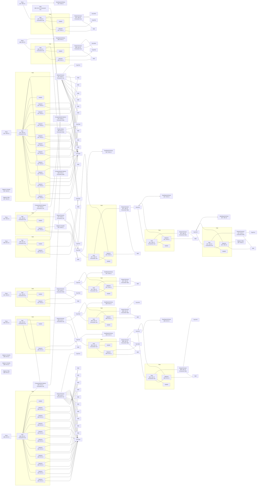

```mermaid
flowchart LR
  subgraph path2 [Path]
    2["Path<br>[517, 563, 0]<br>Consumed: true"]
      %% [ProgramBodyItem { index: 0 }]
    3["Segment<br>[517, 563, 0]"]
      %% [ProgramBodyItem { index: 0 }]
    4[Solid2d]
  end
  subgraph path10 [Path]
    10["Path<br>[517, 563, 0]<br>Consumed: true"]
      %% [ProgramBodyItem { index: 0 }]
    11["Segment<br>[517, 563, 0]"]
      %% [ProgramBodyItem { index: 0 }]
    12[Solid2d]
  end
  subgraph path16 [Path]
    16["Path<br>[517, 563, 0]<br>Consumed: true"]
      %% [ProgramBodyItem { index: 0 }]
    17["Segment<br>[517, 563, 0]"]
      %% [ProgramBodyItem { index: 0 }]
    18[Solid2d]
  end
  subgraph path23 [Path]
    23["Path<br>[517, 563, 0]<br>Consumed: true"]
      %% [ProgramBodyItem { index: 0 }]
    24["Segment<br>[517, 563, 0]"]
      %% [ProgramBodyItem { index: 0 }]
    25[Solid2d]
  end
  subgraph path32 [Path]
    32["Path<br>[517, 563, 0]<br>Consumed: true"]
      %% [ProgramBodyItem { index: 0 }]
    33["Segment<br>[517, 563, 0]"]
      %% [ProgramBodyItem { index: 0 }]
    34["Segment<br>[517, 563, 0]"]
      %% [ProgramBodyItem { index: 0 }]
    35["Segment<br>[517, 563, 0]"]
      %% [ProgramBodyItem { index: 0 }]
    36["Segment<br>[517, 563, 0]"]
      %% [ProgramBodyItem { index: 0 }]
    37["Segment<br>[517, 563, 0]"]
      %% [ProgramBodyItem { index: 0 }]
    38["Segment<br>[517, 563, 0]"]
      %% [ProgramBodyItem { index: 0 }]
    39["Segment<br>[517, 563, 0]"]
      %% [ProgramBodyItem { index: 0 }]
    40["Segment<br>[517, 563, 0]"]
      %% [ProgramBodyItem { index: 0 }]
    41["Segment<br>[517, 563, 0]"]
      %% [ProgramBodyItem { index: 0 }]
    42["Segment<br>[517, 563, 0]"]
      %% [ProgramBodyItem { index: 0 }]
    43[Solid2d]
  end
  subgraph path59 [Path]
    59["Path<br>[517, 563, 0]<br>Consumed: true"]
      %% [ProgramBodyItem { index: 0 }]
    60["Segment<br>[517, 563, 0]"]
      %% [ProgramBodyItem { index: 0 }]
    61[Solid2d]
  end
  subgraph path68 [Path]
    68["Path<br>[517, 563, 0]<br>Consumed: true"]
      %% [ProgramBodyItem { index: 0 }]
    69["Segment<br>[517, 563, 0]"]
      %% [ProgramBodyItem { index: 0 }]
    70[Solid2d]
  end
  subgraph path75 [Path]
    75["Path<br>[517, 563, 0]<br>Consumed: true"]
      %% [ProgramBodyItem { index: 0 }]
    76["Segment<br>[517, 563, 0]"]
      %% [ProgramBodyItem { index: 0 }]
    77[Solid2d]
  end
  subgraph path82 [Path]
    82["Path<br>[564, 601, 0]<br>Consumed: true"]
      %% [ProgramBodyItem { index: 1 }]
    83["Segment<br>[564, 601, 0]"]
      %% [ProgramBodyItem { index: 1 }]
    84[Solid2d]
  end
  subgraph path90 [Path]
    90["Path<br>[602, 642, 0]<br>Consumed: true"]
      %% [ProgramBodyItem { index: 2 }]
    91["Segment<br>[602, 642, 0]"]
      %% [ProgramBodyItem { index: 2 }]
    92[Solid2d]
  end
  subgraph path98 [Path]
    98["Path<br>[602, 642, 0]<br>Consumed: true"]
      %% [ProgramBodyItem { index: 2 }]
    99["Segment<br>[602, 642, 0]"]
      %% [ProgramBodyItem { index: 2 }]
    100[Solid2d]
  end
  subgraph path104 [Path]
    104["Path<br>[602, 642, 0]<br>Consumed: true"]
      %% [ProgramBodyItem { index: 2 }]
    105["Segment<br>[602, 642, 0]"]
      %% [ProgramBodyItem { index: 2 }]
    106[Solid2d]
  end
  subgraph path112 [Path]
    112["Path<br>[602, 642, 0]<br>Consumed: true"]
      %% [ProgramBodyItem { index: 2 }]
    113["Segment<br>[602, 642, 0]"]
      %% [ProgramBodyItem { index: 2 }]
    114[Solid2d]
  end
  subgraph path120 [Path]
    120["Path<br>[602, 642, 0]<br>Consumed: true"]
      %% [ProgramBodyItem { index: 2 }]
    121["Segment<br>[602, 642, 0]"]
      %% [ProgramBodyItem { index: 2 }]
    122["Segment<br>[602, 642, 0]"]
      %% [ProgramBodyItem { index: 2 }]
    123["Segment<br>[602, 642, 0]"]
      %% [ProgramBodyItem { index: 2 }]
    124["Segment<br>[602, 642, 0]"]
      %% [ProgramBodyItem { index: 2 }]
    125["Segment<br>[602, 642, 0]"]
      %% [ProgramBodyItem { index: 2 }]
    126["Segment<br>[602, 642, 0]"]
      %% [ProgramBodyItem { index: 2 }]
    127["Segment<br>[602, 642, 0]"]
      %% [ProgramBodyItem { index: 2 }]
    128["Segment<br>[602, 642, 0]"]
      %% [ProgramBodyItem { index: 2 }]
    129["Segment<br>[602, 642, 0]"]
      %% [ProgramBodyItem { index: 2 }]
    130["Segment<br>[602, 642, 0]"]
      %% [ProgramBodyItem { index: 2 }]
    131[Solid2d]
  end
  subgraph path147 [Path]
    147["Path<br>[602, 642, 0]<br>Consumed: true"]
      %% [ProgramBodyItem { index: 2 }]
    148["Segment<br>[602, 642, 0]"]
      %% [ProgramBodyItem { index: 2 }]
    149[Solid2d]
  end
  1["Plane<br>[517, 563, 0]"]
    %% [ProgramBodyItem { index: 0 }]
  5["Sweep Extrusion<br>[517, 563, 0]<br>Consumed: true"]
    %% [ProgramBodyItem { index: 0 }]
  6[Wall]
    %% face_code_ref=Missing NodePath
  7["Cap Start"]
    %% face_code_ref=[ProgramBodyItem { index: 0 }]
  8["Cap End"]
    %% face_code_ref=Missing NodePath
  9["EdgeCut Chamfer<br>[517, 563, 0]"]
    %% [ProgramBodyItem { index: 0 }]
  13["Sweep Extrusion<br>[517, 563, 0]<br>Consumed: false"]
    %% [ProgramBodyItem { index: 0 }]
  14[Wall]
    %% face_code_ref=Missing NodePath
  15["Cap End"]
    %% face_code_ref=[ProgramBodyItem { index: 0 }]
  19["Sweep Extrusion<br>[517, 563, 0]<br>Consumed: false"]
    %% [ProgramBodyItem { index: 0 }]
  20[Wall]
    %% face_code_ref=Missing NodePath
  21["Cap End"]
    %% face_code_ref=[ProgramBodyItem { index: 0 }]
  22["EdgeCut Chamfer<br>[517, 563, 0]"]
    %% [ProgramBodyItem { index: 0 }]
  26["Sweep Extrusion<br>[517, 563, 0]<br>Consumed: false"]
    %% [ProgramBodyItem { index: 0 }]
  27[Wall]
    %% face_code_ref=Missing NodePath
  28["Cap End"]
    %% face_code_ref=Missing NodePath
  29["EdgeCut Fillet<br>[517, 563, 0]"]
    %% [ProgramBodyItem { index: 0 }]
  30["EdgeCut Fillet<br>[517, 563, 0]"]
    %% [ProgramBodyItem { index: 0 }]
  31["Plane<br>[517, 563, 0]"]
    %% [ProgramBodyItem { index: 0 }]
  44["Sweep Extrusion<br>[517, 563, 0]<br>Consumed: true"]
    %% [ProgramBodyItem { index: 0 }]
  45[Wall]
    %% face_code_ref=Missing NodePath
  46[Wall]
    %% face_code_ref=Missing NodePath
  47[Wall]
    %% face_code_ref=Missing NodePath
  48[Wall]
    %% face_code_ref=Missing NodePath
  49[Wall]
    %% face_code_ref=Missing NodePath
  50[Wall]
    %% face_code_ref=Missing NodePath
  51[Wall]
    %% face_code_ref=Missing NodePath
  52[Wall]
    %% face_code_ref=Missing NodePath
  53[Wall]
    %% face_code_ref=Missing NodePath
  54[Wall]
    %% face_code_ref=Missing NodePath
  55["Cap Start"]
    %% face_code_ref=Missing NodePath
  56["Cap End"]
    %% face_code_ref=Missing NodePath
  57["CompositeSolid Subtract<br>[517, 563, 0]<br>Consumed: true"]
    %% [ProgramBodyItem { index: 0 }]
  58["Plane<br>[517, 563, 0]"]
    %% [ProgramBodyItem { index: 0 }]
  62["Sweep Extrusion<br>[517, 563, 0]<br>Consumed: true"]
    %% [ProgramBodyItem { index: 0 }]
  63[Wall]
    %% face_code_ref=Missing NodePath
  64["Cap Start"]
    %% face_code_ref=Missing NodePath
  65["Cap End"]
    %% face_code_ref=Missing NodePath
  66["CompositeSolid Subtract<br>[517, 563, 0]<br>Consumed: false"]
    %% [ProgramBodyItem { index: 0 }]
  67["Plane<br>[517, 563, 0]"]
    %% [ProgramBodyItem { index: 0 }]
  71["Sweep Extrusion<br>[517, 563, 0]<br>Consumed: false"]
    %% [ProgramBodyItem { index: 0 }]
  72[Wall]
    %% face_code_ref=Missing NodePath
  73["Cap Start"]
    %% face_code_ref=Missing NodePath
  74["Cap End"]
    %% face_code_ref=[ProgramBodyItem { index: 0 }]
  78["Sweep Extrusion<br>[517, 563, 0]<br>Consumed: false"]
    %% [ProgramBodyItem { index: 0 }]
  79[Wall]
    %% face_code_ref=Missing NodePath
  80["Helix<br>[564, 601, 0]: Consumed: true"]
    %% [ProgramBodyItem { index: 1 }]
  81["Plane<br>[564, 601, 0]"]
    %% [ProgramBodyItem { index: 1 }]
  85["Sweep Sweep<br>[564, 601, 0]<br>Consumed: false"]
    %% [ProgramBodyItem { index: 1 }]
  86[Wall]
    %% face_code_ref=Missing NodePath
  87["Cap Start"]
    %% face_code_ref=Missing NodePath
  88["Cap Start"]
    %% face_code_ref=Missing NodePath
  89["Plane<br>[602, 642, 0]"]
    %% [ProgramBodyItem { index: 2 }]
  93["Sweep Extrusion<br>[602, 642, 0]<br>Consumed: true"]
    %% [ProgramBodyItem { index: 2 }]
  94[Wall]
    %% face_code_ref=Missing NodePath
  95["Cap Start"]
    %% face_code_ref=[ProgramBodyItem { index: 2 }]
  96["Cap End"]
    %% face_code_ref=[ProgramBodyItem { index: 2 }]
  97["EdgeCut Chamfer<br>[602, 642, 0]"]
    %% [ProgramBodyItem { index: 2 }]
  101["Sweep Extrusion<br>[602, 642, 0]<br>Consumed: false"]
    %% [ProgramBodyItem { index: 2 }]
  102[Wall]
    %% face_code_ref=Missing NodePath
  103["Cap End"]
    %% face_code_ref=Missing NodePath
  107["Sweep Extrusion<br>[602, 642, 0]<br>Consumed: false"]
    %% [ProgramBodyItem { index: 2 }]
  108[Wall]
    %% face_code_ref=Missing NodePath
  109["Cap Start"]
    %% face_code_ref=Missing NodePath
  110["Cap End"]
    %% face_code_ref=[ProgramBodyItem { index: 2 }]
  111["EdgeCut Chamfer<br>[602, 642, 0]"]
    %% [ProgramBodyItem { index: 2 }]
  115["Sweep Extrusion<br>[602, 642, 0]<br>Consumed: false"]
    %% [ProgramBodyItem { index: 2 }]
  116[Wall]
    %% face_code_ref=Missing NodePath
  117["Cap End"]
    %% face_code_ref=Missing NodePath
  118["EdgeCut Fillet<br>[602, 642, 0]"]
    %% [ProgramBodyItem { index: 2 }]
  119["Plane<br>[602, 642, 0]"]
    %% [ProgramBodyItem { index: 2 }]
  132["Sweep Extrusion<br>[602, 642, 0]<br>Consumed: true"]
    %% [ProgramBodyItem { index: 2 }]
  133[Wall]
    %% face_code_ref=Missing NodePath
  134[Wall]
    %% face_code_ref=Missing NodePath
  135[Wall]
    %% face_code_ref=Missing NodePath
  136[Wall]
    %% face_code_ref=Missing NodePath
  137[Wall]
    %% face_code_ref=Missing NodePath
  138[Wall]
    %% face_code_ref=Missing NodePath
  139[Wall]
    %% face_code_ref=Missing NodePath
  140[Wall]
    %% face_code_ref=Missing NodePath
  141[Wall]
    %% face_code_ref=Missing NodePath
  142[Wall]
    %% face_code_ref=Missing NodePath
  143["Cap Start"]
    %% face_code_ref=Missing NodePath
  144["Cap End"]
    %% face_code_ref=Missing NodePath
  145["CompositeSolid Subtract<br>[602, 642, 0]<br>Consumed: true"]
    %% [ProgramBodyItem { index: 2 }]
  146["Plane<br>[602, 642, 0]"]
    %% [ProgramBodyItem { index: 2 }]
  150["Sweep Extrusion<br>[602, 642, 0]<br>Consumed: true"]
    %% [ProgramBodyItem { index: 2 }]
  151[Wall]
    %% face_code_ref=Missing NodePath
  152["Cap Start"]
    %% face_code_ref=Missing NodePath
  153["Cap End"]
    %% face_code_ref=Missing NodePath
  154["CompositeSolid Subtract<br>[602, 642, 0]<br>Consumed: false"]
    %% [ProgramBodyItem { index: 2 }]
  155["StartSketchOnFace<br>[517, 563, 0]"]
    %% [ProgramBodyItem { index: 0 }]
  156["StartSketchOnFace<br>[517, 563, 0]"]
    %% [ProgramBodyItem { index: 0 }]
  157["StartSketchOnFace<br>[517, 563, 0]"]
    %% [ProgramBodyItem { index: 0 }]
  158["StartSketchOnPlane<br>[517, 563, 0]"]
    %% [ProgramBodyItem { index: 0 }]
  159["StartSketchOnFace<br>[517, 563, 0]"]
    %% [ProgramBodyItem { index: 0 }]
  160["StartSketchOnFace<br>[602, 642, 0]"]
    %% [ProgramBodyItem { index: 2 }]
  161["StartSketchOnFace<br>[602, 642, 0]"]
    %% [ProgramBodyItem { index: 2 }]
  162["StartSketchOnFace<br>[602, 642, 0]"]
    %% [ProgramBodyItem { index: 2 }]
  163["StartSketchOnPlane<br>[602, 642, 0]"]
    %% [ProgramBodyItem { index: 2 }]
  1 --- 2
  2 --- 3
  2 --- 4
  2 ---- 5
  2 --- 57
  3 --- 6
  3 x--> 7
  3 --- 9
  5 --- 6
  5 --- 7
  5 --- 8
  7 --- 10
  11 <--x 7
  7 <--x 155
  10 --- 11
  10 --- 12
  10 ---- 13
  11 --- 14
  13 --- 14
  13 --- 15
  15 --- 16
  17 <--x 15
  15 <--x 156
  16 --- 17
  16 --- 18
  16 ---- 19
  17 --- 20
  19 --- 20
  19 --- 21
  21 --- 23
  24 <--x 21
  21 <--x 157
  23 --- 24
  23 --- 25
  23 ---- 26
  24 --- 27
  24 --- 30
  26 --- 27
  26 --- 28
  31 --- 32
  32 --- 33
  32 --- 34
  32 --- 35
  32 --- 36
  32 --- 37
  32 --- 38
  32 --- 39
  32 --- 40
  32 --- 41
  32 --- 42
  32 --- 43
  32 ---- 44
  32 --- 57
  33 --- 45
  33 x--> 55
  34 --- 46
  34 x--> 55
  35 --- 47
  35 x--> 55
  36 --- 48
  36 x--> 55
  37 --- 49
  37 x--> 55
  38 --- 50
  38 x--> 55
  39 --- 51
  39 x--> 55
  40 --- 52
  40 x--> 55
  41 --- 53
  41 x--> 55
  42 --- 54
  42 x--> 55
  44 --- 45
  44 --- 46
  44 --- 47
  44 --- 48
  44 --- 49
  44 --- 50
  44 --- 51
  44 --- 52
  44 --- 53
  44 --- 54
  44 --- 55
  44 --- 56
  57 --- 66
  58 --- 59
  58 <--x 158
  59 --- 60
  59 --- 61
  59 ---- 62
  59 --- 66
  60 --- 63
  60 x--> 65
  62 --- 63
  62 --- 64
  62 --- 65
  67 --- 68
  68 --- 69
  68 --- 70
  68 ---- 71
  69 --- 72
  69 x--> 73
  71 --- 72
  71 --- 73
  71 --- 74
  74 --- 75
  76 <--x 74
  74 <--x 159
  75 --- 76
  75 --- 77
  75 ---- 78
  76 --- 79
  78 --- 79
  80 --- 85
  81 --- 82
  82 --- 83
  82 --- 84
  82 ---- 85
  83 --- 86
  83 x--> 87
  85 --- 86
  85 --- 87
  85 --- 88
  89 --- 90
  90 --- 91
  90 --- 92
  90 ---- 93
  90 --- 145
  91 --- 94
  91 x--> 96
  93 --- 94
  93 --- 95
  93 --- 96
  95 --- 98
  99 <--x 95
  95 <--x 160
  96 --- 104
  96 <--x 161
  98 --- 99
  98 --- 100
  98 ---- 101
  99 --- 102
  101 --- 102
  101 --- 103
  104 --- 105
  104 --- 106
  104 ---- 107
  105 --- 108
  105 x--> 109
  107 --- 108
  107 --- 109
  107 --- 110
  110 --- 112
  113 <--x 110
  110 <--x 162
  112 --- 113
  112 --- 114
  112 ---- 115
  113 --- 116
  115 --- 116
  115 --- 117
  119 --- 120
  120 --- 121
  120 --- 122
  120 --- 123
  120 --- 124
  120 --- 125
  120 --- 126
  120 --- 127
  120 --- 128
  120 --- 129
  120 --- 130
  120 --- 131
  120 ---- 132
  120 --- 145
  121 --- 142
  121 x--> 143
  122 --- 141
  122 x--> 143
  123 --- 140
  123 x--> 143
  124 --- 139
  124 x--> 143
  125 --- 138
  125 x--> 143
  126 --- 137
  126 x--> 143
  127 --- 136
  127 x--> 143
  128 --- 135
  128 x--> 143
  129 --- 134
  129 x--> 143
  130 --- 133
  130 x--> 143
  132 --- 133
  132 --- 134
  132 --- 135
  132 --- 136
  132 --- 137
  132 --- 138
  132 --- 139
  132 --- 140
  132 --- 141
  132 --- 142
  132 --- 143
  132 --- 144
  145 --- 154
  146 --- 147
  146 <--x 163
  147 --- 148
  147 --- 149
  147 ---- 150
  147 --- 154
  148 --- 151
  148 x--> 153
  150 --- 151
  150 --- 152
  150 --- 153
```
