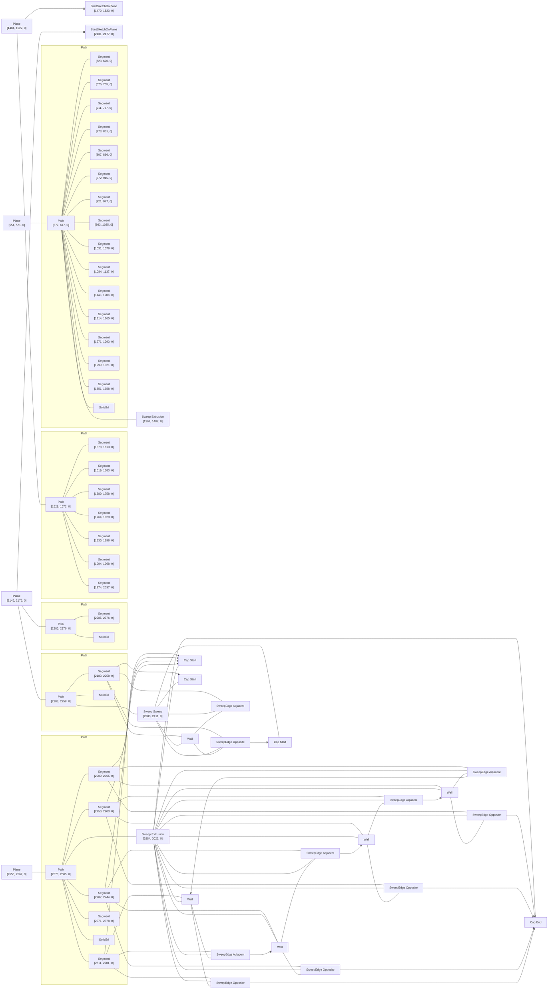

```mermaid
flowchart LR
  subgraph path7 [Path]
    7["Path<br>[577, 617, 0]"]
      %% [ProgramBodyItem { index: 3 }, VariableDeclarationDeclaration, VariableDeclarationInit, PipeBodyItem { index: 1 }]
    12["Segment<br>[623, 670, 0]"]
      %% [ProgramBodyItem { index: 3 }, VariableDeclarationDeclaration, VariableDeclarationInit, PipeBodyItem { index: 2 }]
    13["Segment<br>[676, 705, 0]"]
      %% [ProgramBodyItem { index: 3 }, VariableDeclarationDeclaration, VariableDeclarationInit, PipeBodyItem { index: 3 }]
    14["Segment<br>[711, 767, 0]"]
      %% [ProgramBodyItem { index: 3 }, VariableDeclarationDeclaration, VariableDeclarationInit, PipeBodyItem { index: 4 }]
    15["Segment<br>[773, 801, 0]"]
      %% [ProgramBodyItem { index: 3 }, VariableDeclarationDeclaration, VariableDeclarationInit, PipeBodyItem { index: 5 }]
    16["Segment<br>[807, 866, 0]"]
      %% [ProgramBodyItem { index: 3 }, VariableDeclarationDeclaration, VariableDeclarationInit, PipeBodyItem { index: 6 }]
    17["Segment<br>[872, 915, 0]"]
      %% [ProgramBodyItem { index: 3 }, VariableDeclarationDeclaration, VariableDeclarationInit, PipeBodyItem { index: 7 }]
    18["Segment<br>[921, 977, 0]"]
      %% [ProgramBodyItem { index: 3 }, VariableDeclarationDeclaration, VariableDeclarationInit, PipeBodyItem { index: 8 }]
    19["Segment<br>[983, 1025, 0]"]
      %% [ProgramBodyItem { index: 3 }, VariableDeclarationDeclaration, VariableDeclarationInit, PipeBodyItem { index: 9 }]
    20["Segment<br>[1031, 1078, 0]"]
      %% [ProgramBodyItem { index: 3 }, VariableDeclarationDeclaration, VariableDeclarationInit, PipeBodyItem { index: 10 }]
    21["Segment<br>[1084, 1137, 0]"]
      %% [ProgramBodyItem { index: 3 }, VariableDeclarationDeclaration, VariableDeclarationInit, PipeBodyItem { index: 11 }]
    22["Segment<br>[1143, 1208, 0]"]
      %% [ProgramBodyItem { index: 3 }, VariableDeclarationDeclaration, VariableDeclarationInit, PipeBodyItem { index: 12 }]
    23["Segment<br>[1214, 1265, 0]"]
      %% [ProgramBodyItem { index: 3 }, VariableDeclarationDeclaration, VariableDeclarationInit, PipeBodyItem { index: 13 }]
    24["Segment<br>[1271, 1293, 0]"]
      %% [ProgramBodyItem { index: 3 }, VariableDeclarationDeclaration, VariableDeclarationInit, PipeBodyItem { index: 14 }]
    25["Segment<br>[1299, 1321, 0]"]
      %% [ProgramBodyItem { index: 3 }, VariableDeclarationDeclaration, VariableDeclarationInit, PipeBodyItem { index: 15 }]
    26["Segment<br>[1351, 1358, 0]"]
      %% [ProgramBodyItem { index: 3 }, VariableDeclarationDeclaration, VariableDeclarationInit, PipeBodyItem { index: 17 }]
    44[Solid2d]
  end
  subgraph path8 [Path]
    8["Path<br>[1529, 1572, 0]"]
      %% [ProgramBodyItem { index: 4 }, VariableDeclarationDeclaration, VariableDeclarationInit, PipeBodyItem { index: 1 }]
    27["Segment<br>[1578, 1613, 0]"]
      %% [ProgramBodyItem { index: 4 }, VariableDeclarationDeclaration, VariableDeclarationInit, PipeBodyItem { index: 2 }]
    28["Segment<br>[1619, 1683, 0]"]
      %% [ProgramBodyItem { index: 4 }, VariableDeclarationDeclaration, VariableDeclarationInit, PipeBodyItem { index: 3 }]
    29["Segment<br>[1689, 1758, 0]"]
      %% [ProgramBodyItem { index: 4 }, VariableDeclarationDeclaration, VariableDeclarationInit, PipeBodyItem { index: 4 }]
    30["Segment<br>[1764, 1829, 0]"]
      %% [ProgramBodyItem { index: 4 }, VariableDeclarationDeclaration, VariableDeclarationInit, PipeBodyItem { index: 5 }]
    31["Segment<br>[1835, 1898, 0]"]
      %% [ProgramBodyItem { index: 4 }, VariableDeclarationDeclaration, VariableDeclarationInit, PipeBodyItem { index: 6 }]
    32["Segment<br>[1904, 1968, 0]"]
      %% [ProgramBodyItem { index: 4 }, VariableDeclarationDeclaration, VariableDeclarationInit, PipeBodyItem { index: 7 }]
    33["Segment<br>[1974, 2037, 0]"]
      %% [ProgramBodyItem { index: 4 }, VariableDeclarationDeclaration, VariableDeclarationInit, PipeBodyItem { index: 8 }]
  end
  subgraph path9 [Path]
    9["Path<br>[2183, 2258, 0]"]
      %% [ProgramBodyItem { index: 5 }, VariableDeclarationDeclaration, VariableDeclarationInit, PipeBodyItem { index: 1 }]
    34["Segment<br>[2183, 2258, 0]"]
      %% [ProgramBodyItem { index: 5 }, VariableDeclarationDeclaration, VariableDeclarationInit, PipeBodyItem { index: 1 }]
    43[Solid2d]
  end
  subgraph path10 [Path]
    10["Path<br>[2285, 2376, 0]"]
      %% [ProgramBodyItem { index: 5 }, VariableDeclarationDeclaration, VariableDeclarationInit, PipeBodyItem { index: 2 }, CallKwArg { index: 0 }]
    35["Segment<br>[2285, 2376, 0]"]
      %% [ProgramBodyItem { index: 5 }, VariableDeclarationDeclaration, VariableDeclarationInit, PipeBodyItem { index: 2 }, CallKwArg { index: 0 }]
    41[Solid2d]
  end
  subgraph path11 [Path]
    11["Path<br>[2573, 2605, 0]"]
      %% [ProgramBodyItem { index: 6 }, VariableDeclarationDeclaration, VariableDeclarationInit, PipeBodyItem { index: 1 }]
    36["Segment<br>[2611, 2701, 0]"]
      %% [ProgramBodyItem { index: 6 }, VariableDeclarationDeclaration, VariableDeclarationInit, PipeBodyItem { index: 2 }]
    37["Segment<br>[2707, 2744, 0]"]
      %% [ProgramBodyItem { index: 6 }, VariableDeclarationDeclaration, VariableDeclarationInit, PipeBodyItem { index: 3 }]
    38["Segment<br>[2750, 2903, 0]"]
      %% [ProgramBodyItem { index: 6 }, VariableDeclarationDeclaration, VariableDeclarationInit, PipeBodyItem { index: 4 }]
    39["Segment<br>[2909, 2965, 0]"]
      %% [ProgramBodyItem { index: 6 }, VariableDeclarationDeclaration, VariableDeclarationInit, PipeBodyItem { index: 5 }]
    40["Segment<br>[2971, 2978, 0]"]
      %% [ProgramBodyItem { index: 6 }, VariableDeclarationDeclaration, VariableDeclarationInit, PipeBodyItem { index: 6 }]
    42[Solid2d]
  end
  1["Plane<br>[554, 571, 0]"]
    %% [ProgramBodyItem { index: 3 }, VariableDeclarationDeclaration, VariableDeclarationInit, PipeBodyItem { index: 0 }]
  2["Plane<br>[1484, 1522, 0]"]
    %% [ProgramBodyItem { index: 4 }, VariableDeclarationDeclaration, VariableDeclarationInit, PipeBodyItem { index: 0 }, CallKwUnlabeledArg]
  3["Plane<br>[2145, 2176, 0]"]
    %% [ProgramBodyItem { index: 5 }, VariableDeclarationDeclaration, VariableDeclarationInit, PipeBodyItem { index: 0 }, CallKwUnlabeledArg]
  4["Plane<br>[2550, 2567, 0]"]
    %% [ProgramBodyItem { index: 6 }, VariableDeclarationDeclaration, VariableDeclarationInit, PipeBodyItem { index: 0 }]
  5["StartSketchOnPlane<br>[1470, 1523, 0]"]
    %% Missing NodePath
  6["StartSketchOnPlane<br>[2131, 2177, 0]"]
    %% Missing NodePath
  45["Sweep Extrusion<br>[1364, 1402, 0]"]
    %% [ProgramBodyItem { index: 3 }, VariableDeclarationDeclaration, VariableDeclarationInit, PipeBodyItem { index: 18 }]
  46["Sweep Sweep<br>[2383, 2411, 0]"]
    %% [ProgramBodyItem { index: 5 }, VariableDeclarationDeclaration, VariableDeclarationInit, PipeBodyItem { index: 3 }]
  47["Sweep Extrusion<br>[2984, 3022, 0]"]
    %% [ProgramBodyItem { index: 6 }, VariableDeclarationDeclaration, VariableDeclarationInit, PipeBodyItem { index: 7 }]
  48[Wall]
  49[Wall]
  50[Wall]
  51[Wall]
  52[Wall]
  53["Cap Start"]
  54["Cap Start"]
  55["Cap Start"]
  56["Cap End"]
  57["SweepEdge Opposite"]
  58["SweepEdge Opposite"]
  59["SweepEdge Opposite"]
  60["SweepEdge Opposite"]
  61["SweepEdge Opposite"]
  62["SweepEdge Adjacent"]
  63["SweepEdge Adjacent"]
  64["SweepEdge Adjacent"]
  65["SweepEdge Adjacent"]
  66["SweepEdge Adjacent"]
  1 --- 7
  2 <--x 5
  2 --- 8
  3 <--x 6
  3 --- 9
  3 --- 10
  4 --- 11
  7 --- 12
  7 --- 13
  7 --- 14
  7 --- 15
  7 --- 16
  7 --- 17
  7 --- 18
  7 --- 19
  7 --- 20
  7 --- 21
  7 --- 22
  7 --- 23
  7 --- 24
  7 --- 25
  7 --- 26
  7 --- 44
  7 ---- 45
  8 --- 27
  8 --- 28
  8 --- 29
  8 --- 30
  8 --- 31
  8 --- 32
  8 --- 33
  9 --- 34
  9 --- 43
  9 ---- 46
  10 --- 35
  10 --- 41
  11 --- 36
  11 --- 37
  11 --- 38
  11 --- 39
  11 --- 40
  11 --- 42
  11 ---- 47
  34 --- 48
  34 x--> 55
  34 --- 57
  34 --- 62
  36 --- 49
  36 x--> 53
  36 --- 61
  36 --- 66
  37 --- 50
  37 x--> 53
  37 --- 60
  37 --- 65
  38 --- 51
  38 x--> 53
  38 --- 59
  38 --- 64
  39 --- 52
  39 x--> 53
  39 --- 58
  39 --- 63
  46 --- 48
  46 --- 54
  46 --- 55
  46 --- 57
  46 --- 62
  47 --- 49
  47 --- 50
  47 --- 51
  47 --- 52
  47 --- 53
  47 --- 56
  47 --- 58
  47 --- 59
  47 --- 60
  47 --- 61
  47 --- 63
  47 --- 64
  47 --- 65
  47 --- 66
  48 --- 57
  48 --- 62
  49 --- 61
  63 <--x 49
  49 --- 66
  50 --- 60
  50 --- 65
  66 <--x 50
  51 --- 59
  51 --- 64
  65 <--x 51
  52 --- 58
  52 --- 63
  64 <--x 52
  57 <--x 54
  58 <--x 56
  59 <--x 56
  60 <--x 56
  61 <--x 56
```
