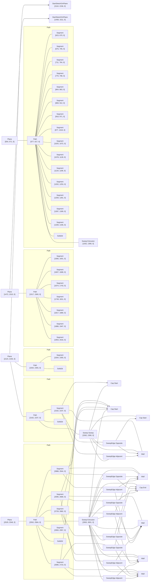

```mermaid
flowchart LR
  subgraph path7 [Path]
    7["Path<br>[577, 617, 0]"]
    12["Segment<br>[623, 670, 0]"]
    13["Segment<br>[676, 705, 0]"]
    14["Segment<br>[711, 764, 0]"]
    15["Segment<br>[770, 798, 0]"]
    16["Segment<br>[804, 863, 0]"]
    17["Segment<br>[869, 912, 0]"]
    18["Segment<br>[918, 971, 0]"]
    19["Segment<br>[977, 1019, 0]"]
    20["Segment<br>[1025, 1072, 0]"]
    21["Segment<br>[1078, 1128, 0]"]
    22["Segment<br>[1134, 1196, 0]"]
    23["Segment<br>[1202, 1253, 0]"]
    24["Segment<br>[1259, 1281, 0]"]
    25["Segment<br>[1287, 1309, 0]"]
    26["Segment<br>[1339, 1346, 0]"]
    43[Solid2d]
  end
  subgraph path8 [Path]
    8["Path<br>[1517, 1560, 0]"]
    27["Segment<br>[1566, 1601, 0]"]
    28["Segment<br>[1607, 1668, 0]"]
    29["Segment<br>[1674, 1743, 0]"]
    30["Segment<br>[1749, 1811, 0]"]
    31["Segment<br>[1817, 1880, 0]"]
    32["Segment<br>[1886, 1947, 0]"]
    33["Segment<br>[1953, 2016, 0]"]
  end
  subgraph path9 [Path]
    9["Path<br>[2162, 2237, 0]"]
    34["Segment<br>[2162, 2237, 0]"]
    41[Solid2d]
  end
  subgraph path10 [Path]
    10["Path<br>[2264, 2355, 0]"]
    35["Segment<br>[2264, 2355, 0]"]
    44[Solid2d]
  end
  subgraph path11 [Path]
    11["Path<br>[2552, 2584, 0]"]
    36["Segment<br>[2590, 2680, 0]"]
    37["Segment<br>[2686, 2723, 0]"]
    38["Segment<br>[2729, 2882, 0]"]
    39["Segment<br>[2888, 2944, 0]"]
    40["Segment<br>[2950, 2957, 0]"]
    42[Solid2d]
  end
  1["Plane<br>[554, 571, 0]"]
  2["Plane<br>[1472, 1510, 0]"]
  3["Plane<br>[2124, 2155, 0]"]
  4["Plane<br>[2529, 2546, 0]"]
  5["StartSketchOnPlane<br>[2110, 2156, 0]"]
  6["StartSketchOnPlane<br>[1458, 1511, 0]"]
  45["Sweep Extrusion<br>[1352, 1390, 0]"]
  46["Sweep Sweep<br>[2362, 2390, 0]"]
  47["Sweep Extrusion<br>[2963, 3001, 0]"]
  48[Wall]
  49[Wall]
  50[Wall]
  51[Wall]
  52[Wall]
  53["Cap Start"]
  54["Cap Start"]
  55["Cap Start"]
  56["Cap End"]
  57["SweepEdge Opposite"]
  58["SweepEdge Opposite"]
  59["SweepEdge Opposite"]
  60["SweepEdge Opposite"]
  61["SweepEdge Opposite"]
  62["SweepEdge Adjacent"]
  63["SweepEdge Adjacent"]
  64["SweepEdge Adjacent"]
  65["SweepEdge Adjacent"]
  66["SweepEdge Adjacent"]
  1 --- 7
  2 <--x 6
  2 --- 8
  3 <--x 5
  3 --- 9
  3 --- 10
  4 --- 11
  7 --- 12
  7 --- 13
  7 --- 14
  7 --- 15
  7 --- 16
  7 --- 17
  7 --- 18
  7 --- 19
  7 --- 20
  7 --- 21
  7 --- 22
  7 --- 23
  7 --- 24
  7 --- 25
  7 --- 26
  7 --- 43
  7 ---- 45
  8 --- 27
  8 --- 28
  8 --- 29
  8 --- 30
  8 --- 31
  8 --- 32
  8 --- 33
  9 --- 34
  9 --- 41
  9 ---- 46
  10 --- 35
  10 --- 44
  11 --- 36
  11 --- 37
  11 --- 38
  11 --- 39
  11 --- 40
  11 --- 42
  11 ---- 47
  34 --- 48
  34 x--> 53
  34 --- 57
  34 --- 62
  36 --- 52
  36 x--> 55
  36 --- 61
  36 --- 64
  37 --- 50
  37 x--> 55
  37 --- 60
  37 --- 65
  38 --- 49
  38 x--> 55
  38 --- 58
  38 --- 63
  39 --- 51
  39 x--> 55
  39 --- 59
  39 --- 66
  46 --- 48
  46 --- 53
  46 --- 54
  46 --- 57
  46 --- 62
  47 --- 49
  47 --- 50
  47 --- 51
  47 --- 52
  47 --- 55
  47 --- 56
  47 --- 58
  47 --- 59
  47 --- 60
  47 --- 61
  47 --- 63
  47 --- 64
  47 --- 65
  47 --- 66
  57 <--x 48
  62 <--x 48
  58 <--x 49
  63 <--x 49
  65 <--x 49
  60 <--x 50
  64 <--x 50
  65 <--x 50
  59 <--x 51
  63 <--x 51
  66 <--x 51
  61 <--x 52
  64 <--x 52
  66 <--x 52
  57 <--x 54
  58 <--x 56
  59 <--x 56
  60 <--x 56
  61 <--x 56
```
