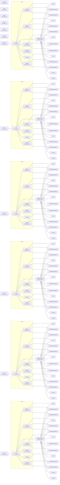

```mermaid
flowchart LR
  subgraph path13 [Path]
    13["Path<br>[778, 818, 0]"]
    14["Segment<br>[824, 871, 0]"]
    15["Segment<br>[877, 977, 0]"]
    16["Segment<br>[983, 1103, 0]"]
    17["Segment<br>[1109, 1165, 0]"]
    18["Segment<br>[1171, 1178, 0]"]
    19[Solid2d]
  end
  subgraph path35 [Path]
    35["Path<br>[778, 818, 0]"]
    36["Segment<br>[824, 871, 0]"]
    37["Segment<br>[877, 977, 0]"]
    38["Segment<br>[983, 1103, 0]"]
    39["Segment<br>[1109, 1165, 0]"]
    40["Segment<br>[1171, 1178, 0]"]
    41[Solid2d]
  end
  subgraph path57 [Path]
    57["Path<br>[778, 818, 0]"]
    58["Segment<br>[824, 871, 0]"]
    59["Segment<br>[877, 977, 0]"]
    60["Segment<br>[983, 1103, 0]"]
    61["Segment<br>[1109, 1165, 0]"]
    62["Segment<br>[1171, 1178, 0]"]
    63[Solid2d]
  end
  subgraph path79 [Path]
    79["Path<br>[778, 818, 0]"]
    80["Segment<br>[824, 871, 0]"]
    81["Segment<br>[877, 977, 0]"]
    82["Segment<br>[983, 1103, 0]"]
    83["Segment<br>[1109, 1165, 0]"]
    84["Segment<br>[1171, 1178, 0]"]
    85[Solid2d]
  end
  subgraph path101 [Path]
    101["Path<br>[778, 818, 0]"]
    102["Segment<br>[824, 871, 0]"]
    103["Segment<br>[877, 977, 0]"]
    104["Segment<br>[983, 1103, 0]"]
    105["Segment<br>[1109, 1165, 0]"]
    106["Segment<br>[1171, 1178, 0]"]
    107[Solid2d]
  end
  subgraph path123 [Path]
    123["Path<br>[778, 818, 0]"]
    124["Segment<br>[824, 871, 0]"]
    125["Segment<br>[877, 977, 0]"]
    126["Segment<br>[983, 1103, 0]"]
    127["Segment<br>[1109, 1165, 0]"]
    128["Segment<br>[1171, 1178, 0]"]
    129[Solid2d]
  end
  1["Plane<br>[350, 386, 0]"]
  2["Plane<br>[350, 386, 0]"]
  3["Plane<br>[350, 386, 0]"]
  4["Plane<br>[350, 386, 0]"]
  5["Plane<br>[350, 386, 0]"]
  6["Plane<br>[350, 386, 0]"]
  7["Plane<br>[350, 386, 0]"]
  8["Plane<br>[401, 438, 0]"]
  9["Plane<br>[452, 489, 0]"]
  10["Plane<br>[504, 542, 0]"]
  11["Plane<br>[554, 606, 0]"]
  12["Plane<br>[619, 656, 0]"]
  20["Sweep Extrusion<br>[1184, 1218, 0]"]
  21[Wall]
  22[Wall]
  23[Wall]
  24[Wall]
  25["Cap Start"]
  26["Cap End"]
  27["SweepEdge Opposite"]
  28["SweepEdge Adjacent"]
  29["SweepEdge Opposite"]
  30["SweepEdge Adjacent"]
  31["SweepEdge Opposite"]
  32["SweepEdge Adjacent"]
  33["SweepEdge Opposite"]
  34["SweepEdge Adjacent"]
  42["Sweep Extrusion<br>[1184, 1218, 0]"]
  43[Wall]
  44[Wall]
  45[Wall]
  46[Wall]
  47["Cap Start"]
  48["Cap End"]
  49["SweepEdge Opposite"]
  50["SweepEdge Adjacent"]
  51["SweepEdge Opposite"]
  52["SweepEdge Adjacent"]
  53["SweepEdge Opposite"]
  54["SweepEdge Adjacent"]
  55["SweepEdge Opposite"]
  56["SweepEdge Adjacent"]
  64["Sweep Extrusion<br>[1184, 1218, 0]"]
  65[Wall]
  66[Wall]
  67[Wall]
  68[Wall]
  69["Cap Start"]
  70["Cap End"]
  71["SweepEdge Opposite"]
  72["SweepEdge Adjacent"]
  73["SweepEdge Opposite"]
  74["SweepEdge Adjacent"]
  75["SweepEdge Opposite"]
  76["SweepEdge Adjacent"]
  77["SweepEdge Opposite"]
  78["SweepEdge Adjacent"]
  86["Sweep Extrusion<br>[1184, 1218, 0]"]
  87[Wall]
  88[Wall]
  89[Wall]
  90[Wall]
  91["Cap Start"]
  92["Cap End"]
  93["SweepEdge Opposite"]
  94["SweepEdge Adjacent"]
  95["SweepEdge Opposite"]
  96["SweepEdge Adjacent"]
  97["SweepEdge Opposite"]
  98["SweepEdge Adjacent"]
  99["SweepEdge Opposite"]
  100["SweepEdge Adjacent"]
  108["Sweep Extrusion<br>[1184, 1218, 0]"]
  109[Wall]
  110[Wall]
  111[Wall]
  112[Wall]
  113["Cap Start"]
  114["Cap End"]
  115["SweepEdge Opposite"]
  116["SweepEdge Adjacent"]
  117["SweepEdge Opposite"]
  118["SweepEdge Adjacent"]
  119["SweepEdge Opposite"]
  120["SweepEdge Adjacent"]
  121["SweepEdge Opposite"]
  122["SweepEdge Adjacent"]
  130["Sweep Extrusion<br>[1184, 1218, 0]"]
  131[Wall]
  132[Wall]
  133[Wall]
  134[Wall]
  135["Cap Start"]
  136["Cap End"]
  137["SweepEdge Opposite"]
  138["SweepEdge Adjacent"]
  139["SweepEdge Opposite"]
  140["SweepEdge Adjacent"]
  141["SweepEdge Opposite"]
  142["SweepEdge Adjacent"]
  143["SweepEdge Opposite"]
  144["SweepEdge Adjacent"]
  7 --- 13
  8 --- 35
  9 --- 57
  10 --- 123
  11 --- 79
  12 --- 101
  13 --- 14
  13 --- 15
  13 --- 16
  13 --- 17
  13 --- 18
  13 ---- 20
  13 --- 19
  14 --- 24
  14 --- 33
  14 --- 34
  15 --- 23
  15 --- 31
  15 --- 32
  16 --- 22
  16 --- 29
  16 --- 30
  17 --- 21
  17 --- 27
  17 --- 28
  20 --- 21
  20 --- 22
  20 --- 23
  20 --- 24
  20 --- 25
  20 --- 26
  20 --- 27
  20 --- 28
  20 --- 29
  20 --- 30
  20 --- 31
  20 --- 32
  20 --- 33
  20 --- 34
  35 --- 36
  35 --- 37
  35 --- 38
  35 --- 39
  35 --- 40
  35 ---- 42
  35 --- 41
  36 --- 46
  36 --- 55
  36 --- 56
  37 --- 45
  37 --- 53
  37 --- 54
  38 --- 44
  38 --- 51
  38 --- 52
  39 --- 43
  39 --- 49
  39 --- 50
  42 --- 43
  42 --- 44
  42 --- 45
  42 --- 46
  42 --- 47
  42 --- 48
  42 --- 49
  42 --- 50
  42 --- 51
  42 --- 52
  42 --- 53
  42 --- 54
  42 --- 55
  42 --- 56
  57 --- 58
  57 --- 59
  57 --- 60
  57 --- 61
  57 --- 62
  57 ---- 64
  57 --- 63
  58 --- 68
  58 --- 77
  58 --- 78
  59 --- 67
  59 --- 75
  59 --- 76
  60 --- 66
  60 --- 73
  60 --- 74
  61 --- 65
  61 --- 71
  61 --- 72
  64 --- 65
  64 --- 66
  64 --- 67
  64 --- 68
  64 --- 69
  64 --- 70
  64 --- 71
  64 --- 72
  64 --- 73
  64 --- 74
  64 --- 75
  64 --- 76
  64 --- 77
  64 --- 78
  79 --- 80
  79 --- 81
  79 --- 82
  79 --- 83
  79 --- 84
  79 ---- 86
  79 --- 85
  80 --- 90
  80 --- 99
  80 --- 100
  81 --- 89
  81 --- 97
  81 --- 98
  82 --- 88
  82 --- 95
  82 --- 96
  83 --- 87
  83 --- 93
  83 --- 94
  86 --- 87
  86 --- 88
  86 --- 89
  86 --- 90
  86 --- 91
  86 --- 92
  86 --- 93
  86 --- 94
  86 --- 95
  86 --- 96
  86 --- 97
  86 --- 98
  86 --- 99
  86 --- 100
  101 --- 102
  101 --- 103
  101 --- 104
  101 --- 105
  101 --- 106
  101 ---- 108
  101 --- 107
  102 --- 112
  102 --- 121
  102 --- 122
  103 --- 111
  103 --- 119
  103 --- 120
  104 --- 110
  104 --- 117
  104 --- 118
  105 --- 109
  105 --- 115
  105 --- 116
  108 --- 109
  108 --- 110
  108 --- 111
  108 --- 112
  108 --- 113
  108 --- 114
  108 --- 115
  108 --- 116
  108 --- 117
  108 --- 118
  108 --- 119
  108 --- 120
  108 --- 121
  108 --- 122
  123 --- 124
  123 --- 125
  123 --- 126
  123 --- 127
  123 --- 128
  123 ---- 130
  123 --- 129
  124 --- 134
  124 --- 143
  124 --- 144
  125 --- 133
  125 --- 141
  125 --- 142
  126 --- 132
  126 --- 139
  126 --- 140
  127 --- 131
  127 --- 137
  127 --- 138
  130 --- 131
  130 --- 132
  130 --- 133
  130 --- 134
  130 --- 135
  130 --- 136
  130 --- 137
  130 --- 138
  130 --- 139
  130 --- 140
  130 --- 141
  130 --- 142
  130 --- 143
  130 --- 144
```
