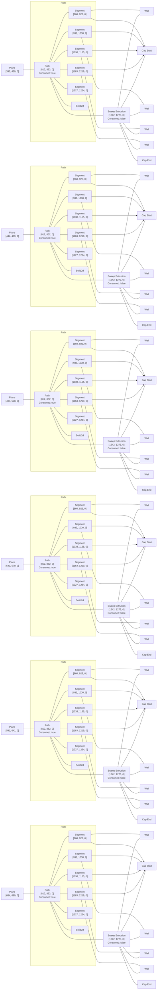

```mermaid
flowchart LR
  subgraph path7 [Path]
    7["Path<br>[812, 852, 0]<br>Consumed: true"]
      %% [ProgramBodyItem { index: 11 }, VariableDeclarationDeclaration, VariableDeclarationInit, FunctionExpressionBody, FunctionExpressionBodyItem { index: 0 }, ReturnStatementArg, PipeBodyItem { index: 1 }]
    8["Segment<br>[860, 925, 0]"]
      %% [ProgramBodyItem { index: 11 }, VariableDeclarationDeclaration, VariableDeclarationInit, FunctionExpressionBody, FunctionExpressionBodyItem { index: 0 }, ReturnStatementArg, PipeBodyItem { index: 2 }]
    9["Segment<br>[933, 1030, 0]"]
      %% [ProgramBodyItem { index: 11 }, VariableDeclarationDeclaration, VariableDeclarationInit, FunctionExpressionBody, FunctionExpressionBodyItem { index: 0 }, ReturnStatementArg, PipeBodyItem { index: 3 }]
    10["Segment<br>[1038, 1155, 0]"]
      %% [ProgramBodyItem { index: 11 }, VariableDeclarationDeclaration, VariableDeclarationInit, FunctionExpressionBody, FunctionExpressionBodyItem { index: 0 }, ReturnStatementArg, PipeBodyItem { index: 4 }]
    11["Segment<br>[1163, 1219, 0]"]
      %% [ProgramBodyItem { index: 11 }, VariableDeclarationDeclaration, VariableDeclarationInit, FunctionExpressionBody, FunctionExpressionBodyItem { index: 0 }, ReturnStatementArg, PipeBodyItem { index: 5 }]
    12["Segment<br>[1227, 1234, 0]"]
      %% [ProgramBodyItem { index: 11 }, VariableDeclarationDeclaration, VariableDeclarationInit, FunctionExpressionBody, FunctionExpressionBodyItem { index: 0 }, ReturnStatementArg, PipeBodyItem { index: 6 }]
    13[Solid2d]
  end
  subgraph path21 [Path]
    21["Path<br>[812, 852, 0]<br>Consumed: true"]
      %% [ProgramBodyItem { index: 11 }, VariableDeclarationDeclaration, VariableDeclarationInit, FunctionExpressionBody, FunctionExpressionBodyItem { index: 0 }, ReturnStatementArg, PipeBodyItem { index: 1 }]
    22["Segment<br>[860, 925, 0]"]
      %% [ProgramBodyItem { index: 11 }, VariableDeclarationDeclaration, VariableDeclarationInit, FunctionExpressionBody, FunctionExpressionBodyItem { index: 0 }, ReturnStatementArg, PipeBodyItem { index: 2 }]
    23["Segment<br>[933, 1030, 0]"]
      %% [ProgramBodyItem { index: 11 }, VariableDeclarationDeclaration, VariableDeclarationInit, FunctionExpressionBody, FunctionExpressionBodyItem { index: 0 }, ReturnStatementArg, PipeBodyItem { index: 3 }]
    24["Segment<br>[1038, 1155, 0]"]
      %% [ProgramBodyItem { index: 11 }, VariableDeclarationDeclaration, VariableDeclarationInit, FunctionExpressionBody, FunctionExpressionBodyItem { index: 0 }, ReturnStatementArg, PipeBodyItem { index: 4 }]
    25["Segment<br>[1163, 1219, 0]"]
      %% [ProgramBodyItem { index: 11 }, VariableDeclarationDeclaration, VariableDeclarationInit, FunctionExpressionBody, FunctionExpressionBodyItem { index: 0 }, ReturnStatementArg, PipeBodyItem { index: 5 }]
    26["Segment<br>[1227, 1234, 0]"]
      %% [ProgramBodyItem { index: 11 }, VariableDeclarationDeclaration, VariableDeclarationInit, FunctionExpressionBody, FunctionExpressionBodyItem { index: 0 }, ReturnStatementArg, PipeBodyItem { index: 6 }]
    27[Solid2d]
  end
  subgraph path35 [Path]
    35["Path<br>[812, 852, 0]<br>Consumed: true"]
      %% [ProgramBodyItem { index: 11 }, VariableDeclarationDeclaration, VariableDeclarationInit, FunctionExpressionBody, FunctionExpressionBodyItem { index: 0 }, ReturnStatementArg, PipeBodyItem { index: 1 }]
    36["Segment<br>[860, 925, 0]"]
      %% [ProgramBodyItem { index: 11 }, VariableDeclarationDeclaration, VariableDeclarationInit, FunctionExpressionBody, FunctionExpressionBodyItem { index: 0 }, ReturnStatementArg, PipeBodyItem { index: 2 }]
    37["Segment<br>[933, 1030, 0]"]
      %% [ProgramBodyItem { index: 11 }, VariableDeclarationDeclaration, VariableDeclarationInit, FunctionExpressionBody, FunctionExpressionBodyItem { index: 0 }, ReturnStatementArg, PipeBodyItem { index: 3 }]
    38["Segment<br>[1038, 1155, 0]"]
      %% [ProgramBodyItem { index: 11 }, VariableDeclarationDeclaration, VariableDeclarationInit, FunctionExpressionBody, FunctionExpressionBodyItem { index: 0 }, ReturnStatementArg, PipeBodyItem { index: 4 }]
    39["Segment<br>[1163, 1219, 0]"]
      %% [ProgramBodyItem { index: 11 }, VariableDeclarationDeclaration, VariableDeclarationInit, FunctionExpressionBody, FunctionExpressionBodyItem { index: 0 }, ReturnStatementArg, PipeBodyItem { index: 5 }]
    40["Segment<br>[1227, 1234, 0]"]
      %% [ProgramBodyItem { index: 11 }, VariableDeclarationDeclaration, VariableDeclarationInit, FunctionExpressionBody, FunctionExpressionBodyItem { index: 0 }, ReturnStatementArg, PipeBodyItem { index: 6 }]
    41[Solid2d]
  end
  subgraph path49 [Path]
    49["Path<br>[812, 852, 0]<br>Consumed: true"]
      %% [ProgramBodyItem { index: 11 }, VariableDeclarationDeclaration, VariableDeclarationInit, FunctionExpressionBody, FunctionExpressionBodyItem { index: 0 }, ReturnStatementArg, PipeBodyItem { index: 1 }]
    50["Segment<br>[860, 925, 0]"]
      %% [ProgramBodyItem { index: 11 }, VariableDeclarationDeclaration, VariableDeclarationInit, FunctionExpressionBody, FunctionExpressionBodyItem { index: 0 }, ReturnStatementArg, PipeBodyItem { index: 2 }]
    51["Segment<br>[933, 1030, 0]"]
      %% [ProgramBodyItem { index: 11 }, VariableDeclarationDeclaration, VariableDeclarationInit, FunctionExpressionBody, FunctionExpressionBodyItem { index: 0 }, ReturnStatementArg, PipeBodyItem { index: 3 }]
    52["Segment<br>[1038, 1155, 0]"]
      %% [ProgramBodyItem { index: 11 }, VariableDeclarationDeclaration, VariableDeclarationInit, FunctionExpressionBody, FunctionExpressionBodyItem { index: 0 }, ReturnStatementArg, PipeBodyItem { index: 4 }]
    53["Segment<br>[1163, 1219, 0]"]
      %% [ProgramBodyItem { index: 11 }, VariableDeclarationDeclaration, VariableDeclarationInit, FunctionExpressionBody, FunctionExpressionBodyItem { index: 0 }, ReturnStatementArg, PipeBodyItem { index: 5 }]
    54["Segment<br>[1227, 1234, 0]"]
      %% [ProgramBodyItem { index: 11 }, VariableDeclarationDeclaration, VariableDeclarationInit, FunctionExpressionBody, FunctionExpressionBodyItem { index: 0 }, ReturnStatementArg, PipeBodyItem { index: 6 }]
    55[Solid2d]
  end
  subgraph path63 [Path]
    63["Path<br>[812, 852, 0]<br>Consumed: true"]
      %% [ProgramBodyItem { index: 11 }, VariableDeclarationDeclaration, VariableDeclarationInit, FunctionExpressionBody, FunctionExpressionBodyItem { index: 0 }, ReturnStatementArg, PipeBodyItem { index: 1 }]
    64["Segment<br>[860, 925, 0]"]
      %% [ProgramBodyItem { index: 11 }, VariableDeclarationDeclaration, VariableDeclarationInit, FunctionExpressionBody, FunctionExpressionBodyItem { index: 0 }, ReturnStatementArg, PipeBodyItem { index: 2 }]
    65["Segment<br>[933, 1030, 0]"]
      %% [ProgramBodyItem { index: 11 }, VariableDeclarationDeclaration, VariableDeclarationInit, FunctionExpressionBody, FunctionExpressionBodyItem { index: 0 }, ReturnStatementArg, PipeBodyItem { index: 3 }]
    66["Segment<br>[1038, 1155, 0]"]
      %% [ProgramBodyItem { index: 11 }, VariableDeclarationDeclaration, VariableDeclarationInit, FunctionExpressionBody, FunctionExpressionBodyItem { index: 0 }, ReturnStatementArg, PipeBodyItem { index: 4 }]
    67["Segment<br>[1163, 1219, 0]"]
      %% [ProgramBodyItem { index: 11 }, VariableDeclarationDeclaration, VariableDeclarationInit, FunctionExpressionBody, FunctionExpressionBodyItem { index: 0 }, ReturnStatementArg, PipeBodyItem { index: 5 }]
    68["Segment<br>[1227, 1234, 0]"]
      %% [ProgramBodyItem { index: 11 }, VariableDeclarationDeclaration, VariableDeclarationInit, FunctionExpressionBody, FunctionExpressionBodyItem { index: 0 }, ReturnStatementArg, PipeBodyItem { index: 6 }]
    69[Solid2d]
  end
  subgraph path77 [Path]
    77["Path<br>[812, 852, 0]<br>Consumed: true"]
      %% [ProgramBodyItem { index: 11 }, VariableDeclarationDeclaration, VariableDeclarationInit, FunctionExpressionBody, FunctionExpressionBodyItem { index: 0 }, ReturnStatementArg, PipeBodyItem { index: 1 }]
    78["Segment<br>[860, 925, 0]"]
      %% [ProgramBodyItem { index: 11 }, VariableDeclarationDeclaration, VariableDeclarationInit, FunctionExpressionBody, FunctionExpressionBodyItem { index: 0 }, ReturnStatementArg, PipeBodyItem { index: 2 }]
    79["Segment<br>[933, 1030, 0]"]
      %% [ProgramBodyItem { index: 11 }, VariableDeclarationDeclaration, VariableDeclarationInit, FunctionExpressionBody, FunctionExpressionBodyItem { index: 0 }, ReturnStatementArg, PipeBodyItem { index: 3 }]
    80["Segment<br>[1038, 1155, 0]"]
      %% [ProgramBodyItem { index: 11 }, VariableDeclarationDeclaration, VariableDeclarationInit, FunctionExpressionBody, FunctionExpressionBodyItem { index: 0 }, ReturnStatementArg, PipeBodyItem { index: 4 }]
    81["Segment<br>[1163, 1219, 0]"]
      %% [ProgramBodyItem { index: 11 }, VariableDeclarationDeclaration, VariableDeclarationInit, FunctionExpressionBody, FunctionExpressionBodyItem { index: 0 }, ReturnStatementArg, PipeBodyItem { index: 5 }]
    82["Segment<br>[1227, 1234, 0]"]
      %% [ProgramBodyItem { index: 11 }, VariableDeclarationDeclaration, VariableDeclarationInit, FunctionExpressionBody, FunctionExpressionBodyItem { index: 0 }, ReturnStatementArg, PipeBodyItem { index: 6 }]
    83[Solid2d]
  end
  1["Plane<br>[395, 429, 0]"]
    %% [ProgramBodyItem { index: 5 }, VariableDeclarationDeclaration, VariableDeclarationInit]
  2["Plane<br>[444, 479, 0]"]
    %% [ProgramBodyItem { index: 6 }, VariableDeclarationDeclaration, VariableDeclarationInit]
  3["Plane<br>[493, 528, 0]"]
    %% [ProgramBodyItem { index: 7 }, VariableDeclarationDeclaration, VariableDeclarationInit]
  4["Plane<br>[543, 579, 0]"]
    %% [ProgramBodyItem { index: 8 }, VariableDeclarationDeclaration, VariableDeclarationInit]
  5["Plane<br>[591, 641, 0]"]
    %% [ProgramBodyItem { index: 9 }, VariableDeclarationDeclaration, VariableDeclarationInit]
  6["Plane<br>[654, 689, 0]"]
    %% [ProgramBodyItem { index: 10 }, VariableDeclarationDeclaration, VariableDeclarationInit]
  14["Sweep Extrusion<br>[1242, 1273, 0]<br>Consumed: false"]
    %% [ProgramBodyItem { index: 11 }, VariableDeclarationDeclaration, VariableDeclarationInit, FunctionExpressionBody, FunctionExpressionBodyItem { index: 0 }, ReturnStatementArg, PipeBodyItem { index: 7 }]
  15[Wall]
    %% face_code_ref=Missing NodePath
  16[Wall]
    %% face_code_ref=Missing NodePath
  17[Wall]
    %% face_code_ref=Missing NodePath
  18[Wall]
    %% face_code_ref=Missing NodePath
  19["Cap Start"]
    %% face_code_ref=Missing NodePath
  20["Cap End"]
    %% face_code_ref=Missing NodePath
  28["Sweep Extrusion<br>[1242, 1273, 0]<br>Consumed: false"]
    %% [ProgramBodyItem { index: 11 }, VariableDeclarationDeclaration, VariableDeclarationInit, FunctionExpressionBody, FunctionExpressionBodyItem { index: 0 }, ReturnStatementArg, PipeBodyItem { index: 7 }]
  29[Wall]
    %% face_code_ref=Missing NodePath
  30[Wall]
    %% face_code_ref=Missing NodePath
  31[Wall]
    %% face_code_ref=Missing NodePath
  32[Wall]
    %% face_code_ref=Missing NodePath
  33["Cap Start"]
    %% face_code_ref=Missing NodePath
  34["Cap End"]
    %% face_code_ref=Missing NodePath
  42["Sweep Extrusion<br>[1242, 1273, 0]<br>Consumed: false"]
    %% [ProgramBodyItem { index: 11 }, VariableDeclarationDeclaration, VariableDeclarationInit, FunctionExpressionBody, FunctionExpressionBodyItem { index: 0 }, ReturnStatementArg, PipeBodyItem { index: 7 }]
  43[Wall]
    %% face_code_ref=Missing NodePath
  44[Wall]
    %% face_code_ref=Missing NodePath
  45[Wall]
    %% face_code_ref=Missing NodePath
  46[Wall]
    %% face_code_ref=Missing NodePath
  47["Cap Start"]
    %% face_code_ref=Missing NodePath
  48["Cap End"]
    %% face_code_ref=Missing NodePath
  56["Sweep Extrusion<br>[1242, 1273, 0]<br>Consumed: false"]
    %% [ProgramBodyItem { index: 11 }, VariableDeclarationDeclaration, VariableDeclarationInit, FunctionExpressionBody, FunctionExpressionBodyItem { index: 0 }, ReturnStatementArg, PipeBodyItem { index: 7 }]
  57[Wall]
    %% face_code_ref=Missing NodePath
  58[Wall]
    %% face_code_ref=Missing NodePath
  59[Wall]
    %% face_code_ref=Missing NodePath
  60[Wall]
    %% face_code_ref=Missing NodePath
  61["Cap Start"]
    %% face_code_ref=Missing NodePath
  62["Cap End"]
    %% face_code_ref=Missing NodePath
  70["Sweep Extrusion<br>[1242, 1273, 0]<br>Consumed: false"]
    %% [ProgramBodyItem { index: 11 }, VariableDeclarationDeclaration, VariableDeclarationInit, FunctionExpressionBody, FunctionExpressionBodyItem { index: 0 }, ReturnStatementArg, PipeBodyItem { index: 7 }]
  71[Wall]
    %% face_code_ref=Missing NodePath
  72[Wall]
    %% face_code_ref=Missing NodePath
  73[Wall]
    %% face_code_ref=Missing NodePath
  74[Wall]
    %% face_code_ref=Missing NodePath
  75["Cap Start"]
    %% face_code_ref=Missing NodePath
  76["Cap End"]
    %% face_code_ref=Missing NodePath
  84["Sweep Extrusion<br>[1242, 1273, 0]<br>Consumed: false"]
    %% [ProgramBodyItem { index: 11 }, VariableDeclarationDeclaration, VariableDeclarationInit, FunctionExpressionBody, FunctionExpressionBodyItem { index: 0 }, ReturnStatementArg, PipeBodyItem { index: 7 }]
  85[Wall]
    %% face_code_ref=Missing NodePath
  86[Wall]
    %% face_code_ref=Missing NodePath
  87[Wall]
    %% face_code_ref=Missing NodePath
  88[Wall]
    %% face_code_ref=Missing NodePath
  89["Cap Start"]
    %% face_code_ref=Missing NodePath
  90["Cap End"]
    %% face_code_ref=Missing NodePath
  1 --- 7
  2 --- 21
  3 --- 35
  4 --- 77
  5 --- 49
  6 --- 63
  7 --- 8
  7 --- 9
  7 --- 10
  7 --- 11
  7 --- 12
  7 --- 13
  7 ---- 14
  8 --- 18
  8 x--> 19
  9 --- 17
  9 x--> 19
  10 --- 16
  10 x--> 19
  11 --- 15
  11 x--> 19
  14 --- 15
  14 --- 16
  14 --- 17
  14 --- 18
  14 --- 19
  14 --- 20
  21 --- 22
  21 --- 23
  21 --- 24
  21 --- 25
  21 --- 26
  21 --- 27
  21 ---- 28
  22 --- 32
  22 x--> 33
  23 --- 31
  23 x--> 33
  24 --- 30
  24 x--> 33
  25 --- 29
  25 x--> 33
  28 --- 29
  28 --- 30
  28 --- 31
  28 --- 32
  28 --- 33
  28 --- 34
  35 --- 36
  35 --- 37
  35 --- 38
  35 --- 39
  35 --- 40
  35 --- 41
  35 ---- 42
  36 --- 46
  36 x--> 47
  37 --- 45
  37 x--> 47
  38 --- 44
  38 x--> 47
  39 --- 43
  39 x--> 47
  42 --- 43
  42 --- 44
  42 --- 45
  42 --- 46
  42 --- 47
  42 --- 48
  49 --- 50
  49 --- 51
  49 --- 52
  49 --- 53
  49 --- 54
  49 --- 55
  49 ---- 56
  50 --- 60
  50 x--> 61
  51 --- 59
  51 x--> 61
  52 --- 58
  52 x--> 61
  53 --- 57
  53 x--> 61
  56 --- 57
  56 --- 58
  56 --- 59
  56 --- 60
  56 --- 61
  56 --- 62
  63 --- 64
  63 --- 65
  63 --- 66
  63 --- 67
  63 --- 68
  63 --- 69
  63 ---- 70
  64 --- 74
  64 x--> 75
  65 --- 73
  65 x--> 75
  66 --- 72
  66 x--> 75
  67 --- 71
  67 x--> 75
  70 --- 71
  70 --- 72
  70 --- 73
  70 --- 74
  70 --- 75
  70 --- 76
  77 --- 78
  77 --- 79
  77 --- 80
  77 --- 81
  77 --- 82
  77 --- 83
  77 ---- 84
  78 --- 88
  78 x--> 89
  79 --- 87
  79 x--> 89
  80 --- 86
  80 x--> 89
  81 --- 85
  81 x--> 89
  84 --- 85
  84 --- 86
  84 --- 87
  84 --- 88
  84 --- 89
  84 --- 90
```
