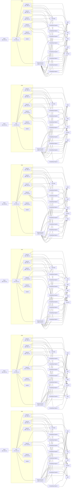

```mermaid
flowchart LR
  subgraph path7 [Path]
    7["Path<br>[773, 813, 0]"]
    17["Segment<br>[821, 886, 0]"]
    24["Segment<br>[894, 991, 0]"]
    28["Segment<br>[999, 1116, 0]"]
    33["Segment<br>[1124, 1180, 0]"]
    37["Segment<br>[1188, 1195, 0]"]
    43[Solid2d]
  end
  subgraph path8 [Path]
    8["Path<br>[773, 813, 0]"]
    14["Segment<br>[821, 886, 0]"]
    22["Segment<br>[894, 991, 0]"]
    25["Segment<br>[999, 1116, 0]"]
    34["Segment<br>[1124, 1180, 0]"]
    39["Segment<br>[1188, 1195, 0]"]
    44[Solid2d]
  end
  subgraph path9 [Path]
    9["Path<br>[773, 813, 0]"]
    16["Segment<br>[821, 886, 0]"]
    21["Segment<br>[894, 991, 0]"]
    27["Segment<br>[999, 1116, 0]"]
    31["Segment<br>[1124, 1180, 0]"]
    41["Segment<br>[1188, 1195, 0]"]
    45[Solid2d]
  end
  subgraph path10 [Path]
    10["Path<br>[773, 813, 0]"]
    13["Segment<br>[821, 886, 0]"]
    19["Segment<br>[894, 991, 0]"]
    30["Segment<br>[999, 1116, 0]"]
    32["Segment<br>[1124, 1180, 0]"]
    42["Segment<br>[1188, 1195, 0]"]
    46[Solid2d]
  end
  subgraph path11 [Path]
    11["Path<br>[773, 813, 0]"]
    15["Segment<br>[821, 886, 0]"]
    23["Segment<br>[894, 991, 0]"]
    26["Segment<br>[999, 1116, 0]"]
    36["Segment<br>[1124, 1180, 0]"]
    38["Segment<br>[1188, 1195, 0]"]
    47[Solid2d]
  end
  subgraph path12 [Path]
    12["Path<br>[773, 813, 0]"]
    18["Segment<br>[821, 886, 0]"]
    20["Segment<br>[894, 991, 0]"]
    29["Segment<br>[999, 1116, 0]"]
    35["Segment<br>[1124, 1180, 0]"]
    40["Segment<br>[1188, 1195, 0]"]
    48[Solid2d]
  end
  1["Plane<br>[356, 390, 0]"]
  2["Plane<br>[405, 440, 0]"]
  3["Plane<br>[454, 489, 0]"]
  4["Plane<br>[504, 540, 0]"]
  5["Plane<br>[552, 602, 0]"]
  6["Plane<br>[615, 650, 0]"]
  49["Sweep Extrusion<br>[1203, 1234, 0]"]
  50["Sweep Extrusion<br>[1203, 1234, 0]"]
  51["Sweep Extrusion<br>[1203, 1234, 0]"]
  52["Sweep Extrusion<br>[1203, 1234, 0]"]
  53["Sweep Extrusion<br>[1203, 1234, 0]"]
  54["Sweep Extrusion<br>[1203, 1234, 0]"]
  55[Wall]
  56[Wall]
  57[Wall]
  58[Wall]
  59[Wall]
  60[Wall]
  61[Wall]
  62[Wall]
  63[Wall]
  64[Wall]
  65[Wall]
  66[Wall]
  67[Wall]
  68[Wall]
  69[Wall]
  70[Wall]
  71[Wall]
  72[Wall]
  73[Wall]
  74[Wall]
  75[Wall]
  76[Wall]
  77[Wall]
  78[Wall]
  79["Cap Start"]
  80["Cap Start"]
  81["Cap Start"]
  82["Cap Start"]
  83["Cap Start"]
  84["Cap Start"]
  85["Cap End"]
  86["Cap End"]
  87["Cap End"]
  88["Cap End"]
  89["Cap End"]
  90["Cap End"]
  91["SweepEdge Opposite"]
  92["SweepEdge Adjacent"]
  93["SweepEdge Opposite"]
  94["SweepEdge Adjacent"]
  95["SweepEdge Opposite"]
  96["SweepEdge Adjacent"]
  97["SweepEdge Opposite"]
  98["SweepEdge Adjacent"]
  99["SweepEdge Opposite"]
  100["SweepEdge Adjacent"]
  101["SweepEdge Opposite"]
  102["SweepEdge Adjacent"]
  103["SweepEdge Opposite"]
  104["SweepEdge Adjacent"]
  105["SweepEdge Opposite"]
  106["SweepEdge Adjacent"]
  107["SweepEdge Opposite"]
  108["SweepEdge Adjacent"]
  109["SweepEdge Opposite"]
  110["SweepEdge Adjacent"]
  111["SweepEdge Opposite"]
  112["SweepEdge Adjacent"]
  113["SweepEdge Opposite"]
  114["SweepEdge Adjacent"]
  115["SweepEdge Opposite"]
  116["SweepEdge Adjacent"]
  117["SweepEdge Opposite"]
  118["SweepEdge Adjacent"]
  119["SweepEdge Opposite"]
  120["SweepEdge Adjacent"]
  121["SweepEdge Opposite"]
  122["SweepEdge Adjacent"]
  123["SweepEdge Opposite"]
  124["SweepEdge Adjacent"]
  125["SweepEdge Opposite"]
  126["SweepEdge Adjacent"]
  127["SweepEdge Opposite"]
  128["SweepEdge Adjacent"]
  129["SweepEdge Opposite"]
  130["SweepEdge Adjacent"]
  131["SweepEdge Opposite"]
  132["SweepEdge Adjacent"]
  133["SweepEdge Opposite"]
  134["SweepEdge Adjacent"]
  135["SweepEdge Opposite"]
  136["SweepEdge Adjacent"]
  137["SweepEdge Opposite"]
  138["SweepEdge Adjacent"]
  1 --- 7
  2 --- 12
  3 --- 10
  4 --- 9
  5 --- 8
  6 --- 11
  7 --- 17
  7 --- 24
  7 --- 28
  7 --- 33
  7 --- 37
  7 --- 43
  7 ---- 52
  8 --- 14
  8 --- 22
  8 --- 25
  8 --- 34
  8 --- 39
  8 --- 44
  8 ---- 51
  9 --- 16
  9 --- 21
  9 --- 27
  9 --- 31
  9 --- 41
  9 --- 45
  9 ---- 49
  10 --- 13
  10 --- 19
  10 --- 30
  10 --- 32
  10 --- 42
  10 --- 46
  10 ---- 54
  11 --- 15
  11 --- 23
  11 --- 26
  11 --- 36
  11 --- 38
  11 --- 47
  11 ---- 50
  12 --- 18
  12 --- 20
  12 --- 29
  12 --- 35
  12 --- 40
  12 --- 48
  12 ---- 53
  13 --- 76
  13 x--> 84
  13 --- 133
  13 --- 134
  14 --- 64
  14 x--> 81
  14 --- 109
  14 --- 110
  15 --- 60
  15 x--> 80
  15 --- 101
  15 --- 102
  16 --- 57
  16 x--> 79
  16 --- 95
  16 --- 96
  17 --- 69
  17 x--> 82
  17 --- 119
  17 --- 120
  18 --- 72
  18 x--> 83
  18 --- 125
  18 --- 126
  19 --- 75
  19 x--> 84
  19 --- 131
  19 --- 132
  20 --- 71
  20 x--> 83
  20 --- 123
  20 --- 124
  21 --- 58
  21 x--> 79
  21 --- 97
  21 --- 98
  22 --- 65
  22 x--> 81
  22 --- 111
  22 --- 112
  23 --- 61
  23 x--> 80
  23 --- 103
  23 --- 104
  24 --- 70
  24 x--> 82
  24 --- 121
  24 --- 122
  25 --- 63
  25 x--> 81
  25 --- 107
  25 --- 108
  26 --- 59
  26 x--> 80
  26 --- 99
  26 --- 100
  27 --- 56
  27 x--> 79
  27 --- 93
  27 --- 94
  28 --- 67
  28 x--> 82
  28 --- 115
  28 --- 116
  29 --- 73
  29 x--> 83
  29 --- 127
  29 --- 128
  30 --- 78
  30 x--> 84
  30 --- 137
  30 --- 138
  31 --- 55
  31 x--> 79
  31 --- 91
  31 --- 92
  32 --- 77
  32 x--> 84
  32 --- 135
  32 --- 136
  33 --- 68
  33 x--> 82
  33 --- 117
  33 --- 118
  34 --- 66
  34 x--> 81
  34 --- 113
  34 --- 114
  35 --- 74
  35 x--> 83
  35 --- 129
  35 --- 130
  36 --- 62
  36 x--> 80
  36 --- 105
  36 --- 106
  49 --- 55
  49 --- 56
  49 --- 57
  49 --- 58
  49 --- 79
  49 --- 85
  49 --- 91
  49 --- 92
  49 --- 93
  49 --- 94
  49 --- 95
  49 --- 96
  49 --- 97
  49 --- 98
  50 --- 59
  50 --- 60
  50 --- 61
  50 --- 62
  50 --- 80
  50 --- 86
  50 --- 99
  50 --- 100
  50 --- 101
  50 --- 102
  50 --- 103
  50 --- 104
  50 --- 105
  50 --- 106
  51 --- 63
  51 --- 64
  51 --- 65
  51 --- 66
  51 --- 81
  51 --- 87
  51 --- 107
  51 --- 108
  51 --- 109
  51 --- 110
  51 --- 111
  51 --- 112
  51 --- 113
  51 --- 114
  52 --- 67
  52 --- 68
  52 --- 69
  52 --- 70
  52 --- 82
  52 --- 88
  52 --- 115
  52 --- 116
  52 --- 117
  52 --- 118
  52 --- 119
  52 --- 120
  52 --- 121
  52 --- 122
  53 --- 71
  53 --- 72
  53 --- 73
  53 --- 74
  53 --- 83
  53 --- 89
  53 --- 123
  53 --- 124
  53 --- 125
  53 --- 126
  53 --- 127
  53 --- 128
  53 --- 129
  53 --- 130
  54 --- 75
  54 --- 76
  54 --- 77
  54 --- 78
  54 --- 84
  54 --- 90
  54 --- 131
  54 --- 132
  54 --- 133
  54 --- 134
  54 --- 135
  54 --- 136
  54 --- 137
  54 --- 138
  91 <--x 55
  92 <--x 55
  94 <--x 55
  93 <--x 56
  94 <--x 56
  98 <--x 56
  92 <--x 57
  95 <--x 57
  96 <--x 57
  96 <--x 58
  97 <--x 58
  98 <--x 58
  99 <--x 59
  100 <--x 59
  104 <--x 59
  101 <--x 60
  102 <--x 60
  106 <--x 60
  102 <--x 61
  103 <--x 61
  104 <--x 61
  100 <--x 62
  105 <--x 62
  106 <--x 62
  107 <--x 63
  108 <--x 63
  112 <--x 63
  109 <--x 64
  110 <--x 64
  114 <--x 64
  110 <--x 65
  111 <--x 65
  112 <--x 65
  108 <--x 66
  113 <--x 66
  114 <--x 66
  115 <--x 67
  116 <--x 67
  122 <--x 67
  116 <--x 68
  117 <--x 68
  118 <--x 68
  118 <--x 69
  119 <--x 69
  120 <--x 69
  120 <--x 70
  121 <--x 70
  122 <--x 70
  123 <--x 71
  124 <--x 71
  126 <--x 71
  125 <--x 72
  126 <--x 72
  130 <--x 72
  124 <--x 73
  127 <--x 73
  128 <--x 73
  128 <--x 74
  129 <--x 74
  130 <--x 74
  131 <--x 75
  132 <--x 75
  134 <--x 75
  133 <--x 76
  134 <--x 76
  136 <--x 76
  135 <--x 77
  136 <--x 77
  138 <--x 77
  132 <--x 78
  137 <--x 78
  138 <--x 78
  91 <--x 85
  93 <--x 85
  95 <--x 85
  97 <--x 85
  99 <--x 86
  101 <--x 86
  103 <--x 86
  105 <--x 86
  107 <--x 87
  109 <--x 87
  111 <--x 87
  113 <--x 87
  115 <--x 88
  117 <--x 88
  119 <--x 88
  121 <--x 88
  123 <--x 89
  125 <--x 89
  127 <--x 89
  129 <--x 89
  131 <--x 90
  133 <--x 90
  135 <--x 90
  137 <--x 90
```
