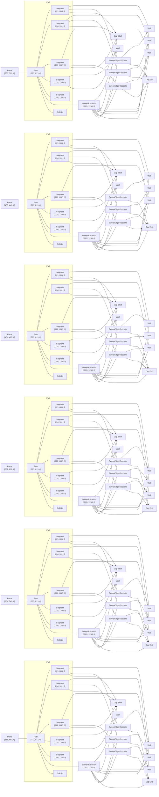

```mermaid
flowchart LR
  subgraph path7 [Path]
    7["Path<br>[773, 813, 0]"]
    8["Segment<br>[821, 886, 0]"]
    9["Segment<br>[894, 991, 0]"]
    10["Segment<br>[999, 1116, 0]"]
    11["Segment<br>[1124, 1180, 0]"]
    12["Segment<br>[1188, 1195, 0]"]
    13[Solid2d]
  end
  subgraph path24 [Path]
    24["Path<br>[773, 813, 0]"]
    25["Segment<br>[821, 886, 0]"]
    26["Segment<br>[894, 991, 0]"]
    27["Segment<br>[999, 1116, 0]"]
    28["Segment<br>[1124, 1180, 0]"]
    29["Segment<br>[1188, 1195, 0]"]
    30[Solid2d]
  end
  subgraph path41 [Path]
    41["Path<br>[773, 813, 0]"]
    42["Segment<br>[821, 886, 0]"]
    43["Segment<br>[894, 991, 0]"]
    44["Segment<br>[999, 1116, 0]"]
    45["Segment<br>[1124, 1180, 0]"]
    46["Segment<br>[1188, 1195, 0]"]
    47[Solid2d]
  end
  subgraph path58 [Path]
    58["Path<br>[773, 813, 0]"]
    59["Segment<br>[821, 886, 0]"]
    60["Segment<br>[894, 991, 0]"]
    61["Segment<br>[999, 1116, 0]"]
    62["Segment<br>[1124, 1180, 0]"]
    63["Segment<br>[1188, 1195, 0]"]
    64[Solid2d]
  end
  subgraph path75 [Path]
    75["Path<br>[773, 813, 0]"]
    76["Segment<br>[821, 886, 0]"]
    77["Segment<br>[894, 991, 0]"]
    78["Segment<br>[999, 1116, 0]"]
    79["Segment<br>[1124, 1180, 0]"]
    80["Segment<br>[1188, 1195, 0]"]
    81[Solid2d]
  end
  subgraph path92 [Path]
    92["Path<br>[773, 813, 0]"]
    93["Segment<br>[821, 886, 0]"]
    94["Segment<br>[894, 991, 0]"]
    95["Segment<br>[999, 1116, 0]"]
    96["Segment<br>[1124, 1180, 0]"]
    97["Segment<br>[1188, 1195, 0]"]
    98[Solid2d]
  end
  1["Plane<br>[356, 390, 0]"]
  2["Plane<br>[405, 440, 0]"]
  3["Plane<br>[454, 489, 0]"]
  4["Plane<br>[504, 540, 0]"]
  5["Plane<br>[552, 602, 0]"]
  6["Plane<br>[615, 650, 0]"]
  14["Sweep Extrusion<br>[1203, 1234, 0]"]
  15[Wall]
  16[Wall]
  17[Wall]
  18[Wall]
  19["Cap Start"]
  20["Cap End"]
  21["SweepEdge Opposite"]
  22["SweepEdge Opposite"]
  23["SweepEdge Opposite"]
  31["Sweep Extrusion<br>[1203, 1234, 0]"]
  32[Wall]
  33[Wall]
  34[Wall]
  35[Wall]
  36["Cap Start"]
  37["Cap End"]
  38["SweepEdge Opposite"]
  39["SweepEdge Opposite"]
  40["SweepEdge Opposite"]
  48["Sweep Extrusion<br>[1203, 1234, 0]"]
  49[Wall]
  50[Wall]
  51[Wall]
  52[Wall]
  53["Cap Start"]
  54["Cap End"]
  55["SweepEdge Opposite"]
  56["SweepEdge Opposite"]
  57["SweepEdge Opposite"]
  65["Sweep Extrusion<br>[1203, 1234, 0]"]
  66[Wall]
  67[Wall]
  68[Wall]
  69[Wall]
  70["Cap Start"]
  71["Cap End"]
  72["SweepEdge Opposite"]
  73["SweepEdge Opposite"]
  74["SweepEdge Opposite"]
  82["Sweep Extrusion<br>[1203, 1234, 0]"]
  83[Wall]
  84[Wall]
  85[Wall]
  86[Wall]
  87["Cap Start"]
  88["Cap End"]
  89["SweepEdge Opposite"]
  90["SweepEdge Opposite"]
  91["SweepEdge Opposite"]
  99["Sweep Extrusion<br>[1203, 1234, 0]"]
  100[Wall]
  101[Wall]
  102[Wall]
  103[Wall]
  104["Cap Start"]
  105["Cap End"]
  106["SweepEdge Opposite"]
  107["SweepEdge Opposite"]
  108["SweepEdge Opposite"]
  1 --- 7
  2 --- 24
  3 --- 41
  4 --- 92
  5 --- 58
  6 --- 75
  7 --- 8
  7 --- 9
  7 --- 10
  7 --- 11
  7 --- 12
  7 ---- 14
  7 --- 13
  8 --- 18
  8 --- 23
  8 x--> 19
  9 --- 17
  9 --- 22
  9 x--> 19
  10 --- 16
  10 --- 21
  10 x--> 19
  11 --- 15
  11 x--> 19
  14 --- 15
  14 --- 16
  14 --- 17
  14 --- 18
  14 --- 19
  14 --- 20
  14 --- 21
  14 --- 22
  14 --- 23
  21 <--x 16
  21 <--x 20
  22 <--x 17
  22 <--x 20
  23 <--x 18
  23 <--x 20
  24 --- 25
  24 --- 26
  24 --- 27
  24 --- 28
  24 --- 29
  24 ---- 31
  24 --- 30
  25 --- 35
  25 --- 40
  25 x--> 36
  26 --- 34
  26 --- 39
  26 x--> 36
  27 --- 33
  27 --- 38
  27 x--> 36
  28 --- 32
  28 x--> 36
  31 --- 32
  31 --- 33
  31 --- 34
  31 --- 35
  31 --- 36
  31 --- 37
  31 --- 38
  31 --- 39
  31 --- 40
  38 <--x 33
  38 <--x 37
  39 <--x 34
  39 <--x 37
  40 <--x 35
  40 <--x 37
  41 --- 42
  41 --- 43
  41 --- 44
  41 --- 45
  41 --- 46
  41 ---- 48
  41 --- 47
  42 --- 52
  42 --- 57
  42 x--> 53
  43 --- 51
  43 --- 56
  43 x--> 53
  44 --- 50
  44 --- 55
  44 x--> 53
  45 --- 49
  45 x--> 53
  48 --- 49
  48 --- 50
  48 --- 51
  48 --- 52
  48 --- 53
  48 --- 54
  48 --- 55
  48 --- 56
  48 --- 57
  55 <--x 50
  55 <--x 54
  56 <--x 51
  56 <--x 54
  57 <--x 52
  57 <--x 54
  58 --- 59
  58 --- 60
  58 --- 61
  58 --- 62
  58 --- 63
  58 ---- 65
  58 --- 64
  59 --- 69
  59 --- 74
  59 x--> 70
  60 --- 68
  60 --- 73
  60 x--> 70
  61 --- 67
  61 --- 72
  61 x--> 70
  62 --- 66
  62 x--> 70
  65 --- 66
  65 --- 67
  65 --- 68
  65 --- 69
  65 --- 70
  65 --- 71
  65 --- 72
  65 --- 73
  65 --- 74
  72 <--x 67
  72 <--x 71
  73 <--x 68
  73 <--x 71
  74 <--x 69
  74 <--x 71
  75 --- 76
  75 --- 77
  75 --- 78
  75 --- 79
  75 --- 80
  75 ---- 82
  75 --- 81
  76 --- 86
  76 --- 91
  76 x--> 87
  77 --- 85
  77 --- 90
  77 x--> 87
  78 --- 84
  78 --- 89
  78 x--> 87
  79 --- 83
  79 x--> 87
  82 --- 83
  82 --- 84
  82 --- 85
  82 --- 86
  82 --- 87
  82 --- 88
  82 --- 89
  82 --- 90
  82 --- 91
  89 <--x 84
  89 <--x 88
  90 <--x 85
  90 <--x 88
  91 <--x 86
  91 <--x 88
  92 --- 93
  92 --- 94
  92 --- 95
  92 --- 96
  92 --- 97
  92 ---- 99
  92 --- 98
  93 --- 103
  93 --- 108
  93 x--> 104
  94 --- 102
  94 --- 107
  94 x--> 104
  95 --- 101
  95 --- 106
  95 x--> 104
  96 --- 100
  96 x--> 104
  99 --- 100
  99 --- 101
  99 --- 102
  99 --- 103
  99 --- 104
  99 --- 105
  99 --- 106
  99 --- 107
  99 --- 108
  106 <--x 101
  106 <--x 105
  107 <--x 102
  107 <--x 105
  108 <--x 103
  108 <--x 105
```
