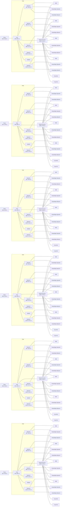

```mermaid
flowchart LR
  subgraph path7 [Path]
    7["Path<br>[769, 809, 0]"]
    8["Segment<br>[817, 882, 0]"]
    9["Segment<br>[890, 987, 0]"]
    10["Segment<br>[995, 1112, 0]"]
    11["Segment<br>[1120, 1176, 0]"]
    12["Segment<br>[1184, 1191, 0]"]
    13[Solid2d]
  end
  subgraph path29 [Path]
    29["Path<br>[769, 809, 0]"]
    30["Segment<br>[817, 882, 0]"]
    31["Segment<br>[890, 987, 0]"]
    32["Segment<br>[995, 1112, 0]"]
    33["Segment<br>[1120, 1176, 0]"]
    34["Segment<br>[1184, 1191, 0]"]
    35[Solid2d]
  end
  subgraph path51 [Path]
    51["Path<br>[769, 809, 0]"]
    52["Segment<br>[817, 882, 0]"]
    53["Segment<br>[890, 987, 0]"]
    54["Segment<br>[995, 1112, 0]"]
    55["Segment<br>[1120, 1176, 0]"]
    56["Segment<br>[1184, 1191, 0]"]
    57[Solid2d]
  end
  subgraph path73 [Path]
    73["Path<br>[769, 809, 0]"]
    74["Segment<br>[817, 882, 0]"]
    75["Segment<br>[890, 987, 0]"]
    76["Segment<br>[995, 1112, 0]"]
    77["Segment<br>[1120, 1176, 0]"]
    78["Segment<br>[1184, 1191, 0]"]
    79[Solid2d]
  end
  subgraph path95 [Path]
    95["Path<br>[769, 809, 0]"]
    96["Segment<br>[817, 882, 0]"]
    97["Segment<br>[890, 987, 0]"]
    98["Segment<br>[995, 1112, 0]"]
    99["Segment<br>[1120, 1176, 0]"]
    100["Segment<br>[1184, 1191, 0]"]
    101[Solid2d]
  end
  subgraph path117 [Path]
    117["Path<br>[769, 809, 0]"]
    118["Segment<br>[817, 882, 0]"]
    119["Segment<br>[890, 987, 0]"]
    120["Segment<br>[995, 1112, 0]"]
    121["Segment<br>[1120, 1176, 0]"]
    122["Segment<br>[1184, 1191, 0]"]
    123[Solid2d]
  end
  1["Plane<br>[352, 386, 0]"]
  2["Plane<br>[401, 436, 0]"]
  3["Plane<br>[450, 485, 0]"]
  4["Plane<br>[500, 536, 0]"]
  5["Plane<br>[548, 598, 0]"]
  6["Plane<br>[611, 646, 0]"]
  14["Sweep Extrusion<br>[1199, 1230, 0]"]
  15[Wall]
  16[Wall]
  17[Wall]
  18[Wall]
  19["Cap Start"]
  20["Cap End"]
  21["SweepEdge Opposite"]
  22["SweepEdge Adjacent"]
  23["SweepEdge Opposite"]
  24["SweepEdge Adjacent"]
  25["SweepEdge Opposite"]
  26["SweepEdge Adjacent"]
  27["SweepEdge Opposite"]
  28["SweepEdge Adjacent"]
  36["Sweep Extrusion<br>[1199, 1230, 0]"]
  37[Wall]
  38[Wall]
  39[Wall]
  40[Wall]
  41["Cap Start"]
  42["Cap End"]
  43["SweepEdge Opposite"]
  44["SweepEdge Adjacent"]
  45["SweepEdge Opposite"]
  46["SweepEdge Adjacent"]
  47["SweepEdge Opposite"]
  48["SweepEdge Adjacent"]
  49["SweepEdge Opposite"]
  50["SweepEdge Adjacent"]
  58["Sweep Extrusion<br>[1199, 1230, 0]"]
  59[Wall]
  60[Wall]
  61[Wall]
  62[Wall]
  63["Cap Start"]
  64["Cap End"]
  65["SweepEdge Opposite"]
  66["SweepEdge Adjacent"]
  67["SweepEdge Opposite"]
  68["SweepEdge Adjacent"]
  69["SweepEdge Opposite"]
  70["SweepEdge Adjacent"]
  71["SweepEdge Opposite"]
  72["SweepEdge Adjacent"]
  80["Sweep Extrusion<br>[1199, 1230, 0]"]
  81[Wall]
  82[Wall]
  83[Wall]
  84[Wall]
  85["Cap Start"]
  86["Cap End"]
  87["SweepEdge Opposite"]
  88["SweepEdge Adjacent"]
  89["SweepEdge Opposite"]
  90["SweepEdge Adjacent"]
  91["SweepEdge Opposite"]
  92["SweepEdge Adjacent"]
  93["SweepEdge Opposite"]
  94["SweepEdge Adjacent"]
  102["Sweep Extrusion<br>[1199, 1230, 0]"]
  103[Wall]
  104[Wall]
  105[Wall]
  106[Wall]
  107["Cap Start"]
  108["Cap End"]
  109["SweepEdge Opposite"]
  110["SweepEdge Adjacent"]
  111["SweepEdge Opposite"]
  112["SweepEdge Adjacent"]
  113["SweepEdge Opposite"]
  114["SweepEdge Adjacent"]
  115["SweepEdge Opposite"]
  116["SweepEdge Adjacent"]
  124["Sweep Extrusion<br>[1199, 1230, 0]"]
  125[Wall]
  126[Wall]
  127[Wall]
  128[Wall]
  129["Cap Start"]
  130["Cap End"]
  131["SweepEdge Opposite"]
  132["SweepEdge Adjacent"]
  133["SweepEdge Opposite"]
  134["SweepEdge Adjacent"]
  135["SweepEdge Opposite"]
  136["SweepEdge Adjacent"]
  137["SweepEdge Opposite"]
  138["SweepEdge Adjacent"]
  1 --- 7
  2 --- 29
  3 --- 51
  4 --- 117
  5 --- 73
  6 --- 95
  7 --- 8
  7 --- 9
  7 --- 10
  7 --- 11
  7 --- 12
  7 ---- 14
  7 --- 13
  8 --- 18
  8 --- 27
  8 --- 28
  9 --- 17
  9 --- 25
  9 --- 26
  10 --- 16
  10 --- 23
  10 --- 24
  11 --- 15
  11 --- 21
  11 --- 22
  14 --- 15
  14 --- 16
  14 --- 17
  14 --- 18
  14 --- 19
  14 --- 20
  14 --- 21
  14 --- 22
  14 --- 23
  14 --- 24
  14 --- 25
  14 --- 26
  14 --- 27
  14 --- 28
  29 --- 30
  29 --- 31
  29 --- 32
  29 --- 33
  29 --- 34
  29 ---- 36
  29 --- 35
  30 --- 40
  30 --- 49
  30 --- 50
  31 --- 39
  31 --- 47
  31 --- 48
  32 --- 38
  32 --- 45
  32 --- 46
  33 --- 37
  33 --- 43
  33 --- 44
  36 --- 37
  36 --- 38
  36 --- 39
  36 --- 40
  36 --- 41
  36 --- 42
  36 --- 43
  36 --- 44
  36 --- 45
  36 --- 46
  36 --- 47
  36 --- 48
  36 --- 49
  36 --- 50
  51 --- 52
  51 --- 53
  51 --- 54
  51 --- 55
  51 --- 56
  51 ---- 58
  51 --- 57
  52 --- 62
  52 --- 71
  52 --- 72
  53 --- 61
  53 --- 69
  53 --- 70
  54 --- 60
  54 --- 67
  54 --- 68
  55 --- 59
  55 --- 65
  55 --- 66
  58 --- 59
  58 --- 60
  58 --- 61
  58 --- 62
  58 --- 63
  58 --- 64
  58 --- 65
  58 --- 66
  58 --- 67
  58 --- 68
  58 --- 69
  58 --- 70
  58 --- 71
  58 --- 72
  73 --- 74
  73 --- 75
  73 --- 76
  73 --- 77
  73 --- 78
  73 ---- 80
  73 --- 79
  74 --- 84
  74 --- 93
  74 --- 94
  75 --- 83
  75 --- 91
  75 --- 92
  76 --- 82
  76 --- 89
  76 --- 90
  77 --- 81
  77 --- 87
  77 --- 88
  80 --- 81
  80 --- 82
  80 --- 83
  80 --- 84
  80 --- 85
  80 --- 86
  80 --- 87
  80 --- 88
  80 --- 89
  80 --- 90
  80 --- 91
  80 --- 92
  80 --- 93
  80 --- 94
  95 --- 96
  95 --- 97
  95 --- 98
  95 --- 99
  95 --- 100
  95 ---- 102
  95 --- 101
  96 --- 106
  96 --- 115
  96 --- 116
  97 --- 105
  97 --- 113
  97 --- 114
  98 --- 104
  98 --- 111
  98 --- 112
  99 --- 103
  99 --- 109
  99 --- 110
  102 --- 103
  102 --- 104
  102 --- 105
  102 --- 106
  102 --- 107
  102 --- 108
  102 --- 109
  102 --- 110
  102 --- 111
  102 --- 112
  102 --- 113
  102 --- 114
  102 --- 115
  102 --- 116
  117 --- 118
  117 --- 119
  117 --- 120
  117 --- 121
  117 --- 122
  117 ---- 124
  117 --- 123
  118 --- 125
  118 --- 131
  118 --- 132
  119 --- 126
  119 --- 133
  119 --- 134
  120 --- 127
  120 --- 135
  120 --- 136
  121 --- 128
  121 --- 137
  121 --- 138
  124 --- 125
  124 --- 126
  124 --- 127
  124 --- 128
  124 --- 129
  124 --- 130
  124 --- 131
  124 --- 132
  124 --- 133
  124 --- 134
  124 --- 135
  124 --- 136
  124 --- 137
  124 --- 138
```
