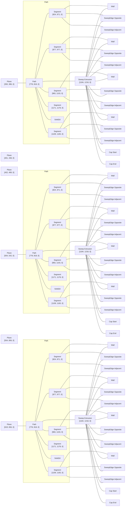

```mermaid
flowchart LR
  subgraph path7 [Path]
    7["Path<br>[778, 818, 0]"]
    8["Segment<br>[824, 871, 0]"]
    9["Segment<br>[877, 977, 0]"]
    10["Segment<br>[983, 1103, 0]"]
    11["Segment<br>[1109, 1165, 0]"]
    12["Segment<br>[1171, 1178, 0]"]
    13[Solid2d]
  end
  subgraph path29 [Path]
    29["Path<br>[778, 818, 0]"]
    30["Segment<br>[824, 871, 0]"]
    31["Segment<br>[877, 977, 0]"]
    32["Segment<br>[983, 1103, 0]"]
    33["Segment<br>[1109, 1165, 0]"]
    34["Segment<br>[1171, 1178, 0]"]
    35[Solid2d]
  end
  subgraph path51 [Path]
    51["Path<br>[778, 818, 0]"]
    52["Segment<br>[824, 871, 0]"]
    53["Segment<br>[877, 977, 0]"]
    54["Segment<br>[983, 1103, 0]"]
    55["Segment<br>[1109, 1165, 0]"]
    56["Segment<br>[1171, 1178, 0]"]
    57[Solid2d]
  end
  1["Plane<br>[350, 386, 0]"]
  2["Plane<br>[401, 438, 0]"]
  3["Plane<br>[452, 489, 0]"]
  4["Plane<br>[504, 542, 0]"]
  5["Plane<br>[554, 606, 0]"]
  6["Plane<br>[619, 656, 0]"]
  14["Sweep Extrusion<br>[1184, 1218, 0]"]
  15[Wall]
  16[Wall]
  17[Wall]
  18[Wall]
  19["Cap Start"]
  20["Cap End"]
  21["SweepEdge Opposite"]
  22["SweepEdge Adjacent"]
  23["SweepEdge Opposite"]
  24["SweepEdge Adjacent"]
  25["SweepEdge Opposite"]
  26["SweepEdge Adjacent"]
  27["SweepEdge Opposite"]
  28["SweepEdge Adjacent"]
  36["Sweep Extrusion<br>[1184, 1218, 0]"]
  37[Wall]
  38[Wall]
  39[Wall]
  40[Wall]
  41["Cap Start"]
  42["Cap End"]
  43["SweepEdge Opposite"]
  44["SweepEdge Adjacent"]
  45["SweepEdge Opposite"]
  46["SweepEdge Adjacent"]
  47["SweepEdge Opposite"]
  48["SweepEdge Adjacent"]
  49["SweepEdge Opposite"]
  50["SweepEdge Adjacent"]
  58["Sweep Extrusion<br>[1184, 1218, 0]"]
  59[Wall]
  60[Wall]
  61[Wall]
  62[Wall]
  63["Cap Start"]
  64["Cap End"]
  65["SweepEdge Opposite"]
  66["SweepEdge Adjacent"]
  67["SweepEdge Opposite"]
  68["SweepEdge Adjacent"]
  69["SweepEdge Opposite"]
  70["SweepEdge Adjacent"]
  71["SweepEdge Opposite"]
  72["SweepEdge Adjacent"]
  1 --- 7
  4 --- 51
  6 --- 29
  7 --- 8
  7 --- 9
  7 --- 10
  7 --- 11
  7 --- 12
  7 ---- 14
  7 --- 13
  8 --- 18
  8 --- 27
  8 --- 28
  9 --- 17
  9 --- 25
  9 --- 26
  10 --- 16
  10 --- 23
  10 --- 24
  11 --- 15
  11 --- 21
  11 --- 22
  14 --- 15
  14 --- 16
  14 --- 17
  14 --- 18
  14 --- 19
  14 --- 20
  14 --- 21
  14 --- 22
  14 --- 23
  14 --- 24
  14 --- 25
  14 --- 26
  14 --- 27
  14 --- 28
  29 --- 30
  29 --- 31
  29 --- 32
  29 --- 33
  29 --- 34
  29 ---- 36
  29 --- 35
  30 --- 40
  30 --- 49
  30 --- 50
  31 --- 39
  31 --- 47
  31 --- 48
  32 --- 38
  32 --- 45
  32 --- 46
  33 --- 37
  33 --- 43
  33 --- 44
  36 --- 37
  36 --- 38
  36 --- 39
  36 --- 40
  36 --- 41
  36 --- 42
  36 --- 43
  36 --- 44
  36 --- 45
  36 --- 46
  36 --- 47
  36 --- 48
  36 --- 49
  36 --- 50
  51 --- 52
  51 --- 53
  51 --- 54
  51 --- 55
  51 --- 56
  51 ---- 58
  51 --- 57
  52 --- 62
  52 --- 71
  52 --- 72
  53 --- 61
  53 --- 69
  53 --- 70
  54 --- 60
  54 --- 67
  54 --- 68
  55 --- 59
  55 --- 65
  55 --- 66
  58 --- 59
  58 --- 60
  58 --- 61
  58 --- 62
  58 --- 63
  58 --- 64
  58 --- 65
  58 --- 66
  58 --- 67
  58 --- 68
  58 --- 69
  58 --- 70
  58 --- 71
  58 --- 72
```
