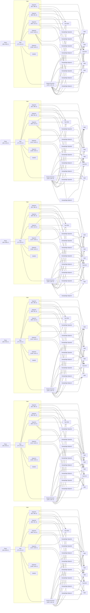

```mermaid
flowchart LR
  subgraph path7 [Path]
    7["Path<br>[773, 813, 0]"]
    16["Segment<br>[821, 886, 0]"]
    21["Segment<br>[894, 991, 0]"]
    25["Segment<br>[999, 1116, 0]"]
    35["Segment<br>[1124, 1180, 0]"]
    40["Segment<br>[1188, 1195, 0]"]
    43[Solid2d]
  end
  subgraph path8 [Path]
    8["Path<br>[773, 813, 0]"]
    15["Segment<br>[821, 886, 0]"]
    19["Segment<br>[894, 991, 0]"]
    30["Segment<br>[999, 1116, 0]"]
    31["Segment<br>[1124, 1180, 0]"]
    41["Segment<br>[1188, 1195, 0]"]
    44[Solid2d]
  end
  subgraph path9 [Path]
    9["Path<br>[773, 813, 0]"]
    18["Segment<br>[821, 886, 0]"]
    23["Segment<br>[894, 991, 0]"]
    26["Segment<br>[999, 1116, 0]"]
    33["Segment<br>[1124, 1180, 0]"]
    37["Segment<br>[1188, 1195, 0]"]
    45[Solid2d]
  end
  subgraph path10 [Path]
    10["Path<br>[773, 813, 0]"]
    14["Segment<br>[821, 886, 0]"]
    24["Segment<br>[894, 991, 0]"]
    28["Segment<br>[999, 1116, 0]"]
    34["Segment<br>[1124, 1180, 0]"]
    38["Segment<br>[1188, 1195, 0]"]
    46[Solid2d]
  end
  subgraph path11 [Path]
    11["Path<br>[773, 813, 0]"]
    13["Segment<br>[821, 886, 0]"]
    22["Segment<br>[894, 991, 0]"]
    27["Segment<br>[999, 1116, 0]"]
    32["Segment<br>[1124, 1180, 0]"]
    39["Segment<br>[1188, 1195, 0]"]
    47[Solid2d]
  end
  subgraph path12 [Path]
    12["Path<br>[773, 813, 0]"]
    17["Segment<br>[821, 886, 0]"]
    20["Segment<br>[894, 991, 0]"]
    29["Segment<br>[999, 1116, 0]"]
    36["Segment<br>[1124, 1180, 0]"]
    42["Segment<br>[1188, 1195, 0]"]
    48[Solid2d]
  end
  1["Plane<br>[356, 390, 0]"]
  2["Plane<br>[405, 440, 0]"]
  3["Plane<br>[454, 489, 0]"]
  4["Plane<br>[504, 540, 0]"]
  5["Plane<br>[552, 602, 0]"]
  6["Plane<br>[615, 650, 0]"]
  49["Sweep Extrusion<br>[1203, 1234, 0]"]
  50["Sweep Extrusion<br>[1203, 1234, 0]"]
  51["Sweep Extrusion<br>[1203, 1234, 0]"]
  52["Sweep Extrusion<br>[1203, 1234, 0]"]
  53["Sweep Extrusion<br>[1203, 1234, 0]"]
  54["Sweep Extrusion<br>[1203, 1234, 0]"]
  55[Wall]
  56[Wall]
  57[Wall]
  58[Wall]
  59[Wall]
  60[Wall]
  61[Wall]
  62[Wall]
  63[Wall]
  64[Wall]
  65[Wall]
  66[Wall]
  67[Wall]
  68[Wall]
  69[Wall]
  70[Wall]
  71[Wall]
  72[Wall]
  73[Wall]
  74[Wall]
  75[Wall]
  76[Wall]
  77[Wall]
  78[Wall]
  79["Cap Start"]
  80["Cap Start"]
  81["Cap Start"]
  82["Cap Start"]
  83["Cap Start"]
  84["Cap Start"]
  85["Cap End"]
  86["Cap End"]
  87["Cap End"]
  88["Cap End"]
  89["Cap End"]
  90["Cap End"]
  91["SweepEdge Opposite"]
  92["SweepEdge Opposite"]
  93["SweepEdge Opposite"]
  94["SweepEdge Opposite"]
  95["SweepEdge Opposite"]
  96["SweepEdge Opposite"]
  97["SweepEdge Opposite"]
  98["SweepEdge Opposite"]
  99["SweepEdge Opposite"]
  100["SweepEdge Opposite"]
  101["SweepEdge Opposite"]
  102["SweepEdge Opposite"]
  103["SweepEdge Opposite"]
  104["SweepEdge Opposite"]
  105["SweepEdge Opposite"]
  106["SweepEdge Opposite"]
  107["SweepEdge Opposite"]
  108["SweepEdge Opposite"]
  109["SweepEdge Opposite"]
  110["SweepEdge Opposite"]
  111["SweepEdge Opposite"]
  112["SweepEdge Opposite"]
  113["SweepEdge Opposite"]
  114["SweepEdge Opposite"]
  115["SweepEdge Adjacent"]
  116["SweepEdge Adjacent"]
  117["SweepEdge Adjacent"]
  118["SweepEdge Adjacent"]
  119["SweepEdge Adjacent"]
  120["SweepEdge Adjacent"]
  121["SweepEdge Adjacent"]
  122["SweepEdge Adjacent"]
  123["SweepEdge Adjacent"]
  124["SweepEdge Adjacent"]
  125["SweepEdge Adjacent"]
  126["SweepEdge Adjacent"]
  127["SweepEdge Adjacent"]
  128["SweepEdge Adjacent"]
  129["SweepEdge Adjacent"]
  130["SweepEdge Adjacent"]
  131["SweepEdge Adjacent"]
  132["SweepEdge Adjacent"]
  133["SweepEdge Adjacent"]
  134["SweepEdge Adjacent"]
  135["SweepEdge Adjacent"]
  136["SweepEdge Adjacent"]
  137["SweepEdge Adjacent"]
  138["SweepEdge Adjacent"]
  1 --- 8
  2 --- 12
  3 --- 10
  4 --- 9
  5 --- 11
  6 --- 7
  7 --- 16
  7 --- 21
  7 --- 25
  7 --- 35
  7 --- 40
  7 --- 43
  7 ---- 49
  8 --- 15
  8 --- 19
  8 --- 30
  8 --- 31
  8 --- 41
  8 --- 44
  8 ---- 50
  9 --- 18
  9 --- 23
  9 --- 26
  9 --- 33
  9 --- 37
  9 --- 45
  9 ---- 54
  10 --- 14
  10 --- 24
  10 --- 28
  10 --- 34
  10 --- 38
  10 --- 46
  10 ---- 51
  11 --- 13
  11 --- 22
  11 --- 27
  11 --- 32
  11 --- 39
  11 --- 47
  11 ---- 52
  12 --- 17
  12 --- 20
  12 --- 29
  12 --- 36
  12 --- 42
  12 --- 48
  12 ---- 53
  13 --- 67
  13 x--> 82
  13 --- 103
  13 --- 129
  14 --- 65
  14 x--> 81
  14 --- 101
  14 --- 124
  15 --- 61
  15 x--> 80
  15 --- 98
  15 --- 122
  16 --- 57
  16 x--> 79
  16 --- 92
  16 --- 118
  17 --- 73
  17 x--> 83
  17 --- 107
  17 --- 131
  18 --- 78
  18 x--> 84
  18 --- 111
  18 --- 135
  19 --- 59
  19 x--> 80
  19 --- 96
  19 --- 121
  20 --- 71
  20 x--> 83
  20 --- 109
  20 --- 133
  21 --- 56
  21 x--> 79
  21 --- 91
  21 --- 115
  22 --- 70
  22 x--> 82
  22 --- 104
  22 --- 130
  23 --- 77
  23 x--> 84
  23 --- 113
  23 --- 137
  24 --- 66
  24 x--> 81
  24 --- 99
  24 --- 125
  25 --- 55
  25 x--> 79
  25 --- 94
  25 --- 117
  26 --- 75
  26 x--> 84
  26 --- 114
  26 --- 138
  27 --- 68
  27 x--> 82
  27 --- 106
  27 --- 127
  28 --- 63
  28 x--> 81
  28 --- 100
  28 --- 123
  29 --- 72
  29 x--> 83
  29 --- 108
  29 --- 132
  30 --- 62
  30 x--> 80
  30 --- 95
  30 --- 120
  31 --- 60
  31 x--> 80
  31 --- 97
  31 --- 119
  32 --- 69
  32 x--> 82
  32 --- 105
  32 --- 128
  33 --- 76
  33 x--> 84
  33 --- 112
  33 --- 136
  34 --- 64
  34 x--> 81
  34 --- 102
  34 --- 126
  35 --- 58
  35 x--> 79
  35 --- 93
  35 --- 116
  36 --- 74
  36 x--> 83
  36 --- 110
  36 --- 134
  49 --- 55
  49 --- 56
  49 --- 57
  49 --- 58
  49 --- 79
  49 --- 85
  49 --- 91
  49 --- 92
  49 --- 93
  49 --- 94
  49 --- 115
  49 --- 116
  49 --- 117
  49 --- 118
  50 --- 59
  50 --- 60
  50 --- 61
  50 --- 62
  50 --- 80
  50 --- 86
  50 --- 95
  50 --- 96
  50 --- 97
  50 --- 98
  50 --- 119
  50 --- 120
  50 --- 121
  50 --- 122
  51 --- 63
  51 --- 64
  51 --- 65
  51 --- 66
  51 --- 81
  51 --- 87
  51 --- 99
  51 --- 100
  51 --- 101
  51 --- 102
  51 --- 123
  51 --- 124
  51 --- 125
  51 --- 126
  52 --- 67
  52 --- 68
  52 --- 69
  52 --- 70
  52 --- 82
  52 --- 88
  52 --- 103
  52 --- 104
  52 --- 105
  52 --- 106
  52 --- 127
  52 --- 128
  52 --- 129
  52 --- 130
  53 --- 71
  53 --- 72
  53 --- 73
  53 --- 74
  53 --- 83
  53 --- 89
  53 --- 107
  53 --- 108
  53 --- 109
  53 --- 110
  53 --- 131
  53 --- 132
  53 --- 133
  53 --- 134
  54 --- 75
  54 --- 76
  54 --- 77
  54 --- 78
  54 --- 84
  54 --- 90
  54 --- 111
  54 --- 112
  54 --- 113
  54 --- 114
  54 --- 135
  54 --- 136
  54 --- 137
  54 --- 138
  94 <--x 55
  115 <--x 55
  117 <--x 55
  91 <--x 56
  115 <--x 56
  118 <--x 56
  92 <--x 57
  116 <--x 57
  118 <--x 57
  93 <--x 58
  116 <--x 58
  117 <--x 58
  96 <--x 59
  121 <--x 59
  122 <--x 59
  97 <--x 60
  119 <--x 60
  120 <--x 60
  98 <--x 61
  119 <--x 61
  122 <--x 61
  95 <--x 62
  120 <--x 62
  121 <--x 62
  100 <--x 63
  123 <--x 63
  125 <--x 63
  102 <--x 64
  123 <--x 64
  126 <--x 64
  101 <--x 65
  124 <--x 65
  126 <--x 65
  99 <--x 66
  124 <--x 66
  125 <--x 66
  103 <--x 67
  128 <--x 67
  129 <--x 67
  106 <--x 68
  127 <--x 68
  130 <--x 68
  105 <--x 69
  127 <--x 69
  128 <--x 69
  104 <--x 70
  129 <--x 70
  130 <--x 70
  109 <--x 71
  131 <--x 71
  133 <--x 71
  108 <--x 72
  132 <--x 72
  133 <--x 72
  107 <--x 73
  131 <--x 73
  134 <--x 73
  110 <--x 74
  132 <--x 74
  134 <--x 74
  114 <--x 75
  137 <--x 75
  138 <--x 75
  112 <--x 76
  136 <--x 76
  138 <--x 76
  113 <--x 77
  135 <--x 77
  137 <--x 77
  111 <--x 78
  135 <--x 78
  136 <--x 78
  91 <--x 85
  92 <--x 85
  93 <--x 85
  94 <--x 85
  95 <--x 86
  96 <--x 86
  97 <--x 86
  98 <--x 86
  99 <--x 87
  100 <--x 87
  101 <--x 87
  102 <--x 87
  103 <--x 88
  104 <--x 88
  105 <--x 88
  106 <--x 88
  107 <--x 89
  108 <--x 89
  109 <--x 89
  110 <--x 89
  111 <--x 90
  112 <--x 90
  113 <--x 90
  114 <--x 90
```
