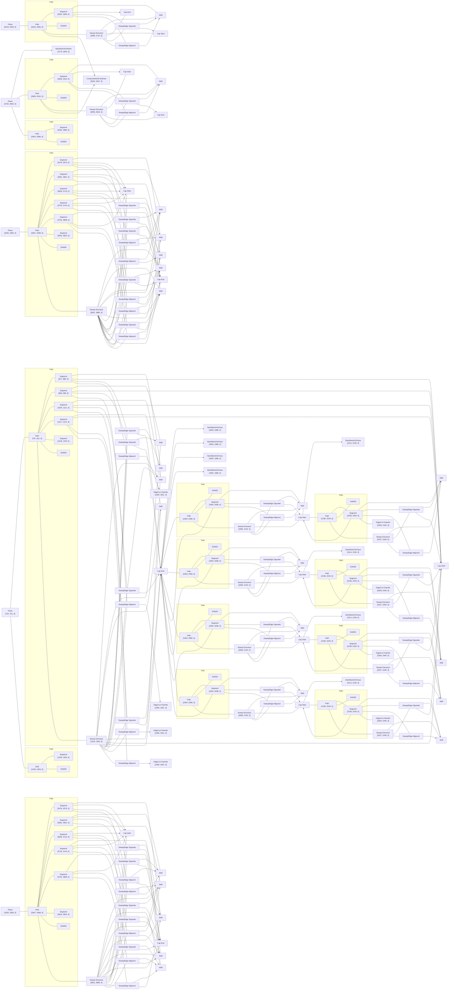

```mermaid
flowchart LR
  subgraph path15 [Path]
    15["Path<br>[757, 811, 0]"]
    30["Segment<br>[817, 889, 0]"]
    31["Segment<br>[895, 998, 0]"]
    32["Segment<br>[1004, 1121, 0]"]
    33["Segment<br>[1127, 1212, 0]"]
    34["Segment<br>[1218, 1225, 0]"]
    64[Solid2d]
  end
  subgraph path16 [Path]
    16["Path<br>[1249, 1304, 0]"]
    35["Segment<br>[1249, 1304, 0]"]
    73[Solid2d]
  end
  subgraph path17 [Path]
    17["Path<br>[1994, 2058, 0]"]
    37["Segment<br>[1994, 2058, 0]"]
    61[Solid2d]
  end
  subgraph path18 [Path]
    18["Path<br>[1994, 2058, 0]"]
    38["Segment<br>[1994, 2058, 0]"]
    62[Solid2d]
  end
  subgraph path19 [Path]
    19["Path<br>[1994, 2058, 0]"]
    36["Segment<br>[1994, 2058, 0]"]
    66[Solid2d]
  end
  subgraph path20 [Path]
    20["Path<br>[1994, 2058, 0]"]
    39["Segment<br>[1994, 2058, 0]"]
    71[Solid2d]
  end
  subgraph path21 [Path]
    21["Path<br>[2158, 2229, 0]"]
    43["Segment<br>[2158, 2229, 0]"]
    60[Solid2d]
  end
  subgraph path22 [Path]
    22["Path<br>[2158, 2229, 0]"]
    42["Segment<br>[2158, 2229, 0]"]
    63[Solid2d]
  end
  subgraph path23 [Path]
    23["Path<br>[2158, 2229, 0]"]
    41["Segment<br>[2158, 2229, 0]"]
    65[Solid2d]
  end
  subgraph path24 [Path]
    24["Path<br>[2158, 2229, 0]"]
    40["Segment<br>[2158, 2229, 0]"]
    67[Solid2d]
  end
  subgraph path25 [Path]
    25["Path<br>[2642, 2683, 0]"]
    44["Segment<br>[2642, 2683, 0]"]
    70[Solid2d]
  end
  subgraph path26 [Path]
    26["Path<br>[2839, 2910, 0]"]
    45["Segment<br>[2839, 2910, 0]"]
    59[Solid2d]
  end
  subgraph path27 [Path]
    27["Path<br>[2934, 2989, 0]"]
    46["Segment<br>[2934, 2989, 0]"]
    69[Solid2d]
  end
  subgraph path28 [Path]
    28["Path<br>[3367, 3468, 0]"]
    48["Segment<br>[3476, 3573, 0]"]
    50["Segment<br>[3581, 3601, 0]"]
    52["Segment<br>[3609, 3715, 0]"]
    53["Segment<br>[3723, 3744, 0]"]
    55["Segment<br>[3752, 3808, 0]"]
    57["Segment<br>[3816, 3823, 0]"]
    68[Solid2d]
  end
  subgraph path29 [Path]
    29["Path<br>[3367, 3468, 0]"]
    47["Segment<br>[3476, 3573, 0]"]
    49["Segment<br>[3581, 3601, 0]"]
    51["Segment<br>[3609, 3715, 0]"]
    54["Segment<br>[3723, 3744, 0]"]
    56["Segment<br>[3752, 3808, 0]"]
    58["Segment<br>[3816, 3823, 0]"]
    72[Solid2d]
  end
  1["Plane<br>[734, 751, 0]"]
  2["Plane<br>[2619, 2636, 0]"]
  3["Plane<br>[2792, 2832, 0]"]
  4["Plane<br>[3335, 3359, 0]"]
  5["Plane<br>[3335, 3359, 0]"]
  6["StartSketchOnPlane<br>[2778, 2833, 0]"]
  7["StartSketchOnFace<br>[2114, 2150, 0]"]
  8["StartSketchOnFace<br>[1950, 1986, 0]"]
  9["StartSketchOnFace<br>[2114, 2150, 0]"]
  10["StartSketchOnFace<br>[2114, 2150, 0]"]
  11["StartSketchOnFace<br>[2114, 2150, 0]"]
  12["StartSketchOnFace<br>[1950, 1986, 0]"]
  13["StartSketchOnFace<br>[1950, 1986, 0]"]
  14["StartSketchOnFace<br>[1950, 1986, 0]"]
  74["Sweep Extrusion<br>[1318, 1363, 0]"]
  75["Sweep Extrusion<br>[2066, 2102, 0]"]
  76["Sweep Extrusion<br>[2066, 2102, 0]"]
  77["Sweep Extrusion<br>[2066, 2102, 0]"]
  78["Sweep Extrusion<br>[2066, 2102, 0]"]
  79["Sweep Extrusion<br>[2237, 2290, 0]"]
  80["Sweep Extrusion<br>[2237, 2290, 0]"]
  81["Sweep Extrusion<br>[2237, 2290, 0]"]
  82["Sweep Extrusion<br>[2237, 2290, 0]"]
  83["Sweep Extrusion<br>[2689, 2710, 0]"]
  84["Sweep Extrusion<br>[2996, 3024, 0]"]
  85["Sweep Extrusion<br>[3831, 3880, 0]"]
  86["Sweep Extrusion<br>[3831, 3880, 0]"]
  87["CompositeSolid Subtract<br>[3030, 3057, 0]"]
  88[Wall]
  89[Wall]
  90[Wall]
  91[Wall]
  92[Wall]
  93[Wall]
  94[Wall]
  95[Wall]
  96[Wall]
  97[Wall]
  98[Wall]
  99[Wall]
  100[Wall]
  101[Wall]
  102[Wall]
  103[Wall]
  104[Wall]
  105[Wall]
  106[Wall]
  107[Wall]
  108[Wall]
  109[Wall]
  110[Wall]
  111[Wall]
  112["Cap Start"]
  113["Cap Start"]
  114["Cap Start"]
  115["Cap Start"]
  116["Cap Start"]
  117["Cap Start"]
  118["Cap Start"]
  119["Cap Start"]
  120["Cap Start"]
  121["Cap End"]
  122["Cap End"]
  123["Cap End"]
  124["Cap End"]
  125["Cap End"]
  126["SweepEdge Opposite"]
  127["SweepEdge Opposite"]
  128["SweepEdge Opposite"]
  129["SweepEdge Opposite"]
  130["SweepEdge Opposite"]
  131["SweepEdge Opposite"]
  132["SweepEdge Opposite"]
  133["SweepEdge Opposite"]
  134["SweepEdge Opposite"]
  135["SweepEdge Opposite"]
  136["SweepEdge Opposite"]
  137["SweepEdge Opposite"]
  138["SweepEdge Opposite"]
  139["SweepEdge Opposite"]
  140["SweepEdge Opposite"]
  141["SweepEdge Opposite"]
  142["SweepEdge Opposite"]
  143["SweepEdge Opposite"]
  144["SweepEdge Opposite"]
  145["SweepEdge Opposite"]
  146["SweepEdge Opposite"]
  147["SweepEdge Opposite"]
  148["SweepEdge Opposite"]
  149["SweepEdge Opposite"]
  150["SweepEdge Adjacent"]
  151["SweepEdge Adjacent"]
  152["SweepEdge Adjacent"]
  153["SweepEdge Adjacent"]
  154["SweepEdge Adjacent"]
  155["SweepEdge Adjacent"]
  156["SweepEdge Adjacent"]
  157["SweepEdge Adjacent"]
  158["SweepEdge Adjacent"]
  159["SweepEdge Adjacent"]
  160["SweepEdge Adjacent"]
  161["SweepEdge Adjacent"]
  162["SweepEdge Adjacent"]
  163["SweepEdge Adjacent"]
  164["SweepEdge Adjacent"]
  165["SweepEdge Adjacent"]
  166["SweepEdge Adjacent"]
  167["SweepEdge Adjacent"]
  168["SweepEdge Adjacent"]
  169["SweepEdge Adjacent"]
  170["SweepEdge Adjacent"]
  171["SweepEdge Adjacent"]
  172["SweepEdge Adjacent"]
  173["SweepEdge Adjacent"]
  174["EdgeCut Chamfer<br>[1369, 1651, 0]"]
  175["EdgeCut Chamfer<br>[1369, 1651, 0]"]
  176["EdgeCut Chamfer<br>[1369, 1651, 0]"]
  177["EdgeCut Chamfer<br>[1369, 1651, 0]"]
  178["EdgeCut Chamfer<br>[2359, 2445, 0]"]
  179["EdgeCut Chamfer<br>[2359, 2445, 0]"]
  180["EdgeCut Chamfer<br>[2359, 2445, 0]"]
  181["EdgeCut Chamfer<br>[2359, 2445, 0]"]
  1 --- 15
  1 --- 16
  2 --- 25
  3 <--x 6
  3 --- 26
  3 --- 27
  4 --- 28
  5 --- 29
  117 x--> 7
  123 x--> 8
  113 x--> 9
  115 x--> 10
  114 x--> 11
  123 x--> 12
  123 x--> 13
  123 x--> 14
  15 --- 30
  15 --- 31
  15 --- 32
  15 --- 33
  15 --- 34
  15 --- 64
  15 ---- 74
  16 --- 35
  16 --- 73
  17 --- 37
  17 --- 61
  17 ---- 78
  123 --- 17
  18 --- 38
  18 --- 62
  18 ---- 76
  123 --- 18
  19 --- 36
  19 --- 66
  19 ---- 77
  123 --- 19
  20 --- 39
  20 --- 71
  20 ---- 75
  123 --- 20
  21 --- 43
  21 --- 60
  21 ---- 79
  114 --- 21
  22 --- 42
  22 --- 63
  22 ---- 82
  113 --- 22
  23 --- 41
  23 --- 65
  23 ---- 80
  117 --- 23
  24 --- 40
  24 --- 67
  24 ---- 81
  115 --- 24
  25 --- 44
  25 --- 70
  25 ---- 83
  25 <--x 87
  26 --- 45
  26 --- 59
  26 ---- 84
  26 <--x 87
  27 --- 46
  27 --- 69
  28 --- 48
  28 --- 50
  28 --- 52
  28 --- 53
  28 --- 55
  28 --- 57
  28 --- 68
  28 ---- 85
  29 --- 47
  29 --- 49
  29 --- 51
  29 --- 54
  29 --- 56
  29 --- 58
  29 --- 72
  29 ---- 86
  30 --- 104
  30 x--> 118
  30 --- 142
  30 --- 164
  31 --- 102
  31 x--> 118
  31 --- 139
  31 --- 165
  32 --- 101
  32 x--> 118
  32 --- 141
  32 --- 163
  33 --- 103
  33 x--> 118
  33 --- 140
  33 --- 166
  36 --- 93
  36 x--> 123
  36 --- 131
  36 --- 155
  37 --- 100
  37 x--> 123
  37 --- 138
  37 --- 162
  38 --- 92
  38 x--> 123
  38 --- 130
  38 --- 154
  39 --- 91
  39 x--> 123
  39 --- 129
  39 --- 153
  40 --- 99
  40 x--> 115
  40 --- 137
  40 --- 161
  40 --- 180
  41 --- 89
  41 x--> 117
  41 --- 127
  41 --- 151
  41 --- 181
  42 --- 111
  42 x--> 113
  42 --- 149
  42 --- 173
  42 --- 178
  43 --- 88
  43 x--> 114
  43 --- 126
  43 --- 150
  43 --- 179
  44 --- 90
  44 x--> 121
  44 --- 128
  44 --- 152
  45 --- 110
  45 x--> 120
  45 --- 148
  45 --- 172
  47 --- 108
  47 x--> 119
  47 --- 143
  47 --- 167
  48 --- 96
  48 x--> 116
  48 --- 135
  48 --- 159
  49 --- 107
  49 x--> 119
  49 --- 144
  49 --- 168
  50 --- 97
  50 x--> 116
  50 --- 133
  50 --- 158
  51 --- 105
  51 x--> 119
  51 --- 147
  51 --- 170
  52 --- 98
  52 x--> 116
  52 --- 132
  52 --- 160
  53 --- 94
  53 x--> 116
  53 --- 134
  53 --- 157
  54 --- 109
  54 x--> 119
  54 --- 146
  54 --- 171
  55 --- 95
  55 x--> 116
  55 --- 136
  55 --- 156
  56 --- 106
  56 x--> 119
  56 --- 145
  56 --- 169
  74 --- 101
  74 --- 102
  74 --- 103
  74 --- 104
  74 --- 118
  74 --- 123
  74 --- 139
  74 --- 140
  74 --- 141
  74 --- 142
  74 --- 163
  74 --- 164
  74 --- 165
  74 --- 166
  75 --- 91
  75 --- 113
  75 --- 129
  75 --- 153
  76 --- 92
  76 --- 114
  76 --- 130
  76 --- 154
  77 --- 93
  77 --- 115
  77 --- 131
  77 --- 155
  78 --- 100
  78 --- 117
  78 --- 138
  78 --- 162
  79 --- 88
  79 --- 126
  79 --- 150
  80 --- 89
  80 --- 127
  80 --- 151
  81 --- 99
  81 --- 137
  81 --- 161
  82 --- 111
  82 --- 149
  82 --- 173
  83 --- 90
  83 --- 112
  83 --- 121
  83 --- 128
  83 --- 152
  84 --- 110
  84 --- 120
  84 --- 125
  84 --- 148
  84 --- 172
  85 --- 94
  85 --- 95
  85 --- 96
  85 --- 97
  85 --- 98
  85 --- 116
  85 --- 122
  85 --- 132
  85 --- 133
  85 --- 134
  85 --- 135
  85 --- 136
  85 --- 156
  85 --- 157
  85 --- 158
  85 --- 159
  85 --- 160
  86 --- 105
  86 --- 106
  86 --- 107
  86 --- 108
  86 --- 109
  86 --- 119
  86 --- 124
  86 --- 143
  86 --- 144
  86 --- 145
  86 --- 146
  86 --- 147
  86 --- 167
  86 --- 168
  86 --- 169
  86 --- 170
  86 --- 171
  126 <--x 88
  150 <--x 88
  127 <--x 89
  151 <--x 89
  128 <--x 90
  152 <--x 90
  129 <--x 91
  153 <--x 91
  130 <--x 92
  154 <--x 92
  131 <--x 93
  155 <--x 93
  134 <--x 94
  157 <--x 94
  160 <--x 94
  136 <--x 95
  156 <--x 95
  157 <--x 95
  135 <--x 96
  156 <--x 96
  159 <--x 96
  133 <--x 97
  158 <--x 97
  159 <--x 97
  132 <--x 98
  158 <--x 98
  160 <--x 98
  137 <--x 99
  161 <--x 99
  138 <--x 100
  162 <--x 100
  141 <--x 101
  139 <--x 102
  140 <--x 103
  142 <--x 104
  147 <--x 105
  168 <--x 105
  170 <--x 105
  145 <--x 106
  169 <--x 106
  171 <--x 106
  144 <--x 107
  167 <--x 107
  168 <--x 107
  143 <--x 108
  167 <--x 108
  169 <--x 108
  146 <--x 109
  170 <--x 109
  171 <--x 109
  148 <--x 110
  172 <--x 110
  149 <--x 111
  173 <--x 111
  128 <--x 112
  129 <--x 113
  130 <--x 114
  131 <--x 115
  138 <--x 117
  126 <--x 118
  127 <--x 118
  137 <--x 118
  149 <--x 118
  132 <--x 122
  133 <--x 122
  134 <--x 122
  135 <--x 122
  136 <--x 122
  139 <--x 123
  140 <--x 123
  141 <--x 123
  142 <--x 123
  143 <--x 124
  144 <--x 124
  145 <--x 124
  146 <--x 124
  147 <--x 124
  148 <--x 125
  163 <--x 175
  164 <--x 174
  165 <--x 177
  166 <--x 176
```
