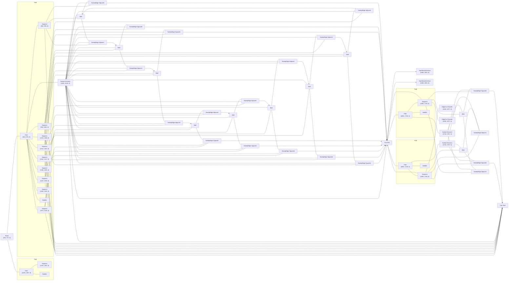

```mermaid
flowchart LR
  subgraph path2 [Path]
    2["Path<br>[812, 876, 0]"]
      %% [ProgramBodyItem { index: 9 }, VariableDeclarationDeclaration, VariableDeclarationInit, PipeBodyItem { index: 1 }]
    3["Segment<br>[882, 939, 0]"]
      %% [ProgramBodyItem { index: 9 }, VariableDeclarationDeclaration, VariableDeclarationInit, PipeBodyItem { index: 2 }]
    4["Segment<br>[945, 1004, 0]"]
      %% [ProgramBodyItem { index: 9 }, VariableDeclarationDeclaration, VariableDeclarationInit, PipeBodyItem { index: 3 }]
    5["Segment<br>[1010, 1067, 0]"]
      %% [ProgramBodyItem { index: 9 }, VariableDeclarationDeclaration, VariableDeclarationInit, PipeBodyItem { index: 4 }]
    6["Segment<br>[1073, 1126, 0]"]
      %% [ProgramBodyItem { index: 9 }, VariableDeclarationDeclaration, VariableDeclarationInit, PipeBodyItem { index: 5 }]
    7["Segment<br>[1132, 1190, 0]"]
      %% [ProgramBodyItem { index: 9 }, VariableDeclarationDeclaration, VariableDeclarationInit, PipeBodyItem { index: 6 }]
    8["Segment<br>[1196, 1255, 0]"]
      %% [ProgramBodyItem { index: 9 }, VariableDeclarationDeclaration, VariableDeclarationInit, PipeBodyItem { index: 7 }]
    9["Segment<br>[1261, 1317, 0]"]
      %% [ProgramBodyItem { index: 9 }, VariableDeclarationDeclaration, VariableDeclarationInit, PipeBodyItem { index: 8 }]
    10["Segment<br>[1323, 1388, 0]"]
      %% [ProgramBodyItem { index: 9 }, VariableDeclarationDeclaration, VariableDeclarationInit, PipeBodyItem { index: 9 }]
    11["Segment<br>[1394, 1401, 0]"]
      %% [ProgramBodyItem { index: 9 }, VariableDeclarationDeclaration, VariableDeclarationInit, PipeBodyItem { index: 10 }]
    12[Solid2d]
  end
  subgraph path13 [Path]
    13["Path<br>[1425, 1487, 0]"]
      %% [ProgramBodyItem { index: 9 }, VariableDeclarationDeclaration, VariableDeclarationInit, PipeBodyItem { index: 11 }, CallKwArg { index: 0 }]
    14["Segment<br>[1425, 1487, 0]"]
      %% [ProgramBodyItem { index: 9 }, VariableDeclarationDeclaration, VariableDeclarationInit, PipeBodyItem { index: 11 }, CallKwArg { index: 0 }]
    15[Solid2d]
  end
  subgraph path43 [Path]
    43["Path<br>[1650, 1726, 0]"]
      %% [ProgramBodyItem { index: 10 }, VariableDeclarationDeclaration, VariableDeclarationInit, FunctionExpressionBody, FunctionExpressionBodyItem { index: 0 }, ExpressionStatementExpr, PipeBodyItem { index: 1 }]
    44["Segment<br>[1650, 1726, 0]"]
      %% [ProgramBodyItem { index: 10 }, VariableDeclarationDeclaration, VariableDeclarationInit, FunctionExpressionBody, FunctionExpressionBodyItem { index: 0 }, ExpressionStatementExpr, PipeBodyItem { index: 1 }]
    45[Solid2d]
  end
  subgraph path51 [Path]
    51["Path<br>[1650, 1726, 0]"]
      %% [ProgramBodyItem { index: 10 }, VariableDeclarationDeclaration, VariableDeclarationInit, FunctionExpressionBody, FunctionExpressionBodyItem { index: 0 }, ExpressionStatementExpr, PipeBodyItem { index: 1 }]
    52["Segment<br>[1650, 1726, 0]"]
      %% [ProgramBodyItem { index: 10 }, VariableDeclarationDeclaration, VariableDeclarationInit, FunctionExpressionBody, FunctionExpressionBodyItem { index: 0 }, ExpressionStatementExpr, PipeBodyItem { index: 1 }]
    53[Solid2d]
  end
  1["Plane<br>[700, 717, 0]"]
    %% [ProgramBodyItem { index: 9 }, VariableDeclarationDeclaration, VariableDeclarationInit, PipeBodyItem { index: 0 }]
  16["Sweep Extrusion<br>[1494, 1529, 0]"]
    %% [ProgramBodyItem { index: 9 }, VariableDeclarationDeclaration, VariableDeclarationInit, PipeBodyItem { index: 12 }]
  17[Wall]
    %% face_code_ref=Missing NodePath
  18[Wall]
    %% face_code_ref=Missing NodePath
  19[Wall]
    %% face_code_ref=Missing NodePath
  20[Wall]
    %% face_code_ref=Missing NodePath
  21[Wall]
    %% face_code_ref=Missing NodePath
  22[Wall]
    %% face_code_ref=Missing NodePath
  23[Wall]
    %% face_code_ref=Missing NodePath
  24[Wall]
    %% face_code_ref=Missing NodePath
  25["Cap Start"]
    %% face_code_ref=Missing NodePath
  26["Cap End"]
    %% face_code_ref=[ProgramBodyItem { index: 10 }, VariableDeclarationDeclaration, VariableDeclarationInit, FunctionExpressionBody, FunctionExpressionBodyItem { index: 0 }, ExpressionStatementExpr, PipeBodyItem { index: 0 }]
  27["SweepEdge Opposite"]
  28["SweepEdge Adjacent"]
  29["SweepEdge Opposite"]
  30["SweepEdge Adjacent"]
  31["SweepEdge Opposite"]
  32["SweepEdge Adjacent"]
  33["SweepEdge Opposite"]
  34["SweepEdge Adjacent"]
  35["SweepEdge Opposite"]
  36["SweepEdge Adjacent"]
  37["SweepEdge Opposite"]
  38["SweepEdge Adjacent"]
  39["SweepEdge Opposite"]
  40["SweepEdge Adjacent"]
  41["SweepEdge Opposite"]
  42["SweepEdge Adjacent"]
  46["Sweep Extrusion<br>[1734, 1767, 0]"]
    %% [ProgramBodyItem { index: 10 }, VariableDeclarationDeclaration, VariableDeclarationInit, FunctionExpressionBody, FunctionExpressionBodyItem { index: 0 }, ExpressionStatementExpr, PipeBodyItem { index: 2 }]
  47[Wall]
    %% face_code_ref=Missing NodePath
  48["SweepEdge Opposite"]
  49["SweepEdge Adjacent"]
  50["EdgeCut Chamfer<br>[1830, 1877, 0]"]
    %% [ProgramBodyItem { index: 10 }, VariableDeclarationDeclaration, VariableDeclarationInit, FunctionExpressionBody, FunctionExpressionBodyItem { index: 0 }, ExpressionStatementExpr, PipeBodyItem { index: 3 }]
  54["Sweep Extrusion<br>[1734, 1767, 0]"]
    %% [ProgramBodyItem { index: 10 }, VariableDeclarationDeclaration, VariableDeclarationInit, FunctionExpressionBody, FunctionExpressionBodyItem { index: 0 }, ExpressionStatementExpr, PipeBodyItem { index: 2 }]
  55[Wall]
    %% face_code_ref=Missing NodePath
  56["SweepEdge Opposite"]
  57["SweepEdge Adjacent"]
  58["EdgeCut Chamfer<br>[1830, 1877, 0]"]
    %% [ProgramBodyItem { index: 10 }, VariableDeclarationDeclaration, VariableDeclarationInit, FunctionExpressionBody, FunctionExpressionBodyItem { index: 0 }, ExpressionStatementExpr, PipeBodyItem { index: 3 }]
  59["StartSketchOnFace<br>[1606, 1642, 0]"]
    %% [ProgramBodyItem { index: 10 }, VariableDeclarationDeclaration, VariableDeclarationInit, FunctionExpressionBody, FunctionExpressionBodyItem { index: 0 }, ExpressionStatementExpr, PipeBodyItem { index: 0 }]
  60["StartSketchOnFace<br>[1606, 1642, 0]"]
    %% [ProgramBodyItem { index: 10 }, VariableDeclarationDeclaration, VariableDeclarationInit, FunctionExpressionBody, FunctionExpressionBodyItem { index: 0 }, ExpressionStatementExpr, PipeBodyItem { index: 0 }]
  1 --- 2
  1 --- 13
  2 --- 3
  2 --- 4
  2 --- 5
  2 --- 6
  2 --- 7
  2 --- 8
  2 --- 9
  2 --- 10
  2 --- 11
  2 --- 12
  2 ---- 16
  3 --- 24
  3 x--> 25
  3 --- 41
  3 --- 42
  4 --- 23
  4 x--> 25
  4 --- 39
  4 --- 40
  5 --- 22
  5 x--> 25
  5 --- 37
  5 --- 38
  6 --- 21
  6 x--> 25
  6 --- 35
  6 --- 36
  7 --- 20
  7 x--> 25
  7 --- 33
  7 --- 34
  8 --- 19
  8 x--> 25
  8 --- 31
  8 --- 32
  9 --- 18
  9 x--> 25
  9 --- 29
  9 --- 30
  10 --- 17
  10 x--> 25
  10 --- 27
  10 --- 28
  13 --- 14
  13 --- 15
  16 --- 17
  16 --- 18
  16 --- 19
  16 --- 20
  16 --- 21
  16 --- 22
  16 --- 23
  16 --- 24
  16 --- 25
  16 --- 26
  16 --- 27
  16 --- 28
  16 --- 29
  16 --- 30
  16 --- 31
  16 --- 32
  16 --- 33
  16 --- 34
  16 --- 35
  16 --- 36
  16 --- 37
  16 --- 38
  16 --- 39
  16 --- 40
  16 --- 41
  16 --- 42
  17 --- 27
  17 --- 28
  30 <--x 17
  18 --- 29
  18 --- 30
  32 <--x 18
  19 --- 31
  19 --- 32
  34 <--x 19
  20 --- 33
  20 --- 34
  36 <--x 20
  21 --- 35
  21 --- 36
  38 <--x 21
  22 --- 37
  22 --- 38
  40 <--x 22
  23 --- 39
  23 --- 40
  42 <--x 23
  28 <--x 24
  24 --- 41
  24 --- 42
  48 <--x 25
  56 <--x 25
  27 <--x 26
  29 <--x 26
  31 <--x 26
  33 <--x 26
  35 <--x 26
  37 <--x 26
  39 <--x 26
  41 <--x 26
  26 --- 43
  44 <--x 26
  26 --- 51
  52 <--x 26
  26 <--x 59
  26 <--x 60
  43 --- 44
  43 --- 45
  43 ---- 46
  44 --- 47
  44 --- 48
  44 --- 49
  44 --- 50
  46 --- 47
  46 --- 48
  46 --- 49
  47 --- 48
  47 --- 49
  51 --- 52
  51 --- 53
  51 ---- 54
  52 --- 55
  52 --- 56
  52 --- 57
  52 --- 58
  54 --- 55
  54 --- 56
  54 --- 57
  55 --- 56
  55 --- 57
```
