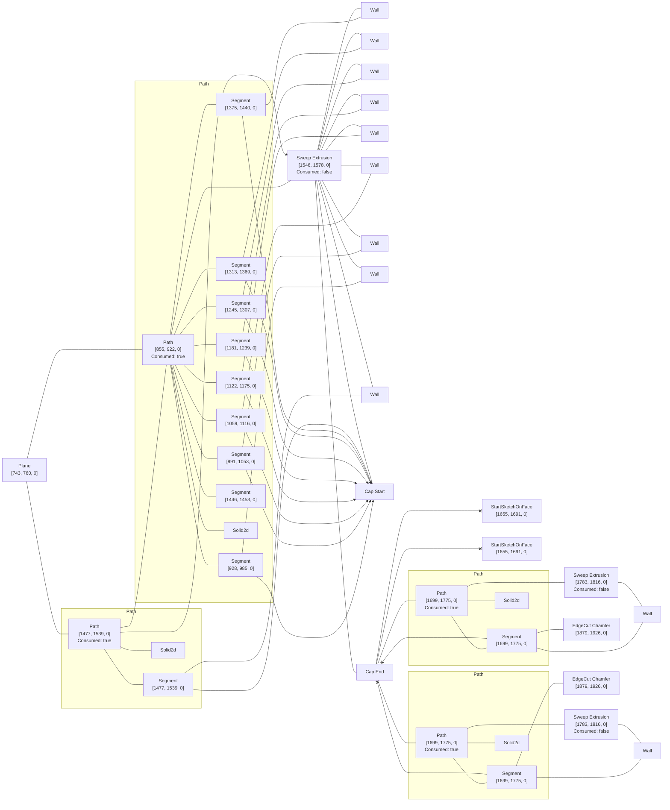

```mermaid
flowchart LR
  subgraph path2 [Path]
    2["Path<br>[855, 922, 0]<br>Consumed: true"]
      %% [ProgramBodyItem { index: 9 }, VariableDeclarationDeclaration, VariableDeclarationInit, PipeBodyItem { index: 1 }]
    3["Segment<br>[928, 985, 0]"]
      %% [ProgramBodyItem { index: 9 }, VariableDeclarationDeclaration, VariableDeclarationInit, PipeBodyItem { index: 2 }]
    4["Segment<br>[991, 1053, 0]"]
      %% [ProgramBodyItem { index: 9 }, VariableDeclarationDeclaration, VariableDeclarationInit, PipeBodyItem { index: 3 }]
    5["Segment<br>[1059, 1116, 0]"]
      %% [ProgramBodyItem { index: 9 }, VariableDeclarationDeclaration, VariableDeclarationInit, PipeBodyItem { index: 4 }]
    6["Segment<br>[1122, 1175, 0]"]
      %% [ProgramBodyItem { index: 9 }, VariableDeclarationDeclaration, VariableDeclarationInit, PipeBodyItem { index: 5 }]
    7["Segment<br>[1181, 1239, 0]"]
      %% [ProgramBodyItem { index: 9 }, VariableDeclarationDeclaration, VariableDeclarationInit, PipeBodyItem { index: 6 }]
    8["Segment<br>[1245, 1307, 0]"]
      %% [ProgramBodyItem { index: 9 }, VariableDeclarationDeclaration, VariableDeclarationInit, PipeBodyItem { index: 7 }]
    9["Segment<br>[1313, 1369, 0]"]
      %% [ProgramBodyItem { index: 9 }, VariableDeclarationDeclaration, VariableDeclarationInit, PipeBodyItem { index: 8 }]
    10["Segment<br>[1375, 1440, 0]"]
      %% [ProgramBodyItem { index: 9 }, VariableDeclarationDeclaration, VariableDeclarationInit, PipeBodyItem { index: 9 }]
    11["Segment<br>[1446, 1453, 0]"]
      %% [ProgramBodyItem { index: 9 }, VariableDeclarationDeclaration, VariableDeclarationInit, PipeBodyItem { index: 10 }]
    12[Solid2d]
  end
  subgraph path13 [Path]
    13["Path<br>[1477, 1539, 0]<br>Consumed: true"]
      %% [ProgramBodyItem { index: 9 }, VariableDeclarationDeclaration, VariableDeclarationInit, PipeBodyItem { index: 11 }, CallKwArg { index: 0 }]
    14["Segment<br>[1477, 1539, 0]"]
      %% [ProgramBodyItem { index: 9 }, VariableDeclarationDeclaration, VariableDeclarationInit, PipeBodyItem { index: 11 }, CallKwArg { index: 0 }]
    15[Solid2d]
  end
  subgraph path28 [Path]
    28["Path<br>[1699, 1775, 0]<br>Consumed: true"]
      %% [ProgramBodyItem { index: 10 }, VariableDeclarationDeclaration, VariableDeclarationInit, FunctionExpressionBody, FunctionExpressionBodyItem { index: 0 }, ExpressionStatementExpr, PipeBodyItem { index: 1 }]
    29["Segment<br>[1699, 1775, 0]"]
      %% [ProgramBodyItem { index: 10 }, VariableDeclarationDeclaration, VariableDeclarationInit, FunctionExpressionBody, FunctionExpressionBodyItem { index: 0 }, ExpressionStatementExpr, PipeBodyItem { index: 1 }]
    30[Solid2d]
  end
  subgraph path34 [Path]
    34["Path<br>[1699, 1775, 0]<br>Consumed: true"]
      %% [ProgramBodyItem { index: 10 }, VariableDeclarationDeclaration, VariableDeclarationInit, FunctionExpressionBody, FunctionExpressionBodyItem { index: 0 }, ExpressionStatementExpr, PipeBodyItem { index: 1 }]
    35["Segment<br>[1699, 1775, 0]"]
      %% [ProgramBodyItem { index: 10 }, VariableDeclarationDeclaration, VariableDeclarationInit, FunctionExpressionBody, FunctionExpressionBodyItem { index: 0 }, ExpressionStatementExpr, PipeBodyItem { index: 1 }]
    36[Solid2d]
  end
  1["Plane<br>[743, 760, 0]"]
    %% [ProgramBodyItem { index: 9 }, VariableDeclarationDeclaration, VariableDeclarationInit, PipeBodyItem { index: 0 }]
  16["Sweep Extrusion<br>[1546, 1578, 0]<br>Consumed: false"]
    %% [ProgramBodyItem { index: 9 }, VariableDeclarationDeclaration, VariableDeclarationInit, PipeBodyItem { index: 12 }]
  17[Wall]
    %% face_code_ref=Missing NodePath
  18[Wall]
    %% face_code_ref=Missing NodePath
  19[Wall]
    %% face_code_ref=Missing NodePath
  20[Wall]
    %% face_code_ref=Missing NodePath
  21[Wall]
    %% face_code_ref=Missing NodePath
  22[Wall]
    %% face_code_ref=Missing NodePath
  23[Wall]
    %% face_code_ref=Missing NodePath
  24[Wall]
    %% face_code_ref=Missing NodePath
  25[Wall]
    %% face_code_ref=Missing NodePath
  26["Cap Start"]
    %% face_code_ref=Missing NodePath
  27["Cap End"]
    %% face_code_ref=[ProgramBodyItem { index: 10 }, VariableDeclarationDeclaration, VariableDeclarationInit, FunctionExpressionBody, FunctionExpressionBodyItem { index: 0 }, ExpressionStatementExpr, PipeBodyItem { index: 0 }]
  31["Sweep Extrusion<br>[1783, 1816, 0]<br>Consumed: false"]
    %% [ProgramBodyItem { index: 10 }, VariableDeclarationDeclaration, VariableDeclarationInit, FunctionExpressionBody, FunctionExpressionBodyItem { index: 0 }, ExpressionStatementExpr, PipeBodyItem { index: 2 }]
  32[Wall]
    %% face_code_ref=Missing NodePath
  33["EdgeCut Chamfer<br>[1879, 1926, 0]"]
    %% [ProgramBodyItem { index: 10 }, VariableDeclarationDeclaration, VariableDeclarationInit, FunctionExpressionBody, FunctionExpressionBodyItem { index: 0 }, ExpressionStatementExpr, PipeBodyItem { index: 3 }]
  37["Sweep Extrusion<br>[1783, 1816, 0]<br>Consumed: false"]
    %% [ProgramBodyItem { index: 10 }, VariableDeclarationDeclaration, VariableDeclarationInit, FunctionExpressionBody, FunctionExpressionBodyItem { index: 0 }, ExpressionStatementExpr, PipeBodyItem { index: 2 }]
  38[Wall]
    %% face_code_ref=Missing NodePath
  39["EdgeCut Chamfer<br>[1879, 1926, 0]"]
    %% [ProgramBodyItem { index: 10 }, VariableDeclarationDeclaration, VariableDeclarationInit, FunctionExpressionBody, FunctionExpressionBodyItem { index: 0 }, ExpressionStatementExpr, PipeBodyItem { index: 3 }]
  40["StartSketchOnFace<br>[1655, 1691, 0]"]
    %% [ProgramBodyItem { index: 10 }, VariableDeclarationDeclaration, VariableDeclarationInit, FunctionExpressionBody, FunctionExpressionBodyItem { index: 0 }, ExpressionStatementExpr, PipeBodyItem { index: 0 }]
  41["StartSketchOnFace<br>[1655, 1691, 0]"]
    %% [ProgramBodyItem { index: 10 }, VariableDeclarationDeclaration, VariableDeclarationInit, FunctionExpressionBody, FunctionExpressionBodyItem { index: 0 }, ExpressionStatementExpr, PipeBodyItem { index: 0 }]
  1 --- 2
  1 --- 13
  2 --- 3
  2 --- 4
  2 --- 5
  2 --- 6
  2 --- 7
  2 --- 8
  2 --- 9
  2 --- 10
  2 --- 11
  2 --- 12
  13 --- 2
  2 ---- 16
  3 --- 24
  3 x--> 26
  4 --- 23
  4 x--> 26
  5 --- 22
  5 x--> 26
  6 --- 21
  6 x--> 26
  7 --- 20
  7 x--> 26
  8 --- 19
  8 x--> 26
  9 --- 18
  9 x--> 26
  10 --- 17
  10 x--> 26
  13 --- 14
  13 --- 15
  13 x---> 16
  14 --- 25
  14 x--> 26
  16 --- 17
  16 --- 18
  16 --- 19
  16 --- 20
  16 --- 21
  16 --- 22
  16 --- 23
  16 --- 24
  16 --- 25
  16 --- 26
  16 --- 27
  27 --- 28
  29 <--x 27
  27 --- 34
  35 <--x 27
  27 <--x 40
  27 <--x 41
  28 --- 29
  28 --- 30
  28 ---- 31
  29 --- 32
  29 --- 33
  31 --- 32
  34 --- 35
  34 --- 36
  34 ---- 37
  35 --- 38
  35 --- 39
  37 --- 38
```
