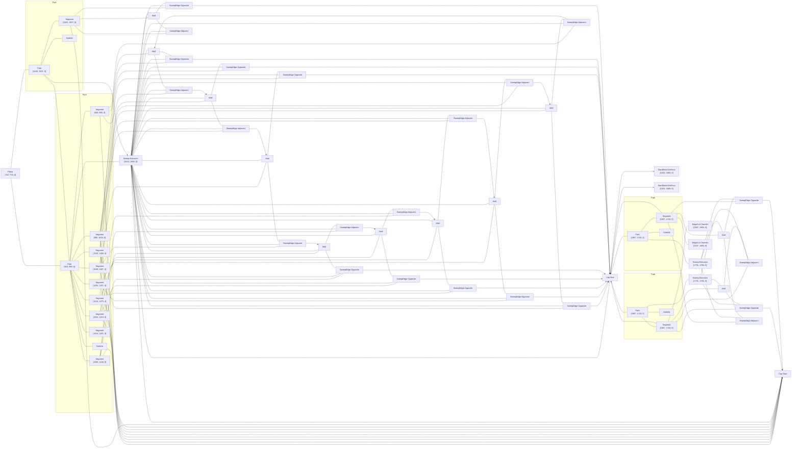

```mermaid
flowchart LR
  subgraph path2 [Path]
    2["Path<br>[819, 896, 0]"]
      %% [ProgramBodyItem { index: 10 }, VariableDeclarationDeclaration, VariableDeclarationInit, PipeBodyItem { index: 0 }]
    3["Segment<br>[902, 959, 0]"]
      %% [ProgramBodyItem { index: 10 }, VariableDeclarationDeclaration, VariableDeclarationInit, PipeBodyItem { index: 1 }]
    4["Segment<br>[965, 1024, 0]"]
      %% [ProgramBodyItem { index: 10 }, VariableDeclarationDeclaration, VariableDeclarationInit, PipeBodyItem { index: 2 }]
    5["Segment<br>[1030, 1087, 0]"]
      %% [ProgramBodyItem { index: 10 }, VariableDeclarationDeclaration, VariableDeclarationInit, PipeBodyItem { index: 3 }]
    6["Segment<br>[1093, 1146, 0]"]
      %% [ProgramBodyItem { index: 10 }, VariableDeclarationDeclaration, VariableDeclarationInit, PipeBodyItem { index: 4 }]
    7["Segment<br>[1152, 1210, 0]"]
      %% [ProgramBodyItem { index: 10 }, VariableDeclarationDeclaration, VariableDeclarationInit, PipeBodyItem { index: 5 }]
    8["Segment<br>[1216, 1275, 0]"]
      %% [ProgramBodyItem { index: 10 }, VariableDeclarationDeclaration, VariableDeclarationInit, PipeBodyItem { index: 6 }]
    9["Segment<br>[1281, 1337, 0]"]
      %% [ProgramBodyItem { index: 10 }, VariableDeclarationDeclaration, VariableDeclarationInit, PipeBodyItem { index: 7 }]
    10["Segment<br>[1343, 1408, 0]"]
      %% [ProgramBodyItem { index: 10 }, VariableDeclarationDeclaration, VariableDeclarationInit, PipeBodyItem { index: 8 }]
    11["Segment<br>[1414, 1421, 0]"]
      %% [ProgramBodyItem { index: 10 }, VariableDeclarationDeclaration, VariableDeclarationInit, PipeBodyItem { index: 9 }]
    12[Solid2d]
  end
  subgraph path13 [Path]
    13["Path<br>[1445, 1507, 0]"]
      %% [ProgramBodyItem { index: 10 }, VariableDeclarationDeclaration, VariableDeclarationInit, PipeBodyItem { index: 10 }, CallKwArg { index: 0 }]
    14["Segment<br>[1445, 1507, 0]"]
      %% [ProgramBodyItem { index: 10 }, VariableDeclarationDeclaration, VariableDeclarationInit, PipeBodyItem { index: 10 }, CallKwArg { index: 0 }]
    15[Solid2d]
  end
  subgraph path46 [Path]
    46["Path<br>[1667, 1743, 0]"]
      %% [ProgramBodyItem { index: 11 }, VariableDeclarationDeclaration, VariableDeclarationInit, FunctionExpressionBody, FunctionExpressionBodyItem { index: 0 }, ExpressionStatementExpr, PipeBodyItem { index: 1 }]
    47["Segment<br>[1667, 1743, 0]"]
      %% [ProgramBodyItem { index: 11 }, VariableDeclarationDeclaration, VariableDeclarationInit, FunctionExpressionBody, FunctionExpressionBodyItem { index: 0 }, ExpressionStatementExpr, PipeBodyItem { index: 1 }]
    48[Solid2d]
  end
  subgraph path54 [Path]
    54["Path<br>[1667, 1743, 0]"]
      %% [ProgramBodyItem { index: 11 }, VariableDeclarationDeclaration, VariableDeclarationInit, FunctionExpressionBody, FunctionExpressionBodyItem { index: 0 }, ExpressionStatementExpr, PipeBodyItem { index: 1 }]
    55["Segment<br>[1667, 1743, 0]"]
      %% [ProgramBodyItem { index: 11 }, VariableDeclarationDeclaration, VariableDeclarationInit, FunctionExpressionBody, FunctionExpressionBodyItem { index: 0 }, ExpressionStatementExpr, PipeBodyItem { index: 1 }]
    56[Solid2d]
  end
  1["Plane<br>[702, 719, 0]"]
    %% [ProgramBodyItem { index: 9 }, VariableDeclarationDeclaration, VariableDeclarationInit]
  16["Sweep Extrusion<br>[1514, 1546, 0]"]
    %% [ProgramBodyItem { index: 10 }, VariableDeclarationDeclaration, VariableDeclarationInit, PipeBodyItem { index: 11 }]
  17[Wall]
    %% face_code_ref=Missing NodePath
  18[Wall]
    %% face_code_ref=Missing NodePath
  19[Wall]
    %% face_code_ref=Missing NodePath
  20[Wall]
    %% face_code_ref=Missing NodePath
  21[Wall]
    %% face_code_ref=Missing NodePath
  22[Wall]
    %% face_code_ref=Missing NodePath
  23[Wall]
    %% face_code_ref=Missing NodePath
  24[Wall]
    %% face_code_ref=Missing NodePath
  25[Wall]
    %% face_code_ref=Missing NodePath
  26["Cap Start"]
    %% face_code_ref=Missing NodePath
  27["Cap End"]
    %% face_code_ref=[ProgramBodyItem { index: 11 }, VariableDeclarationDeclaration, VariableDeclarationInit, FunctionExpressionBody, FunctionExpressionBodyItem { index: 0 }, ExpressionStatementExpr, PipeBodyItem { index: 0 }]
  28["SweepEdge Opposite"]
  29["SweepEdge Adjacent"]
  30["SweepEdge Opposite"]
  31["SweepEdge Adjacent"]
  32["SweepEdge Opposite"]
  33["SweepEdge Adjacent"]
  34["SweepEdge Opposite"]
  35["SweepEdge Adjacent"]
  36["SweepEdge Opposite"]
  37["SweepEdge Adjacent"]
  38["SweepEdge Opposite"]
  39["SweepEdge Adjacent"]
  40["SweepEdge Opposite"]
  41["SweepEdge Adjacent"]
  42["SweepEdge Opposite"]
  43["SweepEdge Adjacent"]
  44["SweepEdge Opposite"]
  45["SweepEdge Adjacent"]
  49["Sweep Extrusion<br>[1751, 1784, 0]"]
    %% [ProgramBodyItem { index: 11 }, VariableDeclarationDeclaration, VariableDeclarationInit, FunctionExpressionBody, FunctionExpressionBodyItem { index: 0 }, ExpressionStatementExpr, PipeBodyItem { index: 2 }]
  50[Wall]
    %% face_code_ref=Missing NodePath
  51["SweepEdge Opposite"]
  52["SweepEdge Adjacent"]
  53["EdgeCut Chamfer<br>[1847, 1894, 0]"]
    %% [ProgramBodyItem { index: 11 }, VariableDeclarationDeclaration, VariableDeclarationInit, FunctionExpressionBody, FunctionExpressionBodyItem { index: 0 }, ExpressionStatementExpr, PipeBodyItem { index: 3 }]
  57["Sweep Extrusion<br>[1751, 1784, 0]"]
    %% [ProgramBodyItem { index: 11 }, VariableDeclarationDeclaration, VariableDeclarationInit, FunctionExpressionBody, FunctionExpressionBodyItem { index: 0 }, ExpressionStatementExpr, PipeBodyItem { index: 2 }]
  58[Wall]
    %% face_code_ref=Missing NodePath
  59["SweepEdge Opposite"]
  60["SweepEdge Adjacent"]
  61["EdgeCut Chamfer<br>[1847, 1894, 0]"]
    %% [ProgramBodyItem { index: 11 }, VariableDeclarationDeclaration, VariableDeclarationInit, FunctionExpressionBody, FunctionExpressionBodyItem { index: 0 }, ExpressionStatementExpr, PipeBodyItem { index: 3 }]
  62["StartSketchOnFace<br>[1623, 1659, 0]"]
    %% [ProgramBodyItem { index: 11 }, VariableDeclarationDeclaration, VariableDeclarationInit, FunctionExpressionBody, FunctionExpressionBodyItem { index: 0 }, ExpressionStatementExpr, PipeBodyItem { index: 0 }]
  63["StartSketchOnFace<br>[1623, 1659, 0]"]
    %% [ProgramBodyItem { index: 11 }, VariableDeclarationDeclaration, VariableDeclarationInit, FunctionExpressionBody, FunctionExpressionBodyItem { index: 0 }, ExpressionStatementExpr, PipeBodyItem { index: 0 }]
  1 --- 2
  1 --- 13
  2 --- 3
  2 --- 4
  2 --- 5
  2 --- 6
  2 --- 7
  2 --- 8
  2 --- 9
  2 --- 10
  2 --- 11
  2 --- 12
  13 --- 2
  2 ---- 16
  3 --- 24
  3 x--> 26
  3 --- 42
  3 --- 43
  4 --- 23
  4 x--> 26
  4 --- 40
  4 --- 41
  5 --- 22
  5 x--> 26
  5 --- 38
  5 --- 39
  6 --- 21
  6 x--> 26
  6 --- 36
  6 --- 37
  7 --- 20
  7 x--> 26
  7 --- 34
  7 --- 35
  8 --- 19
  8 x--> 26
  8 --- 32
  8 --- 33
  9 --- 18
  9 x--> 26
  9 --- 30
  9 --- 31
  10 --- 17
  10 x--> 26
  10 --- 28
  10 --- 29
  13 --- 14
  13 --- 15
  13 x---> 16
  14 --- 25
  14 x--> 26
  14 --- 44
  14 --- 45
  16 --- 17
  16 --- 18
  16 --- 19
  16 --- 20
  16 --- 21
  16 --- 22
  16 --- 23
  16 --- 24
  16 --- 25
  16 --- 26
  16 --- 27
  16 --- 28
  16 --- 29
  16 --- 30
  16 --- 31
  16 --- 32
  16 --- 33
  16 --- 34
  16 --- 35
  16 --- 36
  16 --- 37
  16 --- 38
  16 --- 39
  16 --- 40
  16 --- 41
  16 --- 42
  16 --- 43
  16 --- 44
  16 --- 45
  17 --- 28
  17 --- 29
  31 <--x 17
  18 --- 30
  18 --- 31
  33 <--x 18
  19 --- 32
  19 --- 33
  35 <--x 19
  20 --- 34
  20 --- 35
  37 <--x 20
  21 --- 36
  21 --- 37
  39 <--x 21
  22 --- 38
  22 --- 39
  41 <--x 22
  23 --- 40
  23 --- 41
  43 <--x 23
  29 <--x 24
  24 --- 42
  24 --- 43
  25 --- 44
  25 --- 45
  51 <--x 26
  59 <--x 26
  28 <--x 27
  30 <--x 27
  32 <--x 27
  34 <--x 27
  36 <--x 27
  38 <--x 27
  40 <--x 27
  42 <--x 27
  44 <--x 27
  27 --- 46
  47 <--x 27
  27 --- 54
  55 <--x 27
  27 <--x 62
  27 <--x 63
  46 --- 47
  46 --- 48
  46 ---- 49
  47 --- 50
  47 --- 51
  47 --- 52
  47 --- 53
  49 --- 50
  49 --- 51
  49 --- 52
  50 --- 51
  50 --- 52
  54 --- 55
  54 --- 56
  54 ---- 57
  55 --- 58
  55 --- 59
  55 --- 60
  55 --- 61
  57 --- 58
  57 --- 59
  57 --- 60
  58 --- 59
  58 --- 60
```
