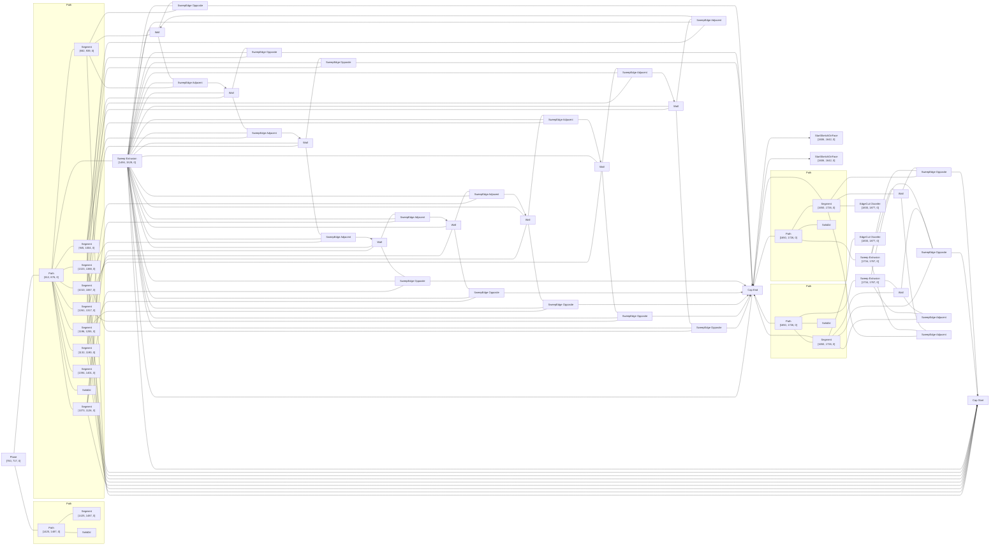

```mermaid
flowchart LR
  subgraph path4 [Path]
    4["Path<br>[812, 876, 0]"]
      %% [ProgramBodyItem { index: 9 }, VariableDeclarationDeclaration, VariableDeclarationInit, PipeBodyItem { index: 1 }]
    8["Segment<br>[882, 939, 0]"]
      %% [ProgramBodyItem { index: 9 }, VariableDeclarationDeclaration, VariableDeclarationInit, PipeBodyItem { index: 2 }]
    9["Segment<br>[945, 1004, 0]"]
      %% [ProgramBodyItem { index: 9 }, VariableDeclarationDeclaration, VariableDeclarationInit, PipeBodyItem { index: 3 }]
    10["Segment<br>[1010, 1067, 0]"]
      %% [ProgramBodyItem { index: 9 }, VariableDeclarationDeclaration, VariableDeclarationInit, PipeBodyItem { index: 4 }]
    11["Segment<br>[1073, 1126, 0]"]
      %% [ProgramBodyItem { index: 9 }, VariableDeclarationDeclaration, VariableDeclarationInit, PipeBodyItem { index: 5 }]
    12["Segment<br>[1132, 1190, 0]"]
      %% [ProgramBodyItem { index: 9 }, VariableDeclarationDeclaration, VariableDeclarationInit, PipeBodyItem { index: 6 }]
    13["Segment<br>[1196, 1255, 0]"]
      %% [ProgramBodyItem { index: 9 }, VariableDeclarationDeclaration, VariableDeclarationInit, PipeBodyItem { index: 7 }]
    14["Segment<br>[1261, 1317, 0]"]
      %% [ProgramBodyItem { index: 9 }, VariableDeclarationDeclaration, VariableDeclarationInit, PipeBodyItem { index: 8 }]
    15["Segment<br>[1323, 1388, 0]"]
      %% [ProgramBodyItem { index: 9 }, VariableDeclarationDeclaration, VariableDeclarationInit, PipeBodyItem { index: 9 }]
    16["Segment<br>[1394, 1401, 0]"]
      %% [ProgramBodyItem { index: 9 }, VariableDeclarationDeclaration, VariableDeclarationInit, PipeBodyItem { index: 10 }]
    23[Solid2d]
  end
  subgraph path5 [Path]
    5["Path<br>[1425, 1487, 0]"]
      %% [ProgramBodyItem { index: 9 }, VariableDeclarationDeclaration, VariableDeclarationInit, PipeBodyItem { index: 11 }, CallKwArg { index: 0 }]
    17["Segment<br>[1425, 1487, 0]"]
      %% [ProgramBodyItem { index: 9 }, VariableDeclarationDeclaration, VariableDeclarationInit, PipeBodyItem { index: 11 }, CallKwArg { index: 0 }]
    20[Solid2d]
  end
  subgraph path6 [Path]
    6["Path<br>[1650, 1726, 0]"]
      %% [ProgramBodyItem { index: 10 }, VariableDeclarationDeclaration, VariableDeclarationInit, FunctionExpressionBody, FunctionExpressionBodyItem { index: 0 }, ExpressionStatementExpr, PipeBodyItem { index: 1 }]
    18["Segment<br>[1650, 1726, 0]"]
      %% [ProgramBodyItem { index: 10 }, VariableDeclarationDeclaration, VariableDeclarationInit, FunctionExpressionBody, FunctionExpressionBodyItem { index: 0 }, ExpressionStatementExpr, PipeBodyItem { index: 1 }]
    21[Solid2d]
  end
  subgraph path7 [Path]
    7["Path<br>[1650, 1726, 0]"]
      %% [ProgramBodyItem { index: 10 }, VariableDeclarationDeclaration, VariableDeclarationInit, FunctionExpressionBody, FunctionExpressionBodyItem { index: 0 }, ExpressionStatementExpr, PipeBodyItem { index: 1 }]
    19["Segment<br>[1650, 1726, 0]"]
      %% [ProgramBodyItem { index: 10 }, VariableDeclarationDeclaration, VariableDeclarationInit, FunctionExpressionBody, FunctionExpressionBodyItem { index: 0 }, ExpressionStatementExpr, PipeBodyItem { index: 1 }]
    22[Solid2d]
  end
  1["Plane<br>[700, 717, 0]"]
    %% [ProgramBodyItem { index: 9 }, VariableDeclarationDeclaration, VariableDeclarationInit, PipeBodyItem { index: 0 }]
  2["StartSketchOnFace<br>[1606, 1642, 0]"]
    %% [ProgramBodyItem { index: 10 }, VariableDeclarationDeclaration, VariableDeclarationInit, FunctionExpressionBody, FunctionExpressionBodyItem { index: 0 }, ExpressionStatementExpr, PipeBodyItem { index: 0 }]
  3["StartSketchOnFace<br>[1606, 1642, 0]"]
    %% [ProgramBodyItem { index: 10 }, VariableDeclarationDeclaration, VariableDeclarationInit, FunctionExpressionBody, FunctionExpressionBodyItem { index: 0 }, ExpressionStatementExpr, PipeBodyItem { index: 0 }]
  24["Sweep Extrusion<br>[1494, 1529, 0]"]
    %% [ProgramBodyItem { index: 9 }, VariableDeclarationDeclaration, VariableDeclarationInit, PipeBodyItem { index: 12 }]
  25["Sweep Extrusion<br>[1734, 1767, 0]"]
    %% [ProgramBodyItem { index: 10 }, VariableDeclarationDeclaration, VariableDeclarationInit, FunctionExpressionBody, FunctionExpressionBodyItem { index: 0 }, ExpressionStatementExpr, PipeBodyItem { index: 2 }]
  26["Sweep Extrusion<br>[1734, 1767, 0]"]
    %% [ProgramBodyItem { index: 10 }, VariableDeclarationDeclaration, VariableDeclarationInit, FunctionExpressionBody, FunctionExpressionBodyItem { index: 0 }, ExpressionStatementExpr, PipeBodyItem { index: 2 }]
  27[Wall]
    %% face_code_ref=Missing NodePath
  28[Wall]
    %% face_code_ref=Missing NodePath
  29[Wall]
    %% face_code_ref=Missing NodePath
  30[Wall]
    %% face_code_ref=Missing NodePath
  31[Wall]
    %% face_code_ref=Missing NodePath
  32[Wall]
    %% face_code_ref=Missing NodePath
  33[Wall]
    %% face_code_ref=Missing NodePath
  34[Wall]
    %% face_code_ref=Missing NodePath
  35[Wall]
    %% face_code_ref=Missing NodePath
  36[Wall]
    %% face_code_ref=Missing NodePath
  37["Cap Start"]
    %% face_code_ref=Missing NodePath
  38["Cap End"]
    %% face_code_ref=[ProgramBodyItem { index: 10 }, VariableDeclarationDeclaration, VariableDeclarationInit, FunctionExpressionBody, FunctionExpressionBodyItem { index: 0 }, ExpressionStatementExpr, PipeBodyItem { index: 0 }]
  39["SweepEdge Opposite"]
  40["SweepEdge Opposite"]
  41["SweepEdge Opposite"]
  42["SweepEdge Opposite"]
  43["SweepEdge Opposite"]
  44["SweepEdge Opposite"]
  45["SweepEdge Opposite"]
  46["SweepEdge Opposite"]
  47["SweepEdge Opposite"]
  48["SweepEdge Opposite"]
  49["SweepEdge Adjacent"]
  50["SweepEdge Adjacent"]
  51["SweepEdge Adjacent"]
  52["SweepEdge Adjacent"]
  53["SweepEdge Adjacent"]
  54["SweepEdge Adjacent"]
  55["SweepEdge Adjacent"]
  56["SweepEdge Adjacent"]
  57["SweepEdge Adjacent"]
  58["SweepEdge Adjacent"]
  59["EdgeCut Chamfer<br>[1830, 1877, 0]"]
    %% [ProgramBodyItem { index: 10 }, VariableDeclarationDeclaration, VariableDeclarationInit, FunctionExpressionBody, FunctionExpressionBodyItem { index: 0 }, ExpressionStatementExpr, PipeBodyItem { index: 3 }]
  60["EdgeCut Chamfer<br>[1830, 1877, 0]"]
    %% [ProgramBodyItem { index: 10 }, VariableDeclarationDeclaration, VariableDeclarationInit, FunctionExpressionBody, FunctionExpressionBodyItem { index: 0 }, ExpressionStatementExpr, PipeBodyItem { index: 3 }]
  1 --- 4
  1 --- 5
  38 x--> 2
  38 x--> 3
  4 --- 8
  4 --- 9
  4 --- 10
  4 --- 11
  4 --- 12
  4 --- 13
  4 --- 14
  4 --- 15
  4 --- 16
  4 --- 23
  4 ---- 24
  5 --- 17
  5 --- 20
  6 --- 18
  6 --- 21
  6 ---- 25
  38 --- 6
  7 --- 19
  7 --- 22
  7 ---- 26
  38 --- 7
  8 --- 34
  8 x--> 37
  8 --- 47
  8 --- 57
  9 --- 31
  9 x--> 37
  9 --- 46
  9 --- 56
  10 --- 30
  10 x--> 37
  10 --- 45
  10 --- 55
  11 --- 32
  11 x--> 37
  11 --- 44
  11 --- 54
  12 --- 29
  12 x--> 37
  12 --- 43
  12 --- 53
  13 --- 28
  13 x--> 37
  13 --- 42
  13 --- 52
  14 --- 33
  14 x--> 37
  14 --- 41
  14 --- 51
  15 --- 35
  15 x--> 37
  15 --- 40
  15 --- 50
  18 --- 27
  18 x--> 38
  18 --- 39
  18 --- 49
  18 --- 60
  19 --- 36
  19 x--> 38
  19 --- 48
  19 --- 58
  19 --- 59
  24 --- 28
  24 --- 29
  24 --- 30
  24 --- 31
  24 --- 32
  24 --- 33
  24 --- 34
  24 --- 35
  24 --- 37
  24 --- 38
  24 --- 40
  24 --- 41
  24 --- 42
  24 --- 43
  24 --- 44
  24 --- 45
  24 --- 46
  24 --- 47
  24 --- 50
  24 --- 51
  24 --- 52
  24 --- 53
  24 --- 54
  24 --- 55
  24 --- 56
  24 --- 57
  25 --- 27
  25 --- 39
  25 --- 49
  26 --- 36
  26 --- 48
  26 --- 58
  27 --- 39
  27 --- 49
  28 --- 42
  28 --- 52
  53 <--x 28
  29 --- 43
  29 --- 53
  54 <--x 29
  30 --- 45
  30 --- 55
  56 <--x 30
  31 --- 46
  31 --- 56
  57 <--x 31
  32 --- 44
  32 --- 54
  55 <--x 32
  33 --- 41
  33 --- 51
  52 <--x 33
  34 --- 47
  50 <--x 34
  34 --- 57
  35 --- 40
  35 --- 50
  51 <--x 35
  36 --- 48
  36 --- 58
  39 <--x 37
  48 <--x 37
  40 <--x 38
  41 <--x 38
  42 <--x 38
  43 <--x 38
  44 <--x 38
  45 <--x 38
  46 <--x 38
  47 <--x 38
```
