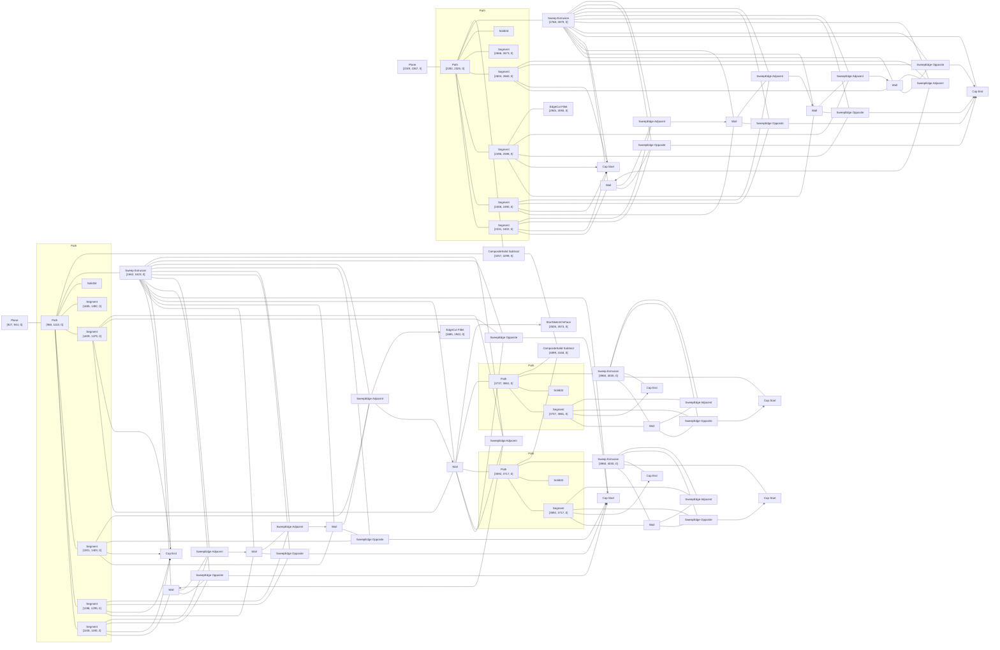

```mermaid
flowchart LR
  subgraph path2 [Path]
    2["Path<br>[968, 1102, 0]"]
      %% [ProgramBodyItem { index: 7 }, VariableDeclarationDeclaration, VariableDeclarationInit, PipeBodyItem { index: 0 }]
    3["Segment<br>[1108, 1190, 0]"]
      %% [ProgramBodyItem { index: 7 }, VariableDeclarationDeclaration, VariableDeclarationInit, PipeBodyItem { index: 1 }]
    4["Segment<br>[1196, 1295, 0]"]
      %% [ProgramBodyItem { index: 7 }, VariableDeclarationDeclaration, VariableDeclarationInit, PipeBodyItem { index: 2 }]
    5["Segment<br>[1301, 1403, 0]"]
      %% [ProgramBodyItem { index: 7 }, VariableDeclarationDeclaration, VariableDeclarationInit, PipeBodyItem { index: 3 }]
    6["Segment<br>[1409, 1479, 0]"]
      %% [ProgramBodyItem { index: 7 }, VariableDeclarationDeclaration, VariableDeclarationInit, PipeBodyItem { index: 4 }]
    7["Segment<br>[1485, 1492, 0]"]
      %% [ProgramBodyItem { index: 7 }, VariableDeclarationDeclaration, VariableDeclarationInit, PipeBodyItem { index: 5 }]
    8[Solid2d]
  end
  subgraph path26 [Path]
    26["Path<br>[2282, 2325, 0]"]
      %% [ProgramBodyItem { index: 12 }, VariableDeclarationDeclaration, VariableDeclarationInit, PipeBodyItem { index: 0 }]
    27["Segment<br>[2331, 2402, 0]"]
      %% [ProgramBodyItem { index: 12 }, VariableDeclarationDeclaration, VariableDeclarationInit, PipeBodyItem { index: 1 }]
    28["Segment<br>[2408, 2490, 0]"]
      %% [ProgramBodyItem { index: 12 }, VariableDeclarationDeclaration, VariableDeclarationInit, PipeBodyItem { index: 2 }]
    29["Segment<br>[2496, 2598, 0]"]
      %% [ProgramBodyItem { index: 12 }, VariableDeclarationDeclaration, VariableDeclarationInit, PipeBodyItem { index: 3 }]
    30["Segment<br>[2604, 2660, 0]"]
      %% [ProgramBodyItem { index: 12 }, VariableDeclarationDeclaration, VariableDeclarationInit, PipeBodyItem { index: 4 }]
    31["Segment<br>[2666, 2673, 0]"]
      %% [ProgramBodyItem { index: 12 }, VariableDeclarationDeclaration, VariableDeclarationInit, PipeBodyItem { index: 5 }]
    32[Solid2d]
  end
  subgraph path50 [Path]
    50["Path<br>[3592, 3717, 0]"]
      %% [ProgramBodyItem { index: 17 }, VariableDeclarationDeclaration, VariableDeclarationInit]
    51["Segment<br>[3592, 3717, 0]"]
      %% [ProgramBodyItem { index: 17 }, VariableDeclarationDeclaration, VariableDeclarationInit]
    52[Solid2d]
  end
  subgraph path53 [Path]
    53["Path<br>[3737, 3861, 0]"]
      %% [ProgramBodyItem { index: 18 }, VariableDeclarationDeclaration, VariableDeclarationInit]
    54["Segment<br>[3737, 3861, 0]"]
      %% [ProgramBodyItem { index: 18 }, VariableDeclarationDeclaration, VariableDeclarationInit]
    55[Solid2d]
  end
  1["Plane<br>[927, 944, 0]"]
    %% [ProgramBodyItem { index: 6 }, VariableDeclarationDeclaration, VariableDeclarationInit]
  9["Sweep Extrusion<br>[1562, 1623, 0]"]
    %% [ProgramBodyItem { index: 8 }, VariableDeclarationDeclaration, VariableDeclarationInit]
  10[Wall]
    %% face_code_ref=Missing NodePath
  11[Wall]
    %% face_code_ref=Missing NodePath
  12[Wall]
    %% face_code_ref=Missing NodePath
  13[Wall]
    %% face_code_ref=[ProgramBodyItem { index: 16 }, VariableDeclarationDeclaration, VariableDeclarationInit]
  14["Cap Start"]
    %% face_code_ref=Missing NodePath
  15["Cap End"]
    %% face_code_ref=Missing NodePath
  16["SweepEdge Opposite"]
  17["SweepEdge Adjacent"]
  18["SweepEdge Opposite"]
  19["SweepEdge Adjacent"]
  20["SweepEdge Opposite"]
  21["SweepEdge Adjacent"]
  22["SweepEdge Opposite"]
  23["SweepEdge Adjacent"]
  24["EdgeCut Fillet<br>[1685, 1943, 0]"]
    %% [ProgramBodyItem { index: 9 }, VariableDeclarationDeclaration, VariableDeclarationInit]
  25["Plane<br>[2249, 2267, 0]"]
    %% [ProgramBodyItem { index: 11 }, VariableDeclarationDeclaration, VariableDeclarationInit]
  33["Sweep Extrusion<br>[2768, 2879, 0]"]
    %% [ProgramBodyItem { index: 13 }, VariableDeclarationDeclaration, VariableDeclarationInit]
  34[Wall]
    %% face_code_ref=Missing NodePath
  35[Wall]
    %% face_code_ref=Missing NodePath
  36[Wall]
    %% face_code_ref=Missing NodePath
  37[Wall]
    %% face_code_ref=Missing NodePath
  38["Cap Start"]
    %% face_code_ref=Missing NodePath
  39["Cap End"]
    %% face_code_ref=Missing NodePath
  40["SweepEdge Opposite"]
  41["SweepEdge Adjacent"]
  42["SweepEdge Opposite"]
  43["SweepEdge Adjacent"]
  44["SweepEdge Opposite"]
  45["SweepEdge Adjacent"]
  46["SweepEdge Opposite"]
  47["SweepEdge Adjacent"]
  48["EdgeCut Fillet<br>[2945, 3093, 0]"]
    %% [ProgramBodyItem { index: 14 }, VariableDeclarationDeclaration, VariableDeclarationInit]
  49["CompositeSolid Subtract<br>[3257, 3299, 0]"]
    %% [ProgramBodyItem { index: 15 }, VariableDeclarationDeclaration, VariableDeclarationInit]
  56["Sweep Extrusion<br>[3960, 4030, 0]"]
    %% [ProgramBodyItem { index: 19 }, VariableDeclarationDeclaration, VariableDeclarationInit]
  57[Wall]
    %% face_code_ref=Missing NodePath
  58["Cap Start"]
    %% face_code_ref=Missing NodePath
  59["Cap End"]
    %% face_code_ref=Missing NodePath
  60["SweepEdge Opposite"]
  61["SweepEdge Adjacent"]
  62["Sweep Extrusion<br>[3960, 4030, 0]"]
    %% [ProgramBodyItem { index: 19 }, VariableDeclarationDeclaration, VariableDeclarationInit]
  63[Wall]
    %% face_code_ref=Missing NodePath
  64["Cap Start"]
    %% face_code_ref=Missing NodePath
  65["Cap End"]
    %% face_code_ref=Missing NodePath
  66["SweepEdge Opposite"]
  67["SweepEdge Adjacent"]
  68["CompositeSolid Subtract<br>[4099, 4148, 0]"]
    %% [ProgramBodyItem { index: 20 }, VariableDeclarationDeclaration, VariableDeclarationInit]
  69["StartSketchOnFace<br>[3526, 3573, 0]"]
    %% [ProgramBodyItem { index: 16 }, VariableDeclarationDeclaration, VariableDeclarationInit]
  1 --- 2
  2 --- 3
  2 --- 4
  2 --- 5
  2 --- 6
  2 --- 7
  2 --- 8
  2 ---- 9
  2 --- 49
  3 --- 10
  3 x--> 15
  3 --- 16
  3 --- 17
  4 --- 11
  4 x--> 15
  4 --- 18
  4 --- 19
  5 --- 12
  5 x--> 15
  5 --- 20
  5 --- 21
  6 --- 13
  6 x--> 15
  6 --- 22
  6 --- 23
  9 --- 10
  9 --- 11
  9 --- 12
  9 --- 13
  9 --- 14
  9 --- 15
  9 --- 16
  9 --- 17
  9 --- 18
  9 --- 19
  9 --- 20
  9 --- 21
  9 --- 22
  9 --- 23
  10 --- 16
  10 --- 17
  23 <--x 10
  17 <--x 11
  11 --- 18
  11 --- 19
  19 <--x 12
  12 --- 20
  12 --- 21
  21 <--x 13
  13 --- 22
  13 --- 23
  13 --- 50
  13 --- 53
  13 <--x 69
  16 <--x 14
  18 <--x 14
  20 <--x 14
  22 <--x 14
  21 <--x 24
  25 --- 26
  26 --- 27
  26 --- 28
  26 --- 29
  26 --- 30
  26 --- 31
  26 --- 32
  26 ---- 33
  26 --- 49
  27 --- 37
  27 x--> 38
  27 --- 46
  27 --- 47
  28 --- 36
  28 x--> 38
  28 --- 44
  28 --- 45
  29 --- 35
  29 x--> 38
  29 --- 42
  29 --- 43
  29 --- 48
  30 --- 34
  30 x--> 38
  30 --- 40
  30 --- 41
  33 --- 34
  33 --- 35
  33 --- 36
  33 --- 37
  33 --- 38
  33 --- 39
  33 --- 40
  33 --- 41
  33 --- 42
  33 --- 43
  33 --- 44
  33 --- 45
  33 --- 46
  33 --- 47
  34 --- 40
  34 --- 41
  43 <--x 34
  35 --- 42
  35 --- 43
  45 <--x 35
  36 --- 44
  36 --- 45
  47 <--x 36
  41 <--x 37
  37 --- 46
  37 --- 47
  40 <--x 39
  42 <--x 39
  44 <--x 39
  46 <--x 39
  49 --- 68
  50 --- 51
  50 --- 52
  50 ---- 56
  50 --- 68
  51 --- 57
  51 x--> 59
  51 --- 60
  51 --- 61
  53 --- 54
  53 --- 55
  53 ---- 62
  53 --- 68
  54 --- 63
  54 x--> 65
  54 --- 66
  54 --- 67
  56 --- 57
  56 --- 58
  56 --- 59
  56 --- 60
  56 --- 61
  57 --- 60
  57 --- 61
  60 <--x 58
  62 --- 63
  62 --- 64
  62 --- 65
  62 --- 66
  62 --- 67
  63 --- 66
  63 --- 67
  66 <--x 64
```
