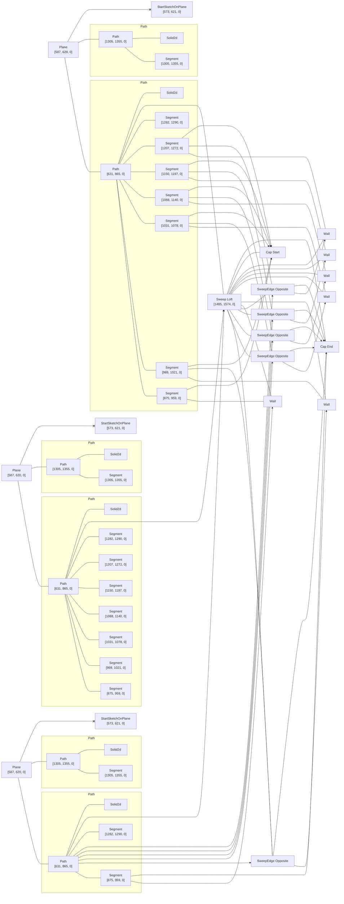

```mermaid
flowchart LR
  subgraph path2 [Path]
    2["Path<br>[631, 865, 0]"]
    3["Segment<br>[875, 959, 0]"]
    4["Segment<br>[969, 1021, 0]"]
    5["Segment<br>[1031, 1078, 0]"]
    6["Segment<br>[1088, 1140, 0]"]
    7["Segment<br>[1150, 1197, 0]"]
    8["Segment<br>[1207, 1272, 0]"]
    9["Segment<br>[1282, 1290, 0]"]
    10[Solid2d]
  end
  subgraph path11 [Path]
    11["Path<br>[1305, 1355, 0]"]
    12["Segment<br>[1305, 1355, 0]"]
    13[Solid2d]
  end
  subgraph path15 [Path]
    15["Path<br>[631, 865, 0]"]
    16["Segment<br>[875, 959, 0]"]
    17["Segment<br>[969, 1021, 0]"]
    18["Segment<br>[1031, 1078, 0]"]
    19["Segment<br>[1088, 1140, 0]"]
    20["Segment<br>[1150, 1197, 0]"]
    21["Segment<br>[1207, 1272, 0]"]
    22["Segment<br>[1282, 1290, 0]"]
    23[Solid2d]
  end
  subgraph path24 [Path]
    24["Path<br>[1305, 1355, 0]"]
    25["Segment<br>[1305, 1355, 0]"]
    26[Solid2d]
  end
  subgraph path28 [Path]
    28["Path<br>[631, 865, 0]"]
    29["Segment<br>[875, 959, 0]"]
    35["Segment<br>[1282, 1290, 0]"]
    36[Solid2d]
  end
  subgraph path37 [Path]
    37["Path<br>[1305, 1355, 0]"]
    38["Segment<br>[1305, 1355, 0]"]
    39[Solid2d]
  end
  1["Plane<br>[587, 620, 0]"]
  14["Plane<br>[587, 620, 0]"]
  27["Plane<br>[587, 620, 0]"]
  30["SweepEdge Opposite"]
  31["SweepEdge Opposite"]
  32["SweepEdge Opposite"]
  33["SweepEdge Opposite"]
  34["SweepEdge Opposite"]
  40["Sweep Loft<br>[1485, 1574, 0]"]
  41[Wall]
  42[Wall]
  43[Wall]
  44[Wall]
  45[Wall]
  46[Wall]
  47["Cap Start"]
  48["Cap End"]
  49["StartSketchOnPlane<br>[573, 621, 0]"]
  50["StartSketchOnPlane<br>[573, 621, 0]"]
  51["StartSketchOnPlane<br>[573, 621, 0]"]
  1 --- 2
  1 --- 11
  2 --- 3
  2 --- 4
  2 --- 5
  2 --- 6
  2 --- 7
  2 --- 8
  2 --- 9
  2 ---- 40
  2 --- 10
  3 --- 41
  3 x--> 47
  4 --- 42
  4 --- 30
  4 x--> 47
  5 --- 43
  5 --- 31
  5 x--> 47
  6 --- 44
  6 --- 32
  6 x--> 47
  7 --- 45
  7 --- 33
  7 x--> 47
  8 --- 46
  8 --- 34
  8 x--> 47
  11 --- 12
  11 --- 13
  14 --- 15
  14 --- 24
  15 --- 16
  15 --- 17
  15 --- 18
  15 --- 19
  15 --- 20
  15 --- 21
  15 --- 22
  15 x---> 40
  15 --- 23
  24 --- 25
  24 --- 26
  27 --- 28
  27 --- 37
  28 --- 29
  28 x--> 30
  28 x--> 31
  28 x--> 32
  28 x--> 33
  28 x--> 34
  28 --- 35
  28 x---> 40
  28 --- 36
  29 x--> 41
  29 x--> 48
  40 --- 30
  30 x--> 42
  30 x--> 48
  40 --- 31
  31 x--> 43
  31 x--> 48
  40 --- 32
  32 x--> 44
  32 x--> 48
  40 --- 33
  33 x--> 45
  33 x--> 48
  40 --- 34
  34 x--> 46
  34 x--> 48
  37 --- 38
  37 --- 39
  40 --- 41
  40 --- 42
  40 --- 43
  40 --- 44
  40 --- 45
  40 --- 46
  40 --- 47
  40 --- 48
  1 <--x 49
  14 <--x 50
  27 <--x 51
```
