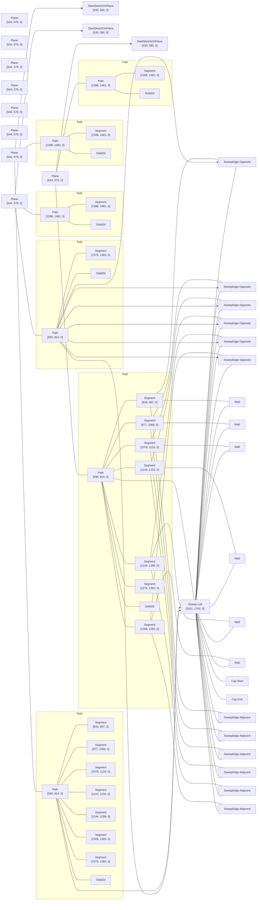

```mermaid
flowchart LR
  subgraph path8 [Path]
    8["Path<br>[590, 824, 0]"]
    9["Segment<br>[834, 967, 0]"]
    10["Segment<br>[977, 1068, 0]"]
    11["Segment<br>[1078, 1133, 0]"]
    12["Segment<br>[1143, 1234, 0]"]
    13["Segment<br>[1244, 1299, 0]"]
    14["Segment<br>[1309, 1365, 0]"]
    15["Segment<br>[1375, 1383, 0]"]
    16[Solid2d]
  end
  subgraph path17 [Path]
    17["Path<br>[1398, 1481, 0]"]
    18["Segment<br>[1398, 1481, 0]"]
    19[Solid2d]
  end
  subgraph path21 [Path]
    21["Path<br>[590, 824, 0]"]
    22["Segment<br>[834, 967, 0]"]
    23["Segment<br>[977, 1068, 0]"]
    24["Segment<br>[1078, 1133, 0]"]
    25["Segment<br>[1143, 1234, 0]"]
    26["Segment<br>[1244, 1299, 0]"]
    27["Segment<br>[1309, 1365, 0]"]
    28["Segment<br>[1375, 1383, 0]"]
    29[Solid2d]
  end
  subgraph path30 [Path]
    30["Path<br>[1398, 1481, 0]"]
    31["Segment<br>[1398, 1481, 0]"]
    32[Solid2d]
  end
  subgraph path34 [Path]
    34["Path<br>[590, 824, 0]"]
    41["Segment<br>[1375, 1383, 0]"]
    42[Solid2d]
  end
  subgraph path43 [Path]
    43["Path<br>[1398, 1481, 0]"]
    44["Segment<br>[1398, 1481, 0]"]
    45[Solid2d]
  end
  1["Plane<br>[544, 579, 0]"]
  2["Plane<br>[544, 579, 0]"]
  3["Plane<br>[544, 579, 0]"]
  4["Plane<br>[544, 579, 0]"]
  5["Plane<br>[544, 579, 0]"]
  6["Plane<br>[544, 579, 0]"]
  7["Plane<br>[544, 579, 0]"]
  20["Plane<br>[544, 579, 0]"]
  33["Plane<br>[544, 579, 0]"]
  35["SweepEdge Opposite"]
  36["SweepEdge Opposite"]
  37["SweepEdge Opposite"]
  38["SweepEdge Opposite"]
  39["SweepEdge Opposite"]
  40["SweepEdge Opposite"]
  46["Sweep Loft<br>[1611, 1700, 0]"]
  47[Wall]
  48[Wall]
  49[Wall]
  50[Wall]
  51[Wall]
  52[Wall]
  53["Cap Start"]
  54["Cap End"]
  55["SweepEdge Adjacent"]
  56["SweepEdge Adjacent"]
  57["SweepEdge Adjacent"]
  58["SweepEdge Adjacent"]
  59["SweepEdge Adjacent"]
  60["SweepEdge Adjacent"]
  61["StartSketchOnPlane<br>[530, 580, 0]"]
  62["StartSketchOnPlane<br>[530, 580, 0]"]
  63["StartSketchOnPlane<br>[530, 580, 0]"]
  7 --- 8
  7 --- 17
  8 --- 9
  8 --- 10
  8 --- 11
  8 --- 12
  8 --- 13
  8 --- 14
  8 --- 15
  8 ---- 46
  8 --- 16
  9 --- 47
  9 --- 35
  9 --- 55
  10 --- 48
  10 --- 36
  10 --- 56
  11 --- 49
  11 --- 37
  11 --- 57
  12 --- 50
  12 --- 38
  12 --- 58
  13 --- 51
  13 --- 39
  13 --- 59
  14 --- 52
  14 --- 40
  14 --- 60
  17 --- 18
  17 --- 19
  20 --- 21
  20 --- 30
  21 --- 22
  21 --- 23
  21 --- 24
  21 --- 25
  21 --- 26
  21 --- 27
  21 --- 28
  21 x---> 46
  21 --- 29
  30 --- 31
  30 --- 32
  33 --- 34
  33 --- 43
  34 x--> 35
  34 x--> 36
  34 x--> 37
  34 x--> 38
  34 x--> 39
  34 x--> 40
  34 --- 41
  34 x---> 46
  34 --- 42
  46 --- 35
  46 --- 36
  46 --- 37
  46 --- 38
  46 --- 39
  46 --- 40
  43 --- 44
  43 --- 45
  46 --- 47
  46 --- 48
  46 --- 49
  46 --- 50
  46 --- 51
  46 --- 52
  46 --- 53
  46 --- 54
  46 --- 55
  46 --- 56
  46 --- 57
  46 --- 58
  46 --- 59
  46 --- 60
  7 <--x 61
  20 <--x 62
  33 <--x 63
```
