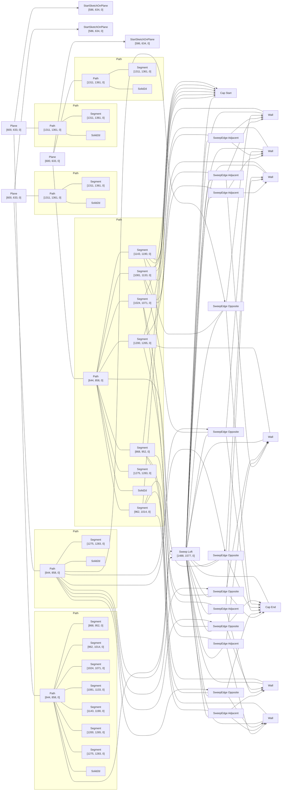

```mermaid
flowchart LR
  subgraph path7 [Path]
    7["Path<br>[644, 858, 0]"]
    13["Segment<br>[868, 952, 0]"]
    16["Segment<br>[962, 1014, 0]"]
    17["Segment<br>[1024, 1071, 0]"]
    19["Segment<br>[1081, 1133, 0]"]
    21["Segment<br>[1143, 1190, 0]"]
    23["Segment<br>[1200, 1265, 0]"]
    27["Segment<br>[1275, 1283, 0]"]
    31[Solid2d]
  end
  subgraph path8 [Path]
    8["Path<br>[644, 858, 0]"]
    14["Segment<br>[868, 952, 0]"]
    15["Segment<br>[962, 1014, 0]"]
    18["Segment<br>[1024, 1071, 0]"]
    20["Segment<br>[1081, 1133, 0]"]
    22["Segment<br>[1143, 1190, 0]"]
    24["Segment<br>[1200, 1265, 0]"]
    25["Segment<br>[1275, 1283, 0]"]
    34[Solid2d]
  end
  subgraph path9 [Path]
    9["Path<br>[644, 858, 0]"]
    26["Segment<br>[1275, 1283, 0]"]
    35[Solid2d]
  end
  subgraph path10 [Path]
    10["Path<br>[1311, 1361, 0]"]
    30["Segment<br>[1311, 1361, 0]"]
    32[Solid2d]
  end
  subgraph path11 [Path]
    11["Path<br>[1311, 1361, 0]"]
    28["Segment<br>[1311, 1361, 0]"]
    33[Solid2d]
  end
  subgraph path12 [Path]
    12["Path<br>[1311, 1361, 0]"]
    29["Segment<br>[1311, 1361, 0]"]
    36[Solid2d]
  end
  1["Plane<br>[600, 633, 0]"]
  2["Plane<br>[600, 633, 0]"]
  3["Plane<br>[600, 633, 0]"]
  4["StartSketchOnPlane<br>[586, 634, 0]"]
  5["StartSketchOnPlane<br>[586, 634, 0]"]
  6["StartSketchOnPlane<br>[586, 634, 0]"]
  37["Sweep Loft<br>[1488, 1577, 0]"]
  38[Wall]
  39[Wall]
  40[Wall]
  41[Wall]
  42[Wall]
  43[Wall]
  44["Cap Start"]
  45["Cap End"]
  46["SweepEdge Opposite"]
  47["SweepEdge Opposite"]
  48["SweepEdge Opposite"]
  49["SweepEdge Opposite"]
  50["SweepEdge Opposite"]
  51["SweepEdge Opposite"]
  52["SweepEdge Adjacent"]
  53["SweepEdge Adjacent"]
  54["SweepEdge Adjacent"]
  55["SweepEdge Adjacent"]
  56["SweepEdge Adjacent"]
  57["SweepEdge Adjacent"]
  1 <--x 5
  1 --- 8
  1 --- 11
  2 <--x 6
  2 --- 9
  2 --- 12
  3 <--x 4
  3 --- 7
  3 --- 10
  7 --- 13
  7 --- 16
  7 --- 17
  7 --- 19
  7 --- 21
  7 --- 23
  7 --- 27
  7 --- 31
  7 x---> 37
  8 --- 14
  8 --- 15
  8 --- 18
  8 --- 20
  8 --- 22
  8 --- 24
  8 --- 25
  8 --- 34
  8 ---- 37
  9 --- 26
  9 --- 35
  9 x---> 37
  9 x--> 46
  9 x--> 47
  9 x--> 48
  9 x--> 49
  9 x--> 50
  9 x--> 51
  10 --- 30
  10 --- 32
  11 --- 28
  11 --- 33
  12 --- 29
  12 --- 36
  14 --- 40
  14 x--> 44
  14 --- 50
  14 --- 55
  15 --- 39
  15 x--> 44
  15 --- 46
  15 --- 54
  18 --- 41
  18 x--> 44
  18 --- 48
  18 --- 53
  20 --- 43
  20 x--> 44
  20 --- 49
  20 --- 57
  22 --- 42
  22 x--> 44
  22 --- 47
  22 --- 52
  24 --- 38
  24 x--> 44
  24 --- 51
  24 --- 56
  37 --- 38
  37 --- 39
  37 --- 40
  37 --- 41
  37 --- 42
  37 --- 43
  37 --- 44
  37 --- 45
  37 --- 46
  37 --- 47
  37 --- 48
  37 --- 49
  37 --- 50
  37 --- 51
  37 --- 52
  37 --- 53
  37 --- 54
  37 --- 55
  37 --- 56
  37 --- 57
  51 <--x 38
  55 <--x 38
  56 <--x 38
  46 <--x 39
  53 <--x 39
  54 <--x 39
  50 <--x 40
  54 <--x 40
  55 <--x 40
  48 <--x 41
  53 <--x 41
  57 <--x 41
  47 <--x 42
  52 <--x 42
  56 <--x 42
  49 <--x 43
  52 <--x 43
  57 <--x 43
  46 <--x 45
  47 <--x 45
  48 <--x 45
  49 <--x 45
  50 <--x 45
  51 <--x 45
```
