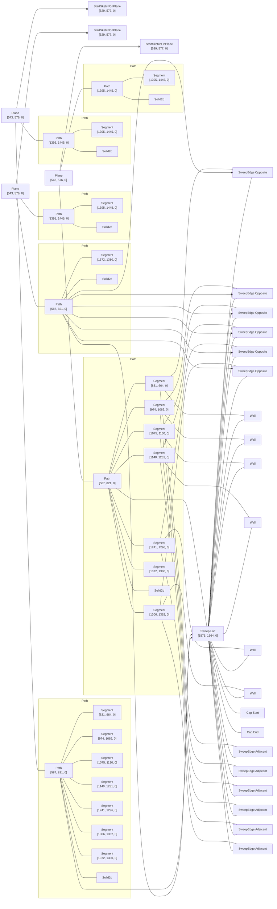

```mermaid
flowchart LR
  subgraph path2 [Path]
    2["Path<br>[587, 821, 0]"]
    3["Segment<br>[831, 964, 0]"]
    4["Segment<br>[974, 1065, 0]"]
    5["Segment<br>[1075, 1130, 0]"]
    6["Segment<br>[1140, 1231, 0]"]
    7["Segment<br>[1241, 1296, 0]"]
    8["Segment<br>[1306, 1362, 0]"]
    9["Segment<br>[1372, 1380, 0]"]
    10[Solid2d]
  end
  subgraph path11 [Path]
    11["Path<br>[1395, 1445, 0]"]
    12["Segment<br>[1395, 1445, 0]"]
    13[Solid2d]
  end
  subgraph path15 [Path]
    15["Path<br>[587, 821, 0]"]
    16["Segment<br>[831, 964, 0]"]
    17["Segment<br>[974, 1065, 0]"]
    18["Segment<br>[1075, 1130, 0]"]
    19["Segment<br>[1140, 1231, 0]"]
    20["Segment<br>[1241, 1296, 0]"]
    21["Segment<br>[1306, 1362, 0]"]
    22["Segment<br>[1372, 1380, 0]"]
    23[Solid2d]
  end
  subgraph path24 [Path]
    24["Path<br>[1395, 1445, 0]"]
    25["Segment<br>[1395, 1445, 0]"]
    26[Solid2d]
  end
  subgraph path28 [Path]
    28["Path<br>[587, 821, 0]"]
    35["Segment<br>[1372, 1380, 0]"]
    36[Solid2d]
  end
  subgraph path37 [Path]
    37["Path<br>[1395, 1445, 0]"]
    38["Segment<br>[1395, 1445, 0]"]
    39[Solid2d]
  end
  1["Plane<br>[543, 576, 0]"]
  14["Plane<br>[543, 576, 0]"]
  27["Plane<br>[543, 576, 0]"]
  29["SweepEdge Opposite"]
  30["SweepEdge Opposite"]
  31["SweepEdge Opposite"]
  32["SweepEdge Opposite"]
  33["SweepEdge Opposite"]
  34["SweepEdge Opposite"]
  40["Sweep Loft<br>[1575, 1664, 0]"]
  41[Wall]
  42[Wall]
  43[Wall]
  44[Wall]
  45[Wall]
  46[Wall]
  47["Cap Start"]
  48["Cap End"]
  49["SweepEdge Adjacent"]
  50["SweepEdge Adjacent"]
  51["SweepEdge Adjacent"]
  52["SweepEdge Adjacent"]
  53["SweepEdge Adjacent"]
  54["SweepEdge Adjacent"]
  55["StartSketchOnPlane<br>[529, 577, 0]"]
  56["StartSketchOnPlane<br>[529, 577, 0]"]
  57["StartSketchOnPlane<br>[529, 577, 0]"]
  1 --- 2
  1 --- 11
  2 --- 3
  2 --- 4
  2 --- 5
  2 --- 6
  2 --- 7
  2 --- 8
  2 --- 9
  2 ---- 40
  2 --- 10
  3 --- 41
  3 --- 29
  3 --- 49
  4 --- 42
  4 --- 30
  4 --- 50
  5 --- 43
  5 --- 31
  5 --- 51
  6 --- 44
  6 --- 32
  6 --- 52
  7 --- 45
  7 --- 33
  7 --- 53
  8 --- 46
  8 --- 34
  8 --- 54
  11 --- 12
  11 --- 13
  14 --- 15
  14 --- 24
  15 --- 16
  15 --- 17
  15 --- 18
  15 --- 19
  15 --- 20
  15 --- 21
  15 --- 22
  15 x---> 40
  15 --- 23
  24 --- 25
  24 --- 26
  27 --- 28
  27 --- 37
  28 x--> 29
  28 x--> 30
  28 x--> 31
  28 x--> 32
  28 x--> 33
  28 x--> 34
  28 --- 35
  28 x---> 40
  28 --- 36
  40 --- 29
  40 --- 30
  40 --- 31
  40 --- 32
  40 --- 33
  40 --- 34
  37 --- 38
  37 --- 39
  40 --- 41
  40 --- 42
  40 --- 43
  40 --- 44
  40 --- 45
  40 --- 46
  40 --- 47
  40 --- 48
  40 --- 49
  40 --- 50
  40 --- 51
  40 --- 52
  40 --- 53
  40 --- 54
  1 <--x 55
  14 <--x 56
  27 <--x 57
```
