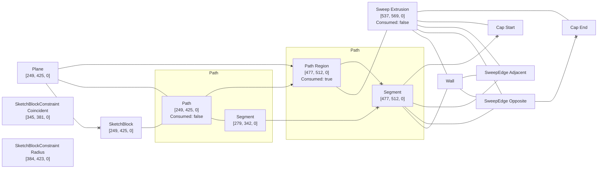

```mermaid
flowchart LR
  subgraph path3 [Path]
    3["Path Region<br>[477, 512, 0]<br>Consumed: true"]
      %% [ProgramBodyItem { index: 3 }, VariableDeclarationDeclaration, VariableDeclarationInit]
    7["Segment<br>[477, 512, 0]"]
      %% [ProgramBodyItem { index: 3 }, VariableDeclarationDeclaration, VariableDeclarationInit]
  end
  subgraph path4 [Path]
    4["Path<br>[249, 425, 0]<br>Consumed: false"]
      %% [ProgramBodyItem { index: 2 }, VariableDeclarationDeclaration, VariableDeclarationInit]
    6["Segment<br>[279, 342, 0]"]
      %% [ProgramBodyItem { index: 2 }, VariableDeclarationDeclaration, VariableDeclarationInit, SketchBlockBody, SketchBlockBodyItem { index: 0 }, VariableDeclarationDeclaration, VariableDeclarationInit]
  end
  1["Cap End"]
    %% face_code_ref=Missing NodePath
  2["Cap Start"]
    %% face_code_ref=Missing NodePath
  5["Plane<br>[249, 425, 0]"]
    %% [ProgramBodyItem { index: 2 }, VariableDeclarationDeclaration, VariableDeclarationInit]
  8["SketchBlock<br>[249, 425, 0]"]
    %% [ProgramBodyItem { index: 2 }, VariableDeclarationDeclaration, VariableDeclarationInit]
  9["SketchBlockConstraint Coincident<br>[345, 381, 0]"]
    %% [ProgramBodyItem { index: 2 }, VariableDeclarationDeclaration, VariableDeclarationInit, SketchBlockBody, SketchBlockBodyItem { index: 1 }, ExpressionStatementExpr]
  10["SketchBlockConstraint Radius<br>[384, 423, 0]"]
    %% [ProgramBodyItem { index: 2 }, VariableDeclarationDeclaration, VariableDeclarationInit, SketchBlockBody, SketchBlockBodyItem { index: 2 }, ExpressionStatementExpr]
  11["Sweep Extrusion<br>[537, 569, 0]<br>Consumed: false"]
    %% [ProgramBodyItem { index: 5 }, VariableDeclarationDeclaration, VariableDeclarationInit]
  12["SweepEdge Adjacent"]
  13["SweepEdge Opposite"]
  14[Wall]
    %% face_code_ref=Missing NodePath
  11 --- 1
  13 <--x 1
  7 <--x 2
  11 --- 2
  4 x--> 3
  5 x--> 3
  3 <--x 7
  3 ---- 11
  5 --- 4
  4 --- 6
  8 --- 4
  5 <--x 8
  6 <--x 7
  7 --- 12
  7 --- 13
  7 --- 14
  11 --- 12
  11 --- 13
  11 --- 14
  14 --- 12
  14 --- 13
```
