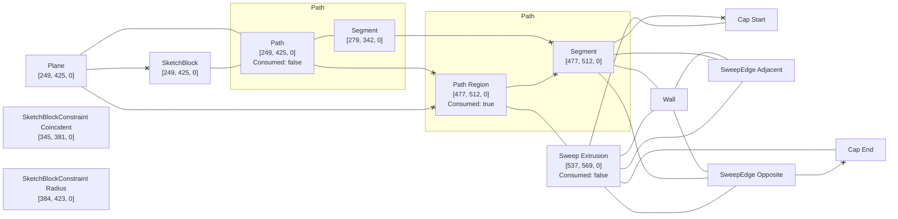

```mermaid
flowchart LR
  subgraph path4 [Path]
    4["Path<br>[249, 425, 0]<br>Consumed: false"]
      %% [ProgramBodyItem { index: 2 }, VariableDeclarationDeclaration, VariableDeclarationInit]
    7["Segment<br>[279, 342, 0]"]
      %% [ProgramBodyItem { index: 2 }, VariableDeclarationDeclaration, VariableDeclarationInit, SketchBlockBody, SketchBlockBodyItem { index: 0 }, VariableDeclarationDeclaration, VariableDeclarationInit]
  end
  subgraph path10 [Path]
    10["Path Region<br>[477, 512, 0]<br>Consumed: true"]
      %% [ProgramBodyItem { index: 3 }, VariableDeclarationDeclaration, VariableDeclarationInit]
    11["Segment<br>[477, 512, 0]"]
      %% [ProgramBodyItem { index: 3 }, VariableDeclarationDeclaration, VariableDeclarationInit]
  end
  1["Cap End"]
    %% face_code_ref=Missing NodePath
  2["Cap Start"]
    %% face_code_ref=Missing NodePath
  3[Wall]
    %% face_code_ref=Missing NodePath
  5["Plane<br>[249, 425, 0]"]
    %% [ProgramBodyItem { index: 2 }, VariableDeclarationDeclaration, VariableDeclarationInit]
  6["SketchBlock<br>[249, 425, 0]"]
    %% [ProgramBodyItem { index: 2 }, VariableDeclarationDeclaration, VariableDeclarationInit]
  8["SketchBlockConstraint Coincident<br>[345, 381, 0]"]
    %% [ProgramBodyItem { index: 2 }, VariableDeclarationDeclaration, VariableDeclarationInit, SketchBlockBody, SketchBlockBodyItem { index: 1 }, ExpressionStatementExpr]
  9["SketchBlockConstraint Radius<br>[384, 423, 0]"]
    %% [ProgramBodyItem { index: 2 }, VariableDeclarationDeclaration, VariableDeclarationInit, SketchBlockBody, SketchBlockBodyItem { index: 2 }, ExpressionStatementExpr]
  12["Sweep Extrusion<br>[537, 569, 0]<br>Consumed: false"]
    %% [ProgramBodyItem { index: 5 }, VariableDeclarationDeclaration, VariableDeclarationInit]
  13["SweepEdge Adjacent"]
  14["SweepEdge Opposite"]
  12 --- 1
  14 <--x 1
  11 <--x 2
  12 --- 2
  11 --- 3
  12 --- 3
  3 --- 13
  3 --- 14
  5 --- 4
  6 --- 4
  4 --- 7
  4 <--x 10
  5 <--x 6
  5 <--x 10
  7 <--x 11
  10 <--x 11
  10 ---- 12
  11 --- 13
  11 --- 14
  12 --- 13
  12 --- 14
```
