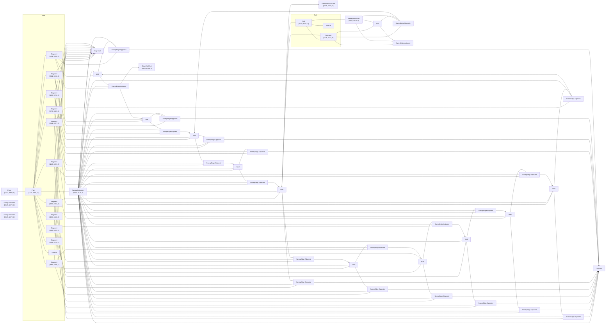

```mermaid
flowchart LR
  subgraph path2 [Path]
    2["Path<br>[3320, 3358, 0]"]
      %% [ProgramBodyItem { index: 16 }, VariableDeclarationDeclaration, VariableDeclarationInit, PipeBodyItem { index: 0 }]
    3["Segment<br>[3424, 3498, 0]"]
      %% [ProgramBodyItem { index: 16 }, VariableDeclarationDeclaration, VariableDeclarationInit, PipeBodyItem { index: 1 }]
    4["Segment<br>[3504, 3576, 0]"]
      %% [ProgramBodyItem { index: 16 }, VariableDeclarationDeclaration, VariableDeclarationInit, PipeBodyItem { index: 2 }]
    5["Segment<br>[3656, 3732, 0]"]
      %% [ProgramBodyItem { index: 16 }, VariableDeclarationDeclaration, VariableDeclarationInit, PipeBodyItem { index: 3 }]
    6["Segment<br>[3776, 3809, 0]"]
      %% [ProgramBodyItem { index: 16 }, VariableDeclarationDeclaration, VariableDeclarationInit, PipeBodyItem { index: 4 }]
    7["Segment<br>[3896, 3962, 0]"]
      %% [ProgramBodyItem { index: 16 }, VariableDeclarationDeclaration, VariableDeclarationInit, PipeBodyItem { index: 5 }]
    8["Segment<br>[3999, 4056, 0]"]
      %% [ProgramBodyItem { index: 16 }, VariableDeclarationDeclaration, VariableDeclarationInit, PipeBodyItem { index: 6 }]
    9["Segment<br>[4062, 4095, 0]"]
      %% [ProgramBodyItem { index: 16 }, VariableDeclarationDeclaration, VariableDeclarationInit, PipeBodyItem { index: 7 }]
    10["Segment<br>[4155, 4188, 0]"]
      %% [ProgramBodyItem { index: 16 }, VariableDeclarationDeclaration, VariableDeclarationInit, PipeBodyItem { index: 8 }]
    11["Segment<br>[4249, 4281, 0]"]
      %% [ProgramBodyItem { index: 16 }, VariableDeclarationDeclaration, VariableDeclarationInit, PipeBodyItem { index: 9 }]
    12["Segment<br>[4341, 4397, 0]"]
      %% [ProgramBodyItem { index: 16 }, VariableDeclarationDeclaration, VariableDeclarationInit, PipeBodyItem { index: 10 }]
    13["Segment<br>[4403, 4410, 0]"]
      %% [ProgramBodyItem { index: 16 }, VariableDeclarationDeclaration, VariableDeclarationInit, PipeBodyItem { index: 11 }]
    14[Solid2d]
  end
  subgraph path48 [Path]
    48["Path<br>[5119, 5247, 0]"]
      %% [ProgramBodyItem { index: 19 }, VariableDeclarationDeclaration, VariableDeclarationInit]
    49["Segment<br>[5119, 5247, 0]"]
      %% [ProgramBodyItem { index: 19 }, VariableDeclarationDeclaration, VariableDeclarationInit]
    50[Solid2d]
  end
  1["Plane<br>[3287, 3304, 0]"]
    %% [ProgramBodyItem { index: 15 }, VariableDeclarationDeclaration, VariableDeclarationInit]
  15["Sweep Extrusion<br>[4424, 4476, 0]"]
    %% [ProgramBodyItem { index: 17 }, VariableDeclarationDeclaration, VariableDeclarationInit]
  16[Wall]
    %% face_code_ref=Missing NodePath
  17[Wall]
    %% face_code_ref=Missing NodePath
  18[Wall]
    %% face_code_ref=Missing NodePath
  19[Wall]
    %% face_code_ref=Missing NodePath
  20[Wall]
    %% face_code_ref=Missing NodePath
  21[Wall]
    %% face_code_ref=[ProgramBodyItem { index: 18 }, VariableDeclarationDeclaration, VariableDeclarationInit]
  22[Wall]
    %% face_code_ref=Missing NodePath
  23[Wall]
    %% face_code_ref=Missing NodePath
  24[Wall]
    %% face_code_ref=Missing NodePath
  25[Wall]
    %% face_code_ref=Missing NodePath
  26["Cap Start"]
    %% face_code_ref=Missing NodePath
  27["Cap End"]
    %% face_code_ref=Missing NodePath
  28["SweepEdge Opposite"]
  29["SweepEdge Adjacent"]
  30["SweepEdge Opposite"]
  31["SweepEdge Adjacent"]
  32["SweepEdge Opposite"]
  33["SweepEdge Adjacent"]
  34["SweepEdge Opposite"]
  35["SweepEdge Adjacent"]
  36["SweepEdge Opposite"]
  37["SweepEdge Adjacent"]
  38["SweepEdge Opposite"]
  39["SweepEdge Adjacent"]
  40["SweepEdge Opposite"]
  41["SweepEdge Adjacent"]
  42["SweepEdge Opposite"]
  43["SweepEdge Adjacent"]
  44["SweepEdge Opposite"]
  45["SweepEdge Adjacent"]
  46["SweepEdge Opposite"]
  47["SweepEdge Adjacent"]
  51["Sweep Extrusion<br>[5525, 5572, 0]"]
    %% [ProgramBodyItem { index: 21 }, VariableDeclarationDeclaration, VariableDeclarationInit]
  52[Wall]
    %% face_code_ref=Missing NodePath
  53["SweepEdge Opposite"]
  54["SweepEdge Adjacent"]
  55["Sweep Extrusion<br>[5525, 5572, 0]"]
    %% [ProgramBodyItem { index: 21 }, VariableDeclarationDeclaration, VariableDeclarationInit]
  56["Sweep Extrusion<br>[5525, 5572, 0]"]
    %% [ProgramBodyItem { index: 21 }, VariableDeclarationDeclaration, VariableDeclarationInit]
  57["EdgeCut Fillet<br>[5865, 6169, 0]"]
    %% [ProgramBodyItem { index: 22 }, VariableDeclarationDeclaration, VariableDeclarationInit]
  58["StartSketchOnFace<br>[5049, 5104, 0]"]
    %% [ProgramBodyItem { index: 18 }, VariableDeclarationDeclaration, VariableDeclarationInit]
  1 --- 2
  2 --- 3
  2 --- 4
  2 --- 5
  2 --- 6
  2 --- 7
  2 --- 8
  2 --- 9
  2 --- 10
  2 --- 11
  2 --- 12
  2 --- 13
  2 --- 14
  2 ---- 15
  3 --- 25
  3 x--> 26
  3 --- 46
  3 --- 47
  4 --- 24
  4 x--> 26
  4 --- 44
  4 --- 45
  5 --- 23
  5 x--> 26
  5 --- 42
  5 --- 43
  6 --- 22
  6 x--> 26
  6 --- 40
  6 --- 41
  7 --- 21
  7 x--> 26
  7 --- 38
  7 --- 39
  8 --- 20
  8 x--> 26
  8 --- 36
  8 --- 37
  9 --- 19
  9 x--> 26
  9 --- 34
  9 --- 35
  10 --- 18
  10 x--> 26
  10 --- 32
  10 --- 33
  11 --- 17
  11 x--> 26
  11 --- 30
  11 --- 31
  12 --- 16
  12 x--> 26
  12 --- 28
  12 --- 29
  15 --- 16
  15 --- 17
  15 --- 18
  15 --- 19
  15 --- 20
  15 --- 21
  15 --- 22
  15 --- 23
  15 --- 24
  15 --- 25
  15 --- 26
  15 --- 27
  15 --- 28
  15 --- 29
  15 --- 30
  15 --- 31
  15 --- 32
  15 --- 33
  15 --- 34
  15 --- 35
  15 --- 36
  15 --- 37
  15 --- 38
  15 --- 39
  15 --- 40
  15 --- 41
  15 --- 42
  15 --- 43
  15 --- 44
  15 --- 45
  15 --- 46
  15 --- 47
  16 --- 28
  16 --- 29
  31 <--x 16
  17 --- 30
  17 --- 31
  33 <--x 17
  18 --- 32
  18 --- 33
  35 <--x 18
  19 --- 34
  19 --- 35
  37 <--x 19
  20 --- 36
  20 --- 37
  39 <--x 20
  21 --- 38
  21 --- 39
  41 <--x 21
  21 --- 48
  49 <--x 21
  21 <--x 58
  22 --- 40
  22 --- 41
  43 <--x 22
  23 --- 42
  23 --- 43
  45 <--x 23
  53 <--x 23
  24 --- 44
  24 --- 45
  47 <--x 24
  29 <--x 25
  25 --- 46
  25 --- 47
  28 <--x 27
  30 <--x 27
  32 <--x 27
  34 <--x 27
  36 <--x 27
  38 <--x 27
  40 <--x 27
  42 <--x 27
  44 <--x 27
  46 <--x 27
  47 <--x 57
  48 --- 49
  48 --- 50
  48 ---- 51
  49 --- 52
  49 --- 53
  49 --- 54
  51 --- 52
  51 --- 53
  51 --- 54
  52 --- 53
  52 --- 54
```
