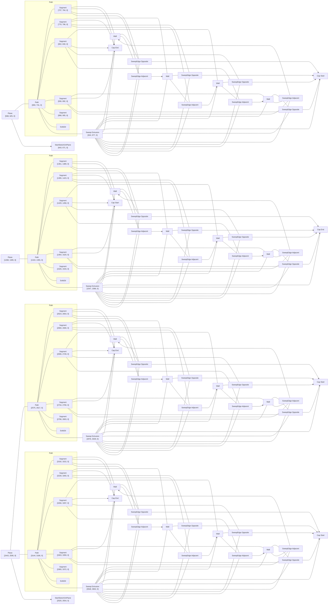

```mermaid
flowchart LR
  subgraph path2 [Path]
    2["Path<br>[690, 731, 0]"]
      %% [ProgramBodyItem { index: 11 }, VariableDeclarationDeclaration, VariableDeclarationInit, PipeBodyItem { index: 0 }]
    3["Segment<br>[737, 764, 0]"]
      %% [ProgramBodyItem { index: 11 }, VariableDeclarationDeclaration, VariableDeclarationInit, PipeBodyItem { index: 1 }]
    4["Segment<br>[770, 796, 0]"]
      %% [ProgramBodyItem { index: 11 }, VariableDeclarationDeclaration, VariableDeclarationInit, PipeBodyItem { index: 2 }]
    5["Segment<br>[802, 830, 0]"]
      %% [ProgramBodyItem { index: 11 }, VariableDeclarationDeclaration, VariableDeclarationInit, PipeBodyItem { index: 3 }]
    6["Segment<br>[836, 892, 0]"]
      %% [ProgramBodyItem { index: 11 }, VariableDeclarationDeclaration, VariableDeclarationInit, PipeBodyItem { index: 4 }]
    7["Segment<br>[898, 905, 0]"]
      %% [ProgramBodyItem { index: 11 }, VariableDeclarationDeclaration, VariableDeclarationInit, PipeBodyItem { index: 5 }]
    8[Solid2d]
  end
  subgraph path25 [Path]
    25["Path<br>[1319, 1355, 0]"]
      %% [ProgramBodyItem { index: 17 }, VariableDeclarationDeclaration, VariableDeclarationInit, PipeBodyItem { index: 0 }]
    26["Segment<br>[1361, 1389, 0]"]
      %% [ProgramBodyItem { index: 17 }, VariableDeclarationDeclaration, VariableDeclarationInit, PipeBodyItem { index: 1 }]
    27["Segment<br>[1395, 1423, 0]"]
      %% [ProgramBodyItem { index: 17 }, VariableDeclarationDeclaration, VariableDeclarationInit, PipeBodyItem { index: 2 }]
    28["Segment<br>[1429, 1458, 0]"]
      %% [ProgramBodyItem { index: 17 }, VariableDeclarationDeclaration, VariableDeclarationInit, PipeBodyItem { index: 3 }]
    29["Segment<br>[1464, 1520, 0]"]
      %% [ProgramBodyItem { index: 17 }, VariableDeclarationDeclaration, VariableDeclarationInit, PipeBodyItem { index: 4 }]
    30["Segment<br>[1526, 1533, 0]"]
      %% [ProgramBodyItem { index: 17 }, VariableDeclarationDeclaration, VariableDeclarationInit, PipeBodyItem { index: 5 }]
    31[Solid2d]
  end
  subgraph path48 [Path]
    48["Path<br>[2575, 2617, 0]"]
      %% [ProgramBodyItem { index: 29 }, VariableDeclarationDeclaration, VariableDeclarationInit, PipeBodyItem { index: 0 }]
    49["Segment<br>[2623, 2654, 0]"]
      %% [ProgramBodyItem { index: 29 }, VariableDeclarationDeclaration, VariableDeclarationInit, PipeBodyItem { index: 1 }]
    50["Segment<br>[2660, 2690, 0]"]
      %% [ProgramBodyItem { index: 29 }, VariableDeclarationDeclaration, VariableDeclarationInit, PipeBodyItem { index: 2 }]
    51["Segment<br>[2696, 2728, 0]"]
      %% [ProgramBodyItem { index: 29 }, VariableDeclarationDeclaration, VariableDeclarationInit, PipeBodyItem { index: 3 }]
    52["Segment<br>[2734, 2790, 0]"]
      %% [ProgramBodyItem { index: 29 }, VariableDeclarationDeclaration, VariableDeclarationInit, PipeBodyItem { index: 4 }]
    53["Segment<br>[2796, 2803, 0]"]
      %% [ProgramBodyItem { index: 29 }, VariableDeclarationDeclaration, VariableDeclarationInit, PipeBodyItem { index: 5 }]
    54[Solid2d]
  end
  subgraph path70 [Path]
    70["Path<br>[3144, 3186, 0]"]
      %% [ProgramBodyItem { index: 33 }, VariableDeclarationDeclaration, VariableDeclarationInit, PipeBodyItem { index: 0 }]
    71["Segment<br>[3192, 3222, 0]"]
      %% [ProgramBodyItem { index: 33 }, VariableDeclarationDeclaration, VariableDeclarationInit, PipeBodyItem { index: 1 }]
    72["Segment<br>[3228, 3260, 0]"]
      %% [ProgramBodyItem { index: 33 }, VariableDeclarationDeclaration, VariableDeclarationInit, PipeBodyItem { index: 2 }]
    73["Segment<br>[3266, 3297, 0]"]
      %% [ProgramBodyItem { index: 33 }, VariableDeclarationDeclaration, VariableDeclarationInit, PipeBodyItem { index: 3 }]
    74["Segment<br>[3303, 3359, 0]"]
      %% [ProgramBodyItem { index: 33 }, VariableDeclarationDeclaration, VariableDeclarationInit, PipeBodyItem { index: 4 }]
    75["Segment<br>[3365, 3372, 0]"]
      %% [ProgramBodyItem { index: 33 }, VariableDeclarationDeclaration, VariableDeclarationInit, PipeBodyItem { index: 5 }]
    76[Solid2d]
  end
  1["Plane<br>[588, 625, 0]"]
    %% [ProgramBodyItem { index: 9 }, VariableDeclarationDeclaration, VariableDeclarationInit]
  9["Sweep Extrusion<br>[924, 977, 0]"]
    %% [ProgramBodyItem { index: 12 }, VariableDeclarationDeclaration, VariableDeclarationInit]
  10[Wall]
    %% face_code_ref=Missing NodePath
  11[Wall]
    %% face_code_ref=Missing NodePath
  12[Wall]
    %% face_code_ref=Missing NodePath
  13[Wall]
    %% face_code_ref=Missing NodePath
  14["Cap Start"]
    %% face_code_ref=Missing NodePath
  15["Cap End"]
    %% face_code_ref=Missing NodePath
  16["SweepEdge Opposite"]
  17["SweepEdge Adjacent"]
  18["SweepEdge Opposite"]
  19["SweepEdge Adjacent"]
  20["SweepEdge Opposite"]
  21["SweepEdge Adjacent"]
  22["SweepEdge Opposite"]
  23["SweepEdge Adjacent"]
  24["Plane<br>[1288, 1305, 0]"]
    %% [ProgramBodyItem { index: 16 }, VariableDeclarationDeclaration, VariableDeclarationInit]
  32["Sweep Extrusion<br>[1547, 1586, 0]"]
    %% [ProgramBodyItem { index: 18 }, VariableDeclarationDeclaration, VariableDeclarationInit, PipeBodyItem { index: 0 }]
  33[Wall]
    %% face_code_ref=Missing NodePath
  34[Wall]
    %% face_code_ref=Missing NodePath
  35[Wall]
    %% face_code_ref=Missing NodePath
  36[Wall]
    %% face_code_ref=Missing NodePath
  37["Cap Start"]
    %% face_code_ref=Missing NodePath
  38["Cap End"]
    %% face_code_ref=Missing NodePath
  39["SweepEdge Opposite"]
  40["SweepEdge Adjacent"]
  41["SweepEdge Opposite"]
  42["SweepEdge Adjacent"]
  43["SweepEdge Opposite"]
  44["SweepEdge Adjacent"]
  45["SweepEdge Opposite"]
  46["SweepEdge Adjacent"]
  47["Plane<br>[2443, 2506, 0]"]
    %% [ProgramBodyItem { index: 27 }, VariableDeclarationDeclaration, VariableDeclarationInit]
  55["Sweep Extrusion<br>[2976, 3029, 0]"]
    %% [ProgramBodyItem { index: 31 }, VariableDeclarationDeclaration, VariableDeclarationInit]
  56[Wall]
    %% face_code_ref=Missing NodePath
  57[Wall]
    %% face_code_ref=Missing NodePath
  58[Wall]
    %% face_code_ref=Missing NodePath
  59[Wall]
    %% face_code_ref=Missing NodePath
  60["Cap Start"]
    %% face_code_ref=Missing NodePath
  61["Cap End"]
    %% face_code_ref=Missing NodePath
  62["SweepEdge Opposite"]
  63["SweepEdge Adjacent"]
  64["SweepEdge Opposite"]
  65["SweepEdge Adjacent"]
  66["SweepEdge Opposite"]
  67["SweepEdge Adjacent"]
  68["SweepEdge Opposite"]
  69["SweepEdge Adjacent"]
  77["Sweep Extrusion<br>[3548, 3602, 0]"]
    %% [ProgramBodyItem { index: 35 }, VariableDeclarationDeclaration, VariableDeclarationInit]
  78[Wall]
    %% face_code_ref=Missing NodePath
  79[Wall]
    %% face_code_ref=Missing NodePath
  80[Wall]
    %% face_code_ref=Missing NodePath
  81[Wall]
    %% face_code_ref=Missing NodePath
  82["Cap Start"]
    %% face_code_ref=Missing NodePath
  83["Cap End"]
    %% face_code_ref=Missing NodePath
  84["SweepEdge Opposite"]
  85["SweepEdge Adjacent"]
  86["SweepEdge Opposite"]
  87["SweepEdge Adjacent"]
  88["SweepEdge Opposite"]
  89["SweepEdge Adjacent"]
  90["SweepEdge Opposite"]
  91["SweepEdge Adjacent"]
  92["StartSketchOnPlane<br>[643, 671, 0]"]
    %% [ProgramBodyItem { index: 10 }, VariableDeclarationDeclaration, VariableDeclarationInit]
  93["StartSketchOnPlane<br>[2525, 2554, 0]"]
    %% [ProgramBodyItem { index: 28 }, VariableDeclarationDeclaration, VariableDeclarationInit]
  1 --- 2
  1 <--x 92
  2 --- 3
  2 --- 4
  2 --- 5
  2 --- 6
  2 --- 7
  2 --- 8
  2 ---- 9
  3 --- 13
  3 x--> 15
  3 --- 22
  3 --- 23
  4 --- 12
  4 x--> 15
  4 --- 20
  4 --- 21
  5 --- 11
  5 x--> 15
  5 --- 18
  5 --- 19
  6 --- 10
  6 x--> 15
  6 --- 16
  6 --- 17
  9 --- 10
  9 --- 11
  9 --- 12
  9 --- 13
  9 --- 14
  9 --- 15
  9 --- 16
  9 --- 17
  9 --- 18
  9 --- 19
  9 --- 20
  9 --- 21
  9 --- 22
  9 --- 23
  10 --- 16
  10 --- 17
  19 <--x 10
  11 --- 18
  11 --- 19
  21 <--x 11
  12 --- 20
  12 --- 21
  23 <--x 12
  17 <--x 13
  13 --- 22
  13 --- 23
  16 <--x 14
  18 <--x 14
  20 <--x 14
  22 <--x 14
  24 --- 25
  25 --- 26
  25 --- 27
  25 --- 28
  25 --- 29
  25 --- 30
  25 --- 31
  25 ---- 32
  26 --- 36
  26 x--> 37
  26 --- 45
  26 --- 46
  27 --- 35
  27 x--> 37
  27 --- 43
  27 --- 44
  28 --- 34
  28 x--> 37
  28 --- 41
  28 --- 42
  29 --- 33
  29 x--> 37
  29 --- 39
  29 --- 40
  32 --- 33
  32 --- 34
  32 --- 35
  32 --- 36
  32 --- 37
  32 --- 38
  32 --- 39
  32 --- 40
  32 --- 41
  32 --- 42
  32 --- 43
  32 --- 44
  32 --- 45
  32 --- 46
  33 --- 39
  33 --- 40
  42 <--x 33
  34 --- 41
  34 --- 42
  44 <--x 34
  35 --- 43
  35 --- 44
  46 <--x 35
  40 <--x 36
  36 --- 45
  36 --- 46
  39 <--x 38
  41 <--x 38
  43 <--x 38
  45 <--x 38
  47 --- 48
  47 --- 70
  47 <--x 93
  48 --- 49
  48 --- 50
  48 --- 51
  48 --- 52
  48 --- 53
  48 --- 54
  48 ---- 55
  49 --- 59
  49 x--> 61
  49 --- 68
  49 --- 69
  50 --- 58
  50 x--> 61
  50 --- 66
  50 --- 67
  51 --- 57
  51 x--> 61
  51 --- 64
  51 --- 65
  52 --- 56
  52 x--> 61
  52 --- 62
  52 --- 63
  55 --- 56
  55 --- 57
  55 --- 58
  55 --- 59
  55 --- 60
  55 --- 61
  55 --- 62
  55 --- 63
  55 --- 64
  55 --- 65
  55 --- 66
  55 --- 67
  55 --- 68
  55 --- 69
  56 --- 62
  56 --- 63
  65 <--x 56
  57 --- 64
  57 --- 65
  67 <--x 57
  58 --- 66
  58 --- 67
  69 <--x 58
  63 <--x 59
  59 --- 68
  59 --- 69
  62 <--x 60
  64 <--x 60
  66 <--x 60
  68 <--x 60
  70 --- 71
  70 --- 72
  70 --- 73
  70 --- 74
  70 --- 75
  70 --- 76
  70 ---- 77
  71 --- 81
  71 x--> 83
  71 --- 90
  71 --- 91
  72 --- 80
  72 x--> 83
  72 --- 88
  72 --- 89
  73 --- 79
  73 x--> 83
  73 --- 86
  73 --- 87
  74 --- 78
  74 x--> 83
  74 --- 84
  74 --- 85
  77 --- 78
  77 --- 79
  77 --- 80
  77 --- 81
  77 --- 82
  77 --- 83
  77 --- 84
  77 --- 85
  77 --- 86
  77 --- 87
  77 --- 88
  77 --- 89
  77 --- 90
  77 --- 91
  78 --- 84
  78 --- 85
  87 <--x 78
  79 --- 86
  79 --- 87
  89 <--x 79
  80 --- 88
  80 --- 89
  91 <--x 80
  85 <--x 81
  81 --- 90
  81 --- 91
  84 <--x 82
  86 <--x 82
  88 <--x 82
  90 <--x 82
```
