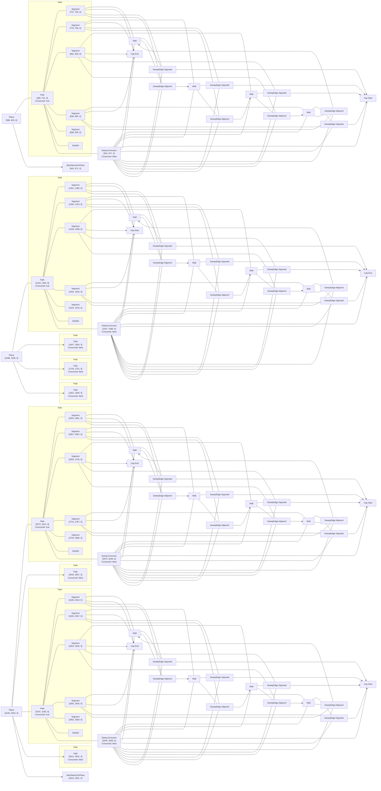

```mermaid
flowchart LR
  subgraph path2 [Path]
    2["Path<br>[690, 731, 0]<br>Consumed: true"]
      %% [ProgramBodyItem { index: 11 }, VariableDeclarationDeclaration, VariableDeclarationInit, PipeBodyItem { index: 0 }]
    3["Segment<br>[737, 764, 0]"]
      %% [ProgramBodyItem { index: 11 }, VariableDeclarationDeclaration, VariableDeclarationInit, PipeBodyItem { index: 1 }]
    4["Segment<br>[770, 796, 0]"]
      %% [ProgramBodyItem { index: 11 }, VariableDeclarationDeclaration, VariableDeclarationInit, PipeBodyItem { index: 2 }]
    5["Segment<br>[802, 830, 0]"]
      %% [ProgramBodyItem { index: 11 }, VariableDeclarationDeclaration, VariableDeclarationInit, PipeBodyItem { index: 3 }]
    6["Segment<br>[836, 892, 0]"]
      %% [ProgramBodyItem { index: 11 }, VariableDeclarationDeclaration, VariableDeclarationInit, PipeBodyItem { index: 4 }]
    7["Segment<br>[898, 905, 0]"]
      %% [ProgramBodyItem { index: 11 }, VariableDeclarationDeclaration, VariableDeclarationInit, PipeBodyItem { index: 5 }]
    8[Solid2d]
  end
  subgraph path25 [Path]
    25["Path<br>[1319, 1355, 0]<br>Consumed: true"]
      %% [ProgramBodyItem { index: 17 }, VariableDeclarationDeclaration, VariableDeclarationInit, PipeBodyItem { index: 0 }]
    26["Segment<br>[1361, 1389, 0]"]
      %% [ProgramBodyItem { index: 17 }, VariableDeclarationDeclaration, VariableDeclarationInit, PipeBodyItem { index: 1 }]
    27["Segment<br>[1395, 1423, 0]"]
      %% [ProgramBodyItem { index: 17 }, VariableDeclarationDeclaration, VariableDeclarationInit, PipeBodyItem { index: 2 }]
    28["Segment<br>[1429, 1458, 0]"]
      %% [ProgramBodyItem { index: 17 }, VariableDeclarationDeclaration, VariableDeclarationInit, PipeBodyItem { index: 3 }]
    29["Segment<br>[1464, 1520, 0]"]
      %% [ProgramBodyItem { index: 17 }, VariableDeclarationDeclaration, VariableDeclarationInit, PipeBodyItem { index: 4 }]
    30["Segment<br>[1526, 1533, 0]"]
      %% [ProgramBodyItem { index: 17 }, VariableDeclarationDeclaration, VariableDeclarationInit, PipeBodyItem { index: 5 }]
    31[Solid2d]
  end
  subgraph path47 [Path]
    47["Path<br>[1647, 1664, 0]<br>Consumed: false"]
      %% [ProgramBodyItem { index: 19 }, VariableDeclarationDeclaration, VariableDeclarationInit, PipeBodyItem { index: 0 }]
  end
  subgraph path48 [Path]
    48["Path<br>[1734, 1751, 0]<br>Consumed: false"]
      %% [ProgramBodyItem { index: 20 }, VariableDeclarationDeclaration, VariableDeclarationInit, PipeBodyItem { index: 0 }]
  end
  subgraph path49 [Path]
    49["Path<br>[1822, 1839, 0]<br>Consumed: false"]
      %% [ProgramBodyItem { index: 21 }, VariableDeclarationDeclaration, VariableDeclarationInit, PipeBodyItem { index: 0 }]
  end
  subgraph path51 [Path]
    51["Path<br>[2572, 2614, 0]<br>Consumed: true"]
      %% [ProgramBodyItem { index: 29 }, VariableDeclarationDeclaration, VariableDeclarationInit, PipeBodyItem { index: 0 }]
    52["Segment<br>[2620, 2651, 0]"]
      %% [ProgramBodyItem { index: 29 }, VariableDeclarationDeclaration, VariableDeclarationInit, PipeBodyItem { index: 1 }]
    53["Segment<br>[2657, 2687, 0]"]
      %% [ProgramBodyItem { index: 29 }, VariableDeclarationDeclaration, VariableDeclarationInit, PipeBodyItem { index: 2 }]
    54["Segment<br>[2693, 2725, 0]"]
      %% [ProgramBodyItem { index: 29 }, VariableDeclarationDeclaration, VariableDeclarationInit, PipeBodyItem { index: 3 }]
    55["Segment<br>[2731, 2787, 0]"]
      %% [ProgramBodyItem { index: 29 }, VariableDeclarationDeclaration, VariableDeclarationInit, PipeBodyItem { index: 4 }]
    56["Segment<br>[2793, 2800, 0]"]
      %% [ProgramBodyItem { index: 29 }, VariableDeclarationDeclaration, VariableDeclarationInit, PipeBodyItem { index: 5 }]
    57[Solid2d]
  end
  subgraph path73 [Path]
    73["Path<br>[3040, 3057, 0]<br>Consumed: false"]
      %% [ProgramBodyItem { index: 32 }, VariableDeclarationDeclaration, VariableDeclarationInit, PipeBodyItem { index: 0 }]
  end
  subgraph path74 [Path]
    74["Path<br>[3141, 3183, 0]<br>Consumed: true"]
      %% [ProgramBodyItem { index: 33 }, VariableDeclarationDeclaration, VariableDeclarationInit, PipeBodyItem { index: 0 }]
    75["Segment<br>[3189, 3219, 0]"]
      %% [ProgramBodyItem { index: 33 }, VariableDeclarationDeclaration, VariableDeclarationInit, PipeBodyItem { index: 1 }]
    76["Segment<br>[3225, 3257, 0]"]
      %% [ProgramBodyItem { index: 33 }, VariableDeclarationDeclaration, VariableDeclarationInit, PipeBodyItem { index: 2 }]
    77["Segment<br>[3263, 3294, 0]"]
      %% [ProgramBodyItem { index: 33 }, VariableDeclarationDeclaration, VariableDeclarationInit, PipeBodyItem { index: 3 }]
    78["Segment<br>[3300, 3356, 0]"]
      %% [ProgramBodyItem { index: 33 }, VariableDeclarationDeclaration, VariableDeclarationInit, PipeBodyItem { index: 4 }]
    79["Segment<br>[3362, 3369, 0]"]
      %% [ProgramBodyItem { index: 33 }, VariableDeclarationDeclaration, VariableDeclarationInit, PipeBodyItem { index: 5 }]
    80[Solid2d]
  end
  subgraph path96 [Path]
    96["Path<br>[3614, 3632, 0]<br>Consumed: false"]
      %% [ProgramBodyItem { index: 36 }, VariableDeclarationDeclaration, VariableDeclarationInit, PipeBodyItem { index: 0 }]
  end
  1["Plane<br>[588, 625, 0]"]
    %% [ProgramBodyItem { index: 9 }, VariableDeclarationDeclaration, VariableDeclarationInit]
  9["Sweep Extrusion<br>[924, 977, 0]<br>Consumed: false"]
    %% [ProgramBodyItem { index: 12 }, VariableDeclarationDeclaration, VariableDeclarationInit]
  10[Wall]
    %% face_code_ref=Missing NodePath
  11[Wall]
    %% face_code_ref=Missing NodePath
  12[Wall]
    %% face_code_ref=Missing NodePath
  13[Wall]
    %% face_code_ref=Missing NodePath
  14["Cap Start"]
    %% face_code_ref=Missing NodePath
  15["Cap End"]
    %% face_code_ref=Missing NodePath
  16["SweepEdge Opposite"]
  17["SweepEdge Adjacent"]
  18["SweepEdge Opposite"]
  19["SweepEdge Adjacent"]
  20["SweepEdge Opposite"]
  21["SweepEdge Adjacent"]
  22["SweepEdge Opposite"]
  23["SweepEdge Adjacent"]
  24["Plane<br>[1288, 1305, 0]"]
    %% [ProgramBodyItem { index: 16 }, VariableDeclarationDeclaration, VariableDeclarationInit]
  32["Sweep Extrusion<br>[1547, 1586, 0]<br>Consumed: false"]
    %% [ProgramBodyItem { index: 18 }, VariableDeclarationDeclaration, VariableDeclarationInit, PipeBodyItem { index: 0 }]
  33[Wall]
    %% face_code_ref=Missing NodePath
  34[Wall]
    %% face_code_ref=Missing NodePath
  35[Wall]
    %% face_code_ref=Missing NodePath
  36[Wall]
    %% face_code_ref=Missing NodePath
  37["Cap Start"]
    %% face_code_ref=Missing NodePath
  38["Cap End"]
    %% face_code_ref=Missing NodePath
  39["SweepEdge Opposite"]
  40["SweepEdge Adjacent"]
  41["SweepEdge Opposite"]
  42["SweepEdge Adjacent"]
  43["SweepEdge Opposite"]
  44["SweepEdge Adjacent"]
  45["SweepEdge Opposite"]
  46["SweepEdge Adjacent"]
  50["Plane<br>[2440, 2503, 0]"]
    %% [ProgramBodyItem { index: 27 }, VariableDeclarationDeclaration, VariableDeclarationInit]
  58["Sweep Extrusion<br>[2973, 3026, 0]<br>Consumed: false"]
    %% [ProgramBodyItem { index: 31 }, VariableDeclarationDeclaration, VariableDeclarationInit]
  59[Wall]
    %% face_code_ref=Missing NodePath
  60[Wall]
    %% face_code_ref=Missing NodePath
  61[Wall]
    %% face_code_ref=Missing NodePath
  62[Wall]
    %% face_code_ref=Missing NodePath
  63["Cap Start"]
    %% face_code_ref=Missing NodePath
  64["Cap End"]
    %% face_code_ref=Missing NodePath
  65["SweepEdge Opposite"]
  66["SweepEdge Adjacent"]
  67["SweepEdge Opposite"]
  68["SweepEdge Adjacent"]
  69["SweepEdge Opposite"]
  70["SweepEdge Adjacent"]
  71["SweepEdge Opposite"]
  72["SweepEdge Adjacent"]
  81["Sweep Extrusion<br>[3545, 3599, 0]<br>Consumed: false"]
    %% [ProgramBodyItem { index: 35 }, VariableDeclarationDeclaration, VariableDeclarationInit]
  82[Wall]
    %% face_code_ref=Missing NodePath
  83[Wall]
    %% face_code_ref=Missing NodePath
  84[Wall]
    %% face_code_ref=Missing NodePath
  85[Wall]
    %% face_code_ref=Missing NodePath
  86["Cap Start"]
    %% face_code_ref=Missing NodePath
  87["Cap End"]
    %% face_code_ref=Missing NodePath
  88["SweepEdge Opposite"]
  89["SweepEdge Adjacent"]
  90["SweepEdge Opposite"]
  91["SweepEdge Adjacent"]
  92["SweepEdge Opposite"]
  93["SweepEdge Adjacent"]
  94["SweepEdge Opposite"]
  95["SweepEdge Adjacent"]
  97["StartSketchOnPlane<br>[643, 671, 0]"]
    %% [ProgramBodyItem { index: 10 }, VariableDeclarationDeclaration, VariableDeclarationInit]
  98["StartSketchOnPlane<br>[2522, 2551, 0]"]
    %% [ProgramBodyItem { index: 28 }, VariableDeclarationDeclaration, VariableDeclarationInit]
  1 --- 2
  1 <--x 97
  2 --- 3
  2 --- 4
  2 --- 5
  2 --- 6
  2 --- 7
  2 --- 8
  2 ---- 9
  3 --- 13
  3 x--> 15
  3 --- 22
  3 --- 23
  4 --- 12
  4 x--> 15
  4 --- 20
  4 --- 21
  5 --- 11
  5 x--> 15
  5 --- 18
  5 --- 19
  6 --- 10
  6 x--> 15
  6 --- 16
  6 --- 17
  9 --- 10
  9 --- 11
  9 --- 12
  9 --- 13
  9 --- 14
  9 --- 15
  9 --- 16
  9 --- 17
  9 --- 18
  9 --- 19
  9 --- 20
  9 --- 21
  9 --- 22
  9 --- 23
  10 --- 16
  10 --- 17
  19 <--x 10
  11 --- 18
  11 --- 19
  21 <--x 11
  12 --- 20
  12 --- 21
  23 <--x 12
  17 <--x 13
  13 --- 22
  13 --- 23
  16 <--x 14
  18 <--x 14
  20 <--x 14
  22 <--x 14
  24 --- 25
  24 <--x 47
  24 <--x 48
  24 <--x 49
  25 --- 26
  25 --- 27
  25 --- 28
  25 --- 29
  25 --- 30
  25 --- 31
  25 ---- 32
  26 --- 36
  26 x--> 37
  26 --- 45
  26 --- 46
  27 --- 35
  27 x--> 37
  27 --- 43
  27 --- 44
  28 --- 34
  28 x--> 37
  28 --- 41
  28 --- 42
  29 --- 33
  29 x--> 37
  29 --- 39
  29 --- 40
  32 --- 33
  32 --- 34
  32 --- 35
  32 --- 36
  32 --- 37
  32 --- 38
  32 --- 39
  32 --- 40
  32 --- 41
  32 --- 42
  32 --- 43
  32 --- 44
  32 --- 45
  32 --- 46
  33 --- 39
  33 --- 40
  42 <--x 33
  34 --- 41
  34 --- 42
  44 <--x 34
  35 --- 43
  35 --- 44
  46 <--x 35
  40 <--x 36
  36 --- 45
  36 --- 46
  39 <--x 38
  41 <--x 38
  43 <--x 38
  45 <--x 38
  50 --- 51
  50 <--x 73
  50 --- 74
  50 <--x 96
  50 <--x 98
  51 --- 52
  51 --- 53
  51 --- 54
  51 --- 55
  51 --- 56
  51 --- 57
  51 ---- 58
  52 --- 62
  52 x--> 64
  52 --- 71
  52 --- 72
  53 --- 61
  53 x--> 64
  53 --- 69
  53 --- 70
  54 --- 60
  54 x--> 64
  54 --- 67
  54 --- 68
  55 --- 59
  55 x--> 64
  55 --- 65
  55 --- 66
  58 --- 59
  58 --- 60
  58 --- 61
  58 --- 62
  58 --- 63
  58 --- 64
  58 --- 65
  58 --- 66
  58 --- 67
  58 --- 68
  58 --- 69
  58 --- 70
  58 --- 71
  58 --- 72
  59 --- 65
  59 --- 66
  68 <--x 59
  60 --- 67
  60 --- 68
  70 <--x 60
  61 --- 69
  61 --- 70
  72 <--x 61
  66 <--x 62
  62 --- 71
  62 --- 72
  65 <--x 63
  67 <--x 63
  69 <--x 63
  71 <--x 63
  74 --- 75
  74 --- 76
  74 --- 77
  74 --- 78
  74 --- 79
  74 --- 80
  74 ---- 81
  75 --- 85
  75 x--> 87
  75 --- 94
  75 --- 95
  76 --- 84
  76 x--> 87
  76 --- 92
  76 --- 93
  77 --- 83
  77 x--> 87
  77 --- 90
  77 --- 91
  78 --- 82
  78 x--> 87
  78 --- 88
  78 --- 89
  81 --- 82
  81 --- 83
  81 --- 84
  81 --- 85
  81 --- 86
  81 --- 87
  81 --- 88
  81 --- 89
  81 --- 90
  81 --- 91
  81 --- 92
  81 --- 93
  81 --- 94
  81 --- 95
  82 --- 88
  82 --- 89
  91 <--x 82
  83 --- 90
  83 --- 91
  93 <--x 83
  84 --- 92
  84 --- 93
  95 <--x 84
  89 <--x 85
  85 --- 94
  85 --- 95
  88 <--x 86
  90 <--x 86
  92 <--x 86
  94 <--x 86
```
