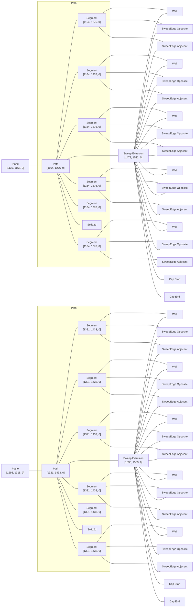

```mermaid
flowchart LR
  subgraph path2 [Path]
    2["Path<br>[1164, 1276, 0]"]
    3["Segment<br>[1164, 1276, 0]"]
    4["Segment<br>[1164, 1276, 0]"]
    5["Segment<br>[1164, 1276, 0]"]
    6["Segment<br>[1164, 1276, 0]"]
    7["Segment<br>[1164, 1276, 0]"]
    8["Segment<br>[1164, 1276, 0]"]
    9[Solid2d]
  end
  subgraph path11 [Path]
    11["Path<br>[1321, 1433, 0]"]
    12["Segment<br>[1321, 1433, 0]"]
    13["Segment<br>[1321, 1433, 0]"]
    14["Segment<br>[1321, 1433, 0]"]
    15["Segment<br>[1321, 1433, 0]"]
    16["Segment<br>[1321, 1433, 0]"]
    17["Segment<br>[1321, 1433, 0]"]
    18[Solid2d]
  end
  1["Plane<br>[1139, 1158, 0]"]
  10["Plane<br>[1295, 1315, 0]"]
  19["Sweep Extrusion<br>[1479, 1522, 0]"]
  20[Wall]
  21[Wall]
  22[Wall]
  23[Wall]
  24[Wall]
  25["Cap Start"]
  26["Cap End"]
  27["SweepEdge Opposite"]
  28["SweepEdge Adjacent"]
  29["SweepEdge Opposite"]
  30["SweepEdge Adjacent"]
  31["SweepEdge Opposite"]
  32["SweepEdge Adjacent"]
  33["SweepEdge Opposite"]
  34["SweepEdge Adjacent"]
  35["SweepEdge Opposite"]
  36["SweepEdge Adjacent"]
  37["Sweep Extrusion<br>[1536, 1583, 0]"]
  38[Wall]
  39[Wall]
  40[Wall]
  41[Wall]
  42[Wall]
  43["Cap Start"]
  44["Cap End"]
  45["SweepEdge Opposite"]
  46["SweepEdge Adjacent"]
  47["SweepEdge Opposite"]
  48["SweepEdge Adjacent"]
  49["SweepEdge Opposite"]
  50["SweepEdge Adjacent"]
  51["SweepEdge Opposite"]
  52["SweepEdge Adjacent"]
  53["SweepEdge Opposite"]
  54["SweepEdge Adjacent"]
  1 --- 2
  2 --- 3
  2 --- 4
  2 --- 5
  2 --- 6
  2 --- 7
  2 --- 8
  2 ---- 19
  2 --- 9
  3 --- 20
  3 --- 27
  3 --- 28
  4 --- 21
  4 --- 29
  4 --- 30
  5 --- 22
  5 --- 31
  5 --- 32
  6 --- 23
  6 --- 33
  6 --- 34
  7 --- 24
  7 --- 35
  7 --- 36
  10 --- 11
  11 --- 12
  11 --- 13
  11 --- 14
  11 --- 15
  11 --- 16
  11 --- 17
  11 ---- 37
  11 --- 18
  12 --- 42
  12 --- 53
  12 --- 54
  13 --- 41
  13 --- 51
  13 --- 52
  14 --- 40
  14 --- 49
  14 --- 50
  15 --- 39
  15 --- 47
  15 --- 48
  16 --- 38
  16 --- 45
  16 --- 46
  19 --- 20
  19 --- 21
  19 --- 22
  19 --- 23
  19 --- 24
  19 --- 25
  19 --- 26
  19 --- 27
  19 --- 28
  19 --- 29
  19 --- 30
  19 --- 31
  19 --- 32
  19 --- 33
  19 --- 34
  19 --- 35
  19 --- 36
  37 --- 38
  37 --- 39
  37 --- 40
  37 --- 41
  37 --- 42
  37 --- 43
  37 --- 44
  37 --- 45
  37 --- 46
  37 --- 47
  37 --- 48
  37 --- 49
  37 --- 50
  37 --- 51
  37 --- 52
  37 --- 53
  37 --- 54
```
