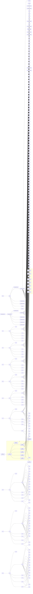

```mermaid
flowchart LR
  subgraph path2 [Path]
    2["Path<br>[1130, 1238, 0]"]
    3["Segment<br>[1130, 1238, 0]"]
    4["Segment<br>[1130, 1238, 0]"]
    5["Segment<br>[1130, 1238, 0]"]
    6["Segment<br>[1130, 1238, 0]"]
    7["Segment<br>[1130, 1238, 0]"]
    8["Segment<br>[1130, 1238, 0]"]
    9[Solid2d]
  end
  subgraph path11 [Path]
    11["Path<br>[1283, 1391, 0]"]
    12["Segment<br>[1283, 1391, 0]"]
    13["Segment<br>[1283, 1391, 0]"]
    14["Segment<br>[1283, 1391, 0]"]
    15["Segment<br>[1283, 1391, 0]"]
    16["Segment<br>[1283, 1391, 0]"]
    17["Segment<br>[1283, 1391, 0]"]
    18[Solid2d]
  end
  1["Plane<br>[1107, 1124, 0]"]
  10["Plane<br>[1257, 1277, 0]"]
  19["Sweep Extrusion<br>[1437, 1480, 0]"]
  20[Wall]
  21[Wall]
  22[Wall]
  23[Wall]
  24[Wall]
  25["Cap Start"]
  26["Cap End"]
  27["SweepEdge Opposite"]
  28["SweepEdge Adjacent"]
  29["SweepEdge Opposite"]
  30["SweepEdge Adjacent"]
  31["SweepEdge Opposite"]
  32["SweepEdge Adjacent"]
  33["SweepEdge Opposite"]
  34["SweepEdge Adjacent"]
  35["SweepEdge Opposite"]
  36["SweepEdge Adjacent"]
  37["Sweep Extrusion<br>[1494, 1541, 0]"]
  38[Wall]
  39[Wall]
  40[Wall]
  41[Wall]
  42[Wall]
  43["Cap Start"]
  44["Cap End"]
  45["SweepEdge Opposite"]
  46["SweepEdge Adjacent"]
  47["SweepEdge Opposite"]
  48["SweepEdge Adjacent"]
  49["SweepEdge Opposite"]
  50["SweepEdge Adjacent"]
  51["SweepEdge Opposite"]
  52["SweepEdge Adjacent"]
  53["SweepEdge Opposite"]
  54["SweepEdge Adjacent"]
  1 --- 2
  2 --- 3
  2 --- 4
  2 --- 5
  2 --- 6
  2 ---- 8
  2 --- 7
  3 --- 9
  3 --- 15
  3 --- 16
  4 --- 10
  4 --- 17
  4 --- 18
  5 --- 11
  5 --- 19
  5 --- 20
  6 --- 12
  6 --- 21
  6 --- 22
  8 --- 9
  8 --- 10
  8 --- 11
  8 --- 12
  8 --- 13
  8 --- 14
  8 --- 15
  8 --- 16
  8 --- 17
  8 --- 18
  8 --- 19
  8 --- 20
  8 --- 21
  8 --- 22
  23 --- 24
  24 --- 25
  24 --- 26
  24 --- 27
  24 --- 28
  24 ---- 30
  24 --- 29
  25 --- 31
  25 --- 37
  25 --- 38
  26 --- 32
  26 --- 39
  26 --- 40
  27 --- 33
  27 --- 41
  27 --- 42
  28 --- 34
  28 --- 43
  28 --- 44
  30 --- 31
  30 --- 32
  30 --- 33
  30 --- 34
  30 --- 35
  30 --- 36
  30 --- 37
  30 --- 38
  30 --- 39
  30 --- 40
  30 --- 41
  30 --- 42
  30 --- 43
  30 --- 44
  45 --- 46
  46 --- 47
  46 --- 48
  46 --- 49
  46 --- 50
  46 ---- 52
  46 --- 51
  47 --- 53
  47 --- 59
  47 --- 60
  48 --- 54
  48 --- 61
  48 --- 62
  49 --- 55
  49 --- 63
  49 --- 64
  50 --- 56
  50 --- 65
  50 --- 66
  52 --- 53
  52 --- 54
  52 --- 55
  52 --- 56
  52 --- 57
  52 --- 58
  52 --- 59
  52 --- 60
  52 --- 61
  52 --- 62
  52 --- 63
  52 --- 64
  52 --- 65
  52 --- 66
  67 --- 68
  68 --- 69
  68 --- 70
  68 --- 71
  68 --- 72
  68 ---- 74
  68 --- 73
  69 --- 75
  69 --- 81
  69 --- 82
  70 --- 76
  70 --- 83
  70 --- 84
  71 --- 77
  71 --- 85
  71 --- 86
  72 --- 78
  72 --- 87
  72 --- 88
  74 --- 75
  74 --- 76
  74 --- 77
  74 --- 78
  74 --- 79
  74 --- 80
  74 --- 81
  74 --- 82
  74 --- 83
  74 --- 84
  74 --- 85
  74 --- 86
  74 --- 87
  74 --- 88
  89 --- 90
  90 --- 91
  90 --- 92
  90 --- 93
  90 --- 94
  90 ---- 96
  90 --- 95
  91 --- 97
  91 --- 103
  91 --- 104
  92 --- 98
  92 --- 105
  92 --- 106
  93 --- 99
  93 --- 107
  93 --- 108
  94 --- 100
  94 --- 109
  94 --- 110
  96 --- 97
  96 --- 98
  96 --- 99
  96 --- 100
  96 --- 101
  96 --- 102
  96 --- 103
  96 --- 104
  96 --- 105
  96 --- 106
  96 --- 107
  96 --- 108
  96 --- 109
  96 --- 110
  111 --- 112
  112 --- 113
  112 --- 114
  112 --- 115
  112 --- 116
  112 ---- 118
  112 --- 117
  113 --- 119
  113 --- 125
  113 --- 126
  114 --- 120
  114 --- 127
  114 --- 128
  115 --- 121
  115 --- 129
  115 --- 130
  116 --- 122
  116 --- 131
  116 --- 132
  118 --- 119
  118 --- 120
  118 --- 121
  118 --- 122
  118 --- 123
  118 --- 124
  118 --- 125
  118 --- 126
  118 --- 127
  118 --- 128
  118 --- 129
  118 --- 130
  118 --- 131
  118 --- 132
  133 --- 134
  134 --- 135
  134 --- 136
  134 --- 137
  134 --- 138
  134 ---- 140
  134 --- 139
  135 --- 141
  135 --- 147
  135 --- 148
  136 --- 142
  136 --- 149
  136 --- 150
  137 --- 143
  137 --- 151
  137 --- 152
  138 --- 144
  138 --- 153
  138 --- 154
  140 --- 141
  140 --- 142
  140 --- 143
  140 --- 144
  140 --- 145
  140 --- 146
  140 --- 147
  140 --- 148
  140 --- 149
  140 --- 150
  140 --- 151
  140 --- 152
  140 --- 153
  140 --- 154
  155 --- 156
  156 --- 157
  156 --- 158
  156 --- 159
  156 --- 160
  156 ---- 162
  156 --- 161
  157 --- 163
  157 --- 169
  157 --- 170
  158 --- 164
  158 --- 171
  158 --- 172
  159 --- 165
  159 --- 173
  159 --- 174
  160 --- 166
  160 --- 175
  160 --- 176
  162 --- 163
  162 --- 164
  162 --- 165
  162 --- 166
  162 --- 167
  162 --- 168
  162 --- 169
  162 --- 170
  162 --- 171
  162 --- 172
  162 --- 173
  162 --- 174
  162 --- 175
  162 --- 176
  177 --- 178
  178 --- 179
  178 --- 180
  178 --- 181
  178 --- 182
  178 ---- 184
  178 --- 183
  179 --- 185
  179 --- 191
  179 --- 192
  180 --- 186
  180 --- 193
  180 --- 194
  181 --- 187
  181 --- 195
  181 --- 196
  182 --- 188
  182 --- 197
  182 --- 198
  184 --- 185
  184 --- 186
  184 --- 187
  184 --- 188
  184 --- 189
  184 --- 190
  184 --- 191
  184 --- 192
  184 --- 193
  184 --- 194
  184 --- 195
  184 --- 196
  184 --- 197
  184 --- 198
  199 --- 200
  200 --- 201
  200 --- 202
  200 --- 203
  200 --- 204
  200 ---- 206
  200 --- 205
  201 --- 207
  201 --- 213
  201 --- 214
  202 --- 208
  202 --- 215
  202 --- 216
  203 --- 209
  203 --- 217
  203 --- 218
  204 --- 210
  204 --- 219
  204 --- 220
  206 --- 207
  206 --- 208
  206 --- 209
  206 --- 210
  206 --- 211
  206 --- 212
  206 --- 213
  206 --- 214
  206 --- 215
  206 --- 216
  206 --- 217
  206 --- 218
  206 --- 219
  206 --- 220
  221 --- 222
  222 --- 223
  222 --- 224
  222 --- 225
  222 --- 226
  222 ---- 228
  222 --- 227
  223 --- 229
  223 --- 235
  223 --- 236
  224 --- 230
  224 --- 237
  224 --- 238
  225 --- 231
  225 --- 239
  225 --- 240
  226 --- 232
  226 --- 241
  226 --- 242
  228 --- 229
  228 --- 230
  228 --- 231
  228 --- 232
  228 --- 233
  228 --- 234
  228 --- 235
  228 --- 236
  228 --- 237
  228 --- 238
  228 --- 239
  228 --- 240
  228 --- 241
  228 --- 242
  243 --- 244
  244 --- 245
  244 --- 246
  244 --- 247
  244 --- 248
  244 ---- 250
  244 --- 249
  245 --- 251
  245 --- 257
  245 --- 258
  246 --- 252
  246 --- 259
  246 --- 260
  247 --- 253
  247 --- 261
  247 --- 262
  248 --- 254
  248 --- 263
  248 --- 264
  250 --- 251
  250 --- 252
  250 --- 253
  250 --- 254
  250 --- 255
  250 --- 256
  250 --- 257
  250 --- 258
  250 --- 259
  250 --- 260
  250 --- 261
  250 --- 262
  250 --- 263
  250 --- 264
```
