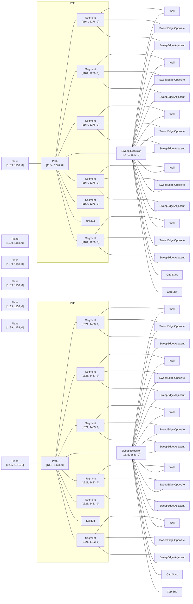

```mermaid
flowchart LR
  subgraph path7 [Path]
    7["Path<br>[1164, 1276, 0]"]
    8["Segment<br>[1164, 1276, 0]"]
    9["Segment<br>[1164, 1276, 0]"]
    10["Segment<br>[1164, 1276, 0]"]
    11["Segment<br>[1164, 1276, 0]"]
    12["Segment<br>[1164, 1276, 0]"]
    13["Segment<br>[1164, 1276, 0]"]
    14[Solid2d]
  end
  subgraph path16 [Path]
    16["Path<br>[1321, 1433, 0]"]
    17["Segment<br>[1321, 1433, 0]"]
    18["Segment<br>[1321, 1433, 0]"]
    19["Segment<br>[1321, 1433, 0]"]
    20["Segment<br>[1321, 1433, 0]"]
    21["Segment<br>[1321, 1433, 0]"]
    22["Segment<br>[1321, 1433, 0]"]
    23[Solid2d]
  end
  1["Plane<br>[1139, 1158, 0]"]
  2["Plane<br>[1139, 1158, 0]"]
  3["Plane<br>[1139, 1158, 0]"]
  4["Plane<br>[1139, 1158, 0]"]
  5["Plane<br>[1139, 1158, 0]"]
  6["Plane<br>[1139, 1158, 0]"]
  15["Plane<br>[1295, 1315, 0]"]
  24["Sweep Extrusion<br>[1479, 1522, 0]"]
  25[Wall]
  26[Wall]
  27[Wall]
  28[Wall]
  29[Wall]
  30["Cap Start"]
  31["Cap End"]
  32["SweepEdge Opposite"]
  33["SweepEdge Adjacent"]
  34["SweepEdge Opposite"]
  35["SweepEdge Adjacent"]
  36["SweepEdge Opposite"]
  37["SweepEdge Adjacent"]
  38["SweepEdge Opposite"]
  39["SweepEdge Adjacent"]
  40["SweepEdge Opposite"]
  41["SweepEdge Adjacent"]
  42["Sweep Extrusion<br>[1536, 1583, 0]"]
  43[Wall]
  44[Wall]
  45[Wall]
  46[Wall]
  47[Wall]
  48["Cap Start"]
  49["Cap End"]
  50["SweepEdge Opposite"]
  51["SweepEdge Adjacent"]
  52["SweepEdge Opposite"]
  53["SweepEdge Adjacent"]
  54["SweepEdge Opposite"]
  55["SweepEdge Adjacent"]
  56["SweepEdge Opposite"]
  57["SweepEdge Adjacent"]
  58["SweepEdge Opposite"]
  59["SweepEdge Adjacent"]
  1 --- 7
  7 --- 8
  7 --- 9
  7 --- 10
  7 --- 11
  7 --- 12
  7 --- 13
  7 ---- 24
  7 --- 14
  8 --- 25
  8 --- 32
  8 --- 33
  9 --- 26
  9 --- 34
  9 --- 35
  10 --- 27
  10 --- 36
  10 --- 37
  11 --- 28
  11 --- 38
  11 --- 39
  12 --- 29
  12 --- 40
  12 --- 41
  15 --- 16
  16 --- 17
  16 --- 18
  16 --- 19
  16 --- 20
  16 --- 21
  16 --- 22
  16 ---- 42
  16 --- 23
  17 --- 47
  17 --- 58
  17 --- 59
  18 --- 46
  18 --- 56
  18 --- 57
  19 --- 45
  19 --- 54
  19 --- 55
  20 --- 44
  20 --- 52
  20 --- 53
  21 --- 43
  21 --- 50
  21 --- 51
  24 --- 25
  24 --- 26
  24 --- 27
  24 --- 28
  24 --- 29
  24 --- 30
  24 --- 31
  24 --- 32
  24 --- 33
  24 --- 34
  24 --- 35
  24 --- 36
  24 --- 37
  24 --- 38
  24 --- 39
  24 --- 40
  24 --- 41
  42 --- 43
  42 --- 44
  42 --- 45
  42 --- 46
  42 --- 47
  42 --- 48
  42 --- 49
  42 --- 50
  42 --- 51
  42 --- 52
  42 --- 53
  42 --- 54
  42 --- 55
  42 --- 56
  42 --- 57
  42 --- 58
  42 --- 59
```
