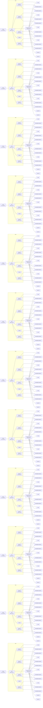

```mermaid
flowchart LR
  subgraph path2 [Path]
    2["Path<br>[498, 549, 0]"]
    3["Segment<br>[557, 608, 0]"]
    4["Segment<br>[616, 666, 0]"]
    5["Segment<br>[674, 725, 0]"]
    6["Segment<br>[733, 740, 0]"]
    7[Solid2d]
  end
  subgraph path24 [Path]
    24["Path<br>[498, 549, 0]"]
    25["Segment<br>[557, 608, 0]"]
    26["Segment<br>[616, 666, 0]"]
    27["Segment<br>[674, 725, 0]"]
    28["Segment<br>[733, 740, 0]"]
    29[Solid2d]
  end
  subgraph path46 [Path]
    46["Path<br>[498, 549, 0]"]
    47["Segment<br>[557, 608, 0]"]
    48["Segment<br>[616, 666, 0]"]
    49["Segment<br>[674, 725, 0]"]
    50["Segment<br>[733, 740, 0]"]
    51[Solid2d]
  end
  subgraph path68 [Path]
    68["Path<br>[498, 549, 0]"]
    69["Segment<br>[557, 608, 0]"]
    70["Segment<br>[616, 666, 0]"]
    71["Segment<br>[674, 725, 0]"]
    72["Segment<br>[733, 740, 0]"]
    73[Solid2d]
  end
  subgraph path90 [Path]
    90["Path<br>[498, 549, 0]"]
    91["Segment<br>[557, 608, 0]"]
    92["Segment<br>[616, 666, 0]"]
    93["Segment<br>[674, 725, 0]"]
    94["Segment<br>[733, 740, 0]"]
    95[Solid2d]
  end
  subgraph path112 [Path]
    112["Path<br>[498, 549, 0]"]
    113["Segment<br>[557, 608, 0]"]
    114["Segment<br>[616, 666, 0]"]
    115["Segment<br>[674, 725, 0]"]
    116["Segment<br>[733, 740, 0]"]
    117[Solid2d]
  end
  subgraph path134 [Path]
    134["Path<br>[498, 549, 0]"]
    135["Segment<br>[557, 608, 0]"]
    136["Segment<br>[616, 666, 0]"]
    137["Segment<br>[674, 725, 0]"]
    138["Segment<br>[733, 740, 0]"]
    139[Solid2d]
  end
  subgraph path156 [Path]
    156["Path<br>[498, 549, 0]"]
    157["Segment<br>[557, 608, 0]"]
    158["Segment<br>[616, 666, 0]"]
    159["Segment<br>[674, 725, 0]"]
    160["Segment<br>[733, 740, 0]"]
    161[Solid2d]
  end
  subgraph path178 [Path]
    178["Path<br>[498, 549, 0]"]
    179["Segment<br>[557, 608, 0]"]
    180["Segment<br>[616, 666, 0]"]
    181["Segment<br>[674, 725, 0]"]
    182["Segment<br>[733, 740, 0]"]
    183[Solid2d]
  end
  subgraph path200 [Path]
    200["Path<br>[498, 549, 0]"]
    201["Segment<br>[557, 608, 0]"]
    202["Segment<br>[616, 666, 0]"]
    203["Segment<br>[674, 725, 0]"]
    204["Segment<br>[733, 740, 0]"]
    205[Solid2d]
  end
  subgraph path222 [Path]
    222["Path<br>[498, 549, 0]"]
    223["Segment<br>[557, 608, 0]"]
    224["Segment<br>[616, 666, 0]"]
    225["Segment<br>[674, 725, 0]"]
    226["Segment<br>[733, 740, 0]"]
    227[Solid2d]
  end
  subgraph path244 [Path]
    244["Path<br>[498, 549, 0]"]
    245["Segment<br>[557, 608, 0]"]
    246["Segment<br>[616, 666, 0]"]
    247["Segment<br>[674, 725, 0]"]
    248["Segment<br>[733, 740, 0]"]
    249[Solid2d]
  end
  1["Plane<br>[473, 490, 0]"]
  8["Sweep Extrusion<br>[754, 804, 0]"]
  9[Wall]
  10[Wall]
  11[Wall]
  12[Wall]
  13["Cap Start"]
  14["Cap End"]
  15["SweepEdge Opposite"]
  16["SweepEdge Adjacent"]
  17["SweepEdge Opposite"]
  18["SweepEdge Adjacent"]
  19["SweepEdge Opposite"]
  20["SweepEdge Adjacent"]
  21["SweepEdge Opposite"]
  22["SweepEdge Adjacent"]
  23["Plane<br>[473, 490, 0]"]
  30["Sweep Extrusion<br>[754, 804, 0]"]
  31[Wall]
  32[Wall]
  33[Wall]
  34[Wall]
  35["Cap Start"]
  36["Cap End"]
  37["SweepEdge Opposite"]
  38["SweepEdge Adjacent"]
  39["SweepEdge Opposite"]
  40["SweepEdge Adjacent"]
  41["SweepEdge Opposite"]
  42["SweepEdge Adjacent"]
  43["SweepEdge Opposite"]
  44["SweepEdge Adjacent"]
  45["Plane<br>[473, 490, 0]"]
  52["Sweep Extrusion<br>[754, 804, 0]"]
  53[Wall]
  54[Wall]
  55[Wall]
  56[Wall]
  57["Cap Start"]
  58["Cap End"]
  59["SweepEdge Opposite"]
  60["SweepEdge Adjacent"]
  61["SweepEdge Opposite"]
  62["SweepEdge Adjacent"]
  63["SweepEdge Opposite"]
  64["SweepEdge Adjacent"]
  65["SweepEdge Opposite"]
  66["SweepEdge Adjacent"]
  67["Plane<br>[473, 490, 0]"]
  74["Sweep Extrusion<br>[754, 804, 0]"]
  75[Wall]
  76[Wall]
  77[Wall]
  78[Wall]
  79["Cap Start"]
  80["Cap End"]
  81["SweepEdge Opposite"]
  82["SweepEdge Adjacent"]
  83["SweepEdge Opposite"]
  84["SweepEdge Adjacent"]
  85["SweepEdge Opposite"]
  86["SweepEdge Adjacent"]
  87["SweepEdge Opposite"]
  88["SweepEdge Adjacent"]
  89["Plane<br>[473, 490, 0]"]
  96["Sweep Extrusion<br>[754, 804, 0]"]
  97[Wall]
  98[Wall]
  99[Wall]
  100[Wall]
  101["Cap Start"]
  102["Cap End"]
  103["SweepEdge Opposite"]
  104["SweepEdge Adjacent"]
  105["SweepEdge Opposite"]
  106["SweepEdge Adjacent"]
  107["SweepEdge Opposite"]
  108["SweepEdge Adjacent"]
  109["SweepEdge Opposite"]
  110["SweepEdge Adjacent"]
  111["Plane<br>[473, 490, 0]"]
  118["Sweep Extrusion<br>[754, 804, 0]"]
  119[Wall]
  120[Wall]
  121[Wall]
  122[Wall]
  123["Cap Start"]
  124["Cap End"]
  125["SweepEdge Opposite"]
  126["SweepEdge Adjacent"]
  127["SweepEdge Opposite"]
  128["SweepEdge Adjacent"]
  129["SweepEdge Opposite"]
  130["SweepEdge Adjacent"]
  131["SweepEdge Opposite"]
  132["SweepEdge Adjacent"]
  133["Plane<br>[473, 490, 0]"]
  140["Sweep Extrusion<br>[754, 804, 0]"]
  141[Wall]
  142[Wall]
  143[Wall]
  144[Wall]
  145["Cap Start"]
  146["Cap End"]
  147["SweepEdge Opposite"]
  148["SweepEdge Adjacent"]
  149["SweepEdge Opposite"]
  150["SweepEdge Adjacent"]
  151["SweepEdge Opposite"]
  152["SweepEdge Adjacent"]
  153["SweepEdge Opposite"]
  154["SweepEdge Adjacent"]
  155["Plane<br>[473, 490, 0]"]
  162["Sweep Extrusion<br>[754, 804, 0]"]
  163[Wall]
  164[Wall]
  165[Wall]
  166[Wall]
  167["Cap Start"]
  168["Cap End"]
  169["SweepEdge Opposite"]
  170["SweepEdge Adjacent"]
  171["SweepEdge Opposite"]
  172["SweepEdge Adjacent"]
  173["SweepEdge Opposite"]
  174["SweepEdge Adjacent"]
  175["SweepEdge Opposite"]
  176["SweepEdge Adjacent"]
  177["Plane<br>[473, 490, 0]"]
  184["Sweep Extrusion<br>[754, 804, 0]"]
  185[Wall]
  186[Wall]
  187[Wall]
  188[Wall]
  189["Cap Start"]
  190["Cap End"]
  191["SweepEdge Opposite"]
  192["SweepEdge Adjacent"]
  193["SweepEdge Opposite"]
  194["SweepEdge Adjacent"]
  195["SweepEdge Opposite"]
  196["SweepEdge Adjacent"]
  197["SweepEdge Opposite"]
  198["SweepEdge Adjacent"]
  199["Plane<br>[473, 490, 0]"]
  206["Sweep Extrusion<br>[754, 804, 0]"]
  207[Wall]
  208[Wall]
  209[Wall]
  210[Wall]
  211["Cap Start"]
  212["Cap End"]
  213["SweepEdge Opposite"]
  214["SweepEdge Adjacent"]
  215["SweepEdge Opposite"]
  216["SweepEdge Adjacent"]
  217["SweepEdge Opposite"]
  218["SweepEdge Adjacent"]
  219["SweepEdge Opposite"]
  220["SweepEdge Adjacent"]
  221["Plane<br>[473, 490, 0]"]
  228["Sweep Extrusion<br>[754, 804, 0]"]
  229[Wall]
  230[Wall]
  231[Wall]
  232[Wall]
  233["Cap Start"]
  234["Cap End"]
  235["SweepEdge Opposite"]
  236["SweepEdge Adjacent"]
  237["SweepEdge Opposite"]
  238["SweepEdge Adjacent"]
  239["SweepEdge Opposite"]
  240["SweepEdge Adjacent"]
  241["SweepEdge Opposite"]
  242["SweepEdge Adjacent"]
  243["Plane<br>[473, 490, 0]"]
  250["Sweep Extrusion<br>[754, 804, 0]"]
  251[Wall]
  252[Wall]
  253[Wall]
  254[Wall]
  255["Cap Start"]
  256["Cap End"]
  257["SweepEdge Opposite"]
  258["SweepEdge Adjacent"]
  259["SweepEdge Opposite"]
  260["SweepEdge Adjacent"]
  261["SweepEdge Opposite"]
  262["SweepEdge Adjacent"]
  263["SweepEdge Opposite"]
  264["SweepEdge Adjacent"]
  1 --- 2
  2 --- 3
  2 --- 4
  2 --- 5
  2 --- 6
  2 ---- 8
  2 --- 7
  3 --- 9
  3 --- 15
  3 --- 16
  4 --- 10
  4 --- 17
  4 --- 18
  5 --- 11
  5 --- 19
  5 --- 20
  6 --- 12
  6 --- 21
  6 --- 22
  8 --- 9
  8 --- 10
  8 --- 11
  8 --- 12
  8 --- 13
  8 --- 14
  8 --- 15
  8 --- 16
  8 --- 17
  8 --- 18
  8 --- 19
  8 --- 20
  8 --- 21
  8 --- 22
  23 --- 24
  24 --- 25
  24 --- 26
  24 --- 27
  24 --- 28
  24 ---- 30
  24 --- 29
  25 --- 31
  25 --- 37
  25 --- 38
  26 --- 32
  26 --- 39
  26 --- 40
  27 --- 33
  27 --- 41
  27 --- 42
  28 --- 34
  28 --- 43
  28 --- 44
  30 --- 31
  30 --- 32
  30 --- 33
  30 --- 34
  30 --- 35
  30 --- 36
  30 --- 37
  30 --- 38
  30 --- 39
  30 --- 40
  30 --- 41
  30 --- 42
  30 --- 43
  30 --- 44
  45 --- 46
  46 --- 47
  46 --- 48
  46 --- 49
  46 --- 50
  46 ---- 52
  46 --- 51
  47 --- 53
  47 --- 59
  47 --- 60
  48 --- 54
  48 --- 61
  48 --- 62
  49 --- 55
  49 --- 63
  49 --- 64
  50 --- 56
  50 --- 65
  50 --- 66
  52 --- 53
  52 --- 54
  52 --- 55
  52 --- 56
  52 --- 57
  52 --- 58
  52 --- 59
  52 --- 60
  52 --- 61
  52 --- 62
  52 --- 63
  52 --- 64
  52 --- 65
  52 --- 66
  67 --- 68
  68 --- 69
  68 --- 70
  68 --- 71
  68 --- 72
  68 ---- 74
  68 --- 73
  69 --- 75
  69 --- 81
  69 --- 82
  70 --- 76
  70 --- 83
  70 --- 84
  71 --- 77
  71 --- 85
  71 --- 86
  72 --- 78
  72 --- 87
  72 --- 88
  74 --- 75
  74 --- 76
  74 --- 77
  74 --- 78
  74 --- 79
  74 --- 80
  74 --- 81
  74 --- 82
  74 --- 83
  74 --- 84
  74 --- 85
  74 --- 86
  74 --- 87
  74 --- 88
  89 --- 90
  90 --- 91
  90 --- 92
  90 --- 93
  90 --- 94
  90 ---- 96
  90 --- 95
  91 --- 97
  91 --- 103
  91 --- 104
  92 --- 98
  92 --- 105
  92 --- 106
  93 --- 99
  93 --- 107
  93 --- 108
  94 --- 100
  94 --- 109
  94 --- 110
  96 --- 97
  96 --- 98
  96 --- 99
  96 --- 100
  96 --- 101
  96 --- 102
  96 --- 103
  96 --- 104
  96 --- 105
  96 --- 106
  96 --- 107
  96 --- 108
  96 --- 109
  96 --- 110
  111 --- 112
  112 --- 113
  112 --- 114
  112 --- 115
  112 --- 116
  112 ---- 118
  112 --- 117
  113 --- 119
  113 --- 125
  113 --- 126
  114 --- 120
  114 --- 127
  114 --- 128
  115 --- 121
  115 --- 129
  115 --- 130
  116 --- 122
  116 --- 131
  116 --- 132
  118 --- 119
  118 --- 120
  118 --- 121
  118 --- 122
  118 --- 123
  118 --- 124
  118 --- 125
  118 --- 126
  118 --- 127
  118 --- 128
  118 --- 129
  118 --- 130
  118 --- 131
  118 --- 132
  133 --- 134
  134 --- 135
  134 --- 136
  134 --- 137
  134 --- 138
  134 ---- 140
  134 --- 139
  135 --- 141
  135 --- 147
  135 --- 148
  136 --- 142
  136 --- 149
  136 --- 150
  137 --- 143
  137 --- 151
  137 --- 152
  138 --- 144
  138 --- 153
  138 --- 154
  140 --- 141
  140 --- 142
  140 --- 143
  140 --- 144
  140 --- 145
  140 --- 146
  140 --- 147
  140 --- 148
  140 --- 149
  140 --- 150
  140 --- 151
  140 --- 152
  140 --- 153
  140 --- 154
  155 --- 156
  156 --- 157
  156 --- 158
  156 --- 159
  156 --- 160
  156 ---- 162
  156 --- 161
  157 --- 163
  157 --- 169
  157 --- 170
  158 --- 164
  158 --- 171
  158 --- 172
  159 --- 165
  159 --- 173
  159 --- 174
  160 --- 166
  160 --- 175
  160 --- 176
  162 --- 163
  162 --- 164
  162 --- 165
  162 --- 166
  162 --- 167
  162 --- 168
  162 --- 169
  162 --- 170
  162 --- 171
  162 --- 172
  162 --- 173
  162 --- 174
  162 --- 175
  162 --- 176
  177 --- 178
  178 --- 179
  178 --- 180
  178 --- 181
  178 --- 182
  178 ---- 184
  178 --- 183
  179 --- 185
  179 --- 191
  179 --- 192
  180 --- 186
  180 --- 193
  180 --- 194
  181 --- 187
  181 --- 195
  181 --- 196
  182 --- 188
  182 --- 197
  182 --- 198
  184 --- 185
  184 --- 186
  184 --- 187
  184 --- 188
  184 --- 189
  184 --- 190
  184 --- 191
  184 --- 192
  184 --- 193
  184 --- 194
  184 --- 195
  184 --- 196
  184 --- 197
  184 --- 198
  199 --- 200
  200 --- 201
  200 --- 202
  200 --- 203
  200 --- 204
  200 ---- 206
  200 --- 205
  201 --- 207
  201 --- 213
  201 --- 214
  202 --- 208
  202 --- 215
  202 --- 216
  203 --- 209
  203 --- 217
  203 --- 218
  204 --- 210
  204 --- 219
  204 --- 220
  206 --- 207
  206 --- 208
  206 --- 209
  206 --- 210
  206 --- 211
  206 --- 212
  206 --- 213
  206 --- 214
  206 --- 215
  206 --- 216
  206 --- 217
  206 --- 218
  206 --- 219
  206 --- 220
  221 --- 222
  222 --- 223
  222 --- 224
  222 --- 225
  222 --- 226
  222 ---- 228
  222 --- 227
  223 --- 229
  223 --- 235
  223 --- 236
  224 --- 230
  224 --- 237
  224 --- 238
  225 --- 231
  225 --- 239
  225 --- 240
  226 --- 232
  226 --- 241
  226 --- 242
  228 --- 229
  228 --- 230
  228 --- 231
  228 --- 232
  228 --- 233
  228 --- 234
  228 --- 235
  228 --- 236
  228 --- 237
  228 --- 238
  228 --- 239
  228 --- 240
  228 --- 241
  228 --- 242
  243 --- 244
  244 --- 245
  244 --- 246
  244 --- 247
  244 --- 248
  244 ---- 250
  244 --- 249
  245 --- 251
  245 --- 257
  245 --- 258
  246 --- 252
  246 --- 259
  246 --- 260
  247 --- 253
  247 --- 261
  247 --- 262
  248 --- 254
  248 --- 263
  248 --- 264
  250 --- 251
  250 --- 252
  250 --- 253
  250 --- 254
  250 --- 255
  250 --- 256
  250 --- 257
  250 --- 258
  250 --- 259
  250 --- 260
  250 --- 261
  250 --- 262
  250 --- 263
  250 --- 264
```
