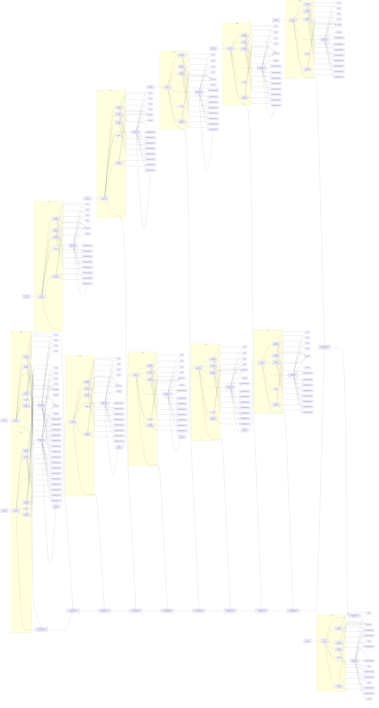

```mermaid
flowchart LR
  subgraph path13 [Path]
    13["Path<br>[496, 547, 0]"]
    31["Segment<br>[555, 606, 0]"]
    38["Segment<br>[614, 664, 0]"]
    59["Segment<br>[672, 723, 0]"]
    67["Segment<br>[731, 738, 0]"]
    73[Solid2d]
  end
  subgraph path14 [Path]
    14["Path<br>[496, 547, 0]"]
    27["Segment<br>[555, 606, 0]"]
    45["Segment<br>[614, 664, 0]"]
    50["Segment<br>[672, 723, 0]"]
    65["Segment<br>[731, 738, 0]"]
    74[Solid2d]
  end
  subgraph path15 [Path]
    15["Path<br>[496, 547, 0]"]
    32["Segment<br>[555, 606, 0]"]
    48["Segment<br>[614, 664, 0]"]
    51["Segment<br>[672, 723, 0]"]
    71["Segment<br>[731, 738, 0]"]
    75[Solid2d]
  end
  subgraph path16 [Path]
    16["Path<br>[496, 547, 0]"]
    29["Segment<br>[555, 606, 0]"]
    40["Segment<br>[614, 664, 0]"]
    56["Segment<br>[672, 723, 0]"]
    69["Segment<br>[731, 738, 0]"]
    76[Solid2d]
  end
  subgraph path17 [Path]
    17["Path<br>[496, 547, 0]"]
    26["Segment<br>[555, 606, 0]"]
    44["Segment<br>[614, 664, 0]"]
    52["Segment<br>[672, 723, 0]"]
    63["Segment<br>[731, 738, 0]"]
    77[Solid2d]
  end
  subgraph path18 [Path]
    18["Path<br>[496, 547, 0]"]
    28["Segment<br>[555, 606, 0]"]
    47["Segment<br>[614, 664, 0]"]
    58["Segment<br>[672, 723, 0]"]
    64["Segment<br>[731, 738, 0]"]
    78[Solid2d]
  end
  subgraph path19 [Path]
    19["Path<br>[496, 547, 0]"]
    35["Segment<br>[555, 606, 0]"]
    41["Segment<br>[614, 664, 0]"]
    57["Segment<br>[672, 723, 0]"]
    66["Segment<br>[731, 738, 0]"]
    79[Solid2d]
  end
  subgraph path20 [Path]
    20["Path<br>[496, 547, 0]"]
    34["Segment<br>[555, 606, 0]"]
    42["Segment<br>[614, 664, 0]"]
    55["Segment<br>[672, 723, 0]"]
    68["Segment<br>[731, 738, 0]"]
    80[Solid2d]
  end
  subgraph path21 [Path]
    21["Path<br>[496, 547, 0]"]
    30["Segment<br>[555, 606, 0]"]
    39["Segment<br>[614, 664, 0]"]
    60["Segment<br>[672, 723, 0]"]
    70["Segment<br>[731, 738, 0]"]
    81[Solid2d]
  end
  subgraph path22 [Path]
    22["Path<br>[496, 547, 0]"]
    25["Segment<br>[555, 606, 0]"]
    46["Segment<br>[614, 664, 0]"]
    54["Segment<br>[672, 723, 0]"]
    72["Segment<br>[731, 738, 0]"]
    82[Solid2d]
  end
  subgraph path23 [Path]
    23["Path<br>[496, 547, 0]"]
    36["Segment<br>[555, 606, 0]"]
    37["Segment<br>[614, 664, 0]"]
    49["Segment<br>[672, 723, 0]"]
    62["Segment<br>[731, 738, 0]"]
    83[Solid2d]
  end
  subgraph path24 [Path]
    24["Path<br>[496, 547, 0]"]
    33["Segment<br>[555, 606, 0]"]
    43["Segment<br>[614, 664, 0]"]
    53["Segment<br>[672, 723, 0]"]
    61["Segment<br>[731, 738, 0]"]
    84[Solid2d]
  end
  1["Plane<br>[471, 488, 0]"]
  2["Plane<br>[471, 488, 0]"]
  3["Plane<br>[471, 488, 0]"]
  4["Plane<br>[471, 488, 0]"]
  5["Plane<br>[471, 488, 0]"]
  6["Plane<br>[471, 488, 0]"]
  7["Plane<br>[471, 488, 0]"]
  8["Plane<br>[471, 488, 0]"]
  9["Plane<br>[471, 488, 0]"]
  10["Plane<br>[471, 488, 0]"]
  11["Plane<br>[471, 488, 0]"]
  12["Plane<br>[471, 488, 0]"]
  85["Sweep Extrusion<br>[752, 802, 0]"]
  86["Sweep Extrusion<br>[752, 802, 0]"]
  87["Sweep Extrusion<br>[752, 802, 0]"]
  88["Sweep Extrusion<br>[752, 802, 0]"]
  89["Sweep Extrusion<br>[752, 802, 0]"]
  90["Sweep Extrusion<br>[752, 802, 0]"]
  91["Sweep Extrusion<br>[752, 802, 0]"]
  92["Sweep Extrusion<br>[752, 802, 0]"]
  93["Sweep Extrusion<br>[752, 802, 0]"]
  94["Sweep Extrusion<br>[752, 802, 0]"]
  95["Sweep Extrusion<br>[752, 802, 0]"]
  96["Sweep Extrusion<br>[752, 802, 0]"]
  97["CompositeSolid Intersect<br>[1997, 2027, 0]"]
  98["CompositeSolid Intersect<br>[1997, 2027, 0]"]
  99["CompositeSolid Intersect<br>[1997, 2027, 0]"]
  100["CompositeSolid Intersect<br>[1997, 2027, 0]"]
  101["CompositeSolid Intersect<br>[1997, 2027, 0]"]
  102["CompositeSolid Intersect<br>[1997, 2027, 0]"]
  103["CompositeSolid Intersect<br>[1997, 2027, 0]"]
  104["CompositeSolid Intersect<br>[1997, 2027, 0]"]
  105["CompositeSolid Intersect<br>[1997, 2027, 0]"]
  106["CompositeSolid Intersect<br>[1997, 2027, 0]"]
  107["CompositeSolid Intersect<br>[1997, 2027, 0]"]
  108[Wall]
  109[Wall]
  110[Wall]
  111[Wall]
  112[Wall]
  113[Wall]
  114[Wall]
  115[Wall]
  116[Wall]
  117[Wall]
  118[Wall]
  119[Wall]
  120[Wall]
  121[Wall]
  122[Wall]
  123[Wall]
  124[Wall]
  125[Wall]
  126[Wall]
  127[Wall]
  128[Wall]
  129[Wall]
  130[Wall]
  131[Wall]
  132[Wall]
  133[Wall]
  134[Wall]
  135[Wall]
  136[Wall]
  137[Wall]
  138[Wall]
  139[Wall]
  140[Wall]
  141[Wall]
  142[Wall]
  143[Wall]
  144[Wall]
  145[Wall]
  146[Wall]
  147[Wall]
  148[Wall]
  149[Wall]
  150[Wall]
  151[Wall]
  152[Wall]
  153[Wall]
  154[Wall]
  155[Wall]
  156["Cap Start"]
  157["Cap End"]
  158["Cap Start"]
  159["Cap End"]
  160["Cap Start"]
  161["Cap End"]
  162["Cap Start"]
  163["Cap End"]
  164["Cap Start"]
  165["Cap End"]
  166["Cap Start"]
  167["Cap End"]
  168["Cap Start"]
  169["Cap End"]
  170["Cap Start"]
  171["Cap End"]
  172["Cap Start"]
  173["Cap End"]
  174["Cap Start"]
  175["Cap End"]
  176["Cap Start"]
  177["Cap End"]
  178["Cap Start"]
  179["Cap End"]
  180["SweepEdge Opposite"]
  181["SweepEdge Adjacent"]
  182["SweepEdge Opposite"]
  183["SweepEdge Adjacent"]
  184["SweepEdge Opposite"]
  185["SweepEdge Adjacent"]
  186["SweepEdge Opposite"]
  187["SweepEdge Adjacent"]
  188["SweepEdge Opposite"]
  189["SweepEdge Adjacent"]
  190["SweepEdge Opposite"]
  191["SweepEdge Adjacent"]
  192["SweepEdge Opposite"]
  193["SweepEdge Adjacent"]
  194["SweepEdge Opposite"]
  195["SweepEdge Adjacent"]
  196["SweepEdge Opposite"]
  197["SweepEdge Adjacent"]
  198["SweepEdge Opposite"]
  199["SweepEdge Adjacent"]
  200["SweepEdge Opposite"]
  201["SweepEdge Adjacent"]
  202["SweepEdge Opposite"]
  203["SweepEdge Adjacent"]
  204["SweepEdge Opposite"]
  205["SweepEdge Adjacent"]
  206["SweepEdge Opposite"]
  207["SweepEdge Adjacent"]
  208["SweepEdge Opposite"]
  209["SweepEdge Adjacent"]
  210["SweepEdge Opposite"]
  211["SweepEdge Adjacent"]
  212["SweepEdge Opposite"]
  213["SweepEdge Adjacent"]
  214["SweepEdge Opposite"]
  215["SweepEdge Adjacent"]
  216["SweepEdge Opposite"]
  217["SweepEdge Adjacent"]
  218["SweepEdge Opposite"]
  219["SweepEdge Adjacent"]
  220["SweepEdge Opposite"]
  221["SweepEdge Adjacent"]
  222["SweepEdge Opposite"]
  223["SweepEdge Adjacent"]
  224["SweepEdge Opposite"]
  225["SweepEdge Adjacent"]
  226["SweepEdge Opposite"]
  227["SweepEdge Adjacent"]
  228["SweepEdge Opposite"]
  229["SweepEdge Adjacent"]
  230["SweepEdge Opposite"]
  231["SweepEdge Adjacent"]
  232["SweepEdge Opposite"]
  233["SweepEdge Adjacent"]
  234["SweepEdge Opposite"]
  235["SweepEdge Adjacent"]
  236["SweepEdge Opposite"]
  237["SweepEdge Adjacent"]
  238["SweepEdge Opposite"]
  239["SweepEdge Adjacent"]
  240["SweepEdge Opposite"]
  241["SweepEdge Adjacent"]
  242["SweepEdge Opposite"]
  243["SweepEdge Adjacent"]
  244["SweepEdge Opposite"]
  245["SweepEdge Adjacent"]
  246["SweepEdge Opposite"]
  247["SweepEdge Adjacent"]
  248["SweepEdge Opposite"]
  249["SweepEdge Adjacent"]
  250["SweepEdge Opposite"]
  251["SweepEdge Adjacent"]
  252["SweepEdge Opposite"]
  253["SweepEdge Adjacent"]
  254["SweepEdge Opposite"]
  255["SweepEdge Adjacent"]
  256["SweepEdge Opposite"]
  257["SweepEdge Adjacent"]
  258["SweepEdge Opposite"]
  259["SweepEdge Adjacent"]
  260["SweepEdge Opposite"]
  261["SweepEdge Adjacent"]
  262["SweepEdge Opposite"]
  263["SweepEdge Adjacent"]
  264["SweepEdge Opposite"]
  265["SweepEdge Adjacent"]
  266["SweepEdge Opposite"]
  267["SweepEdge Adjacent"]
  268["SweepEdge Opposite"]
  269["SweepEdge Adjacent"]
  270["SweepEdge Opposite"]
  271["SweepEdge Adjacent"]
  272["SweepEdge Opposite"]
  273["SweepEdge Adjacent"]
  274["SweepEdge Opposite"]
  275["SweepEdge Adjacent"]
  1 --- 23
  2 --- 14
  3 --- 16
  4 --- 24
  5 --- 15
  6 --- 21
  7 --- 22
  8 --- 18
  9 --- 19
  10 --- 20
  11 --- 13
  12 --- 17
  13 --- 31
  13 --- 38
  13 --- 59
  13 --- 67
  13 --- 73
  13 ---- 90
  13 <--x 106
  14 --- 27
  14 --- 45
  14 --- 50
  14 --- 65
  14 --- 74
  14 ---- 92
  14 <--x 101
  15 --- 32
  15 --- 48
  15 --- 51
  15 --- 71
  15 --- 75
  15 ---- 93
  15 <--x 99
  16 --- 29
  16 --- 40
  16 --- 56
  16 --- 69
  16 --- 76
  16 ---- 96
  16 <--x 100
  17 --- 26
  17 --- 44
  17 --- 52
  17 --- 63
  17 --- 77
  17 ---- 95
  17 <--x 105
  18 --- 28
  18 --- 47
  18 --- 58
  18 --- 64
  18 --- 78
  18 ---- 94
  18 <--x 102
  19 --- 35
  19 --- 41
  19 --- 57
  19 --- 66
  19 --- 79
  19 ---- 89
  19 <--x 98
  20 --- 34
  20 --- 42
  20 --- 55
  20 --- 68
  20 --- 80
  20 ---- 87
  20 <--x 104
  21 --- 30
  21 --- 39
  21 --- 60
  21 --- 70
  21 --- 81
  21 ---- 91
  21 <--x 103
  22 --- 25
  22 --- 46
  22 --- 54
  22 --- 72
  22 --- 82
  22 ---- 88
  22 <--x 104
  23 --- 36
  23 --- 37
  23 --- 49
  23 --- 62
  23 --- 83
  23 ---- 86
  23 <--x 107
  24 --- 33
  24 --- 43
  24 --- 53
  24 --- 61
  24 --- 84
  24 ---- 85
  24 <--x 97
  25 --- 120
  25 x--> 162
  25 --- 204
  25 --- 205
  26 --- 148
  26 x--> 176
  26 --- 260
  26 --- 261
  27 --- 138
  27 x--> 170
  27 --- 240
  27 --- 241
  28 --- 145
  28 x--> 174
  28 --- 254
  28 --- 255
  29 --- 153
  29 x--> 178
  29 --- 270
  29 --- 271
  30 --- 133
  30 x--> 168
  30 --- 230
  30 --- 231
  31 --- 130
  31 x--> 166
  31 --- 224
  31 --- 225
  32 --- 141
  32 x--> 172
  32 --- 246
  32 --- 247
  33 --- 111
  33 x--> 156
  33 --- 186
  33 --- 187
  34 --- 119
  34 x--> 160
  34 --- 202
  34 --- 203
  35 --- 127
  35 x--> 164
  35 --- 218
  35 --- 219
  36 --- 115
  36 x--> 158
  36 --- 194
  36 --- 195
  37 --- 112
  37 x--> 158
  37 --- 188
  37 --- 189
  38 --- 128
  38 x--> 166
  38 --- 220
  38 --- 221
  39 --- 132
  39 x--> 168
  39 --- 228
  39 --- 229
  40 --- 152
  40 x--> 178
  40 --- 268
  40 --- 269
  41 --- 124
  41 x--> 164
  41 --- 212
  41 --- 213
  42 --- 117
  42 x--> 160
  42 --- 198
  42 --- 199
  43 --- 110
  43 x--> 156
  43 --- 184
  43 --- 185
  44 --- 151
  44 x--> 176
  44 --- 266
  44 --- 267
  45 --- 139
  45 x--> 170
  45 --- 242
  45 --- 243
  46 --- 122
  46 x--> 162
  46 --- 208
  46 --- 209
  47 --- 147
  47 x--> 174
  47 --- 258
  47 --- 259
  48 --- 143
  48 x--> 172
  48 --- 250
  48 --- 251
  49 --- 113
  49 x--> 158
  49 --- 190
  49 --- 191
  50 --- 136
  50 x--> 170
  50 --- 236
  50 --- 237
  51 --- 140
  51 x--> 172
  51 --- 244
  51 --- 245
  52 --- 150
  52 x--> 176
  52 --- 264
  52 --- 265
  53 --- 109
  53 x--> 156
  53 --- 182
  53 --- 183
  54 --- 121
  54 x--> 162
  54 --- 206
  54 --- 207
  55 --- 116
  55 x--> 160
  55 --- 196
  55 --- 197
  56 --- 154
  56 x--> 178
  56 --- 272
  56 --- 273
  57 --- 126
  57 x--> 164
  57 --- 216
  57 --- 217
  58 --- 146
  58 x--> 174
  58 --- 256
  58 --- 257
  59 --- 131
  59 x--> 166
  59 --- 226
  59 --- 227
  60 --- 134
  60 x--> 168
  60 --- 232
  60 --- 233
  61 --- 108
  61 x--> 156
  61 --- 180
  61 --- 181
  62 --- 114
  62 x--> 158
  62 --- 192
  62 --- 193
  63 --- 149
  63 x--> 176
  63 --- 262
  63 --- 263
  64 --- 144
  64 x--> 174
  64 --- 252
  64 --- 253
  65 --- 137
  65 x--> 170
  65 --- 238
  65 --- 239
  66 --- 125
  66 x--> 164
  66 --- 214
  66 --- 215
  67 --- 129
  67 x--> 166
  67 --- 222
  67 --- 223
  68 --- 118
  68 x--> 160
  68 --- 200
  68 --- 201
  69 --- 155
  69 x--> 178
  69 --- 274
  69 --- 275
  70 --- 135
  70 x--> 168
  70 --- 234
  70 --- 235
  71 --- 142
  71 x--> 172
  71 --- 248
  71 --- 249
  72 --- 123
  72 x--> 162
  72 --- 210
  72 --- 211
  85 --- 108
  85 --- 109
  85 --- 110
  85 --- 111
  85 --- 156
  85 --- 157
  85 --- 180
  85 --- 181
  85 --- 182
  85 --- 183
  85 --- 184
  85 --- 185
  85 --- 186
  85 --- 187
  86 --- 112
  86 --- 113
  86 --- 114
  86 --- 115
  86 --- 158
  86 --- 159
  86 --- 188
  86 --- 189
  86 --- 190
  86 --- 191
  86 --- 192
  86 --- 193
  86 --- 194
  86 --- 195
  87 --- 116
  87 --- 117
  87 --- 118
  87 --- 119
  87 --- 160
  87 --- 161
  87 --- 196
  87 --- 197
  87 --- 198
  87 --- 199
  87 --- 200
  87 --- 201
  87 --- 202
  87 --- 203
  88 --- 120
  88 --- 121
  88 --- 122
  88 --- 123
  88 --- 162
  88 --- 163
  88 --- 204
  88 --- 205
  88 --- 206
  88 --- 207
  88 --- 208
  88 --- 209
  88 --- 210
  88 --- 211
  89 --- 124
  89 --- 125
  89 --- 126
  89 --- 127
  89 --- 164
  89 --- 165
  89 --- 212
  89 --- 213
  89 --- 214
  89 --- 215
  89 --- 216
  89 --- 217
  89 --- 218
  89 --- 219
  90 --- 128
  90 --- 129
  90 --- 130
  90 --- 131
  90 --- 166
  90 --- 167
  90 --- 220
  90 --- 221
  90 --- 222
  90 --- 223
  90 --- 224
  90 --- 225
  90 --- 226
  90 --- 227
  91 --- 132
  91 --- 133
  91 --- 134
  91 --- 135
  91 --- 168
  91 --- 169
  91 --- 228
  91 --- 229
  91 --- 230
  91 --- 231
  91 --- 232
  91 --- 233
  91 --- 234
  91 --- 235
  92 --- 136
  92 --- 137
  92 --- 138
  92 --- 139
  92 --- 170
  92 --- 171
  92 --- 236
  92 --- 237
  92 --- 238
  92 --- 239
  92 --- 240
  92 --- 241
  92 --- 242
  92 --- 243
  93 --- 140
  93 --- 141
  93 --- 142
  93 --- 143
  93 --- 172
  93 --- 173
  93 --- 244
  93 --- 245
  93 --- 246
  93 --- 247
  93 --- 248
  93 --- 249
  93 --- 250
  93 --- 251
  94 --- 144
  94 --- 145
  94 --- 146
  94 --- 147
  94 --- 174
  94 --- 175
  94 --- 252
  94 --- 253
  94 --- 254
  94 --- 255
  94 --- 256
  94 --- 257
  94 --- 258
  94 --- 259
  95 --- 148
  95 --- 149
  95 --- 150
  95 --- 151
  95 --- 176
  95 --- 177
  95 --- 260
  95 --- 261
  95 --- 262
  95 --- 263
  95 --- 264
  95 --- 265
  95 --- 266
  95 --- 267
  96 --- 152
  96 --- 153
  96 --- 154
  96 --- 155
  96 --- 178
  96 --- 179
  96 --- 268
  96 --- 269
  96 --- 270
  96 --- 271
  96 --- 272
  96 --- 273
  96 --- 274
  96 --- 275
  97 <--x 98
  99 x--> 97
  98 <--x 103
  105 x--> 99
  104 x--> 100
  100 <--x 107
  101 <--x 102
  103 x--> 101
  106 x--> 105
  107 x--> 106
```
