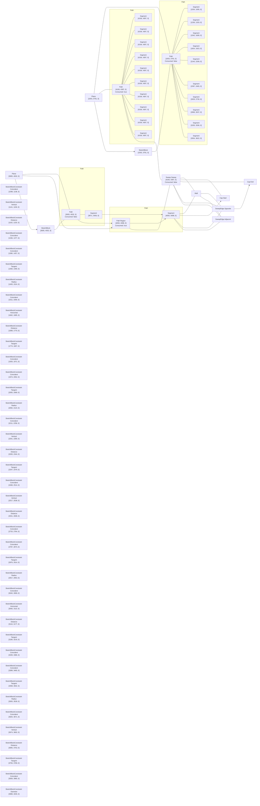

```mermaid
flowchart LR
  subgraph path2 [Path]
    2["Path<br>[1003, 3791, 0]<br>Consumed: false"]
      %% [ProgramBodyItem { index: 22 }, VariableDeclarationDeclaration, VariableDeclarationInit]
    3["Segment<br>[1034, 1095, 0]"]
      %% [ProgramBodyItem { index: 22 }, VariableDeclarationDeclaration, VariableDeclarationInit, SketchBlockBody, SketchBlockBodyItem { index: 0 }, VariableDeclarationDeclaration, VariableDeclarationInit]
    4["Segment<br>[1236, 1333, 0]"]
      %% [ProgramBodyItem { index: 22 }, VariableDeclarationDeclaration, VariableDeclarationInit, SketchBlockBody, SketchBlockBodyItem { index: 4 }, VariableDeclarationDeclaration, VariableDeclarationInit]
    5["Segment<br>[1542, 1608, 0]"]
      %% [ProgramBodyItem { index: 22 }, VariableDeclarationDeclaration, VariableDeclarationInit, SketchBlockBody, SketchBlockBodyItem { index: 9 }, VariableDeclarationDeclaration, VariableDeclarationInit]
    6["Segment<br>[1824, 1923, 0]"]
      %% [ProgramBodyItem { index: 22 }, VariableDeclarationDeclaration, VariableDeclarationInit, SketchBlockBody, SketchBlockBodyItem { index: 14 }, VariableDeclarationDeclaration, VariableDeclarationInit]
    7["Segment<br>[2140, 2208, 0]"]
      %% [ProgramBodyItem { index: 22 }, VariableDeclarationDeclaration, VariableDeclarationInit, SketchBlockBody, SketchBlockBodyItem { index: 19 }, VariableDeclarationDeclaration, VariableDeclarationInit]
    8["Segment<br>[2397, 2465, 0]"]
      %% [ProgramBodyItem { index: 22 }, VariableDeclarationDeclaration, VariableDeclarationInit, SketchBlockBody, SketchBlockBodyItem { index: 24 }, VariableDeclarationDeclaration, VariableDeclarationInit]
    9["Segment<br>[2629, 2730, 0]"]
      %% [ProgramBodyItem { index: 22 }, VariableDeclarationDeclaration, VariableDeclarationInit, SketchBlockBody, SketchBlockBodyItem { index: 28 }, VariableDeclarationDeclaration, VariableDeclarationInit]
    10["Segment<br>[2969, 3037, 0]"]
      %% [ProgramBodyItem { index: 22 }, VariableDeclarationDeclaration, VariableDeclarationInit, SketchBlockBody, SketchBlockBodyItem { index: 33 }, VariableDeclarationDeclaration, VariableDeclarationInit]
    11["Segment<br>[3235, 3336, 0]"]
      %% [ProgramBodyItem { index: 22 }, VariableDeclarationDeclaration, VariableDeclarationInit, SketchBlockBody, SketchBlockBodyItem { index: 38 }, VariableDeclarationDeclaration, VariableDeclarationInit]
    12["Segment<br>[3554, 3622, 0]"]
      %% [ProgramBodyItem { index: 22 }, VariableDeclarationDeclaration, VariableDeclarationInit, SketchBlockBody, SketchBlockBodyItem { index: 43 }, VariableDeclarationDeclaration, VariableDeclarationInit]
  end
  subgraph path14 [Path]
    14["Path<br>[3835, 4032, 0]<br>Consumed: false"]
      %% [ProgramBodyItem { index: 23 }, VariableDeclarationDeclaration, VariableDeclarationInit]
    15["Segment<br>[3871, 3936, 0]"]
      %% [ProgramBodyItem { index: 23 }, VariableDeclarationDeclaration, VariableDeclarationInit, SketchBlockBody, SketchBlockBodyItem { index: 0 }, VariableDeclarationDeclaration, VariableDeclarationInit]
  end
  subgraph path16 [Path]
    16["Path Region<br>[4050, 4098, 0]<br>Consumed: true"]
      %% [ProgramBodyItem { index: 24 }, VariableDeclarationDeclaration, VariableDeclarationInit]
    17["Segment<br>[4050, 4098, 0]"]
      %% [ProgramBodyItem { index: 24 }, VariableDeclarationDeclaration, VariableDeclarationInit]
  end
  subgraph path18 [Path]
    18["Path<br>[4106, 4397, 0]<br>Consumed: true"]
      %% [ProgramBodyItem { index: 25 }, VariableDeclarationDeclaration, VariableDeclarationInit, PipeBodyItem { index: 0 }]
    19["Segment<br>[4106, 4397, 0]"]
      %% [ProgramBodyItem { index: 25 }, VariableDeclarationDeclaration, VariableDeclarationInit, PipeBodyItem { index: 0 }]
    20["Segment<br>[4106, 4397, 0]"]
      %% [ProgramBodyItem { index: 25 }, VariableDeclarationDeclaration, VariableDeclarationInit, PipeBodyItem { index: 0 }]
    21["Segment<br>[4106, 4397, 0]"]
      %% [ProgramBodyItem { index: 25 }, VariableDeclarationDeclaration, VariableDeclarationInit, PipeBodyItem { index: 0 }]
    22["Segment<br>[4106, 4397, 0]"]
      %% [ProgramBodyItem { index: 25 }, VariableDeclarationDeclaration, VariableDeclarationInit, PipeBodyItem { index: 0 }]
    23["Segment<br>[4106, 4397, 0]"]
      %% [ProgramBodyItem { index: 25 }, VariableDeclarationDeclaration, VariableDeclarationInit, PipeBodyItem { index: 0 }]
    24["Segment<br>[4106, 4397, 0]"]
      %% [ProgramBodyItem { index: 25 }, VariableDeclarationDeclaration, VariableDeclarationInit, PipeBodyItem { index: 0 }]
    25["Segment<br>[4106, 4397, 0]"]
      %% [ProgramBodyItem { index: 25 }, VariableDeclarationDeclaration, VariableDeclarationInit, PipeBodyItem { index: 0 }]
    26["Segment<br>[4106, 4397, 0]"]
      %% [ProgramBodyItem { index: 25 }, VariableDeclarationDeclaration, VariableDeclarationInit, PipeBodyItem { index: 0 }]
    27["Segment<br>[4106, 4397, 0]"]
      %% [ProgramBodyItem { index: 25 }, VariableDeclarationDeclaration, VariableDeclarationInit, PipeBodyItem { index: 0 }]
    28["Segment<br>[4106, 4397, 0]"]
      %% [ProgramBodyItem { index: 25 }, VariableDeclarationDeclaration, VariableDeclarationInit, PipeBodyItem { index: 0 }]
  end
  1["Plane<br>[1003, 3791, 0]"]
    %% [ProgramBodyItem { index: 22 }, VariableDeclarationDeclaration, VariableDeclarationInit]
  13["Plane<br>[3835, 4032, 0]"]
    %% [ProgramBodyItem { index: 23 }, VariableDeclarationDeclaration, VariableDeclarationInit]
  29["Sweep Sweep<br>[4106, 4397, 0]<br>Consumed: false"]
    %% [ProgramBodyItem { index: 25 }, VariableDeclarationDeclaration, VariableDeclarationInit, PipeBodyItem { index: 0 }]
  30[Wall]
    %% face_code_ref=Missing NodePath
  31["Cap Start"]
    %% face_code_ref=Missing NodePath
  32["Cap End"]
    %% face_code_ref=Missing NodePath
  33["SweepEdge Opposite"]
  34["SweepEdge Adjacent"]
  35["SketchBlock<br>[1003, 3791, 0]"]
    %% [ProgramBodyItem { index: 22 }, VariableDeclarationDeclaration, VariableDeclarationInit]
  36["SketchBlockConstraint Coincident<br>[1098, 1138, 0]"]
    %% [ProgramBodyItem { index: 22 }, VariableDeclarationDeclaration, VariableDeclarationInit, SketchBlockBody, SketchBlockBodyItem { index: 1 }, ExpressionStatementExpr]
  37["SketchBlockConstraint Vertical<br>[1141, 1159, 0]"]
    %% [ProgramBodyItem { index: 22 }, VariableDeclarationDeclaration, VariableDeclarationInit, SketchBlockBody, SketchBlockBodyItem { index: 2 }, ExpressionStatementExpr]
  38["SketchBlockConstraint Distance<br>[1162, 1220, 0]"]
    %% [ProgramBodyItem { index: 22 }, VariableDeclarationDeclaration, VariableDeclarationInit, SketchBlockBody, SketchBlockBodyItem { index: 3 }, ExpressionStatementExpr]
  39["SketchBlockConstraint Coincident<br>[1336, 1377, 0]"]
    %% [ProgramBodyItem { index: 22 }, VariableDeclarationDeclaration, VariableDeclarationInit, SketchBlockBody, SketchBlockBodyItem { index: 5 }, ExpressionStatementExpr]
  40["SketchBlockConstraint Coincident<br>[1380, 1457, 0]"]
    %% [ProgramBodyItem { index: 22 }, VariableDeclarationDeclaration, VariableDeclarationInit, SketchBlockBody, SketchBlockBodyItem { index: 6 }, ExpressionStatementExpr]
  41["SketchBlockConstraint Tangent<br>[1460, 1490, 0]"]
    %% [ProgramBodyItem { index: 22 }, VariableDeclarationDeclaration, VariableDeclarationInit, SketchBlockBody, SketchBlockBodyItem { index: 7 }, ExpressionStatementExpr]
  42["SketchBlockConstraint Radius<br>[1493, 1524, 0]"]
    %% [ProgramBodyItem { index: 22 }, VariableDeclarationDeclaration, VariableDeclarationInit, SketchBlockBody, SketchBlockBodyItem { index: 8 }, ExpressionStatementExpr]
  43["SketchBlockConstraint Coincident<br>[1611, 1659, 0]"]
    %% [ProgramBodyItem { index: 22 }, VariableDeclarationDeclaration, VariableDeclarationInit, SketchBlockBody, SketchBlockBodyItem { index: 10 }, ExpressionStatementExpr]
  44["SketchBlockConstraint Horizontal<br>[1662, 1685, 0]"]
    %% [ProgramBodyItem { index: 22 }, VariableDeclarationDeclaration, VariableDeclarationInit, SketchBlockBody, SketchBlockBodyItem { index: 11 }, ExpressionStatementExpr]
  45["SketchBlockConstraint Distance<br>[1688, 1770, 0]"]
    %% [ProgramBodyItem { index: 22 }, VariableDeclarationDeclaration, VariableDeclarationInit, SketchBlockBody, SketchBlockBodyItem { index: 12 }, ExpressionStatementExpr]
  46["SketchBlockConstraint Tangent<br>[1774, 1807, 0]"]
    %% [ProgramBodyItem { index: 22 }, VariableDeclarationDeclaration, VariableDeclarationInit, SketchBlockBody, SketchBlockBodyItem { index: 13 }, ExpressionStatementExpr]
  47["SketchBlockConstraint Coincident<br>[1926, 1971, 0]"]
    %% [ProgramBodyItem { index: 22 }, VariableDeclarationDeclaration, VariableDeclarationInit, SketchBlockBody, SketchBlockBodyItem { index: 15 }, ExpressionStatementExpr]
  48["SketchBlockConstraint Coincident<br>[1974, 2052, 0]"]
    %% [ProgramBodyItem { index: 22 }, VariableDeclarationDeclaration, VariableDeclarationInit, SketchBlockBody, SketchBlockBodyItem { index: 16 }, ExpressionStatementExpr]
  49["SketchBlockConstraint Tangent<br>[2055, 2089, 0]"]
    %% [ProgramBodyItem { index: 22 }, VariableDeclarationDeclaration, VariableDeclarationInit, SketchBlockBody, SketchBlockBodyItem { index: 17 }, ExpressionStatementExpr]
  50["SketchBlockConstraint Radius<br>[2092, 2124, 0]"]
    %% [ProgramBodyItem { index: 22 }, VariableDeclarationDeclaration, VariableDeclarationInit, SketchBlockBody, SketchBlockBodyItem { index: 18 }, ExpressionStatementExpr]
  51["SketchBlockConstraint Coincident<br>[2211, 2258, 0]"]
    %% [ProgramBodyItem { index: 22 }, VariableDeclarationDeclaration, VariableDeclarationInit, SketchBlockBody, SketchBlockBodyItem { index: 20 }, ExpressionStatementExpr]
  52["SketchBlockConstraint Vertical<br>[2261, 2280, 0]"]
    %% [ProgramBodyItem { index: 22 }, VariableDeclarationDeclaration, VariableDeclarationInit, SketchBlockBody, SketchBlockBodyItem { index: 21 }, ExpressionStatementExpr]
  53["SketchBlockConstraint Distance<br>[2283, 2344, 0]"]
    %% [ProgramBodyItem { index: 22 }, VariableDeclarationDeclaration, VariableDeclarationInit, SketchBlockBody, SketchBlockBodyItem { index: 22 }, ExpressionStatementExpr]
  54["SketchBlockConstraint Tangent<br>[2347, 2379, 0]"]
    %% [ProgramBodyItem { index: 22 }, VariableDeclarationDeclaration, VariableDeclarationInit, SketchBlockBody, SketchBlockBodyItem { index: 23 }, ExpressionStatementExpr]
  55["SketchBlockConstraint Coincident<br>[2468, 2514, 0]"]
    %% [ProgramBodyItem { index: 22 }, VariableDeclarationDeclaration, VariableDeclarationInit, SketchBlockBody, SketchBlockBodyItem { index: 25 }, ExpressionStatementExpr]
  56["SketchBlockConstraint Vertical<br>[2517, 2538, 0]"]
    %% [ProgramBodyItem { index: 22 }, VariableDeclarationDeclaration, VariableDeclarationInit, SketchBlockBody, SketchBlockBodyItem { index: 26 }, ExpressionStatementExpr]
  57["SketchBlockConstraint Distance<br>[2541, 2608, 0]"]
    %% [ProgramBodyItem { index: 22 }, VariableDeclarationDeclaration, VariableDeclarationInit, SketchBlockBody, SketchBlockBodyItem { index: 27 }, ExpressionStatementExpr]
  58["SketchBlockConstraint Coincident<br>[2733, 2784, 0]"]
    %% [ProgramBodyItem { index: 22 }, VariableDeclarationDeclaration, VariableDeclarationInit, SketchBlockBody, SketchBlockBodyItem { index: 29 }, ExpressionStatementExpr]
  59["SketchBlockConstraint Coincident<br>[2787, 2873, 0]"]
    %% [ProgramBodyItem { index: 22 }, VariableDeclarationDeclaration, VariableDeclarationInit, SketchBlockBody, SketchBlockBodyItem { index: 30 }, ExpressionStatementExpr]
  60["SketchBlockConstraint Tangent<br>[2876, 2914, 0]"]
    %% [ProgramBodyItem { index: 22 }, VariableDeclarationDeclaration, VariableDeclarationInit, SketchBlockBody, SketchBlockBodyItem { index: 31 }, ExpressionStatementExpr]
  61["SketchBlockConstraint Radius<br>[2917, 2953, 0]"]
    %% [ProgramBodyItem { index: 22 }, VariableDeclarationDeclaration, VariableDeclarationInit, SketchBlockBody, SketchBlockBodyItem { index: 32 }, ExpressionStatementExpr]
  62["SketchBlockConstraint Coincident<br>[3040, 3089, 0]"]
    %% [ProgramBodyItem { index: 22 }, VariableDeclarationDeclaration, VariableDeclarationInit, SketchBlockBody, SketchBlockBodyItem { index: 34 }, ExpressionStatementExpr]
  63["SketchBlockConstraint Horizontal<br>[3092, 3113, 0]"]
    %% [ProgramBodyItem { index: 22 }, VariableDeclarationDeclaration, VariableDeclarationInit, SketchBlockBody, SketchBlockBodyItem { index: 35 }, ExpressionStatementExpr]
  64["SketchBlockConstraint Distance<br>[3116, 3177, 0]"]
    %% [ProgramBodyItem { index: 22 }, VariableDeclarationDeclaration, VariableDeclarationInit, SketchBlockBody, SketchBlockBodyItem { index: 36 }, ExpressionStatementExpr]
  65["SketchBlockConstraint Tangent<br>[3180, 3216, 0]"]
    %% [ProgramBodyItem { index: 22 }, VariableDeclarationDeclaration, VariableDeclarationInit, SketchBlockBody, SketchBlockBodyItem { index: 37 }, ExpressionStatementExpr]
  66["SketchBlockConstraint Coincident<br>[3339, 3386, 0]"]
    %% [ProgramBodyItem { index: 22 }, VariableDeclarationDeclaration, VariableDeclarationInit, SketchBlockBody, SketchBlockBodyItem { index: 39 }, ExpressionStatementExpr]
  67["SketchBlockConstraint Coincident<br>[3389, 3465, 0]"]
    %% [ProgramBodyItem { index: 22 }, VariableDeclarationDeclaration, VariableDeclarationInit, SketchBlockBody, SketchBlockBodyItem { index: 40 }, ExpressionStatementExpr]
  68["SketchBlockConstraint Tangent<br>[3468, 3502, 0]"]
    %% [ProgramBodyItem { index: 22 }, VariableDeclarationDeclaration, VariableDeclarationInit, SketchBlockBody, SketchBlockBodyItem { index: 41 }, ExpressionStatementExpr]
  69["SketchBlockConstraint Radius<br>[3505, 3539, 0]"]
    %% [ProgramBodyItem { index: 22 }, VariableDeclarationDeclaration, VariableDeclarationInit, SketchBlockBody, SketchBlockBodyItem { index: 42 }, ExpressionStatementExpr]
  70["SketchBlockConstraint Coincident<br>[3625, 3671, 0]"]
    %% [ProgramBodyItem { index: 22 }, VariableDeclarationDeclaration, VariableDeclarationInit, SketchBlockBody, SketchBlockBodyItem { index: 44 }, ExpressionStatementExpr]
  71["SketchBlockConstraint Vertical<br>[3674, 3692, 0]"]
    %% [ProgramBodyItem { index: 22 }, VariableDeclarationDeclaration, VariableDeclarationInit, SketchBlockBody, SketchBlockBodyItem { index: 45 }, ExpressionStatementExpr]
  72["SketchBlockConstraint Distance<br>[3695, 3753, 0]"]
    %% [ProgramBodyItem { index: 22 }, VariableDeclarationDeclaration, VariableDeclarationInit, SketchBlockBody, SketchBlockBodyItem { index: 46 }, ExpressionStatementExpr]
  73["SketchBlockConstraint Tangent<br>[3756, 3789, 0]"]
    %% [ProgramBodyItem { index: 22 }, VariableDeclarationDeclaration, VariableDeclarationInit, SketchBlockBody, SketchBlockBodyItem { index: 47 }, ExpressionStatementExpr]
  74["SketchBlock<br>[3835, 4032, 0]"]
    %% [ProgramBodyItem { index: 23 }, VariableDeclarationDeclaration, VariableDeclarationInit]
  75["SketchBlockConstraint Coincident<br>[3939, 3985, 0]"]
    %% [ProgramBodyItem { index: 23 }, VariableDeclarationDeclaration, VariableDeclarationInit, SketchBlockBody, SketchBlockBodyItem { index: 1 }, ExpressionStatementExpr]
  76["SketchBlockConstraint Diameter<br>[3988, 4030, 0]"]
    %% [ProgramBodyItem { index: 23 }, VariableDeclarationDeclaration, VariableDeclarationInit, SketchBlockBody, SketchBlockBodyItem { index: 2 }, ExpressionStatementExpr]
  1 --- 2
  1 --- 18
  1 <--x 35
  2 --- 3
  2 --- 4
  2 --- 5
  2 --- 6
  2 --- 7
  2 --- 8
  2 --- 9
  2 --- 10
  2 --- 11
  2 --- 12
  35 --- 2
  13 --- 14
  13 <--x 16
  13 <--x 74
  14 --- 15
  14 <--x 16
  74 --- 14
  15 <--x 17
  16 <--x 17
  16 ---- 29
  17 --- 30
  17 x--> 31
  17 --- 33
  17 --- 34
  18 --- 19
  18 --- 20
  18 --- 21
  18 --- 22
  18 --- 23
  18 --- 24
  18 --- 25
  18 --- 26
  18 --- 27
  18 --- 28
  18 ---- 29
  29 --- 30
  29 --- 31
  29 --- 32
  29 --- 33
  29 --- 34
  30 --- 33
  30 --- 34
  33 <--x 32
```
