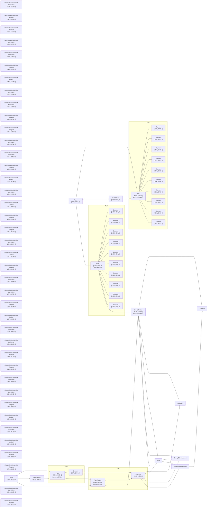

```mermaid
flowchart LR
  subgraph path4 [Path]
    4["Path<br>[1003, 3791, 0]<br>Consumed: false"]
      %% [ProgramBodyItem { index: 22 }, VariableDeclarationDeclaration, VariableDeclarationInit]
    7["Segment<br>[1034, 1095, 0]"]
      %% [ProgramBodyItem { index: 22 }, VariableDeclarationDeclaration, VariableDeclarationInit, SketchBlockBody, SketchBlockBodyItem { index: 0 }, VariableDeclarationDeclaration, VariableDeclarationInit]
    11["Segment<br>[1236, 1333, 0]"]
      %% [ProgramBodyItem { index: 22 }, VariableDeclarationDeclaration, VariableDeclarationInit, SketchBlockBody, SketchBlockBodyItem { index: 4 }, VariableDeclarationDeclaration, VariableDeclarationInit]
    16["Segment<br>[1542, 1608, 0]"]
      %% [ProgramBodyItem { index: 22 }, VariableDeclarationDeclaration, VariableDeclarationInit, SketchBlockBody, SketchBlockBodyItem { index: 9 }, VariableDeclarationDeclaration, VariableDeclarationInit]
    21["Segment<br>[1824, 1923, 0]"]
      %% [ProgramBodyItem { index: 22 }, VariableDeclarationDeclaration, VariableDeclarationInit, SketchBlockBody, SketchBlockBodyItem { index: 14 }, VariableDeclarationDeclaration, VariableDeclarationInit]
    26["Segment<br>[2140, 2208, 0]"]
      %% [ProgramBodyItem { index: 22 }, VariableDeclarationDeclaration, VariableDeclarationInit, SketchBlockBody, SketchBlockBodyItem { index: 19 }, VariableDeclarationDeclaration, VariableDeclarationInit]
    31["Segment<br>[2397, 2465, 0]"]
      %% [ProgramBodyItem { index: 22 }, VariableDeclarationDeclaration, VariableDeclarationInit, SketchBlockBody, SketchBlockBodyItem { index: 24 }, VariableDeclarationDeclaration, VariableDeclarationInit]
    35["Segment<br>[2629, 2730, 0]"]
      %% [ProgramBodyItem { index: 22 }, VariableDeclarationDeclaration, VariableDeclarationInit, SketchBlockBody, SketchBlockBodyItem { index: 28 }, VariableDeclarationDeclaration, VariableDeclarationInit]
    40["Segment<br>[2969, 3037, 0]"]
      %% [ProgramBodyItem { index: 22 }, VariableDeclarationDeclaration, VariableDeclarationInit, SketchBlockBody, SketchBlockBodyItem { index: 33 }, VariableDeclarationDeclaration, VariableDeclarationInit]
    45["Segment<br>[3235, 3336, 0]"]
      %% [ProgramBodyItem { index: 22 }, VariableDeclarationDeclaration, VariableDeclarationInit, SketchBlockBody, SketchBlockBodyItem { index: 38 }, VariableDeclarationDeclaration, VariableDeclarationInit]
    50["Segment<br>[3554, 3622, 0]"]
      %% [ProgramBodyItem { index: 22 }, VariableDeclarationDeclaration, VariableDeclarationInit, SketchBlockBody, SketchBlockBodyItem { index: 43 }, VariableDeclarationDeclaration, VariableDeclarationInit]
  end
  subgraph path55 [Path]
    55["Path<br>[3835, 4032, 0]<br>Consumed: false"]
      %% [ProgramBodyItem { index: 23 }, VariableDeclarationDeclaration, VariableDeclarationInit]
    58["Segment<br>[3871, 3936, 0]"]
      %% [ProgramBodyItem { index: 23 }, VariableDeclarationDeclaration, VariableDeclarationInit, SketchBlockBody, SketchBlockBodyItem { index: 0 }, VariableDeclarationDeclaration, VariableDeclarationInit]
  end
  subgraph path61 [Path]
    61["Path Region<br>[4050, 4098, 0]<br>Consumed: true"]
      %% [ProgramBodyItem { index: 24 }, VariableDeclarationDeclaration, VariableDeclarationInit]
    62["Segment<br>[4050, 4098, 0]"]
      %% [ProgramBodyItem { index: 24 }, VariableDeclarationDeclaration, VariableDeclarationInit]
  end
  subgraph path63 [Path]
    63["Path<br>[4106, 4397, 0]<br>Consumed: true"]
      %% [ProgramBodyItem { index: 25 }, VariableDeclarationDeclaration, VariableDeclarationInit, PipeBodyItem { index: 0 }]
    64["Segment<br>[4106, 4397, 0]"]
      %% [ProgramBodyItem { index: 25 }, VariableDeclarationDeclaration, VariableDeclarationInit, PipeBodyItem { index: 0 }]
    65["Segment<br>[4106, 4397, 0]"]
      %% [ProgramBodyItem { index: 25 }, VariableDeclarationDeclaration, VariableDeclarationInit, PipeBodyItem { index: 0 }]
    66["Segment<br>[4106, 4397, 0]"]
      %% [ProgramBodyItem { index: 25 }, VariableDeclarationDeclaration, VariableDeclarationInit, PipeBodyItem { index: 0 }]
    67["Segment<br>[4106, 4397, 0]"]
      %% [ProgramBodyItem { index: 25 }, VariableDeclarationDeclaration, VariableDeclarationInit, PipeBodyItem { index: 0 }]
    68["Segment<br>[4106, 4397, 0]"]
      %% [ProgramBodyItem { index: 25 }, VariableDeclarationDeclaration, VariableDeclarationInit, PipeBodyItem { index: 0 }]
    69["Segment<br>[4106, 4397, 0]"]
      %% [ProgramBodyItem { index: 25 }, VariableDeclarationDeclaration, VariableDeclarationInit, PipeBodyItem { index: 0 }]
    70["Segment<br>[4106, 4397, 0]"]
      %% [ProgramBodyItem { index: 25 }, VariableDeclarationDeclaration, VariableDeclarationInit, PipeBodyItem { index: 0 }]
    71["Segment<br>[4106, 4397, 0]"]
      %% [ProgramBodyItem { index: 25 }, VariableDeclarationDeclaration, VariableDeclarationInit, PipeBodyItem { index: 0 }]
    72["Segment<br>[4106, 4397, 0]"]
      %% [ProgramBodyItem { index: 25 }, VariableDeclarationDeclaration, VariableDeclarationInit, PipeBodyItem { index: 0 }]
    73["Segment<br>[4106, 4397, 0]"]
      %% [ProgramBodyItem { index: 25 }, VariableDeclarationDeclaration, VariableDeclarationInit, PipeBodyItem { index: 0 }]
  end
  1["Cap End"]
    %% face_code_ref=Missing NodePath
  2["Cap Start"]
    %% face_code_ref=Missing NodePath
  3[Wall]
    %% face_code_ref=Missing NodePath
  5["Plane<br>[1003, 3791, 0]"]
    %% [ProgramBodyItem { index: 22 }, VariableDeclarationDeclaration, VariableDeclarationInit]
  6["SketchBlock<br>[1003, 3791, 0]"]
    %% [ProgramBodyItem { index: 22 }, VariableDeclarationDeclaration, VariableDeclarationInit]
  8["SketchBlockConstraint Coincident<br>[1098, 1138, 0]"]
    %% [ProgramBodyItem { index: 22 }, VariableDeclarationDeclaration, VariableDeclarationInit, SketchBlockBody, SketchBlockBodyItem { index: 1 }, ExpressionStatementExpr]
  9["SketchBlockConstraint Vertical<br>[1141, 1159, 0]"]
    %% [ProgramBodyItem { index: 22 }, VariableDeclarationDeclaration, VariableDeclarationInit, SketchBlockBody, SketchBlockBodyItem { index: 2 }, ExpressionStatementExpr]
  10["SketchBlockConstraint Distance<br>[1162, 1220, 0]"]
    %% [ProgramBodyItem { index: 22 }, VariableDeclarationDeclaration, VariableDeclarationInit, SketchBlockBody, SketchBlockBodyItem { index: 3 }, ExpressionStatementExpr]
  12["SketchBlockConstraint Coincident<br>[1336, 1377, 0]"]
    %% [ProgramBodyItem { index: 22 }, VariableDeclarationDeclaration, VariableDeclarationInit, SketchBlockBody, SketchBlockBodyItem { index: 5 }, ExpressionStatementExpr]
  13["SketchBlockConstraint Coincident<br>[1380, 1457, 0]"]
    %% [ProgramBodyItem { index: 22 }, VariableDeclarationDeclaration, VariableDeclarationInit, SketchBlockBody, SketchBlockBodyItem { index: 6 }, ExpressionStatementExpr]
  14["SketchBlockConstraint Tangent<br>[1460, 1490, 0]"]
    %% [ProgramBodyItem { index: 22 }, VariableDeclarationDeclaration, VariableDeclarationInit, SketchBlockBody, SketchBlockBodyItem { index: 7 }, ExpressionStatementExpr]
  15["SketchBlockConstraint Radius<br>[1493, 1524, 0]"]
    %% [ProgramBodyItem { index: 22 }, VariableDeclarationDeclaration, VariableDeclarationInit, SketchBlockBody, SketchBlockBodyItem { index: 8 }, ExpressionStatementExpr]
  17["SketchBlockConstraint Coincident<br>[1611, 1659, 0]"]
    %% [ProgramBodyItem { index: 22 }, VariableDeclarationDeclaration, VariableDeclarationInit, SketchBlockBody, SketchBlockBodyItem { index: 10 }, ExpressionStatementExpr]
  18["SketchBlockConstraint Horizontal<br>[1662, 1685, 0]"]
    %% [ProgramBodyItem { index: 22 }, VariableDeclarationDeclaration, VariableDeclarationInit, SketchBlockBody, SketchBlockBodyItem { index: 11 }, ExpressionStatementExpr]
  19["SketchBlockConstraint Distance<br>[1688, 1770, 0]"]
    %% [ProgramBodyItem { index: 22 }, VariableDeclarationDeclaration, VariableDeclarationInit, SketchBlockBody, SketchBlockBodyItem { index: 12 }, ExpressionStatementExpr]
  20["SketchBlockConstraint Tangent<br>[1774, 1807, 0]"]
    %% [ProgramBodyItem { index: 22 }, VariableDeclarationDeclaration, VariableDeclarationInit, SketchBlockBody, SketchBlockBodyItem { index: 13 }, ExpressionStatementExpr]
  22["SketchBlockConstraint Coincident<br>[1926, 1971, 0]"]
    %% [ProgramBodyItem { index: 22 }, VariableDeclarationDeclaration, VariableDeclarationInit, SketchBlockBody, SketchBlockBodyItem { index: 15 }, ExpressionStatementExpr]
  23["SketchBlockConstraint Coincident<br>[1974, 2052, 0]"]
    %% [ProgramBodyItem { index: 22 }, VariableDeclarationDeclaration, VariableDeclarationInit, SketchBlockBody, SketchBlockBodyItem { index: 16 }, ExpressionStatementExpr]
  24["SketchBlockConstraint Tangent<br>[2055, 2089, 0]"]
    %% [ProgramBodyItem { index: 22 }, VariableDeclarationDeclaration, VariableDeclarationInit, SketchBlockBody, SketchBlockBodyItem { index: 17 }, ExpressionStatementExpr]
  25["SketchBlockConstraint Radius<br>[2092, 2124, 0]"]
    %% [ProgramBodyItem { index: 22 }, VariableDeclarationDeclaration, VariableDeclarationInit, SketchBlockBody, SketchBlockBodyItem { index: 18 }, ExpressionStatementExpr]
  27["SketchBlockConstraint Coincident<br>[2211, 2258, 0]"]
    %% [ProgramBodyItem { index: 22 }, VariableDeclarationDeclaration, VariableDeclarationInit, SketchBlockBody, SketchBlockBodyItem { index: 20 }, ExpressionStatementExpr]
  28["SketchBlockConstraint Vertical<br>[2261, 2280, 0]"]
    %% [ProgramBodyItem { index: 22 }, VariableDeclarationDeclaration, VariableDeclarationInit, SketchBlockBody, SketchBlockBodyItem { index: 21 }, ExpressionStatementExpr]
  29["SketchBlockConstraint Distance<br>[2283, 2344, 0]"]
    %% [ProgramBodyItem { index: 22 }, VariableDeclarationDeclaration, VariableDeclarationInit, SketchBlockBody, SketchBlockBodyItem { index: 22 }, ExpressionStatementExpr]
  30["SketchBlockConstraint Tangent<br>[2347, 2379, 0]"]
    %% [ProgramBodyItem { index: 22 }, VariableDeclarationDeclaration, VariableDeclarationInit, SketchBlockBody, SketchBlockBodyItem { index: 23 }, ExpressionStatementExpr]
  32["SketchBlockConstraint Coincident<br>[2468, 2514, 0]"]
    %% [ProgramBodyItem { index: 22 }, VariableDeclarationDeclaration, VariableDeclarationInit, SketchBlockBody, SketchBlockBodyItem { index: 25 }, ExpressionStatementExpr]
  33["SketchBlockConstraint Vertical<br>[2517, 2538, 0]"]
    %% [ProgramBodyItem { index: 22 }, VariableDeclarationDeclaration, VariableDeclarationInit, SketchBlockBody, SketchBlockBodyItem { index: 26 }, ExpressionStatementExpr]
  34["SketchBlockConstraint Distance<br>[2541, 2608, 0]"]
    %% [ProgramBodyItem { index: 22 }, VariableDeclarationDeclaration, VariableDeclarationInit, SketchBlockBody, SketchBlockBodyItem { index: 27 }, ExpressionStatementExpr]
  36["SketchBlockConstraint Coincident<br>[2733, 2784, 0]"]
    %% [ProgramBodyItem { index: 22 }, VariableDeclarationDeclaration, VariableDeclarationInit, SketchBlockBody, SketchBlockBodyItem { index: 29 }, ExpressionStatementExpr]
  37["SketchBlockConstraint Coincident<br>[2787, 2873, 0]"]
    %% [ProgramBodyItem { index: 22 }, VariableDeclarationDeclaration, VariableDeclarationInit, SketchBlockBody, SketchBlockBodyItem { index: 30 }, ExpressionStatementExpr]
  38["SketchBlockConstraint Tangent<br>[2876, 2914, 0]"]
    %% [ProgramBodyItem { index: 22 }, VariableDeclarationDeclaration, VariableDeclarationInit, SketchBlockBody, SketchBlockBodyItem { index: 31 }, ExpressionStatementExpr]
  39["SketchBlockConstraint Radius<br>[2917, 2953, 0]"]
    %% [ProgramBodyItem { index: 22 }, VariableDeclarationDeclaration, VariableDeclarationInit, SketchBlockBody, SketchBlockBodyItem { index: 32 }, ExpressionStatementExpr]
  41["SketchBlockConstraint Coincident<br>[3040, 3089, 0]"]
    %% [ProgramBodyItem { index: 22 }, VariableDeclarationDeclaration, VariableDeclarationInit, SketchBlockBody, SketchBlockBodyItem { index: 34 }, ExpressionStatementExpr]
  42["SketchBlockConstraint Horizontal<br>[3092, 3113, 0]"]
    %% [ProgramBodyItem { index: 22 }, VariableDeclarationDeclaration, VariableDeclarationInit, SketchBlockBody, SketchBlockBodyItem { index: 35 }, ExpressionStatementExpr]
  43["SketchBlockConstraint Distance<br>[3116, 3177, 0]"]
    %% [ProgramBodyItem { index: 22 }, VariableDeclarationDeclaration, VariableDeclarationInit, SketchBlockBody, SketchBlockBodyItem { index: 36 }, ExpressionStatementExpr]
  44["SketchBlockConstraint Tangent<br>[3180, 3216, 0]"]
    %% [ProgramBodyItem { index: 22 }, VariableDeclarationDeclaration, VariableDeclarationInit, SketchBlockBody, SketchBlockBodyItem { index: 37 }, ExpressionStatementExpr]
  46["SketchBlockConstraint Coincident<br>[3339, 3386, 0]"]
    %% [ProgramBodyItem { index: 22 }, VariableDeclarationDeclaration, VariableDeclarationInit, SketchBlockBody, SketchBlockBodyItem { index: 39 }, ExpressionStatementExpr]
  47["SketchBlockConstraint Coincident<br>[3389, 3465, 0]"]
    %% [ProgramBodyItem { index: 22 }, VariableDeclarationDeclaration, VariableDeclarationInit, SketchBlockBody, SketchBlockBodyItem { index: 40 }, ExpressionStatementExpr]
  48["SketchBlockConstraint Tangent<br>[3468, 3502, 0]"]
    %% [ProgramBodyItem { index: 22 }, VariableDeclarationDeclaration, VariableDeclarationInit, SketchBlockBody, SketchBlockBodyItem { index: 41 }, ExpressionStatementExpr]
  49["SketchBlockConstraint Radius<br>[3505, 3539, 0]"]
    %% [ProgramBodyItem { index: 22 }, VariableDeclarationDeclaration, VariableDeclarationInit, SketchBlockBody, SketchBlockBodyItem { index: 42 }, ExpressionStatementExpr]
  51["SketchBlockConstraint Coincident<br>[3625, 3671, 0]"]
    %% [ProgramBodyItem { index: 22 }, VariableDeclarationDeclaration, VariableDeclarationInit, SketchBlockBody, SketchBlockBodyItem { index: 44 }, ExpressionStatementExpr]
  52["SketchBlockConstraint Vertical<br>[3674, 3692, 0]"]
    %% [ProgramBodyItem { index: 22 }, VariableDeclarationDeclaration, VariableDeclarationInit, SketchBlockBody, SketchBlockBodyItem { index: 45 }, ExpressionStatementExpr]
  53["SketchBlockConstraint Distance<br>[3695, 3753, 0]"]
    %% [ProgramBodyItem { index: 22 }, VariableDeclarationDeclaration, VariableDeclarationInit, SketchBlockBody, SketchBlockBodyItem { index: 46 }, ExpressionStatementExpr]
  54["SketchBlockConstraint Tangent<br>[3756, 3789, 0]"]
    %% [ProgramBodyItem { index: 22 }, VariableDeclarationDeclaration, VariableDeclarationInit, SketchBlockBody, SketchBlockBodyItem { index: 47 }, ExpressionStatementExpr]
  56["Plane<br>[3835, 4032, 0]"]
    %% [ProgramBodyItem { index: 23 }, VariableDeclarationDeclaration, VariableDeclarationInit]
  57["SketchBlock<br>[3835, 4032, 0]"]
    %% [ProgramBodyItem { index: 23 }, VariableDeclarationDeclaration, VariableDeclarationInit]
  59["SketchBlockConstraint Coincident<br>[3939, 3985, 0]"]
    %% [ProgramBodyItem { index: 23 }, VariableDeclarationDeclaration, VariableDeclarationInit, SketchBlockBody, SketchBlockBodyItem { index: 1 }, ExpressionStatementExpr]
  60["SketchBlockConstraint Diameter<br>[3988, 4030, 0]"]
    %% [ProgramBodyItem { index: 23 }, VariableDeclarationDeclaration, VariableDeclarationInit, SketchBlockBody, SketchBlockBodyItem { index: 2 }, ExpressionStatementExpr]
  74["Sweep Sweep<br>[4106, 4397, 0]<br>Consumed: false"]
    %% [ProgramBodyItem { index: 25 }, VariableDeclarationDeclaration, VariableDeclarationInit, PipeBodyItem { index: 0 }]
  75["SweepEdge Adjacent"]
  76["SweepEdge Opposite"]
  74 --- 1
  76 <--x 1
  62 <--x 2
  74 --- 2
  62 --- 3
  74 --- 3
  3 --- 75
  3 --- 76
  5 --- 4
  6 --- 4
  4 --- 7
  4 --- 11
  4 --- 16
  4 --- 21
  4 --- 26
  4 --- 31
  4 --- 35
  4 --- 40
  4 --- 45
  4 --- 50
  5 <--x 6
  5 --- 63
  56 --- 55
  57 --- 55
  55 --- 58
  55 <--x 61
  56 <--x 57
  56 <--x 61
  58 <--x 62
  61 <--x 62
  61 ---- 74
  62 --- 75
  62 --- 76
  63 --- 64
  63 --- 65
  63 --- 66
  63 --- 67
  63 --- 68
  63 --- 69
  63 --- 70
  63 --- 71
  63 --- 72
  63 --- 73
  63 ---- 74
  74 --- 75
  74 --- 76
```
