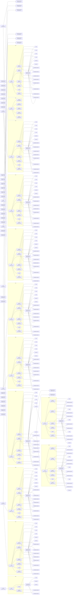

```mermaid
flowchart LR
  subgraph path2 [Path]
    2["Path<br>[662, 696, 0]"]
    3["Segment<br>[702, 734, 0]"]
    4["Segment<br>[740, 772, 0]"]
    5["Segment<br>[778, 811, 0]"]
    6["Segment<br>[817, 873, 0]"]
    7["Segment<br>[879, 886, 0]"]
    8[Solid2d]
  end
  subgraph path32 [Path]
    32["Path<br>[1279, 1332, 0]"]
    33["Segment<br>[1338, 1370, 0]"]
    34["Segment<br>[1376, 1408, 0]"]
    35["Segment<br>[1414, 1447, 0]"]
    36["Segment<br>[1453, 1509, 0]"]
    37["Segment<br>[1515, 1522, 0]"]
    38[Solid2d]
  end
  subgraph path59 [Path]
    59["Path<br>[1787, 1840, 0]"]
    60["Segment<br>[1846, 1878, 0]"]
    61["Segment<br>[1884, 1916, 0]"]
    62["Segment<br>[1922, 1955, 0]"]
    63["Segment<br>[1961, 2017, 0]"]
    64["Segment<br>[2023, 2030, 0]"]
    65[Solid2d]
  end
  subgraph path83 [Path]
    83["Path<br>[2426, 2481, 0]"]
    84["Segment<br>[2487, 2519, 0]"]
    85["Segment<br>[2525, 2557, 0]"]
    86["Segment<br>[2563, 2596, 0]"]
    87["Segment<br>[2602, 2658, 0]"]
    88["Segment<br>[2664, 2671, 0]"]
    89[Solid2d]
  end
  subgraph path111 [Path]
    111["Path<br>[2973, 3011, 0]"]
    112["Segment<br>[3017, 3049, 0]"]
    113["Segment<br>[3055, 3081, 0]"]
    114["Segment<br>[3087, 3120, 0]"]
    115["Segment<br>[3126, 3182, 0]"]
    116["Segment<br>[3188, 3195, 0]"]
    117[Solid2d]
  end
  subgraph path134 [Path]
    134["Path<br>[3378, 3431, 0]"]
    135["Segment<br>[3437, 3469, 0]"]
    136["Segment<br>[3475, 3507, 0]"]
    137["Segment<br>[3513, 3546, 0]"]
    138["Segment<br>[3552, 3608, 0]"]
    139["Segment<br>[3614, 3621, 0]"]
    140[Solid2d]
  end
  subgraph path158 [Path]
    158["Path<br>[3849, 3886, 0]"]
    159["Segment<br>[3892, 3918, 0]"]
    160["Segment<br>[3924, 3950, 0]"]
    161["Segment<br>[3956, 3983, 0]"]
    162["Segment<br>[3989, 4045, 0]"]
    163["Segment<br>[4051, 4058, 0]"]
    164[Solid2d]
  end
  subgraph path180 [Path]
    180["Path<br>[4340, 4408, 0]"]
    181["Segment<br>[4414, 4440, 0]"]
    182["Segment<br>[4446, 4472, 0]"]
    183["Segment<br>[4478, 4505, 0]"]
    184["Segment<br>[4511, 4567, 0]"]
    185["Segment<br>[4573, 4580, 0]"]
    186[Solid2d]
  end
  subgraph path202 [Path]
    202["Path<br>[4769, 4890, 0]"]
    203["Segment<br>[4896, 4945, 0]"]
    204["Segment<br>[4951, 4999, 0]"]
    205["Segment<br>[5005, 5053, 0]"]
    206["Segment<br>[5059, 5115, 0]"]
    207["Segment<br>[5121, 5128, 0]"]
    208[Solid2d]
  end
  subgraph path225 [Path]
    225["Path<br>[5660, 5701, 0]"]
    226["Segment<br>[5707, 5739, 0]"]
    227["Segment<br>[5745, 5770, 0]"]
    228["Segment<br>[5776, 5809, 0]"]
    229["Segment<br>[5815, 5871, 0]"]
    230["Segment<br>[5877, 5884, 0]"]
    231[Solid2d]
  end
  subgraph path252 [Path]
    252["Path<br>[6171, 6212, 0]"]
    253["Segment<br>[6218, 6244, 0]"]
    254["Segment<br>[6250, 6282, 0]"]
    255["Segment<br>[6288, 6315, 0]"]
    256["Segment<br>[6321, 6377, 0]"]
    257["Segment<br>[6383, 6390, 0]"]
    258[Solid2d]
  end
  subgraph path276 [Path]
    276["Path<br>[6867, 6917, 0]"]
    277["Segment<br>[6923, 6960, 0]"]
    278["Segment<br>[6966, 7050, 0]"]
    279["Segment<br>[7056, 7092, 0]"]
    280["Segment<br>[7098, 7190, 0]"]
    281["Segment<br>[7196, 7232, 0]"]
  end
  subgraph path283 [Path]
    283["Path<br>[7295, 7406, 0]"]
    284["Segment<br>[7295, 7406, 0]"]
    285[Solid2d]
  end
  1["Plane<br>[555, 572, 0]"]
  9["Sweep Extrusion<br>[1047, 1074, 0]"]
  10[Wall]
  11[Wall]
  12[Wall]
  13[Wall]
  14["Cap Start"]
  15["Cap End"]
  16["SweepEdge Opposite"]
  17["SweepEdge Adjacent"]
  18["SweepEdge Opposite"]
  19["SweepEdge Adjacent"]
  20["SweepEdge Opposite"]
  21["SweepEdge Adjacent"]
  22["SweepEdge Opposite"]
  23["SweepEdge Adjacent"]
  24["Sweep Extrusion<br>[1047, 1074, 0]"]
  25["Sweep Extrusion<br>[1047, 1074, 0]"]
  26["Sweep Extrusion<br>[1047, 1074, 0]"]
  27["Sweep Extrusion<br>[1047, 1074, 0]"]
  28["Sweep Extrusion<br>[1047, 1074, 0]"]
  29["Sweep Extrusion<br>[1047, 1074, 0]"]
  30["Sweep Extrusion<br>[1047, 1074, 0]"]
  31["Plane<br>[1206, 1260, 0]"]
  39["Sweep Extrusion<br>[1685, 1719, 0]"]
  40[Wall]
  41[Wall]
  42[Wall]
  43[Wall]
  44["Cap Start"]
  45["Cap End"]
  46["SweepEdge Opposite"]
  47["SweepEdge Adjacent"]
  48["SweepEdge Opposite"]
  49["SweepEdge Adjacent"]
  50["SweepEdge Opposite"]
  51["SweepEdge Adjacent"]
  52["SweepEdge Opposite"]
  53["SweepEdge Adjacent"]
  54["Sweep Extrusion<br>[1685, 1719, 0]"]
  55["Sweep Extrusion<br>[1685, 1719, 0]"]
  56["Sweep Extrusion<br>[1685, 1719, 0]"]
  57["Sweep Extrusion<br>[1685, 1719, 0]"]
  58["Sweep Extrusion<br>[1685, 1719, 0]"]
  66["Sweep Extrusion<br>[2129, 2163, 0]"]
  67[Wall]
  68[Wall]
  69[Wall]
  70[Wall]
  71["Cap Start"]
  72["Cap End"]
  73["SweepEdge Opposite"]
  74["SweepEdge Adjacent"]
  75["SweepEdge Opposite"]
  76["SweepEdge Adjacent"]
  77["SweepEdge Opposite"]
  78["SweepEdge Adjacent"]
  79["SweepEdge Opposite"]
  80["SweepEdge Adjacent"]
  81["Sweep Extrusion<br>[2129, 2163, 0]"]
  82["Plane<br>[2280, 2331, 0]"]
  90["Sweep Extrusion<br>[2834, 2869, 0]"]
  91[Wall]
  92[Wall]
  93[Wall]
  94[Wall]
  95["Cap Start"]
  96["Cap End"]
  97["SweepEdge Opposite"]
  98["SweepEdge Adjacent"]
  99["SweepEdge Opposite"]
  100["SweepEdge Adjacent"]
  101["SweepEdge Opposite"]
  102["SweepEdge Adjacent"]
  103["SweepEdge Opposite"]
  104["SweepEdge Adjacent"]
  105["Sweep Extrusion<br>[2834, 2869, 0]"]
  106["Sweep Extrusion<br>[2834, 2869, 0]"]
  107["Sweep Extrusion<br>[2834, 2869, 0]"]
  108["Sweep Extrusion<br>[2834, 2869, 0]"]
  109["Sweep Extrusion<br>[2834, 2869, 0]"]
  110["Plane<br>[2916, 2953, 0]"]
  118["Sweep Extrusion<br>[3275, 3310, 0]"]
  119[Wall]
  120[Wall]
  121[Wall]
  122[Wall]
  123["Cap Start"]
  124["Cap End"]
  125["SweepEdge Opposite"]
  126["SweepEdge Adjacent"]
  127["SweepEdge Opposite"]
  128["SweepEdge Adjacent"]
  129["SweepEdge Opposite"]
  130["SweepEdge Adjacent"]
  131["SweepEdge Opposite"]
  132["SweepEdge Adjacent"]
  133["Sweep Extrusion<br>[3275, 3310, 0]"]
  141["Sweep Extrusion<br>[3720, 3755, 0]"]
  142[Wall]
  143[Wall]
  144[Wall]
  145[Wall]
  146["Cap Start"]
  147["Cap End"]
  148["SweepEdge Opposite"]
  149["SweepEdge Adjacent"]
  150["SweepEdge Opposite"]
  151["SweepEdge Adjacent"]
  152["SweepEdge Opposite"]
  153["SweepEdge Adjacent"]
  154["SweepEdge Opposite"]
  155["SweepEdge Adjacent"]
  156["Sweep Extrusion<br>[3720, 3755, 0]"]
  157["Plane<br>[3795, 3832, 0]"]
  165["Sweep Extrusion<br>[4064, 4097, 0]"]
  166[Wall]
  167[Wall]
  168[Wall]
  169[Wall]
  170["Cap Start"]
  171["Cap End"]
  172["SweepEdge Opposite"]
  173["SweepEdge Adjacent"]
  174["SweepEdge Opposite"]
  175["SweepEdge Adjacent"]
  176["SweepEdge Opposite"]
  177["SweepEdge Adjacent"]
  178["SweepEdge Opposite"]
  179["SweepEdge Adjacent"]
  187["Sweep Extrusion<br>[4670, 4697, 0]"]
  188[Wall]
  189[Wall]
  190[Wall]
  191[Wall]
  192["Cap End"]
  193["SweepEdge Opposite"]
  194["SweepEdge Adjacent"]
  195["SweepEdge Opposite"]
  196["SweepEdge Adjacent"]
  197["SweepEdge Opposite"]
  198["SweepEdge Adjacent"]
  199["SweepEdge Opposite"]
  200["SweepEdge Adjacent"]
  201["Sweep Extrusion<br>[4670, 4697, 0]"]
  209["Sweep Extrusion<br>[5217, 5245, 0]"]
  210[Wall]
  211[Wall]
  212[Wall]
  213[Wall]
  214["Cap Start"]
  215["SweepEdge Opposite"]
  216["SweepEdge Adjacent"]
  217["SweepEdge Opposite"]
  218["SweepEdge Adjacent"]
  219["SweepEdge Opposite"]
  220["SweepEdge Adjacent"]
  221["SweepEdge Opposite"]
  222["SweepEdge Adjacent"]
  223["Sweep Extrusion<br>[5217, 5245, 0]"]
  224["Plane<br>[5598, 5647, 0]"]
  232["Sweep Extrusion<br>[5983, 6011, 0]"]
  233[Wall]
  234[Wall]
  235[Wall]
  236[Wall]
  237["Cap Start"]
  238["Cap End"]
  239["SweepEdge Opposite"]
  240["SweepEdge Adjacent"]
  241["SweepEdge Opposite"]
  242["SweepEdge Adjacent"]
  243["SweepEdge Opposite"]
  244["SweepEdge Adjacent"]
  245["SweepEdge Opposite"]
  246["SweepEdge Adjacent"]
  247["Sweep Extrusion<br>[5983, 6011, 0]"]
  248["Sweep Extrusion<br>[5983, 6011, 0]"]
  249["Sweep Extrusion<br>[5983, 6011, 0]"]
  250["Sweep Extrusion<br>[5983, 6011, 0]"]
  251["Sweep Extrusion<br>[5983, 6011, 0]"]
  259["Sweep Extrusion<br>[6472, 6500, 0]"]
  260[Wall]
  261[Wall]
  262[Wall]
  263[Wall]
  264["Cap Start"]
  265["Cap End"]
  266["SweepEdge Opposite"]
  267["SweepEdge Adjacent"]
  268["SweepEdge Opposite"]
  269["SweepEdge Adjacent"]
  270["SweepEdge Opposite"]
  271["SweepEdge Adjacent"]
  272["SweepEdge Opposite"]
  273["SweepEdge Adjacent"]
  274["Sweep Extrusion<br>[6472, 6500, 0]"]
  275["Plane<br>[6793, 6844, 0]"]
  282["Plane<br>[7254, 7271, 0]"]
  286["Sweep Sweep<br>[7420, 7473, 0]"]
  287[Wall]
  288["Cap Start"]
  289["Cap Start"]
  290["SweepEdge Opposite"]
  291["SweepEdge Adjacent"]
  292["StartSketchOnPlane<br>[1192, 1261, 0]"]
  293["StartSketchOnPlane<br>[2266, 2332, 0]"]
  294["StartSketchOnPlane<br>[2902, 2954, 0]"]
  295["StartSketchOnPlane<br>[3781, 3833, 0]"]
  296["StartSketchOnFace<br>[4285, 4321, 0]"]
  297["StartSketchOnFace<br>[4717, 4751, 0]"]
  298["StartSketchOnPlane<br>[5584, 5648, 0]"]
  299["StartSketchOnPlane<br>[6779, 6845, 0]"]
  1 --- 2
  2 --- 3
  2 --- 4
  2 --- 5
  2 --- 6
  2 --- 7
  2 ---- 9
  2 --- 8
  3 --- 13
  3 --- 22
  3 --- 23
  4 --- 12
  4 --- 20
  4 --- 21
  5 --- 11
  5 --- 18
  5 --- 19
  6 --- 10
  6 --- 16
  6 --- 17
  9 --- 10
  9 --- 11
  9 --- 12
  9 --- 13
  9 --- 14
  9 --- 15
  9 --- 16
  9 --- 17
  9 --- 18
  9 --- 19
  9 --- 20
  9 --- 21
  9 --- 22
  9 --- 23
  31 --- 32
  31 --- 59
  32 --- 33
  32 --- 34
  32 --- 35
  32 --- 36
  32 --- 37
  32 ---- 39
  32 --- 38
  33 --- 43
  33 --- 52
  33 --- 53
  34 --- 42
  34 --- 50
  34 --- 51
  35 --- 41
  35 --- 48
  35 --- 49
  36 --- 40
  36 --- 46
  36 --- 47
  39 --- 40
  39 --- 41
  39 --- 42
  39 --- 43
  39 --- 44
  39 --- 45
  39 --- 46
  39 --- 47
  39 --- 48
  39 --- 49
  39 --- 50
  39 --- 51
  39 --- 52
  39 --- 53
  59 --- 60
  59 --- 61
  59 --- 62
  59 --- 63
  59 --- 64
  59 ---- 66
  59 --- 65
  60 --- 70
  60 --- 79
  60 --- 80
  61 --- 69
  61 --- 77
  61 --- 78
  62 --- 68
  62 --- 75
  62 --- 76
  63 --- 67
  63 --- 73
  63 --- 74
  66 --- 67
  66 --- 68
  66 --- 69
  66 --- 70
  66 --- 71
  66 --- 72
  66 --- 73
  66 --- 74
  66 --- 75
  66 --- 76
  66 --- 77
  66 --- 78
  66 --- 79
  66 --- 80
  82 --- 83
  83 --- 84
  83 --- 85
  83 --- 86
  83 --- 87
  83 --- 88
  83 ---- 90
  83 --- 89
  84 --- 94
  84 --- 103
  84 --- 104
  85 --- 93
  85 --- 101
  85 --- 102
  86 --- 92
  86 --- 99
  86 --- 100
  87 --- 91
  87 --- 97
  87 --- 98
  90 --- 91
  90 --- 92
  90 --- 93
  90 --- 94
  90 --- 95
  90 --- 96
  90 --- 97
  90 --- 98
  90 --- 99
  90 --- 100
  90 --- 101
  90 --- 102
  90 --- 103
  90 --- 104
  110 --- 111
  110 --- 134
  111 --- 112
  111 --- 113
  111 --- 114
  111 --- 115
  111 --- 116
  111 ---- 118
  111 --- 117
  112 --- 122
  112 --- 131
  112 --- 132
  113 --- 121
  113 --- 129
  113 --- 130
  114 --- 120
  114 --- 127
  114 --- 128
  115 --- 119
  115 --- 125
  115 --- 126
  118 --- 119
  118 --- 120
  118 --- 121
  118 --- 122
  118 --- 123
  118 --- 124
  118 --- 125
  118 --- 126
  118 --- 127
  118 --- 128
  118 --- 129
  118 --- 130
  118 --- 131
  118 --- 132
  134 --- 135
  134 --- 136
  134 --- 137
  134 --- 138
  134 --- 139
  134 ---- 141
  134 --- 140
  135 --- 145
  135 --- 154
  135 --- 155
  136 --- 144
  136 --- 152
  136 --- 153
  137 --- 143
  137 --- 150
  137 --- 151
  138 --- 142
  138 --- 148
  138 --- 149
  141 --- 142
  141 --- 143
  141 --- 144
  141 --- 145
  141 --- 146
  141 --- 147
  141 --- 148
  141 --- 149
  141 --- 150
  141 --- 151
  141 --- 152
  141 --- 153
  141 --- 154
  141 --- 155
  157 --- 158
  158 --- 159
  158 --- 160
  158 --- 161
  158 --- 162
  158 --- 163
  158 ---- 165
  158 --- 164
  159 --- 169
  159 --- 178
  159 --- 179
  160 --- 168
  160 --- 176
  160 --- 177
  161 --- 167
  161 --- 174
  161 --- 175
  162 --- 166
  162 --- 172
  162 --- 173
  165 --- 166
  165 --- 167
  165 --- 168
  165 --- 169
  165 --- 170
  165 --- 171
  165 --- 172
  165 --- 173
  165 --- 174
  165 --- 175
  165 --- 176
  165 --- 177
  165 --- 178
  165 --- 179
  170 --- 180
  171 --- 202
  180 --- 181
  180 --- 182
  180 --- 183
  180 --- 184
  180 --- 185
  180 ---- 187
  180 --- 186
  181 --- 188
  181 --- 193
  181 --- 194
  182 --- 189
  182 --- 195
  182 --- 196
  183 --- 190
  183 --- 197
  183 --- 198
  184 --- 191
  184 --- 199
  184 --- 200
  187 --- 188
  187 --- 189
  187 --- 190
  187 --- 191
  187 --- 192
  187 --- 193
  187 --- 194
  187 --- 195
  187 --- 196
  187 --- 197
  187 --- 198
  187 --- 199
  187 --- 200
  202 --- 203
  202 --- 204
  202 --- 205
  202 --- 206
  202 --- 207
  202 ---- 209
  202 --- 208
  203 --- 213
  203 --- 221
  203 --- 222
  204 --- 212
  204 --- 219
  204 --- 220
  205 --- 211
  205 --- 217
  205 --- 218
  206 --- 210
  206 --- 215
  206 --- 216
  209 --- 210
  209 --- 211
  209 --- 212
  209 --- 213
  209 --- 214
  209 --- 215
  209 --- 216
  209 --- 217
  209 --- 218
  209 --- 219
  209 --- 220
  209 --- 221
  209 --- 222
  224 --- 225
  224 --- 252
  225 --- 226
  225 --- 227
  225 --- 228
  225 --- 229
  225 --- 230
  225 ---- 232
  225 --- 231
  226 --- 236
  226 --- 245
  226 --- 246
  227 --- 235
  227 --- 243
  227 --- 244
  228 --- 234
  228 --- 241
  228 --- 242
  229 --- 233
  229 --- 239
  229 --- 240
  232 --- 233
  232 --- 234
  232 --- 235
  232 --- 236
  232 --- 237
  232 --- 238
  232 --- 239
  232 --- 240
  232 --- 241
  232 --- 242
  232 --- 243
  232 --- 244
  232 --- 245
  232 --- 246
  252 --- 253
  252 --- 254
  252 --- 255
  252 --- 256
  252 --- 257
  252 ---- 259
  252 --- 258
  253 --- 263
  253 --- 272
  253 --- 273
  254 --- 262
  254 --- 270
  254 --- 271
  255 --- 261
  255 --- 268
  255 --- 269
  256 --- 260
  256 --- 266
  256 --- 267
  259 --- 260
  259 --- 261
  259 --- 262
  259 --- 263
  259 --- 264
  259 --- 265
  259 --- 266
  259 --- 267
  259 --- 268
  259 --- 269
  259 --- 270
  259 --- 271
  259 --- 272
  259 --- 273
  275 --- 276
  276 --- 277
  276 --- 278
  276 --- 279
  276 --- 280
  276 --- 281
  282 --- 283
  283 --- 284
  283 ---- 286
  283 --- 285
  284 --- 287
  284 --- 290
  284 --- 291
  286 --- 287
  286 --- 288
  286 --- 289
  286 --- 290
  286 --- 291
  31 <--x 292
  82 <--x 293
  110 <--x 294
  157 <--x 295
  170 <--x 296
  171 <--x 297
  224 <--x 298
  275 <--x 299
```
