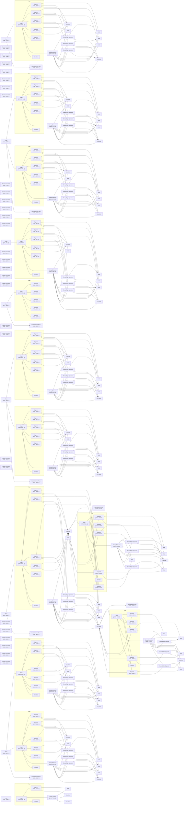

```mermaid
flowchart LR
  subgraph path2 [Path]
    2["Path<br>[672, 706, 0]"]
    3["Segment<br>[712, 744, 0]"]
    4["Segment<br>[750, 782, 0]"]
    5["Segment<br>[788, 821, 0]"]
    6["Segment<br>[827, 883, 0]"]
    7["Segment<br>[889, 896, 0]"]
    8[Solid2d]
  end
  subgraph path27 [Path]
    27["Path<br>[1289, 1342, 0]"]
    28["Segment<br>[1348, 1380, 0]"]
    29["Segment<br>[1386, 1418, 0]"]
    30["Segment<br>[1424, 1457, 0]"]
    31["Segment<br>[1463, 1519, 0]"]
    32["Segment<br>[1525, 1532, 0]"]
    33[Solid2d]
  end
  subgraph path49 [Path]
    49["Path<br>[1797, 1850, 0]"]
    50["Segment<br>[1856, 1888, 0]"]
    51["Segment<br>[1894, 1926, 0]"]
    52["Segment<br>[1932, 1965, 0]"]
    53["Segment<br>[1971, 2027, 0]"]
    54["Segment<br>[2033, 2040, 0]"]
    55[Solid2d]
  end
  subgraph path68 [Path]
    68["Path<br>[2436, 2491, 0]"]
    69["Segment<br>[2497, 2529, 0]"]
    70["Segment<br>[2535, 2567, 0]"]
    71["Segment<br>[2573, 2606, 0]"]
    72["Segment<br>[2612, 2668, 0]"]
    73["Segment<br>[2674, 2681, 0]"]
    74[Solid2d]
  end
  subgraph path91 [Path]
    91["Path<br>[2983, 3021, 0]"]
    92["Segment<br>[3027, 3059, 0]"]
    93["Segment<br>[3065, 3091, 0]"]
    94["Segment<br>[3097, 3130, 0]"]
    95["Segment<br>[3136, 3192, 0]"]
    96["Segment<br>[3198, 3205, 0]"]
    97[Solid2d]
  end
  subgraph path109 [Path]
    109["Path<br>[3388, 3441, 0]"]
    110["Segment<br>[3447, 3479, 0]"]
    111["Segment<br>[3485, 3517, 0]"]
    112["Segment<br>[3523, 3556, 0]"]
    113["Segment<br>[3562, 3618, 0]"]
    114["Segment<br>[3624, 3631, 0]"]
    115[Solid2d]
  end
  subgraph path128 [Path]
    128["Path<br>[3859, 3896, 0]"]
    129["Segment<br>[3902, 3928, 0]"]
    130["Segment<br>[3934, 3960, 0]"]
    131["Segment<br>[3966, 3993, 0]"]
    132["Segment<br>[3999, 4055, 0]"]
    133["Segment<br>[4061, 4068, 0]"]
    134[Solid2d]
  end
  subgraph path145 [Path]
    145["Path<br>[4355, 4423, 0]"]
    146["Segment<br>[4429, 4455, 0]"]
    147["Segment<br>[4461, 4487, 0]"]
    148["Segment<br>[4493, 4520, 0]"]
    149["Segment<br>[4526, 4582, 0]"]
    150["Segment<br>[4588, 4595, 0]"]
    151[Solid2d]
  end
  subgraph path162 [Path]
    162["Path<br>[4789, 4910, 0]"]
    163["Segment<br>[4916, 4965, 0]"]
    164["Segment<br>[4971, 5019, 0]"]
    165["Segment<br>[5025, 5073, 0]"]
    166["Segment<br>[5079, 5135, 0]"]
    167["Segment<br>[5141, 5148, 0]"]
    168[Solid2d]
  end
  subgraph path180 [Path]
    180["Path<br>[5680, 5721, 0]"]
    181["Segment<br>[5727, 5759, 0]"]
    182["Segment<br>[5765, 5790, 0]"]
    183["Segment<br>[5796, 5829, 0]"]
    184["Segment<br>[5835, 5891, 0]"]
    185["Segment<br>[5897, 5904, 0]"]
    186[Solid2d]
  end
  subgraph path202 [Path]
    202["Path<br>[6191, 6232, 0]"]
    203["Segment<br>[6238, 6264, 0]"]
    204["Segment<br>[6270, 6302, 0]"]
    205["Segment<br>[6308, 6335, 0]"]
    206["Segment<br>[6341, 6397, 0]"]
    207["Segment<br>[6403, 6410, 0]"]
    208[Solid2d]
  end
  subgraph path221 [Path]
    221["Path<br>[6887, 6937, 0]"]
    222["Segment<br>[6943, 6980, 0]"]
    223["Segment<br>[6986, 7079, 0]"]
    224["Segment<br>[7085, 7121, 0]"]
    225["Segment<br>[7127, 7228, 0]"]
    226["Segment<br>[7234, 7270, 0]"]
  end
  subgraph path228 [Path]
    228["Path<br>[7333, 7444, 0]"]
    229["Segment<br>[7333, 7444, 0]"]
    230[Solid2d]
  end
  1["Plane<br>[565, 582, 0]"]
  9["Sweep Extrusion<br>[1057, 1084, 0]"]
  10[Wall]
  11[Wall]
  12[Wall]
  13[Wall]
  14["Cap Start"]
  15["Cap End"]
  16["SweepEdge Opposite"]
  17["SweepEdge Opposite"]
  18["SweepEdge Opposite"]
  19["Sweep Extrusion<br>[1057, 1084, 0]"]
  20["Sweep Extrusion<br>[1057, 1084, 0]"]
  21["Sweep Extrusion<br>[1057, 1084, 0]"]
  22["Sweep Extrusion<br>[1057, 1084, 0]"]
  23["Sweep Extrusion<br>[1057, 1084, 0]"]
  24["Sweep Extrusion<br>[1057, 1084, 0]"]
  25["Sweep Extrusion<br>[1057, 1084, 0]"]
  26["Plane<br>[1216, 1270, 0]"]
  34["Sweep Extrusion<br>[1695, 1729, 0]"]
  35[Wall]
  36[Wall]
  37[Wall]
  38[Wall]
  39["Cap Start"]
  40["Cap End"]
  41["SweepEdge Opposite"]
  42["SweepEdge Opposite"]
  43["SweepEdge Opposite"]
  44["Sweep Extrusion<br>[1695, 1729, 0]"]
  45["Sweep Extrusion<br>[1695, 1729, 0]"]
  46["Sweep Extrusion<br>[1695, 1729, 0]"]
  47["Sweep Extrusion<br>[1695, 1729, 0]"]
  48["Sweep Extrusion<br>[1695, 1729, 0]"]
  56["Sweep Extrusion<br>[2139, 2173, 0]"]
  57[Wall]
  58[Wall]
  59[Wall]
  60[Wall]
  61["Cap Start"]
  62["Cap End"]
  63["SweepEdge Opposite"]
  64["SweepEdge Opposite"]
  65["SweepEdge Opposite"]
  66["Sweep Extrusion<br>[2139, 2173, 0]"]
  67["Plane<br>[2290, 2341, 0]"]
  75["Sweep Extrusion<br>[2844, 2879, 0]"]
  76[Wall]
  77[Wall]
  78[Wall]
  79[Wall]
  80["Cap Start"]
  81["Cap End"]
  82["SweepEdge Opposite"]
  83["SweepEdge Opposite"]
  84["SweepEdge Opposite"]
  85["Sweep Extrusion<br>[2844, 2879, 0]"]
  86["Sweep Extrusion<br>[2844, 2879, 0]"]
  87["Sweep Extrusion<br>[2844, 2879, 0]"]
  88["Sweep Extrusion<br>[2844, 2879, 0]"]
  89["Sweep Extrusion<br>[2844, 2879, 0]"]
  90["Plane<br>[2926, 2963, 0]"]
  98["Sweep Extrusion<br>[3285, 3320, 0]"]
  99[Wall]
  100[Wall]
  101[Wall]
  102[Wall]
  103["Cap Start"]
  104["Cap End"]
  105["SweepEdge Opposite"]
  106["SweepEdge Opposite"]
  107["SweepEdge Opposite"]
  108["Sweep Extrusion<br>[3285, 3320, 0]"]
  116["Sweep Extrusion<br>[3730, 3765, 0]"]
  117[Wall]
  118[Wall]
  119[Wall]
  120[Wall]
  121["Cap Start"]
  122["Cap End"]
  123["SweepEdge Opposite"]
  124["SweepEdge Opposite"]
  125["SweepEdge Opposite"]
  126["Sweep Extrusion<br>[3730, 3765, 0]"]
  127["Plane<br>[3805, 3842, 0]"]
  135["Sweep Extrusion<br>[4074, 4107, 0]"]
  136[Wall]
  137[Wall]
  138[Wall]
  139[Wall]
  140["Cap Start"]
  141["Cap End"]
  142["SweepEdge Opposite"]
  143["SweepEdge Opposite"]
  144["SweepEdge Opposite"]
  152["Sweep Extrusion<br>[4685, 4712, 0]"]
  153[Wall]
  154[Wall]
  155[Wall]
  156[Wall]
  157["Cap End"]
  158["SweepEdge Opposite"]
  159["SweepEdge Opposite"]
  160["SweepEdge Opposite"]
  161["Sweep Extrusion<br>[4685, 4712, 0]"]
  169["Sweep Extrusion<br>[5237, 5265, 0]"]
  170[Wall]
  171[Wall]
  172[Wall]
  173[Wall]
  174["Cap Start"]
  175["SweepEdge Opposite"]
  176["SweepEdge Opposite"]
  177["SweepEdge Opposite"]
  178["Sweep Extrusion<br>[5237, 5265, 0]"]
  179["Plane<br>[5618, 5667, 0]"]
  187["Sweep Extrusion<br>[6003, 6031, 0]"]
  188[Wall]
  189[Wall]
  190[Wall]
  191[Wall]
  192["Cap Start"]
  193["Cap End"]
  194["SweepEdge Opposite"]
  195["SweepEdge Opposite"]
  196["SweepEdge Opposite"]
  197["Sweep Extrusion<br>[6003, 6031, 0]"]
  198["Sweep Extrusion<br>[6003, 6031, 0]"]
  199["Sweep Extrusion<br>[6003, 6031, 0]"]
  200["Sweep Extrusion<br>[6003, 6031, 0]"]
  201["Sweep Extrusion<br>[6003, 6031, 0]"]
  209["Sweep Extrusion<br>[6492, 6520, 0]"]
  210[Wall]
  211[Wall]
  212[Wall]
  213[Wall]
  214["Cap Start"]
  215["Cap End"]
  216["SweepEdge Opposite"]
  217["SweepEdge Opposite"]
  218["SweepEdge Opposite"]
  219["Sweep Extrusion<br>[6492, 6520, 0]"]
  220["Plane<br>[6813, 6864, 0]"]
  227["Plane<br>[7292, 7309, 0]"]
  231["Sweep Sweep<br>[7458, 7511, 0]"]
  232[Wall]
  233["Cap Start"]
  234["Cap Start"]
  235["StartSketchOnPlane<br>[1202, 1271, 0]"]
  236["StartSketchOnPlane<br>[2276, 2342, 0]"]
  237["StartSketchOnPlane<br>[2912, 2964, 0]"]
  238["StartSketchOnPlane<br>[3791, 3843, 0]"]
  239["StartSketchOnFace<br>[4295, 4336, 0]"]
  240["StartSketchOnFace<br>[4732, 4771, 0]"]
  241["StartSketchOnPlane<br>[5604, 5668, 0]"]
  242["StartSketchOnPlane<br>[6799, 6865, 0]"]
  1 --- 2
  2 --- 3
  2 --- 4
  2 --- 5
  2 --- 6
  2 --- 7
  2 ---- 9
  2 --- 8
  3 --- 13
  3 --- 18
  3 x--> 14
  4 --- 12
  4 --- 17
  4 x--> 14
  5 --- 11
  5 --- 16
  5 x--> 14
  6 --- 10
  6 x--> 14
  9 --- 10
  9 --- 11
  9 --- 12
  9 --- 13
  9 --- 14
  9 --- 15
  9 --- 16
  9 --- 17
  9 --- 18
  16 <--x 11
  16 <--x 15
  17 <--x 12
  17 <--x 15
  18 <--x 13
  18 <--x 15
  26 --- 27
  26 --- 49
  27 --- 28
  27 --- 29
  27 --- 30
  27 --- 31
  27 --- 32
  27 ---- 34
  27 --- 33
  28 --- 38
  28 --- 43
  28 x--> 39
  29 --- 37
  29 --- 42
  29 x--> 39
  30 --- 36
  30 --- 41
  30 x--> 39
  31 --- 35
  31 x--> 39
  34 --- 35
  34 --- 36
  34 --- 37
  34 --- 38
  34 --- 39
  34 --- 40
  34 --- 41
  34 --- 42
  34 --- 43
  41 <--x 36
  41 <--x 40
  42 <--x 37
  42 <--x 40
  43 <--x 38
  43 <--x 40
  49 --- 50
  49 --- 51
  49 --- 52
  49 --- 53
  49 --- 54
  49 ---- 56
  49 --- 55
  50 --- 60
  50 --- 65
  50 x--> 61
  51 --- 59
  51 --- 64
  51 x--> 61
  52 --- 58
  52 --- 63
  52 x--> 61
  53 --- 57
  53 x--> 61
  56 --- 57
  56 --- 58
  56 --- 59
  56 --- 60
  56 --- 61
  56 --- 62
  56 --- 63
  56 --- 64
  56 --- 65
  63 <--x 58
  63 <--x 62
  64 <--x 59
  64 <--x 62
  65 <--x 60
  65 <--x 62
  67 --- 68
  68 --- 69
  68 --- 70
  68 --- 71
  68 --- 72
  68 --- 73
  68 ---- 75
  68 --- 74
  69 --- 79
  69 --- 84
  69 x--> 80
  70 --- 78
  70 --- 83
  70 x--> 80
  71 --- 77
  71 --- 82
  71 x--> 80
  72 --- 76
  72 x--> 80
  75 --- 76
  75 --- 77
  75 --- 78
  75 --- 79
  75 --- 80
  75 --- 81
  75 --- 82
  75 --- 83
  75 --- 84
  82 <--x 77
  82 <--x 81
  83 <--x 78
  83 <--x 81
  84 <--x 79
  84 <--x 81
  90 --- 91
  90 --- 109
  91 --- 92
  91 --- 93
  91 --- 94
  91 --- 95
  91 --- 96
  91 ---- 98
  91 --- 97
  92 --- 102
  92 --- 107
  92 x--> 104
  93 --- 101
  93 --- 106
  93 x--> 104
  94 --- 100
  94 --- 105
  94 x--> 104
  95 --- 99
  95 x--> 104
  98 --- 99
  98 --- 100
  98 --- 101
  98 --- 102
  98 --- 103
  98 --- 104
  98 --- 105
  98 --- 106
  98 --- 107
  105 <--x 100
  105 <--x 103
  106 <--x 101
  106 <--x 103
  107 <--x 102
  107 <--x 103
  109 --- 110
  109 --- 111
  109 --- 112
  109 --- 113
  109 --- 114
  109 ---- 116
  109 --- 115
  110 --- 120
  110 --- 125
  110 x--> 122
  111 --- 119
  111 --- 124
  111 x--> 122
  112 --- 118
  112 --- 123
  112 x--> 122
  113 --- 117
  113 x--> 122
  116 --- 117
  116 --- 118
  116 --- 119
  116 --- 120
  116 --- 121
  116 --- 122
  116 --- 123
  116 --- 124
  116 --- 125
  123 <--x 118
  123 <--x 121
  124 <--x 119
  124 <--x 121
  125 <--x 120
  125 <--x 121
  127 --- 128
  128 --- 129
  128 --- 130
  128 --- 131
  128 --- 132
  128 --- 133
  128 ---- 135
  128 --- 134
  129 --- 139
  129 --- 144
  129 x--> 141
  130 --- 138
  130 --- 143
  130 x--> 141
  131 --- 137
  131 --- 142
  131 x--> 141
  132 --- 136
  132 x--> 141
  135 --- 136
  135 --- 137
  135 --- 138
  135 --- 139
  135 --- 140
  135 --- 141
  135 --- 142
  135 --- 143
  135 --- 144
  140 --- 145
  141 --- 162
  142 <--x 137
  142 <--x 140
  143 <--x 138
  143 <--x 140
  144 <--x 139
  144 <--x 140
  145 --- 146
  145 --- 147
  145 --- 148
  145 --- 149
  145 --- 150
  145 ---- 152
  145 --- 151
  146 --- 153
  146 <--x 140
  147 --- 154
  147 --- 158
  147 <--x 140
  148 --- 155
  148 --- 159
  148 <--x 140
  149 --- 156
  149 --- 160
  149 <--x 140
  152 --- 153
  152 --- 154
  152 --- 155
  152 --- 156
  152 --- 157
  152 --- 158
  152 --- 159
  152 --- 160
  158 <--x 154
  158 <--x 157
  159 <--x 155
  159 <--x 157
  160 <--x 156
  160 <--x 157
  162 --- 163
  162 --- 164
  162 --- 165
  162 --- 166
  162 --- 167
  162 ---- 169
  162 --- 168
  163 --- 173
  163 --- 177
  163 <--x 141
  164 --- 172
  164 --- 176
  164 <--x 141
  165 --- 171
  165 --- 175
  165 <--x 141
  166 --- 170
  166 <--x 141
  169 --- 170
  169 --- 171
  169 --- 172
  169 --- 173
  169 --- 174
  169 --- 175
  169 --- 176
  169 --- 177
  175 <--x 171
  175 <--x 174
  176 <--x 172
  176 <--x 174
  177 <--x 173
  177 <--x 174
  179 --- 180
  179 --- 202
  180 --- 181
  180 --- 182
  180 --- 183
  180 --- 184
  180 --- 185
  180 ---- 187
  180 --- 186
  181 --- 191
  181 --- 196
  181 x--> 192
  182 --- 190
  182 --- 195
  182 x--> 192
  183 --- 189
  183 --- 194
  183 x--> 192
  184 --- 188
  184 x--> 192
  187 --- 188
  187 --- 189
  187 --- 190
  187 --- 191
  187 --- 192
  187 --- 193
  187 --- 194
  187 --- 195
  187 --- 196
  194 <--x 189
  194 <--x 193
  195 <--x 190
  195 <--x 193
  196 <--x 191
  196 <--x 193
  202 --- 203
  202 --- 204
  202 --- 205
  202 --- 206
  202 --- 207
  202 ---- 209
  202 --- 208
  203 --- 213
  203 --- 218
  203 x--> 214
  204 --- 212
  204 --- 217
  204 x--> 214
  205 --- 211
  205 --- 216
  205 x--> 214
  206 --- 210
  206 x--> 214
  209 --- 210
  209 --- 211
  209 --- 212
  209 --- 213
  209 --- 214
  209 --- 215
  209 --- 216
  209 --- 217
  209 --- 218
  216 <--x 211
  216 <--x 215
  217 <--x 212
  217 <--x 215
  218 <--x 213
  218 <--x 215
  220 --- 221
  221 --- 222
  221 --- 223
  221 --- 224
  221 --- 225
  221 --- 226
  227 --- 228
  228 --- 229
  228 ---- 231
  228 --- 230
  229 --- 232
  229 x--> 233
  231 --- 232
  231 --- 233
  231 --- 234
  26 <--x 235
  67 <--x 236
  90 <--x 237
  127 <--x 238
  140 <--x 239
  141 <--x 240
  179 <--x 241
  220 <--x 242
```
