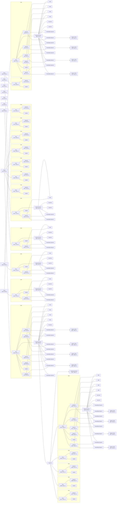

```mermaid
flowchart LR
  subgraph path7 [Path]
    7["Path<br>[268, 293, 0]"]
    8["Segment<br>[299, 347, 0]"]
    9["Segment<br>[353, 455, 0]"]
    10["Segment<br>[461, 581, 0]"]
    11["Segment<br>[587, 672, 0]"]
    12["Segment<br>[678, 685, 0]"]
    13[Solid2d]
  end
  subgraph path34 [Path]
    34["Path<br>[1616, 1726, 0]"]
    35["Segment<br>[1616, 1726, 0]"]
    36[Solid2d]
  end
  subgraph path37 [Path]
    37["Path<br>[1739, 1833, 0]"]
    38["Segment<br>[1739, 1833, 0]"]
    39[Solid2d]
  end
  subgraph path47 [Path]
    47["Path<br>[1616, 1726, 0]"]
    48["Segment<br>[1616, 1726, 0]"]
    49[Solid2d]
  end
  subgraph path50 [Path]
    50["Path<br>[1739, 1833, 0]"]
    51["Segment<br>[1739, 1833, 0]"]
    52[Solid2d]
  end
  subgraph path60 [Path]
    60["Path<br>[1616, 1726, 0]"]
    61["Segment<br>[1616, 1726, 0]"]
    62[Solid2d]
  end
  subgraph path63 [Path]
    63["Path<br>[1739, 1833, 0]"]
    64["Segment<br>[1739, 1833, 0]"]
    65[Solid2d]
  end
  subgraph path73 [Path]
    73["Path<br>[1616, 1726, 0]"]
    74["Segment<br>[1616, 1726, 0]"]
    75[Solid2d]
  end
  subgraph path76 [Path]
    76["Path<br>[1739, 1833, 0]"]
    77["Segment<br>[1739, 1833, 0]"]
    78[Solid2d]
  end
  subgraph path85 [Path]
    85["Path<br>[2406, 2441, 0]"]
    86["Segment<br>[2447, 2495, 0]"]
    87["Segment<br>[2501, 2603, 0]"]
    88["Segment<br>[2609, 2729, 0]"]
    89["Segment<br>[2735, 2820, 0]"]
    90["Segment<br>[2826, 2833, 0]"]
    91[Solid2d]
  end
  subgraph path92 [Path]
    92["Path<br>[2844, 2999, 0]"]
    93["Segment<br>[2844, 2999, 0]"]
    94[Solid2d]
  end
  subgraph path95 [Path]
    95["Path<br>[3014, 3180, 0]"]
    96["Segment<br>[3014, 3180, 0]"]
    97[Solid2d]
  end
  subgraph path98 [Path]
    98["Path<br>[3195, 3352, 0]"]
    99["Segment<br>[3195, 3352, 0]"]
    100[Solid2d]
  end
  subgraph path101 [Path]
    101["Path<br>[3367, 3535, 0]"]
    102["Segment<br>[3367, 3535, 0]"]
    103[Solid2d]
  end
  subgraph path123 [Path]
    123["Path<br>[3975, 4059, 0]"]
    124["Segment<br>[4065, 4135, 0]"]
    125["Segment<br>[4141, 4265, 0]"]
    126["Segment<br>[4271, 4391, 0]"]
    127["Segment<br>[4397, 4482, 0]"]
    128["Segment<br>[4488, 4495, 0]"]
    129[Solid2d]
  end
  subgraph path130 [Path]
    130["Path<br>[4506, 4677, 0]"]
    131["Segment<br>[4506, 4677, 0]"]
    132[Solid2d]
  end
  subgraph path133 [Path]
    133["Path<br>[4692, 4874, 0]"]
    134["Segment<br>[4692, 4874, 0]"]
    135[Solid2d]
  end
  subgraph path136 [Path]
    136["Path<br>[4889, 5062, 0]"]
    137["Segment<br>[4889, 5062, 0]"]
    138[Solid2d]
  end
  subgraph path139 [Path]
    139["Path<br>[5077, 5261, 0]"]
    140["Segment<br>[5077, 5261, 0]"]
    141[Solid2d]
  end
  1["Plane<br>[243, 262, 0]"]
  2["Plane<br>[243, 262, 0]"]
  3["Plane<br>[243, 262, 0]"]
  4["Plane<br>[243, 262, 0]"]
  5["Plane<br>[243, 262, 0]"]
  6["Plane<br>[243, 262, 0]"]
  14["Sweep Extrusion<br>[699, 734, 0]"]
  15[Wall]
  16[Wall]
  17[Wall]
  18[Wall]
  19["Cap Start"]
  20["Cap End"]
  21["SweepEdge Opposite"]
  22["SweepEdge Adjacent"]
  23["SweepEdge Opposite"]
  24["SweepEdge Adjacent"]
  25["SweepEdge Opposite"]
  26["SweepEdge Adjacent"]
  27["SweepEdge Opposite"]
  28["SweepEdge Adjacent"]
  29["EdgeCut Fillet<br>[740, 1021, 0]"]
  30["EdgeCut Fillet<br>[740, 1021, 0]"]
  31["EdgeCut Fillet<br>[740, 1021, 0]"]
  32["EdgeCut Fillet<br>[740, 1021, 0]"]
  33["Plane<br>[1585, 1608, 0]"]
  40["Sweep Extrusion<br>[1853, 1904, 0]"]
  41[Wall]
  42["Cap Start"]
  43["Cap End"]
  44["SweepEdge Opposite"]
  45["SweepEdge Adjacent"]
  46["Plane<br>[1585, 1608, 0]"]
  53["Sweep Extrusion<br>[1853, 1904, 0]"]
  54[Wall]
  55["Cap Start"]
  56["Cap End"]
  57["SweepEdge Opposite"]
  58["SweepEdge Adjacent"]
  59["Plane<br>[1585, 1608, 0]"]
  66["Sweep Extrusion<br>[1853, 1904, 0]"]
  67[Wall]
  68["Cap Start"]
  69["Cap End"]
  70["SweepEdge Opposite"]
  71["SweepEdge Adjacent"]
  72["Plane<br>[1585, 1608, 0]"]
  79["Sweep Extrusion<br>[1853, 1904, 0]"]
  80[Wall]
  81["Cap Start"]
  82["Cap End"]
  83["SweepEdge Opposite"]
  84["SweepEdge Adjacent"]
  104["Sweep Extrusion<br>[3553, 3595, 0]"]
  105[Wall]
  106[Wall]
  107[Wall]
  108[Wall]
  109["Cap Start"]
  110["Cap End"]
  111["SweepEdge Opposite"]
  112["SweepEdge Adjacent"]
  113["SweepEdge Opposite"]
  114["SweepEdge Adjacent"]
  115["SweepEdge Opposite"]
  116["SweepEdge Adjacent"]
  117["SweepEdge Opposite"]
  118["SweepEdge Adjacent"]
  119["EdgeCut Fillet<br>[3601, 3882, 0]"]
  120["EdgeCut Fillet<br>[3601, 3882, 0]"]
  121["EdgeCut Fillet<br>[3601, 3882, 0]"]
  122["EdgeCut Fillet<br>[3601, 3882, 0]"]
  142["Sweep Extrusion<br>[5279, 5321, 0]"]
  143[Wall]
  144[Wall]
  145[Wall]
  146[Wall]
  147["Cap Start"]
  148["Cap End"]
  149["SweepEdge Opposite"]
  150["SweepEdge Adjacent"]
  151["SweepEdge Opposite"]
  152["SweepEdge Adjacent"]
  153["SweepEdge Opposite"]
  154["SweepEdge Adjacent"]
  155["SweepEdge Opposite"]
  156["SweepEdge Adjacent"]
  157["EdgeCut Fillet<br>[5327, 5608, 0]"]
  158["EdgeCut Fillet<br>[5327, 5608, 0]"]
  159["EdgeCut Fillet<br>[5327, 5608, 0]"]
  160["EdgeCut Fillet<br>[5327, 5608, 0]"]
  161["StartSketchOnFace<br>[3937, 3969, 0]"]
  1 --- 7
  1 --- 85
  1 --- 92
  1 --- 95
  1 --- 98
  1 --- 101
  7 --- 8
  7 --- 9
  7 --- 10
  7 --- 11
  7 --- 12
  7 ---- 14
  7 --- 13
  8 --- 15
  8 --- 21
  8 --- 22
  9 --- 16
  9 --- 23
  9 --- 24
  10 --- 17
  10 --- 25
  10 --- 26
  11 --- 18
  11 --- 27
  11 --- 28
  14 --- 15
  14 --- 16
  14 --- 17
  14 --- 18
  14 --- 19
  14 --- 20
  14 --- 21
  14 --- 22
  14 --- 23
  14 --- 24
  14 --- 25
  14 --- 26
  14 --- 27
  14 --- 28
  22 <--x 29
  24 <--x 30
  26 <--x 31
  28 <--x 32
  33 --- 34
  33 --- 37
  34 --- 35
  34 ---- 40
  34 --- 36
  35 --- 41
  35 --- 44
  35 --- 45
  37 --- 38
  37 --- 39
  40 --- 41
  40 --- 42
  40 --- 43
  40 --- 44
  40 --- 45
  46 --- 47
  46 --- 50
  47 --- 48
  47 ---- 53
  47 --- 49
  48 --- 54
  48 --- 57
  48 --- 58
  50 --- 51
  50 --- 52
  53 --- 54
  53 --- 55
  53 --- 56
  53 --- 57
  53 --- 58
  59 --- 60
  59 --- 63
  60 --- 61
  60 ---- 66
  60 --- 62
  61 --- 67
  61 --- 70
  61 --- 71
  63 --- 64
  63 --- 65
  66 --- 67
  66 --- 68
  66 --- 69
  66 --- 70
  66 --- 71
  72 --- 73
  72 --- 76
  73 --- 74
  73 ---- 79
  73 --- 75
  74 --- 80
  74 --- 83
  74 --- 84
  76 --- 77
  76 --- 78
  79 --- 80
  79 --- 81
  79 --- 82
  79 --- 83
  79 --- 84
  85 --- 86
  85 --- 87
  85 --- 88
  85 --- 89
  85 --- 90
  85 ---- 104
  85 --- 91
  86 --- 105
  86 --- 111
  86 --- 112
  87 --- 106
  87 --- 113
  87 --- 114
  88 --- 107
  88 --- 115
  88 --- 116
  89 --- 108
  89 --- 117
  89 --- 118
  92 --- 93
  92 --- 94
  95 --- 96
  95 --- 97
  98 --- 99
  98 --- 100
  101 --- 102
  101 --- 103
  104 --- 105
  104 --- 106
  104 --- 107
  104 --- 108
  104 --- 109
  104 --- 110
  104 --- 111
  104 --- 112
  104 --- 113
  104 --- 114
  104 --- 115
  104 --- 116
  104 --- 117
  104 --- 118
  110 --- 123
  110 --- 130
  110 --- 133
  110 --- 136
  110 --- 139
  112 <--x 119
  114 <--x 120
  116 <--x 121
  118 <--x 122
  123 --- 124
  123 --- 125
  123 --- 126
  123 --- 127
  123 --- 128
  123 ---- 142
  123 --- 129
  124 --- 143
  124 --- 149
  124 --- 150
  125 --- 144
  125 --- 151
  125 --- 152
  126 --- 145
  126 --- 153
  126 --- 154
  127 --- 146
  127 --- 155
  127 --- 156
  130 --- 131
  130 --- 132
  133 --- 134
  133 --- 135
  136 --- 137
  136 --- 138
  139 --- 140
  139 --- 141
  142 --- 143
  142 --- 144
  142 --- 145
  142 --- 146
  142 --- 147
  142 --- 148
  142 --- 149
  142 --- 150
  142 --- 151
  142 --- 152
  142 --- 153
  142 --- 154
  142 --- 155
  142 --- 156
  150 <--x 157
  152 <--x 158
  154 <--x 159
  156 <--x 160
  110 <--x 161
```
