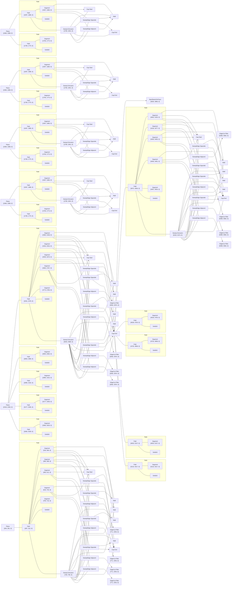

```mermaid
flowchart LR
  subgraph path8 [Path]
    8["Path<br>[287, 312, 0]"]
    27["Segment<br>[318, 384, 0]"]
    28["Segment<br>[390, 489, 0]"]
    29["Segment<br>[495, 612, 0]"]
    30["Segment<br>[618, 703, 0]"]
    31["Segment<br>[709, 716, 0]"]
    70[Solid2d]
  end
  subgraph path9 [Path]
    9["Path<br>[1597, 1680, 0]"]
    33["Segment<br>[1597, 1680, 0]"]
    62[Solid2d]
  end
  subgraph path10 [Path]
    10["Path<br>[1597, 1680, 0]"]
    32["Segment<br>[1597, 1680, 0]"]
    67[Solid2d]
  end
  subgraph path11 [Path]
    11["Path<br>[1597, 1680, 0]"]
    34["Segment<br>[1597, 1680, 0]"]
    72[Solid2d]
  end
  subgraph path12 [Path]
    12["Path<br>[1597, 1680, 0]"]
    35["Segment<br>[1597, 1680, 0]"]
    73[Solid2d]
  end
  subgraph path13 [Path]
    13["Path<br>[1706, 1773, 0]"]
    38["Segment<br>[1706, 1773, 0]"]
    59[Solid2d]
  end
  subgraph path14 [Path]
    14["Path<br>[1706, 1773, 0]"]
    39["Segment<br>[1706, 1773, 0]"]
    63[Solid2d]
  end
  subgraph path15 [Path]
    15["Path<br>[1706, 1773, 0]"]
    37["Segment<br>[1706, 1773, 0]"]
    64[Solid2d]
  end
  subgraph path16 [Path]
    16["Path<br>[1706, 1773, 0]"]
    36["Segment<br>[1706, 1773, 0]"]
    66[Solid2d]
  end
  subgraph path17 [Path]
    17["Path<br>[2341, 2376, 0]"]
    40["Segment<br>[2382, 2448, 0]"]
    41["Segment<br>[2454, 2553, 0]"]
    42["Segment<br>[2559, 2676, 0]"]
    43["Segment<br>[2682, 2767, 0]"]
    44["Segment<br>[2773, 2780, 0]"]
    75[Solid2d]
  end
  subgraph path18 [Path]
    18["Path<br>[2804, 2960, 0]"]
    45["Segment<br>[2804, 2960, 0]"]
    58[Solid2d]
  end
  subgraph path19 [Path]
    19["Path<br>[2985, 3152, 0]"]
    46["Segment<br>[2985, 3152, 0]"]
    76[Solid2d]
  end
  subgraph path20 [Path]
    20["Path<br>[3177, 3335, 0]"]
    47["Segment<br>[3177, 3335, 0]"]
    60[Solid2d]
  end
  subgraph path21 [Path]
    21["Path<br>[3360, 3529, 0]"]
    48["Segment<br>[3360, 3529, 0]"]
    69[Solid2d]
  end
  subgraph path22 [Path]
    22["Path<br>[3972, 4056, 0]"]
    49["Segment<br>[4062, 4150, 0]"]
    50["Segment<br>[4156, 4277, 0]"]
    51["Segment<br>[4283, 4400, 0]"]
    52["Segment<br>[4406, 4491, 0]"]
    53["Segment<br>[4497, 4504, 0]"]
    65[Solid2d]
  end
  subgraph path23 [Path]
    23["Path<br>[4528, 4700, 0]"]
    54["Segment<br>[4528, 4700, 0]"]
    61[Solid2d]
  end
  subgraph path24 [Path]
    24["Path<br>[4725, 4908, 0]"]
    55["Segment<br>[4725, 4908, 0]"]
    68[Solid2d]
  end
  subgraph path25 [Path]
    25["Path<br>[4933, 5107, 0]"]
    56["Segment<br>[4933, 5107, 0]"]
    71[Solid2d]
  end
  subgraph path26 [Path]
    26["Path<br>[5132, 5317, 0]"]
    57["Segment<br>[5132, 5317, 0]"]
    74[Solid2d]
  end
  1["Plane<br>[264, 281, 0]"]
  2["Plane<br>[1566, 1589, 0]"]
  3["Plane<br>[1566, 1589, 0]"]
  4["Plane<br>[1566, 1589, 0]"]
  5["Plane<br>[1566, 1589, 0]"]
  6["Plane<br>[2318, 2335, 0]"]
  7["StartSketchOnFace<br>[3929, 3966, 0]"]
  77["Sweep Extrusion<br>[730, 765, 0]"]
  78["Sweep Extrusion<br>[1790, 1841, 0]"]
  79["Sweep Extrusion<br>[1790, 1841, 0]"]
  80["Sweep Extrusion<br>[1790, 1841, 0]"]
  81["Sweep Extrusion<br>[1790, 1841, 0]"]
  82["Sweep Extrusion<br>[3544, 3586, 0]"]
  83["Sweep Extrusion<br>[5332, 5374, 0]"]
  84[Wall]
  85[Wall]
  86[Wall]
  87[Wall]
  88[Wall]
  89[Wall]
  90[Wall]
  91[Wall]
  92[Wall]
  93[Wall]
  94[Wall]
  95[Wall]
  96[Wall]
  97[Wall]
  98[Wall]
  99[Wall]
  100["Cap Start"]
  101["Cap Start"]
  102["Cap Start"]
  103["Cap Start"]
  104["Cap Start"]
  105["Cap Start"]
  106["Cap Start"]
  107["Cap End"]
  108["Cap End"]
  109["Cap End"]
  110["Cap End"]
  111["Cap End"]
  112["Cap End"]
  113["Cap End"]
  114["SweepEdge Opposite"]
  115["SweepEdge Opposite"]
  116["SweepEdge Opposite"]
  117["SweepEdge Opposite"]
  118["SweepEdge Opposite"]
  119["SweepEdge Opposite"]
  120["SweepEdge Opposite"]
  121["SweepEdge Opposite"]
  122["SweepEdge Opposite"]
  123["SweepEdge Opposite"]
  124["SweepEdge Opposite"]
  125["SweepEdge Opposite"]
  126["SweepEdge Opposite"]
  127["SweepEdge Opposite"]
  128["SweepEdge Opposite"]
  129["SweepEdge Opposite"]
  130["SweepEdge Adjacent"]
  131["SweepEdge Adjacent"]
  132["SweepEdge Adjacent"]
  133["SweepEdge Adjacent"]
  134["SweepEdge Adjacent"]
  135["SweepEdge Adjacent"]
  136["SweepEdge Adjacent"]
  137["SweepEdge Adjacent"]
  138["SweepEdge Adjacent"]
  139["SweepEdge Adjacent"]
  140["SweepEdge Adjacent"]
  141["SweepEdge Adjacent"]
  142["SweepEdge Adjacent"]
  143["SweepEdge Adjacent"]
  144["SweepEdge Adjacent"]
  145["SweepEdge Adjacent"]
  146["EdgeCut Fillet<br>[771, 1053, 0]"]
  147["EdgeCut Fillet<br>[771, 1053, 0]"]
  148["EdgeCut Fillet<br>[771, 1053, 0]"]
  149["EdgeCut Fillet<br>[771, 1053, 0]"]
  150["EdgeCut Fillet<br>[3592, 3874, 0]"]
  151["EdgeCut Fillet<br>[3592, 3874, 0]"]
  152["EdgeCut Fillet<br>[3592, 3874, 0]"]
  153["EdgeCut Fillet<br>[3592, 3874, 0]"]
  154["EdgeCut Fillet<br>[5380, 5662, 0]"]
  155["EdgeCut Fillet<br>[5380, 5662, 0]"]
  156["EdgeCut Fillet<br>[5380, 5662, 0]"]
  157["EdgeCut Fillet<br>[5380, 5662, 0]"]
  1 --- 8
  2 --- 12
  2 --- 14
  3 --- 9
  3 --- 15
  4 --- 11
  4 --- 16
  5 --- 10
  5 --- 13
  6 --- 17
  6 --- 18
  6 --- 19
  6 --- 20
  6 --- 21
  113 x--> 7
  8 --- 27
  8 --- 28
  8 --- 29
  8 --- 30
  8 --- 31
  8 --- 70
  8 ---- 77
  9 --- 33
  9 --- 62
  9 ---- 80
  10 --- 32
  10 --- 67
  10 ---- 79
  11 --- 34
  11 --- 72
  11 ---- 78
  12 --- 35
  12 --- 73
  12 ---- 81
  13 --- 38
  13 --- 59
  14 --- 39
  14 --- 63
  15 --- 37
  15 --- 64
  16 --- 36
  16 --- 66
  17 --- 40
  17 --- 41
  17 --- 42
  17 --- 43
  17 --- 44
  17 --- 75
  17 ---- 82
  18 --- 45
  18 --- 58
  19 --- 46
  19 --- 76
  20 --- 47
  20 --- 60
  21 --- 48
  21 --- 69
  22 --- 49
  22 --- 50
  22 --- 51
  22 --- 52
  22 --- 53
  22 --- 65
  22 ---- 83
  113 --- 22
  23 --- 54
  23 --- 61
  113 --- 23
  24 --- 55
  24 --- 68
  113 --- 24
  25 --- 56
  25 --- 71
  113 --- 25
  26 --- 57
  26 --- 74
  113 --- 26
  27 --- 92
  27 x--> 102
  27 --- 119
  27 --- 137
  28 --- 90
  28 x--> 102
  28 --- 122
  28 --- 136
  29 --- 89
  29 x--> 102
  29 --- 121
  29 --- 138
  30 --- 91
  30 x--> 102
  30 --- 120
  30 --- 135
  32 --- 93
  32 x--> 103
  32 --- 123
  32 --- 139
  33 --- 94
  33 x--> 104
  33 --- 124
  33 --- 140
  34 --- 88
  34 x--> 101
  34 --- 118
  34 --- 134
  35 --- 95
  35 x--> 105
  35 --- 125
  35 --- 141
  40 --- 98
  40 x--> 106
  40 --- 129
  40 --- 144
  41 --- 96
  41 x--> 106
  41 --- 127
  41 --- 143
  42 --- 99
  42 x--> 106
  42 --- 126
  42 --- 145
  43 --- 97
  43 x--> 106
  43 --- 128
  43 --- 142
  49 --- 87
  49 x--> 100
  49 --- 114
  49 --- 130
  50 --- 86
  50 x--> 100
  50 --- 117
  50 --- 133
  51 --- 84
  51 x--> 100
  51 --- 116
  51 --- 132
  52 --- 85
  52 x--> 100
  52 --- 115
  52 --- 131
  77 --- 89
  77 --- 90
  77 --- 91
  77 --- 92
  77 --- 102
  77 --- 109
  77 --- 119
  77 --- 120
  77 --- 121
  77 --- 122
  77 --- 135
  77 --- 136
  77 --- 137
  77 --- 138
  78 --- 88
  78 --- 101
  78 --- 108
  78 --- 118
  78 --- 134
  79 --- 93
  79 --- 103
  79 --- 110
  79 --- 123
  79 --- 139
  80 --- 94
  80 --- 104
  80 --- 111
  80 --- 124
  80 --- 140
  81 --- 95
  81 --- 105
  81 --- 112
  81 --- 125
  81 --- 141
  82 --- 96
  82 --- 97
  82 --- 98
  82 --- 99
  82 --- 106
  82 --- 113
  82 --- 126
  82 --- 127
  82 --- 128
  82 --- 129
  82 --- 142
  82 --- 143
  82 --- 144
  82 --- 145
  83 --- 84
  83 --- 85
  83 --- 86
  83 --- 87
  83 --- 100
  83 --- 107
  83 --- 114
  83 --- 115
  83 --- 116
  83 --- 117
  83 --- 130
  83 --- 131
  83 --- 132
  83 --- 133
  116 <--x 84
  115 <--x 85
  117 <--x 86
  114 <--x 87
  118 <--x 88
  134 <--x 88
  121 <--x 89
  122 <--x 90
  120 <--x 91
  119 <--x 92
  123 <--x 93
  139 <--x 93
  124 <--x 94
  140 <--x 94
  125 <--x 95
  141 <--x 95
  127 <--x 96
  128 <--x 97
  129 <--x 98
  126 <--x 99
  114 <--x 107
  115 <--x 107
  116 <--x 107
  117 <--x 107
  118 <--x 108
  119 <--x 109
  120 <--x 109
  121 <--x 109
  122 <--x 109
  123 <--x 110
  124 <--x 111
  125 <--x 112
  126 <--x 113
  127 <--x 113
  128 <--x 113
  129 <--x 113
  130 <--x 155
  131 <--x 154
  132 <--x 157
  133 <--x 156
  135 <--x 146
  136 <--x 149
  137 <--x 148
  138 <--x 147
  142 <--x 153
  143 <--x 151
  144 <--x 152
  145 <--x 150
```
