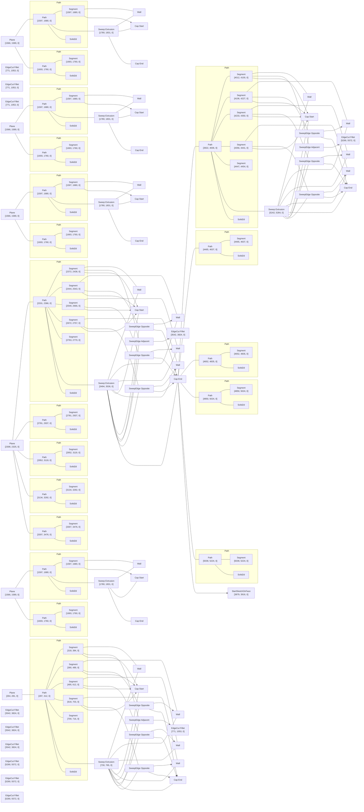

```mermaid
flowchart LR
  subgraph path2 [Path]
    2["Path<br>[287, 312, 0]"]
    3["Segment<br>[318, 384, 0]"]
    4["Segment<br>[390, 489, 0]"]
    5["Segment<br>[495, 612, 0]"]
    6["Segment<br>[618, 703, 0]"]
    7["Segment<br>[709, 716, 0]"]
    8[Solid2d]
  end
  subgraph path25 [Path]
    25["Path<br>[1597, 1680, 0]"]
    26["Segment<br>[1597, 1680, 0]"]
    27[Solid2d]
  end
  subgraph path28 [Path]
    28["Path<br>[1693, 1760, 0]"]
    29["Segment<br>[1693, 1760, 0]"]
    30[Solid2d]
  end
  subgraph path36 [Path]
    36["Path<br>[1597, 1680, 0]"]
    37["Segment<br>[1597, 1680, 0]"]
    38[Solid2d]
  end
  subgraph path39 [Path]
    39["Path<br>[1693, 1760, 0]"]
    40["Segment<br>[1693, 1760, 0]"]
    41[Solid2d]
  end
  subgraph path47 [Path]
    47["Path<br>[1597, 1680, 0]"]
    48["Segment<br>[1597, 1680, 0]"]
    49[Solid2d]
  end
  subgraph path50 [Path]
    50["Path<br>[1693, 1760, 0]"]
    51["Segment<br>[1693, 1760, 0]"]
    52[Solid2d]
  end
  subgraph path58 [Path]
    58["Path<br>[1597, 1680, 0]"]
    59["Segment<br>[1597, 1680, 0]"]
    60[Solid2d]
  end
  subgraph path61 [Path]
    61["Path<br>[1693, 1760, 0]"]
    62["Segment<br>[1693, 1760, 0]"]
    63[Solid2d]
  end
  subgraph path69 [Path]
    69["Path<br>[2331, 2366, 0]"]
    70["Segment<br>[2372, 2438, 0]"]
    71["Segment<br>[2444, 2543, 0]"]
    72["Segment<br>[2549, 2666, 0]"]
    73["Segment<br>[2672, 2757, 0]"]
    74["Segment<br>[2763, 2770, 0]"]
    75[Solid2d]
  end
  subgraph path76 [Path]
    76["Path<br>[2781, 2937, 0]"]
    77["Segment<br>[2781, 2937, 0]"]
    78[Solid2d]
  end
  subgraph path79 [Path]
    79["Path<br>[2952, 3119, 0]"]
    80["Segment<br>[2952, 3119, 0]"]
    81[Solid2d]
  end
  subgraph path82 [Path]
    82["Path<br>[3134, 3292, 0]"]
    83["Segment<br>[3134, 3292, 0]"]
    84[Solid2d]
  end
  subgraph path85 [Path]
    85["Path<br>[3307, 3476, 0]"]
    86["Segment<br>[3307, 3476, 0]"]
    87[Solid2d]
  end
  subgraph path103 [Path]
    103["Path<br>[3922, 4006, 0]"]
    104["Segment<br>[4012, 4100, 0]"]
    105["Segment<br>[4106, 4227, 0]"]
    106["Segment<br>[4233, 4350, 0]"]
    107["Segment<br>[4356, 4441, 0]"]
    108["Segment<br>[4447, 4454, 0]"]
    109[Solid2d]
  end
  subgraph path110 [Path]
    110["Path<br>[4465, 4637, 0]"]
    111["Segment<br>[4465, 4637, 0]"]
    112[Solid2d]
  end
  subgraph path113 [Path]
    113["Path<br>[4652, 4835, 0]"]
    114["Segment<br>[4652, 4835, 0]"]
    115[Solid2d]
  end
  subgraph path116 [Path]
    116["Path<br>[4850, 5024, 0]"]
    117["Segment<br>[4850, 5024, 0]"]
    118[Solid2d]
  end
  subgraph path119 [Path]
    119["Path<br>[5039, 5224, 0]"]
    120["Segment<br>[5039, 5224, 0]"]
    121[Solid2d]
  end
  1["Plane<br>[264, 281, 0]"]
  9["Sweep Extrusion<br>[730, 765, 0]"]
  10[Wall]
  11[Wall]
  12[Wall]
  13[Wall]
  14["Cap Start"]
  15["Cap End"]
  16["SweepEdge Opposite"]
  17["SweepEdge Opposite"]
  18["SweepEdge Opposite"]
  19["SweepEdge Adjacent"]
  20["EdgeCut Fillet<br>[771, 1053, 0]"]
  21["EdgeCut Fillet<br>[771, 1053, 0]"]
  22["EdgeCut Fillet<br>[771, 1053, 0]"]
  23["EdgeCut Fillet<br>[771, 1053, 0]"]
  24["Plane<br>[1566, 1589, 0]"]
  31["Sweep Extrusion<br>[1780, 1831, 0]"]
  32[Wall]
  33["Cap Start"]
  34["Cap End"]
  35["Plane<br>[1566, 1589, 0]"]
  42["Sweep Extrusion<br>[1780, 1831, 0]"]
  43[Wall]
  44["Cap Start"]
  45["Cap End"]
  46["Plane<br>[1566, 1589, 0]"]
  53["Sweep Extrusion<br>[1780, 1831, 0]"]
  54[Wall]
  55["Cap Start"]
  56["Cap End"]
  57["Plane<br>[1566, 1589, 0]"]
  64["Sweep Extrusion<br>[1780, 1831, 0]"]
  65[Wall]
  66["Cap Start"]
  67["Cap End"]
  68["Plane<br>[2308, 2325, 0]"]
  88["Sweep Extrusion<br>[3494, 3536, 0]"]
  89[Wall]
  90[Wall]
  91[Wall]
  92[Wall]
  93["Cap Start"]
  94["Cap End"]
  95["SweepEdge Opposite"]
  96["SweepEdge Opposite"]
  97["SweepEdge Opposite"]
  98["SweepEdge Adjacent"]
  99["EdgeCut Fillet<br>[3542, 3824, 0]"]
  100["EdgeCut Fillet<br>[3542, 3824, 0]"]
  101["EdgeCut Fillet<br>[3542, 3824, 0]"]
  102["EdgeCut Fillet<br>[3542, 3824, 0]"]
  122["Sweep Extrusion<br>[5242, 5284, 0]"]
  123[Wall]
  124[Wall]
  125[Wall]
  126[Wall]
  127["Cap Start"]
  128["Cap End"]
  129["SweepEdge Opposite"]
  130["SweepEdge Opposite"]
  131["SweepEdge Opposite"]
  132["SweepEdge Adjacent"]
  133["EdgeCut Fillet<br>[5290, 5572, 0]"]
  134["EdgeCut Fillet<br>[5290, 5572, 0]"]
  135["EdgeCut Fillet<br>[5290, 5572, 0]"]
  136["EdgeCut Fillet<br>[5290, 5572, 0]"]
  137["StartSketchOnFace<br>[3879, 3916, 0]"]
  1 --- 2
  2 --- 3
  2 --- 4
  2 --- 5
  2 --- 6
  2 --- 7
  2 ---- 9
  2 --- 8
  3 --- 10
  3 --- 19
  3 x--> 14
  4 --- 11
  4 --- 16
  4 x--> 14
  5 --- 12
  5 --- 17
  5 x--> 14
  6 --- 13
  6 --- 18
  6 x--> 14
  9 --- 10
  9 --- 11
  9 --- 12
  9 --- 13
  9 --- 14
  9 --- 15
  9 --- 16
  9 --- 17
  9 --- 18
  9 --- 19
  16 <--x 11
  16 <--x 15
  17 <--x 12
  17 <--x 15
  18 <--x 13
  18 <--x 15
  19 <--x 20
  24 --- 25
  24 --- 28
  25 --- 26
  25 ---- 31
  25 --- 27
  26 --- 32
  26 x--> 33
  28 --- 29
  28 --- 30
  31 --- 32
  31 --- 33
  31 --- 34
  35 --- 36
  35 --- 39
  36 --- 37
  36 ---- 42
  36 --- 38
  37 --- 43
  37 x--> 44
  39 --- 40
  39 --- 41
  42 --- 43
  42 --- 44
  42 --- 45
  46 --- 47
  46 --- 50
  47 --- 48
  47 ---- 53
  47 --- 49
  48 --- 54
  48 x--> 55
  50 --- 51
  50 --- 52
  53 --- 54
  53 --- 55
  53 --- 56
  57 --- 58
  57 --- 61
  58 --- 59
  58 ---- 64
  58 --- 60
  59 --- 65
  59 x--> 66
  61 --- 62
  61 --- 63
  64 --- 65
  64 --- 66
  64 --- 67
  68 --- 69
  68 --- 76
  68 --- 79
  68 --- 82
  68 --- 85
  69 --- 70
  69 --- 71
  69 --- 72
  69 --- 73
  69 --- 74
  69 ---- 88
  69 --- 75
  70 --- 89
  70 --- 98
  70 x--> 93
  71 --- 90
  71 --- 95
  71 x--> 93
  72 --- 91
  72 --- 96
  72 x--> 93
  73 --- 92
  73 --- 97
  73 x--> 93
  76 --- 77
  76 --- 78
  79 --- 80
  79 --- 81
  82 --- 83
  82 --- 84
  85 --- 86
  85 --- 87
  88 --- 89
  88 --- 90
  88 --- 91
  88 --- 92
  88 --- 93
  88 --- 94
  88 --- 95
  88 --- 96
  88 --- 97
  88 --- 98
  94 --- 103
  94 --- 110
  94 --- 113
  94 --- 116
  94 --- 119
  95 <--x 90
  95 <--x 94
  96 <--x 91
  96 <--x 94
  97 <--x 92
  97 <--x 94
  98 <--x 99
  103 --- 104
  103 --- 105
  103 --- 106
  103 --- 107
  103 --- 108
  103 ---- 122
  103 --- 109
  104 --- 123
  104 --- 132
  104 x--> 127
  105 --- 124
  105 --- 129
  105 x--> 127
  106 --- 125
  106 --- 130
  106 x--> 127
  107 --- 126
  107 --- 131
  107 x--> 127
  110 --- 111
  110 --- 112
  113 --- 114
  113 --- 115
  116 --- 117
  116 --- 118
  119 --- 120
  119 --- 121
  122 --- 123
  122 --- 124
  122 --- 125
  122 --- 126
  122 --- 127
  122 --- 128
  122 --- 129
  122 --- 130
  122 --- 131
  122 --- 132
  129 <--x 124
  129 <--x 128
  130 <--x 125
  130 <--x 128
  131 <--x 126
  131 <--x 128
  132 <--x 133
  94 <--x 137
```
